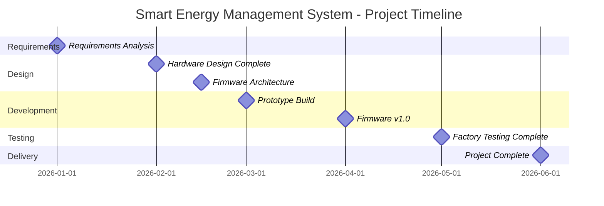

# 📋 Project Charter

**Smart Energy Management System**

**Project Charter Document**

_Developed by Gestell Company - Professional Embedded Solutions_

---

## 📋 Table of Contents

- [Project Overview](#-project-overview)
- [Project Objectives](#-project-objectives)
- [Project Scope](#-project-scope)
- [Key Deliverables](#-key-deliverables)
- [Stakeholders](#-stakeholders)
- [Budget & Resources](#-budget--resources)
- [Project Timeline](#-project-timeline)
- [Success Criteria](#-success-criteria)
- [Risks & Assumptions](#-risks--assumptions)
- [Project Authorization](#-project-authorization)

---

## 🔗 Related Documentation

| Document                                       | Description                         | Status       |
| ---------------------------------------------- | ----------------------------------- | ------------ |
| **[CRS.md](../../02_Requirements/CRS/CRS.md)** | Customer Requirements Specification | ✅ Available |
| **[Risk_Management.md](Risk_Management.md)**   | Risk Management Plan                | 📅 Planned   |
| **[Stakeholder_List.md](Stakeholder_List.md)** | Stakeholder Registry                | 📅 Planned   |

---

## 🎯 Project Overview

### 1.1 Project Name

**Smart Energy Management System** - Embedded Monitoring and Protection Device

### 1.2 Project Purpose

> **TBD**: Define the business case and justification for this project

### 1.3 Project Background

> **TBD**: Provide background context on market needs, customer requirements, and strategic alignment

---

## 🎯 Project Objectives

### 2.1 Primary Objectives

> **TBD**: Define SMART objectives (Specific, Measurable, Achievable, Relevant, Time-bound)

**Example Structure**:

1. Develop a cost-effective energy monitoring solution for residential/commercial use
2. Achieve measurement accuracy of ±1% for voltage and current
3. Implement real-time protection with <500ms response time
4. Complete development and testing by Q2 2026

### 2.2 Secondary Objectives

> **TBD**: Define additional goals (e.g., technology demonstrator, team capability building)

---

## 📦 Project Scope

### 3.1 In Scope

> **TBD**: Define what IS included in this project

**Example Items**:

- Hardware design (PCB, components, enclosure)
- Firmware development (MCAL, HAL, Application layers)
- Mobile app and web dashboard
- Testing and validation
- User documentation

### 3.2 Out of Scope

> **TBD**: Define what is NOT included

**Example Items**:

- Multi-phase (3-phase) system support
- Advanced power quality analysis (harmonics)
- Installation services
- Extended warranty beyond standard period

---

## 🚀 Key Deliverables

| Deliverable                | Description                    | Target Date | Owner   |
| -------------------------- | ------------------------------ | ----------- | ------- |
| **Requirements Documents** | CRS, HRS, SRS                  | **TBD**     | **TBD** |
| **Hardware Prototype**     | Functional PCB with components | **TBD**     | **TBD** |
| **Firmware v1.0**          | Production-ready firmware      | **TBD**     | **TBD** |
| **Mobile App**             | Android/iOS app                | **TBD**     | **TBD** |
| **Web Dashboard**          | Remote monitoring interface    | **TBD**     | **TBD** |
| **Test Reports**           | FAT & SAT validation           | **TBD**     | **TBD** |
| **Documentation**          | User manual, service manual    | **TBD**     | **TBD** |

---

## 👥 Stakeholders

### 5.1 Project Sponsor

> **TBD**: Name and role of project sponsor/decision authority

### 5.2 Project Manager

> **TBD**: Name and contact information

### 5.3 Key Stakeholders

> **TBD**: List key stakeholders

See [Stakeholder_List.md](Stakeholder_List.md) for complete stakeholder registry.

---

## 💰 Budget & Resources

### 6.1 Budget Summary

> **TBD**: Define project budget

| Category             | Estimated Cost (EGP) |
| -------------------- | -------------------- |
| Hardware Development | **TBD**              |
| Software Development | **TBD**              |
| Testing & Validation | **TBD**              |
| Documentation        | **TBD**              |
| Contingency (15%)    | **TBD**              |
| **Total**            | **TBD**              |

### 6.2 Resource Allocation

> **TBD**: Define team structure and resource allocation

| Role                       | Allocation | Duration |
| -------------------------- | ---------- | -------- |
| Hardware Engineer          | **TBD**    | **TBD**  |
| Embedded Software Engineer | **TBD**    | **TBD**  |
| Mobile App Developer       | **TBD**    | **TBD**  |
| Test Engineer              | **TBD**    | **TBD**  |
| Technical Writer           | **TBD**    | **TBD**  |

---

## 📅 Project Timeline

### 7.1 High-Level Milestones

> **TBD**: Define major project milestones

> [!NOTE]
> Timeline dates are placeholders (TBD). Actual schedule to be defined during project planning.

### 7.2 Phase Breakdown

> **TBD**: Define project phases with detailed activities

---

## ✅ Success Criteria

### 8.1 Technical Success Criteria

> **TBD**: Define measurable technical success metrics

**Example Criteria**:

- ✅ Voltage measurement accuracy: ±2V (±1% at 220V)
- ✅ Current measurement accuracy: ±0.1A (±1% at 10A)
- ✅ Protection response time: <500ms
- ✅ Energy tracking error: <2% over 24 hours
- ✅ Communication uptime: >99%

### 8.2 Business Success Criteria

> **TBD**: Define business/project success metrics

**Example Criteria**:

- ✅ Project delivered on time and within budget
- ✅ Customer acceptance achieved
- ✅ Product meets all regulatory requirements
- ✅ Bill of Materials cost below target

---

## ⚠️ Risks & Assumptions

### 9.1 Key Assumptions

> **TBD**: List critical project assumptions

**Example Assumptions**:

1. Component availability in local market
2. Team members have required skills
3. Development tools and licenses available
4. Customer requirements remain stable

### 9.2 High-Level Risks

> **TBD**: Identify major project risks

See [Risk_Management.md](Risk_Management.md) for detailed risk analysis.

---

## ✍️ Project Authorization

### 10.1 Approval

> **TBD**: Project sponsor signature and approval

| Role                | Name    | Signature | Date    |
| ------------------- | ------- | --------- | ------- |
| **Project Sponsor** | **TBD** | **TBD**   | **TBD** |
| **Project Manager** | **TBD** | **TBD**   | **TBD** |
| **Technical Lead**  | **TBD** | **TBD**   | **TBD** |

### 10.2 Change Control

Changes to this charter require approval from the project sponsor.

---

## 📞 Support & Contact

**Project Information**:

- **Project Name**: Smart Energy Management System
- **Development Company**: Gestell - Professional Embedded Solutions

**Technical Support**: Hisham4Ahmed@gmail.com

**LinkedIn Company Page**: https://www.linkedin.com/company/gestell-company

---

## 📄 Document Control

| Attribute            | Value                          |
| -------------------- | ------------------------------ |
| **Document Type**    | Project Charter                |
| **Document Status**  | Draft                          |
| **Document Version** | 0.1                            |
| **Last Updated**     | January 2026                   |
| **Prepared By**      | Gestell Engineering Team       |
| **Project Name**     | Smart Energy Management System |

---

**Built with ❤️ by Gestell Team**

_Professional Embedded Systems Engineering_

**Copyright © 2025-2026 Gestell Company - All Rights Reserved**

