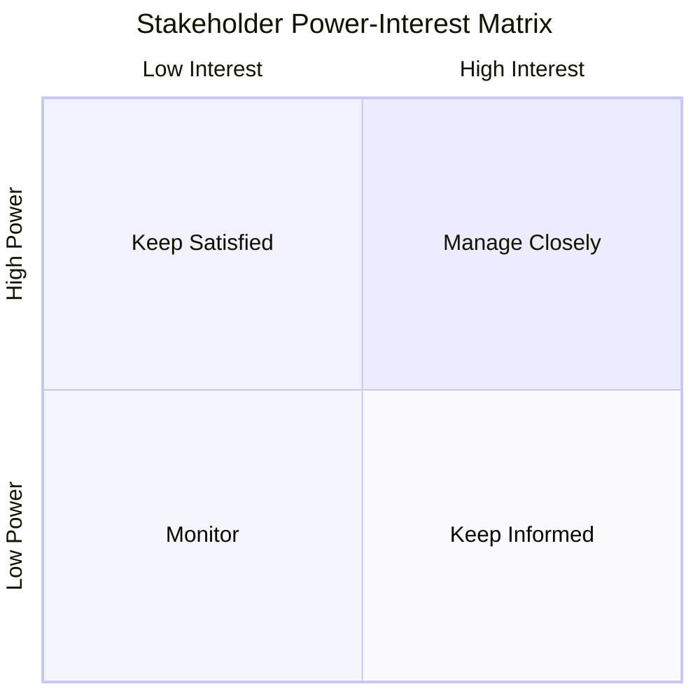
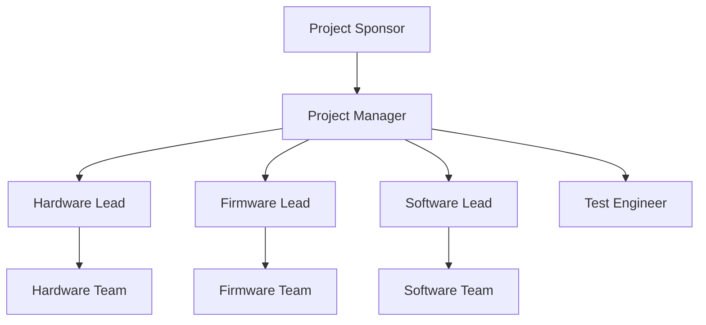

# 👥 Stakeholder List

**Smart Energy Management System**

**Stakeholder Registry**

_Developed by Gestell Company - Professional Embedded Solutions_

---

## 📋 Table of Contents

- [Stakeholder Overview](#-stakeholder-overview)
- [Stakeholder Classification](#-stakeholder-classification)
- [Stakeholder Register](#-stakeholder-register)
- [Communication Matrix](#-communication-matrix)
- [Engagement Strategy](#-engagement-strategy)

---

## 🔗 Related Documentation

| Document                                       | Description           | Status       |
| ---------------------------------------------- | --------------------- | ------------ |
| **[Project_Charter.md](Project_Charter.md)**   | Project Charter       | ✅ Available |
| **[CRS.md](../../02_Requirements/CRS/CRS.md)** | Customer Requirements | ✅ Available |

---

## 📖 Stakeholder Overview

### 1.1 Purpose

This document identifies and categorizes all stakeholders involved in the Smart Energy Management System project, defining their roles, interests, and engagement requirements.

### 1.2 Stakeholder Definition

A stakeholder is any individual, group, or organization that:

- Can affect or be affected by the project
- Has interest in project outcomes
- Has authority or influence over project decisions

---

## 🏷️ Stakeholder Classification

### 2.1 Classification Criteria

#### Power vs. Interest Matrix

| Quadrant                      | Strategy                                             |
| ----------------------------- | ---------------------------------------------------- |
| **High Power, High Interest** | Manage Closely - Key players, active engagement      |
| **High Power, Low Interest**  | Keep Satisfied - Meet needs, prevent blocking        |
| **Low Power, High Interest**  | Keep Informed - Regular updates, manage expectations |
| **Low Power, Low Interest**   | Monitor - Minimal effort, awareness only             |

### 2.2 Stakeholder Categories

| Category      | Description          | Examples                         |
| ------------- | -------------------- | -------------------------------- |
| **Internal**  | Within organization  | Development team, management     |
| **External**  | Outside organization | Customers, suppliers, regulators |
| **Primary**   | Directly affected    | End users, project sponsor       |
| **Secondary** | Indirectly affected  | Support teams, vendors           |

---

## 👤 Stakeholder Register

> **TBD**: Populate with actual stakeholders

### 3.1 Executive Stakeholders

| Name    | Role              | Organization | Power | Interest | Category         | Contact |
| ------- | ----------------- | ------------ | ----- | -------- | ---------------- | ------- |
| **TBD** | Project Sponsor   | **TBD**      | High  | High     | Internal/Primary | **TBD** |
| **TBD** | Executive Sponsor | **TBD**      | High  | Medium   | Internal/Primary | **TBD** |

### 3.2 Project Team

| Name    | Role             | Organization | Power  | Interest | Category           | Contact |
| ------- | ---------------- | ------------ | ------ | -------- | ------------------ | ------- |
| **TBD** | Project Manager  | Gestell      | High   | High     | Internal/Primary   | **TBD** |
| **TBD** | Hardware Lead    | Gestell      | Medium | High     | Internal/Primary   | **TBD** |
| **TBD** | Firmware Lead    | Gestell      | Medium | High     | Internal/Primary   | **TBD** |
| **TBD** | Software Lead    | Gestell      | Medium | High     | Internal/Primary   | **TBD** |
| **TBD** | Test Engineer    | Gestell      | Medium | High     | Internal/Primary   | **TBD** |
| **TBD** | Technical Writer | Gestell      | Low    | Medium   | Internal/Secondary | **TBD** |

### 3.3 Customer Stakeholders

| Name    | Role                    | Organization | Power  | Interest | Category         | Contact |
| ------- | ----------------------- | ------------ | ------ | -------- | ---------------- | ------- |
| **TBD** | Customer Representative | **TBD**      | High   | High     | External/Primary | **TBD** |
| **TBD** | End User Representative | **TBD**      | Medium | High     | External/Primary | **TBD** |

### 3.4 Vendor/Supplier Stakeholders

| Name    | Role               | Organization | Power | Interest | Category           | Contact |
| ------- | ------------------ | ------------ | ----- | -------- | ------------------ | ------- |
| **TBD** | Component Supplier | **TBD**      | Low   | Medium   | External/Secondary | **TBD** |
| **TBD** | PCB Manufacturer   | **TBD**      | Low   | Medium   | External/Secondary | **TBD** |

### 3.5 Regulatory Stakeholders

| Name    | Role               | Organization | Power  | Interest | Category           | Contact |
| ------- | ------------------ | ------------ | ------ | -------- | ------------------ | ------- |
| **TBD** | Compliance Officer | **TBD**      | Medium | Low      | External/Secondary | **TBD** |

---

## 📢 Communication Matrix

> **TBD**: Define communication requirements for each stakeholder group

### 4.1 Communication Plan

| Stakeholder Group      | Information Needs              | Method                  | Frequency | Owner   |
| ---------------------- | ------------------------------ | ----------------------- | --------- | ------- |
| **Executive Sponsors** | Project status, budget, risks  | Executive summary email | Monthly   | PM      |
| **Project Team**       | Tasks, blockers, decisions     | Daily standup, Slack    | Daily     | PM      |
| **Customer**           | Progress, deliverables, issues | Status report, demo     | Bi-weekly | PM      |
| **Vendors**            | Orders, schedules, specs       | Email, purchase orders  | As needed | HW Lead |

### 4.2 Reporting Structure

---

## 🤝 Engagement Strategy

> **TBD**: Define engagement approach for key stakeholders

### 5.1 Engagement Levels

| Level          | Description           | Actions                                  |
| -------------- | --------------------- | ---------------------------------------- |
| **Unaware**    | Not aware of project  | Inform about project existence           |
| **Resistant**  | Aware but opposed     | Address concerns, show benefits          |
| **Neutral**    | Aware but not engaged | Provide information, highlight relevance |
| **Supportive** | Aware and supportive  | Maintain engagement, leverage support    |
| **Leading**    | Actively championing  | Empower to influence others              |

### 5.2 Key Stakeholder Engagement Plans

> **TBD**: Create individual engagement plans for high-power, high-interest stakeholders

**Template**:

**Stakeholder**: [Name]  
**Current Engagement Level**: [Current state]  
**Desired Engagement Level**: [Target state]  
**Strategy**:

- Action 1: [Description]
- Action 2: [Description]

**Owner**: [Responsible person]

---

## 📊 Stakeholder Analysis Summary

> **TBD**: Summarize stakeholder landscape

### 6.1 Key Insights

**Critical Stakeholders** (Manage Closely): **TBD**

**Potential Blockers**: **TBD**

**Champions**: **TBD**

### 6.2 Stakeholder Risks

> **TBD**: Identify stakeholder-related risks

| Stakeholder | Risk    | Mitigation |
| ----------- | ------- | ---------- |
| **TBD**     | **TBD** | **TBD**    |

---

## 📞 Support & Contact

**Project Information**:

- **Project Name**: Smart Energy Management System
- **Development Company**: Gestell - Professional Embedded Solutions

**Stakeholder Management Owner**: **TBD**

**Technical Support**: Hisham4Ahmed@gmail.com

---

## 📄 Document Control

| Attribute            | Value                    |
| -------------------- | ------------------------ |
| **Document Type**    | Stakeholder Registry     |
| **Document Status**  | Draft                    |
| **Document Version** | 0.1                      |
| **Last Updated**     | January 2026             |
| **Prepared By**      | Gestell Engineering Team |
| **Review Frequency** | Quarterly or on change   |

---

**Built with ❤️ by Gestell Team**

_Professional Embedded Systems Engineering_

**Copyright © 2025-2026 Gestell Company - All Rights Reserved**

