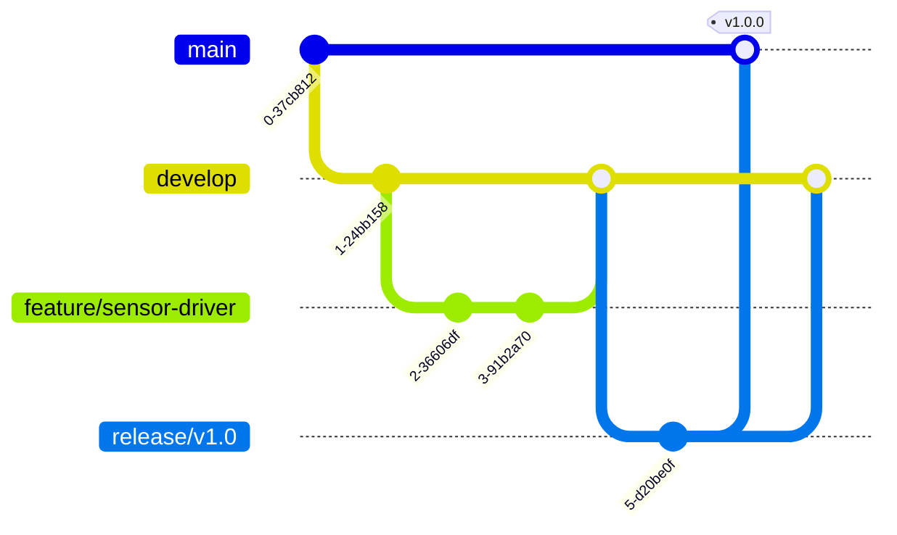

# 🔄 Git Workflow

<div align="center">


**Smart Energy Management System**

**Git Workflow & Version Control Strategy**

_Developed by Gestell Company - Professional Embedded Solutions_

</div>

---

## 📋 Table of Contents

- [Workflow Overview](#-workflow-overview)
- [Branch Strategy](#-branch-strategy)
- [Commit Conventions](#-commit-conventions)
- [Pull Request Process](#-pull-request-process)
- [Release Management](#-release-management)
- [Best Practices](#-best-practices)

---

## 🔗 Related Documentation

| Document                                                                                   | Description            | Status       |
| ------------------------------------------------------------------------------------------ | ---------------------- | ------------ |
| **[Project_Charter.md](../Project_Managment/Project_Charter.md)**                          | Project Charter        | ✅ Available |
| **[Coding_Standards.md](../../06_ImplementationDoc/Coding_Standards/Coding_Standards.md)** | Code Quality Standards | ✅ Available |

---

## 📖 Workflow Overview

### 1.1 Purpose

This document defines the Git workflow and version control practices for the Smart Energy Management System project.

### 1.2 Git Strategy

> **TBD**: Define specific Git workflow strategy (e.g., GitFlow, GitHub Flow, Trunk-Based)

**Recommended**: **GitHub Flow** (simplified for embedded projects)

---

## 🌲 Branch Strategy

### 2.1 Branch Types

> **TBD**: Define branch naming and purpose



#### Main Branches

| Branch      | Purpose               | Lifetime  | Protection |
| ----------- | --------------------- | --------- | ---------- |
| **main**    | Production-ready code | Permanent | Protected  |
| **develop** | Integration branch    | Permanent | Protected  |

#### Supporting Branches

| Branch Type | Naming Convention    | Purpose                 | Example                  |
| ----------- | -------------------- | ----------------------- | ------------------------ |
| **Feature** | `feature/<name>`     | New features            | `feature/lcd-driver`     |
| **Bugfix**  | `bugfix/<name>`      | Bug fixes               | `bugfix/adc-calibration` |
| **Hotfix**  | `hotfix/<name>`      | Urgent production fixes | `hotfix/relay-issue`     |
| **Release** | `release/v<version>` | Release preparation     | `release/v1.0`           |

### 2.2 Branch Lifecycle

**Feature Branch Flow**:

1. Create from `develop`
2. Develop feature
3. Create pull request to `develop`
4. Code review and approval
5. Merge to `develop`
6. Delete feature branch

**Release Branch Flow**:

1. Create from `develop` when ready
2. Final testing and bug fixes only
3. Merge to `main` and tag with version
4. Merge back to `develop`
5. Delete release branch

---

## 💬 Commit Conventions

### 3.1 Commit Message Format

> **TBD**: Define commit message standard

**Recommended Format** (Conventional Commits):

```
<type>(<scope>): <subject>

<body>

<footer>
```

**Example**:

```
feat(MCAL): Add ADC multi-channel support

Implemented ADC channel switching for voltage and current sensing.
Added calibration factor support.

Closes #42
```

### 3.2 Commit Types

| Type         | Description            | Example                                |
| ------------ | ---------------------- | -------------------------------------- |
| **feat**     | New feature            | `feat(HAL): Add ACS712 driver`         |
| **fix**      | Bug fix                | `fix(App): Correct energy calculation` |
| **docs**     | Documentation changes  | `docs(HRS): Update pin assignments`    |
| **refactor** | Code refactoring       | `refactor(MCAL): Optimize Timer1 ISR`  |
| **test**     | Test additions/changes | `test(Sensor): Add calibration tests`  |
| **chore**    | Build/tool changes     | `chore: Update Makefile`               |

### 3.3 Scope Examples

- **MCAL**: DIO, ADC, TIMER, UART, EEPROM
- **HAL**: Voltage_Sensor, Current_Sensor, LCD, Relay, RGB_LED
- **App**: Measurement, Protection, Communication
- **HW**: Hardware design changes
- **Docs**: Documentation updates

### 3.4 Commit Best Practices

> **TBD**: Define project-specific commit guidelines

**General Rules**:

- Keep commits atomic (one logical change)
- Write clear, descriptive messages
- Reference issue/ticket numbers
- Use imperative mood ("Add" not "Added")
- Limit subject line to 50 characters
- Wrap body at 72 characters

---

## 🔀 Pull Request Process

### 4.1 Creating Pull Requests

> **TBD**: Define PR creation process

**PR Checklist**:

- ✅ Code compiles without errors
- ✅ Code follows coding standards
- ✅ Tests pass (if applicable)
- ✅ Documentation updated
- ✅ Descriptive title and description
- ✅ Linked to relevant issue/ticket

### 4.2 PR Template

> **TBD**: Create PR template

**Suggested Template**:

```markdown
## Description

Brief description of changes

## Type of Change

- [ ] Bug fix
- [ ] New feature
- [ ] Refactoring
- [ ] Documentation

## Testing

How has this been tested?

## Checklist

- [ ] Code follows style guide
- [ ] Self-reviewed code
- [ ] Commented complex code
- [ ] Updated documentation
- [ ] No new warnings

## Related Issues

Fixes #<issue_number>
```

### 4.3 Code Review Process

> **TBD**: Define review requirements

**Review Guidelines**:

- **Minimum reviewers**: 1 (for critical changes: 2)
- **Review focus**: Correctness, readability, performance, safety
- **Response time**: Within 24 hours
- **Approval required**: Yes, before merge

---

## 🚀 Release Management

### 5.1 Versioning Scheme

> **TBD**: Define version numbering

**Recommended**: **Semantic Versioning (SemVer)**

Format: `MAJOR.MINOR.PATCH` (e.g., `1.2.3`)

- **MAJOR**: Breaking changes, incompatible API changes
- **MINOR**: New features, backwards-compatible
- **PATCH**: Bug fixes, backwards-compatible

**Pre-release**: `1.0.0-alpha.1`, `1.0.0-beta.2`, `1.0.0-rc.1`

### 5.2 Tagging Strategy

> **TBD**: Define git tag conventions

**Tag Format**: `v<MAJOR>.<MINOR>.<PATCH>`

**Examples**:

- `v1.0.0` - First production release
- `v1.1.0` - Feature release
- `v1.1.1` - Patch release

**Tagging Command**:

```bash
git tag -a v1.0.0 -m "Release version 1.0.0 - Initial production release"
git push origin v1.0.0
```

### 5.3 Release Checklist

> **TBD**: Define release process

**Pre-Release**:

- [ ] All features merged to `develop`
- [ ] Create release branch
- [ ] Update version numbers in code
- [ ] Update CHANGELOG
- [ ] Run full test suite
- [ ] Build firmware binary
- [ ] Create release notes

**Release**:

- [ ] Merge to `main`
- [ ] Create git tag
- [ ] Build and archive artifacts
- [ ] Deploy to production (if applicable)
- [ ] Merge back to `develop`

**Post-Release**:

- [ ] Monitor for issues
- [ ] Update documentation
- [ ] Communicate to stakeholders

---

## ✅ Best Practices

### 6.1 General Guidelines

> **TBD**: Define project-specific best practices

**Recommended Practices**:

1. **Commit Frequently**: Small, logical commits are easier to review and revert
2. **Pull Regularly**: Keep your branch up-to-date with `develop`
3. **Write Tests**: Add tests for new features
4. **Document Changes**: Update docs with code changes
5. **Review Carefully**: Take time for thorough code reviews
6. **Use .gitignore**: Don't commit build artifacts, IDE files

### 6.2 Don'ts

> **TBD**: Define anti-patterns to avoid

**Avoid**:

- ❌ Committing directly to `main` or `develop`
- ❌ Committing binaries or build artifacts
- ❌ Force-pushing to shared branches
- ❌ Mixing multiple unrelated changes in one commit
- ❌ Leaving commented-out code
- ❌ Committing sensitive data (passwords, keys)

### 6.3 Conflict Resolution

> **TBD**: Define conflict resolution process

**Strategy**:

1. Pull latest `develop` into your branch
2. Resolve conflicts locally
3. Test thoroughly after resolution
4. Commit resolution with clear message
5. Push and update PR

---

## 🛠️ Git Commands Reference

### 7.1 Common Operations

> **TBD**: Add project-specific git commands

**Feature Development**:

```bash
# Create feature branch
git checkout develop
git pull origin develop
git checkout -b feature/my-feature

# Work on feature
git add <files>
git commit -m "feat(scope): description"

# Push to remote
git push origin feature/my-feature

# Update with latest develop
git checkout develop
git pull origin develop
git checkout feature/my-feature
git merge develop
```

**Release Process**:

```bash
# Create release branch
git checkout develop
git checkout -b release/v1.0

# Finalize release
git commit -m "chore: bump version to 1.0.0"

# Merge to main
git checkout main
git merge release/v1.0
git tag -a v1.0.0 -m "Release v1.0.0"

# Merge back to develop
git checkout develop
git merge release/v1.0

# Push everything
git push origin main develop --tags
```

---

## 📞 Support & Contact

**Project Information**:

- **Project Name**: Smart Energy Management System
- **Development Company**: Gestell - Professional Embedded Solutions

**Git Workflow Owner**: **TBD**

**Technical Support**: Hisham4Ahmed@gmail.com

---

## 📄 Document Control

| Attribute            | Value                    |
| -------------------- | ------------------------ |
| **Document Type**    | Git Workflow Guide       |
| **Document Status**  | Draft                    |
| **Document Version** | 0.1                      |
| **Last Updated**     | January 2026             |
| **Prepared By**      | Gestell Engineering Team |

---

<div align="center">

**Built with ❤️ by Gestell Team**

_Professional Embedded Systems Engineering_

**Copyright © 2025-2026 Gestell Company - All Rights Reserved**

</div>
