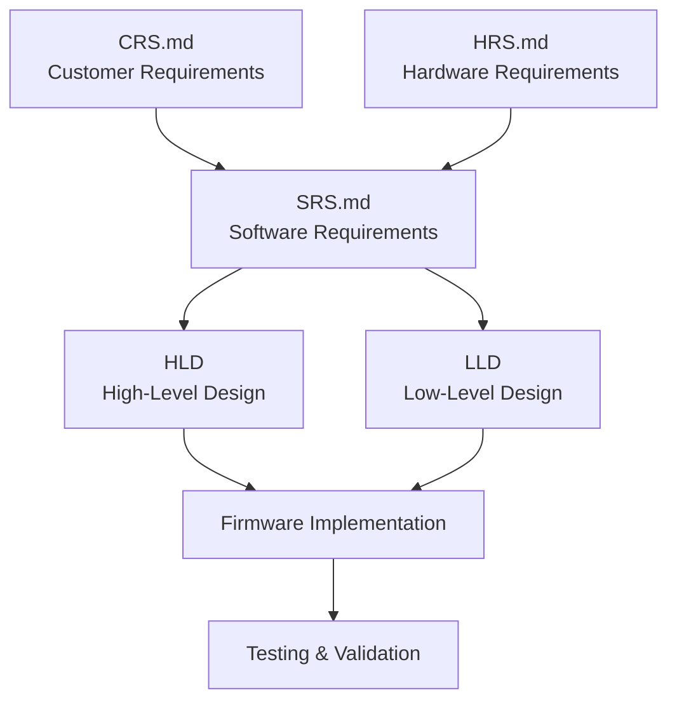

# 💻 Software Requirements Specification (SRS)

<div align="center">


**Software Requirements Specification (SRS)**

**Smart Energy Management System Firmware**

_Developed by Gestell Company - Professional Embedded Solutions_

</div>

---

## 📋 Table of Contents

- [Introduction](#-introduction)
- [Related Documentation](#-related-documentation)
- [System Architecture Requirements](#-system-architecture-requirements)
- [Functional Requirements](#-functional-requirements)
- [Software Modules](#-software-modules)
- [I/O Requirements](#-io-requirements)
- [Configuration Management](#-configuration-management)
- [Safety Requirements](#-safety-requirements)
- [Performance Requirements](#-performance-requirements)
- [Diagnostic Requirements](#-diagnostic-requirements)
- [Communication Requirements](#-communication-requirements)
- [Non-Functional Requirements](#-non-functional-requirements)
- [Testing Requirements](#-testing-requirements)
- [Deliverables](#-deliverables)

---

## 📖 Introduction

### 1.1 Purpose

This document defines the **Software Requirements Specification (SRS)** for the firmware of the **Smart Energy Management System**.

The SRS translates the customer requirements defined in the [CRS](../CRS/CRS.md) into detailed software and firmware specifications that guide the development team.

### 1.2 Scope

This SRS covers:

- Firmware architecture and design
- Software modules and their interactions
- Measurement algorithms (RMS calculation, power, energy)
- Protection logic implementation
- I/O handling and signal processing
- Data persistence (EEPROM management)
- Communication protocols (Mobile App, Web Dashboard)
- Display management and user interface

### 1.3 Document Relationship



---

## 📚 Related Documentation

| Document                                                                          | Description                         | Status       |
| --------------------------------------------------------------------------------- | ----------------------------------- | ------------ |
| **[CRS.md](../CRS/CRS.md)**                                                       | Customer Requirements Specification | ✅ Available |
| **[HRS.md](../HRS/HRS.md)**                                                       | Hardware Requirements Specification | ✅ Available |
| **[DashboardRequirementfromEmbedded.md](../DashboardRequirementfromEmbedded.md)** | Dashboard communication protocol    | ✅ Available |
| **[MobileRequirementfromEmbedded.md](../MobileRequirementfromEmbedded.md)**       | Mobile App communication protocol   | ✅ Available |
| **[Code_Analysis_Report.md](../../06_ImplementationDoc/Code_Analysis_Report.md)** | Current code quality analysis       | ✅ Available |
| **[Issue_Solutions.md](../../06_ImplementationDoc/Issue_Solutions.md)**           | Known issues and solutions          | ✅ Available |

---

## 🏗️ System Architecture Requirements

### 2.1 Firmware Architecture

**REQ-ARCH-001**: The firmware shall be based on a **modular layered architecture** for maintainability and portability.

**REQ-ARCH-002**: The software shall be structured in the following layers:

- **Microcontroller Abstraction Layer (MCAL)**: Low-level peripheral drivers (DIO, ADC, UART, Timers, EEPROM, SPI, TWI, EXTI, GIE)
- **Hardware Abstraction Layer (HAL)**: Hardware module drivers (Sensors, Actuators, LCD, Communication modules)
- **Common Layer**: Shared utilities, macros, configuration, and data structures
- **Application Layer**: High-level business logic including:
  - Measurement Engine
  - Protection Manager
  - Energy Logger
  - Communication Manager
  - Display Manager
  - System Controller
  - Calibration Manager

**REQ-ARCH-003**: The firmware shall be written in **C language (C99 standard)** following embedded C coding standards.

**REQ-ARCH-004**: Real-time deterministic behavior shall be guaranteed with maximum response time ≤ **100ms** for critical measurements.

### 2.2 Execution Model

**REQ-ARCH-005**: The firmware shall use a **bare-metal superloop** execution model (no RTOS).

**REQ-ARCH-006**: The main loop shall execute at a minimum frequency of **10 Hz** (100ms cycle time).

**REQ-ARCH-007**: Interrupt Service Routines (ISRs) shall be used for:

- Timer-based ADC sampling (Timer1)
- UART communication reception
- External interrupts (if used)

**REQ-ARCH-008**: ISRs shall be **short and non-blocking** (set flags, update counters only).

### 2.3 Memory Requirements

**REQ-ARCH-009**: Configuration parameters and calibration data shall be stored in **EEPROM** (non-volatile memory).

**REQ-ARCH-010**: Energy consumption data shall be periodically saved to EEPROM (every 1 minute or on significant change >0.1 kWh).

**REQ-ARCH-011**: Firmware shall implement **wear leveling** for EEPROM writes to extend memory lifespan (>100,000 write cycles).

**REQ-ARCH-012**: Flash memory usage shall not exceed **80%** of available program memory (~25 KB of 32 KB).

**REQ-ARCH-013**: SRAM usage shall not exceed **70%** of available data memory (~1.4 KB of 2 KB).

---

## ✨ Functional Requirements

### 3.1 Measurement System

#### 3.1.1 Voltage Measurement

**REQ-MEAS-001**: The system shall measure **AC RMS voltage** using analog voltage divider and ADC.

**REQ-MEAS-002**: Voltage measurement specifications:

- Range: **0V to 300V AC RMS**
- Accuracy: **±2V** (≤1% at 220V)
- Update rate: **Every 100ms**
- ADC channel: **PA0 (ADC Channel 0)**
- Resolution: **10-bit ADC** (0-1023 counts)

**REQ-MEAS-003**: Voltage calculation algorithm:

- Sample AC waveform at **100 samples per second** minimum
- Calculate **RMS** using sum-of-squares method: V_RMS = √(Σ V²/N)
- Apply calibration factor (stored in EEPROM)
- Apply voltage divider scaling (100:1 ratio)

**REQ-MEAS-004**: Voltage sensor calibration:

- Support **calibration factor** adjustment (range: 0.5 to 2.0)
- Store calibration factor in EEPROM
- Default calibration factor: 1.0

#### 3.1.2 Current Measurement

**REQ-MEAS-005**: The system shall measure **AC RMS current** using ACS712 Hall-effect sensor.

**REQ-MEAS-006**: Current measurement specifications:

- Range: **0A to 30A AC RMS**
- Accuracy: **±0.1A** (≤1% at 10A)
- Update rate: **Every 100ms**
- ADC channel: **PA1 (ADC Channel 1)**
- Sensor sensitivity: **66 mV/A**
- Zero-current output: **2.5V** (VCC/2)

**REQ-MEAS-007**: Current calculation algorithm:

- Sample ACS712 output at **100 samples per second** minimum
- Subtract **zero-current offset** (calibrated value stored in EEPROM)
- Calculate **RMS** using sum-of-squares method: I_RMS = √(Σ I²/N)
- Apply sensor sensitivity scaling (66 mV/A)
- Apply calibration factor (stored in EEPROM)

**REQ-MEAS-008**: Current sensor calibration:

- Support **zero-current offset** calibration (measure with no load, store in EEPROM)
- Support **calibration factor** adjustment (range: 0.5 to 2.0)
- Default calibration factor: 1.0

**REQ-MEAS-009**: Current sensor shall detect and compensate for:

- DC bias drift (periodic re-calibration)
- Temperature effects (if temperature sensor available)

#### 3.1.3 Power Calculation

**REQ-MEAS-010**: The system shall calculate **instantaneous power** based on voltage and current measurements.

**REQ-MEAS-011**: Power calculation formula:

```
P = V_RMS × I_RMS × Power_Factor
```

Where:

- P = Power in Watts (W)
- V_RMS = RMS voltage in Volts (V)
- I_RMS = RMS current in Amperes (A)
- Power_Factor = Configurable (default: 0.95 for resistive loads)

**REQ-MEAS-012**: Power factor shall be:

- **Configurable** via Mobile App or Dashboard
- Range: **0.5 to 1.0**
- Default: **0.95**
- Stored in EEPROM

**REQ-MEAS-013**: Power measurement specifications:

- Range: **0W to 5000W**
- Update rate: **Every 100ms**
- Display precision: **1 decimal place** (e.g., 1234.5 W)

#### 3.1.4 Energy Calculation

**REQ-MEAS-014**: The system shall calculate **cumulative energy consumption** by integrating power over time.

**REQ-MEAS-015**: Energy calculation formula:

```
E(t) = E(t-1) + [P × Δt]
```

Where:

- E(t) = Energy at current time in Joules (J)
- E(t-1) = Energy at previous time in Joules (J)
- P = Power in Watts (W)
- Δt = Time interval in seconds (s)
- Conversion: Energy (kWh) = Energy (J) / 3,600,000

**REQ-MEAS-016**: Energy measurement specifications:

- Unit: **kWh** (kilowatt-hours)
- Range: **0 to 9999 kWh**
- Update rate: **Every 100ms** (accumulation)
- Display precision: **1 decimal place** (e.g., 123.4 kWh)
- Persistence: **Stored in EEPROM every 1 minute or on change >0.1 kWh**

**REQ-MEAS-017**: Energy counter reset:

- Shall be triggered **only via command** from Mobile App or Dashboard
- Shall **save zero value to EEPROM** immediately after reset
- Shall **log reset event** with timestamp (if available)

---

### 3.2 Protection System

#### 3.2.1 Overcurrent Protection

**REQ-PROT-001**: The system shall detect **overcurrent** conditions when measured current exceeds configurable threshold.

**REQ-PROT-002**: Overcurrent protection specifications:

- Threshold: **Configurable** (default: 20A)
- Range: **5A to 30A**
- Debouncing: **3 consecutive readings** above threshold (300ms total)
- Response time: **≤500ms** from fault detection to relay disconnection

**REQ-PROT-003**: Upon overcurrent detection, the system shall:

1. **Disconnect load** (relay OFF)
2. **Display warning** on LCD: "OVERLOAD!"
3. **Change RGB LED** to RED
4. **Activate buzzer** (3 beeps pattern)
5. **Send alert** to Mobile App/Dashboard (if connected)
6. **Log event** with timestamp

**REQ-PROT-004**: Overcurrent recovery:

- **Manual reset** required (user must acknowledge fault via button or command)
- **Automatic retry** after configurable delay (default: 30 seconds) - optional feature
- Relay shall remain OFF until reset

#### 3.2.2 Overvoltage Protection

**REQ-PROT-005**: The system shall detect **overvoltage** conditions when measured voltage exceeds configurable threshold.

**REQ-PROT-006**: Overvoltage protection specifications:

- Threshold: **Configurable** (default: 250V)
- Range: **200V to 300V**
- Debouncing: **3 consecutive readings** above threshold (300ms total)
- Response time: **≤500ms** from fault detection to relay disconnection

**REQ-PROT-007**: Upon overvoltage detection, the system shall:

1. **Disconnect load** (relay OFF)
2. **Display warning** on LCD: "OVERVOLT!"
3. **Change RGB LED** to RED
4. **Activate buzzer** (5 beeps pattern)
5. **Send alert** to Mobile App/Dashboard (if connected)
6. **Log event** with timestamp

**REQ-PROT-008**: Overvoltage recovery:

- **Manual reset** required (user must acknowledge fault)
- Relay shall remain OFF until reset

#### 3.2.3 Relay Control

**REQ-PROT-009**: The system shall control relay to connect/disconnect load.

**REQ-PROT-010**: Relay control specifications:

- Control pin: **PB0** (via ULN2003 driver)
- States: **ON** (load connected), **OFF** (load disconnected)
- Control sources:
  - **Automatic**: Protection system (overcurrent, overvoltage)
  - **Manual**: User command via Mobile App or Dashboard

**REQ-PROT-011**: Relay safe state:

- Default state on power-up: **OFF** (load disconnected)
- Default state on MCU reset: **OFF**
- Default state on fault: **OFF**

**REQ-PROT-012**: Relay state shall be:

- **Displayed** on LCD (screen 3)
- **Indicated** via green LED (relay status LED)
- **Reported** to Mobile App/Dashboard

---

### 3.3 Display System

#### 3.3.1 LCD Display Management

**REQ-DISP-001**: The system shall display measurements and status on **16×2 LCD** (HD44780-compatible).

**REQ-DISP-002**: Display mode: **Rotating screens** (3 screens, 2 seconds each).

**REQ-DISP-003**: Display content:

**Screen 1** (Voltage & Current):

```
V: 220.5 V
I:  5.20 A
```

**Screen 2** (Power & Energy):

```
P: 1146.6 W
E:    2.5 kWh
```

**Screen 3** (Status):

```
Status: OK
Load: Connected
```

**REQ-DISP-004**: Status options for Screen 3:

- **OK**: Normal operation
- **OVERLOAD**: Overcurrent detected
- **OVERVOLT**: Overvoltage detected
- **FAULT**: General fault condition

**REQ-DISP-005**: Load status options for Screen 3:

- **Connected**: Relay ON
- **Disconnected**: Relay OFF

**REQ-DISP-006**: Display update rate: **Minimum 1 Hz** (every 1 second).

**REQ-DISP-007**: Display backlight: **Always ON** during operation (optional: PWM dimming control).

#### 3.3.2 RGB LED Status Indication

**REQ-DISP-008**: The system shall indicate status via **RGB LED** with color coding.

**REQ-DISP-009**: RGB LED color codes:

- **Green**: Normal operation (no faults)
- **Yellow** (Red + Green): Warning (approaching threshold)
- **Red**: Fault (protection triggered)
- **Blue**: Communication active (data transmission)
- **Cyan** (Green + Blue): Calibration mode

**REQ-DISP-010**: RGB LED control:

- Pins: **PB1 (Red), PB2 (Green), PB3 (Blue)**
- PWM control for brightness and color mixing
- Update rate: **Minimum 10 Hz**

#### 3.3.3 Buzzer Alerts

**REQ-DISP-011**: The system shall provide audible alerts via **active buzzer**.

**REQ-DISP-012**: Buzzer patterns:

- **3 beeps**: Overcurrent protection triggered
- **5 beeps**: Overvoltage protection triggered
- **1 long beep**: System startup/reset
- **Continuous beep**: Critical fault

**REQ-DISP-013**: Buzzer control:

- Pin: **PB4**
- Duration: Configurable (default: 200ms per beep, 100ms gap)
- Mute option: User can disable buzzer via Mobile App/Dashboard

---

### 3.4 Communication System

#### 3.4.1 Communication Protocol Overview

**REQ-COMM-001**: The system shall support communication via **UART** with two protocol variants:

- **Mobile App**: Bluetooth (HC-05 module)
- **Web Dashboard**: WiFi (ESP-01 module)

**REQ-COMM-002**: UART specifications:

- Baud rate: **9600 bps**
- Data bits: **8**
- Parity: **None**
- Stop bits: **1**
- TX pin: **PD1**
- RX pin: **PD0**

**REQ-COMM-003**: Frame structure:

```
[HEADER][LENGTH][COMMAND][DATA...]
```

Where:

- HEADER: Fixed byte **0xAA** (frame start marker)
- LENGTH: Number of data bytes (excluding header, length, command)
- COMMAND: Single byte command ID
- DATA: Variable length payload

#### 3.4.2 Supported Commands

**REQ-COMM-004**: The system shall support the following commands:

| Command ID | Command Name      | Direction | Description                  |
| ---------- | ----------------- | --------- | ---------------------------- |
| 0x05       | GET_RMS_DATA      | RX        | Request V, I, P, E values    |
| 0x09       | RELAY_CONTROL     | RX        | Turn relay ON/OFF            |
| 0x02       | CALIBRATE_SENSORS | RX        | Trigger sensor calibration   |
| 0x0C       | UPDATE_WIFI       | RX        | Configure WiFi (ESP-01 only) |
| 0x0E       | RESET_ENERGY      | RX        | Reset energy counter to zero |

#### 3.4.3 Data Format for Mobile App

**REQ-COMM-005**: Mobile App data format (command 0x05 response):

- **Data type**: Scaled integers (uint16/uint32)
- **Byte order**: **Big-Endian** (MSB first)
- **Total bytes**: 10 bytes

**REQ-COMM-006**: Data structure:

1. **Voltage** (2 bytes): uint16, scaled by **×10** (e.g., 220.5V → 2205)
2. **Current** (2 bytes): uint16, scaled by **×100** (e.g., 5.20A → 520)
3. **Power** (2 bytes): uint16, scaled by **×10** (e.g., 1146.6W → 11466)
4. **Energy** (4 bytes): uint32, scaled by **×100** (e.g., 2.50kWh → 250)

**REQ-COMM-007**: Example response for Mobile App:

```
Request:  [0xAA][0x00][0x05]
Response: [0xAA][0x0A][0x05][0x08][0x9D][0x02][0x08][0x2C][0xCA][0x00][0x00][0x00][0xFA]
          Header  Len  Cmd   V=2205       I=520        P=11466      E=250
```

#### 3.4.4 Data Format for Web Dashboard

**REQ-COMM-008**: Web Dashboard data format (command 0x05 or 0x15 response):

- **Data type**: Float32 (IEEE 754)
- **Byte order**: **Little-Endian** (LSB first)
- **Total bytes**: 16 bytes

**REQ-COMM-009**: Data structure:

1. **Voltage** (4 bytes): float32 (e.g., 220.5)
2. **Current** (4 bytes): float32 (e.g., 5.20)
3. **Power** (4 bytes): float32 (e.g., 1146.6)
4. **Energy** (4 bytes): float32 (e.g., 2.50)

**REQ-COMM-010**: Example response for Dashboard:

```
Request:  [0xAA][0x00][0x05]
Response: [0xAA][0x10][0x05][4 bytes V][4 bytes I][4 bytes P][4 bytes E]
          (Float32 Little-Endian format)
```

#### 3.4.5 Relay Control Command

**REQ-COMM-011**: Relay control command format (0x09):

```
Request: [0xAA][0x02][0x09][RelayNumber][State]
```

Where:

- RelayNumber: **1** (only one relay in this system)
- State: **0** = OFF, **1** = ON

**REQ-COMM-012**: Relay control response:

- Optional acknowledgment frame (same command echo)
- Relay status shall be reflected in next GET_RMS_DATA response

#### 3.4.6 Calibration Command

**REQ-COMM-013**: Calibration command format (0x02):

```
Request: [0xAA][0x04][0x02][VoltageFactorH][VoltageFactorL][CurrentFactorH][CurrentFactorL]
```

Where:

- VoltageFactorH, VoltageFactorL: 16-bit calibration factor (scaled ×1000)
- CurrentFactorH, CurrentFactorL: 16-bit calibration factor (scaled ×1000)

**REQ-COMM-014**: Upon calibration command, the system shall:

- Update calibration factors in RAM
- Save calibration factors to EEPROM
- Acknowledge calibration (optional response)

#### 3.4.7 Energy Reset Command

**REQ-COMM-015**: Energy reset command format (0x0E):

```
Request: [0xAA][0x00][0x0E]
```

**REQ-COMM-016**: Upon energy reset command, the system shall:

- Set energy counter to **zero**
- Save zero value to EEPROM immediately
- Acknowledge reset (optional response)

---

### 3.5 Data Persistence (EEPROM Management)

#### 3.5.1 EEPROM Storage Layout

**REQ-EEPROM-001**: The system shall use EEPROM (1 KB) to store:

- Energy counter (4 bytes - float32)
- Voltage calibration factor (2 bytes - uint16)
- Current calibration factor (2 bytes - uint16)
- Current zero-point offset (2 bytes - uint16)
- Power factor (2 bytes - uint16, scaled ×1000)
- Protection thresholds (4 bytes - 2× uint16)
- Configuration flags (1 byte)

**REQ-EEPROM-002**: EEPROM memory map:
| Address | Size | Data | Description |
|---------|------|------|-------------|
| 0x0000 | 4 | Energy (kWh) | Float32, cumulative energy |
| 0x0004 | 2 | Voltage Cal Factor | Uint16, ×1000 scaling |
| 0x0006 | 2 | Current Cal Factor | Uint16, ×1000 scaling |
| 0x0008 | 2 | Current Zero Offset | Uint16, ADC counts |
| 0x000A | 2 | Power Factor | Uint16, ×1000 scaling (e.g., 950 = 0.95) |
| 0x000C | 2 | Overcurrent Threshold | Uint16, ×100 scaling (e.g., 2000 = 20.00A) |
| 0x000E | 2 | Overvoltage Threshold | Uint16, ×1 scaling (e.g., 250 = 250V) |
| 0x0010 | 1 | Config Flags | Bitfield (buzzer enable, etc.) |
| 0x0011-0x03FF | - | Reserved | Future use |

#### 3.5.2 EEPROM Write Strategy

**REQ-EEPROM-003**: Energy counter shall be written to EEPROM:

- **Every 1 minute** (periodic save)
- **On significant change** (>0.1 kWh increment)
- **Before system shutdown** (if shutdown detection available)

**REQ-EEPROM-004**: Calibration data shall be written to EEPROM:

- **Immediately after calibration** command
- **Only when values change** (avoid unnecessary writes)

**REQ-EEPROM-005**: EEPROM writes shall include:

- **Timeout protection** (max 5ms per write operation)
- **Write verification** (read-back and compare)
- **Retry mechanism** (up to 3 attempts on failure)

**REQ-EEPROM-006**: Wear leveling:

- Energy counter writes limited to **1 write per minute** maximum
- Estimated EEPROM lifetime: >100,000 cycles / (60 minutes/hour × 24 hours/day × 365 days/year) = **~190 years**

#### 3.5.3 EEPROM Read Strategy

**REQ-EEPROM-007**: EEPROM data shall be read:

- **At system startup** (load all configuration and calibration data)
- **On demand** for diagnostic purposes

**REQ-EEPROM-008**: Invalid EEPROM data handling:

- Detect invalid data (e.g., 0xFFFF indicates unprogrammed memory)
- Use **factory defaults** if EEPROM data is invalid
- Log warning to indicate default values in use

---

## 🧩 Software Modules

### 4.1 Module Breakdown

**REQ-MOD-001**: The firmware shall be organized into the following modules:

#### MCAL Layer (Microcontroller Abstraction)

| Module     | Responsibility                 | Key Functions                                        |
| ---------- | ------------------------------ | ---------------------------------------------------- |
| **DIO**    | Digital I/O control            | Pin initialization, read/write operations            |
| **ADC**    | Analog-to-Digital Conversion   | ADC initialization, channel read, interrupt handling |
| **TIMER0** | 8-bit Timer (optional)         | Timing, delays, PWM generation                       |
| **TIMER1** | 16-bit Timer (primary)         | ADC sampling timing, interrupts                      |
| **UART**   | Serial communication           | UART init, TX/RX, interrupt handling                 |
| **EEPROM** | Non-volatile memory            | EEPROM read/write, verification                      |
| **SPI**    | SPI communication (future)     | SPI master/slave (reserved)                          |
| **TWI**    | I2C communication (future)     | TWI master/slave (reserved)                          |
| **EXTI**   | External interrupts (optional) | Button interrupts (if used)                          |
| **GIE**    | Global Interrupt Enable        | Master interrupt control                             |

#### HAL Layer (Hardware Abstraction)

| Module                     | Responsibility          | Key Functions                                      |
| -------------------------- | ----------------------- | -------------------------------------------------- |
| **Voltage Sensor**         | Voltage measurement     | ADC read, RMS calculation, calibration             |
| **CurrentSensor (ACS712)** | Current measurement     | ADC read, RMS calculation, zero-offset calibration |
| **LCD**                    | LCD display control     | LCD init, write string, clear, cursor              |
| **RGB LED**                | RGB status indication   | Color set (PWM), color codes                       |
| **Buzzer**                 | Audible alerts          | Beep patterns, ON/OFF                              |
| **Relay**                  | Load control            | Relay ON/OFF, status read                          |
| **Button** (optional)      | User input              | Button read, debouncing                            |
| **HC-05**                  | Bluetooth communication | UART wrapper, AT commands (optional)               |

#### Application Layer

| Module                    | Responsibility            | Key Functions                                                                                     |
| ------------------------- | ------------------------- | ------------------------------------------------------------------------------------------------- |
| **Measurement Engine**    | Measurement orchestration | ME_Init, ME_Update, ME_GetVoltageRMS, ME_GetCurrentRMS, ME_GetPower, ME_GetEnergy                 |
| **Protection Manager**    | Protection logic          | PM_Init, PM_Update, PM_CheckOvercurrent, PM_CheckOvervoltage, PM_Reset                            |
| **Energy Logger**         | EEPROM data persistence   | EnergyLogger_Init, EnergyLogger_Update, EnergyLogger_Task (periodic save)                         |
| **Communication Manager** | Protocol handling         | CommManager_Init, CommManager_Task, CommManager_ProcessCommand, CommManager_SendResponse          |
| **Display Manager**       | Display orchestration     | DM_Init, DM_Update, DM_ShowMeasurements, DM_ShowStatus                                            |
| **System Controller**     | Overall system management | SystemController_Init, SystemController_Task (optional)                                           |
| **Calibration Manager**   | Calibration procedures    | CalibrationManager_Init, CalibrationManager_CalibrateVoltage, CalibrationManager_CalibrateCurrent |

---

## 🔌 I/O Requirements

### 5.1 Input Processing

**REQ-IO-001**: All ADC inputs shall be scanned at a minimum frequency of **100 Hz** (10ms interval) via Timer1 interrupt.

**REQ-IO-002**: ADC sampling specifications:

- ADC clock prescaler: **/128** (125 kHz ADC clock at 16 MHz CPU)
- Single conversion time: **~104 µs** (13 ADC clock cycles)
- Sampling rate per channel: **100 Hz** (10ms interval)

**REQ-IO-003**: ADC inputs:

- **PA0 (ADC Channel 0)**: Voltage sensor (0-5V DC after rectification)
- **PA1 (ADC Channel 1)**: Current sensor (ACS712 output, 0-5V)

**REQ-IO-004**: ADC input filtering:

- **Software filtering**: Moving average filter (window size: 10 samples)
- **Hardware filtering**: RC filter (1kΩ + 100nF) on PCB

**REQ-IO-005**: Button inputs (if used):

- **Debouncing**: Software debouncing with 50ms delay
- **Polling rate**: Minimum 20 Hz (50ms interval)

### 5.2 Output Control

**REQ-IO-006**: All digital outputs shall default to **safe state** (LOW/OFF) on power-up and MCU reset.

**REQ-IO-007**: Output pins:

- **PB0**: Relay control (via ULN2003)
- **PB1**: RGB LED - Red (PWM capable)
- **PB2**: RGB LED - Green (PWM capable)
- **PB3**: RGB LED - Blue (PWM capable)
- **PB4**: Buzzer control

**REQ-IO-008**: LCD interface (4-bit mode):

- **PD2**: RS (Register Select)
- **PD3**: E (Enable)
- **PD4-PD7**: Data pins (D4-D7)

**REQ-IO-009**: Output update rate:

- Relay: Immediate response to protection triggers (<100ms)
- RGB LED: Minimum 10 Hz (smooth color transitions)
- LCD: Minimum 1 Hz (screen updates)
- Buzzer: On-demand (beep patterns as needed)

### 5.3 Communication I/O

**REQ-IO-010**: UART communication:

- **PD0 (RX)**: Receive from HC-05 or ESP-01 (3.3V level-shifted)
- **PD1 (TX)**: Transmit to HC-05 or ESP-01 (3.3V level-shifted)
- **Baud rate**: 9600 bps
- **Interrupt-driven**: RX interrupt enabled for asynchronous reception

**REQ-IO-011**: Communication update rate:

- Mobile App: **1 Hz** (data sent every 1 second upon request)
- Web Dashboard: **1 Hz** (data sent every 1 second upon request)

---

## ⚙️ Configuration Management

### 6.1 Configuration Parameters

**REQ-CFG-001**: The firmware shall support the following configurable parameters:

| Parameter                  | Type   | Range        | Default | Storage |
| -------------------------- | ------ | ------------ | ------- | ------- |
| Voltage Calibration Factor | float  | 0.5 - 2.0    | 1.0     | EEPROM  |
| Current Calibration Factor | float  | 0.5 - 2.0    | 1.0     | EEPROM  |
| Current Zero Offset        | uint16 | 0 - 1023     | 512     | EEPROM  |
| Power Factor               | float  | 0.5 - 1.0    | 0.95    | EEPROM  |
| Overcurrent Threshold      | float  | 5.0 - 30.0 A | 20.0 A  | EEPROM  |
| Overvoltage Threshold      | float  | 200 - 300 V  | 250 V   | EEPROM  |
| Buzzer Enable              | bool   | ON/OFF       | ON      | EEPROM  |

**REQ-CFG-002**: Configuration changes via Mobile App or Dashboard shall:

- Be validated for range compliance
- Be saved to EEPROM immediately
- Take effect immediately (no restart required)

**REQ-CFG-003**: Factory reset shall:

- Restore all parameters to **default values**
- Reset energy counter to **zero**
- Trigger system restart (optional)

---

## 🛡️ Safety Requirements

### 7.1 Protection Response

**REQ-SAFE-001**: The firmware shall continuously monitor for fault conditions in the main loop.

**REQ-SAFE-002**: Fault detection response time:

- **Overcurrent**: ≤500ms (3 consecutive readings at 100ms intervals)
- **Overvoltage**: ≤500ms (3 consecutive readings at 100ms intervals)

**REQ-SAFE-003**: Protection debouncing:

- Require **3 consecutive readings** above threshold before triggering
- Prevents false positives from transients or noise

**REQ-SAFE-004**: Upon fault detection, the system shall:

1. Disable relay (load disconnection) within 100ms
2. Update status display within 200ms
3. Activate visual/audible alerts within 300ms
4. Send communication alert within 500ms (if connected)

### 7.2 Fail-Safe Behavior

**REQ-SAFE-005**: Default safe states:

- Relay: **OFF** (load disconnected)
- RGB LED: **RED** (fault indication)
- Buzzer: **ON** (alert active)

**REQ-SAFE-006**: On power-up, the firmware shall:

- Initialize all outputs to safe state
- Verify EEPROM data integrity
- Perform self-test (ADC, UART, EEPROM)
- Enter normal operation only after successful initialization

**REQ-SAFE-007**: Watchdog timer (optional):

- Enable hardware watchdog with **500ms timeout**
- Refresh watchdog at end of each main loop cycle
- Watchdog reset triggers system restart and fault logging

---

## ⚡ Performance Requirements

### 8.1 Timing Requirements

**REQ-PERF-001**: Main loop cycle time shall be ≤ **100ms** (10 Hz minimum).

**REQ-PERF-002**: Measurement update rate shall be **100ms** (10 Hz).

**REQ-PERF-003**: Display update rate shall be ≥ **1 Hz** (1000ms maximum interval).

**REQ-PERF-004**: Communication response time shall be ≤ **100ms** from command reception to response transmission.

**REQ-PERF-005**: EEPROM write time shall be ≤ **5ms** per byte (with timeout protection).

### 8.2 Accuracy Requirements

**REQ-PERF-006**: Voltage measurement accuracy: **±2V** (≤1% at 220V).

**REQ-PERF-007**: Current measurement accuracy: **±0.1A** (≤1% at 10A).

**REQ-PERF-008**: Power calculation accuracy: **±2%** (considering power factor).

**REQ-PERF-009**: Energy accumulation accuracy: **±2%** over 24-hour period.

### 8.3 Resource Requirements

**REQ-PERF-010**: Flash memory usage shall not exceed **80%** (~25 KB of 32 KB).

**REQ-PERF-011**: SRAM usage shall not exceed **70%** (~1.4 KB of 2 KB).

**REQ-PERF-012**: EEPROM write cycles shall be minimized:

- Energy counter: Maximum **1 write per minute**
- Calibration data: Write only on change
- Configuration: Write only on change

---

## 🔍 Diagnostic Requirements

### 9.1 Fault Detection

**REQ-DIAG-001**: The firmware shall detect and log the following fault types:

| Fault Code | Fault Name            | Detection Criteria                                          |
| ---------- | --------------------- | ----------------------------------------------------------- |
| F01        | Overcurrent           | Current > threshold for 3 consecutive readings              |
| F02        | Overvoltage           | Voltage > threshold for 3 consecutive readings              |
| F03        | Sensor Failure        | ADC readings out of expected range (e.g., always 0 or 1023) |
| F04        | EEPROM Write Failure  | EEPROM write verification failed after 3 retries            |
| F05        | Communication Timeout | No command received for >60 seconds (optional)              |
| F06        | Calibration Error     | Calibration factors out of valid range                      |

**REQ-DIAG-002**: Fault logging (optional future feature):

- Store last **10 fault events** in EEPROM
- Each log entry: Fault code, timestamp (if RTC available), voltage, current

**REQ-DIAG-003**: Fault display:

- Display fault code on LCD
- Change RGB LED to RED
- Activate buzzer (fault-specific pattern)

### 9.2 Diagnostic Commands

**REQ-DIAG-004**: The firmware shall support diagnostic commands via UART:

- **Get Status**: Return system status (voltage, current, power, energy, relay state, fault flags)
- **Get Configuration**: Return all configuration parameters from EEPROM
- **Get Calibration**: Return calibration factors and zero-offset

---

## 📡 Communication Requirements

### 10.1 Protocol Reliability

**REQ-COMM-016**: The firmware shall implement **checksum verification** for all received commands (optional future enhancement).

**REQ-COMM-017**: The firmware shall handle **malformed frames** gracefully:

- Ignore frames with invalid header
- Ignore frames with incorrect length
- No system crash or hang on bad data

**REQ-COMM-018**: Communication timeout:

- If no valid command received for >60 seconds, system shall continue autonomous operation
- Communication timeout shall not affect measurement or protection functions

### 10.2 Dual Protocol Support

**REQ-COMM-019**: The firmware shall support **two data format variants**:

- **Mobile App**: Scaled integers, Big-Endian (command 0x05)
- **Web Dashboard**: Float32, Little-Endian (command 0x05 or dedicated command 0x15)

**REQ-COMM-020**: Protocol selection:

- Automatic detection based on command ID (0x05 for Mobile, 0x15 for Dashboard)
- Or configuration flag in EEPROM to set default protocol

---

## 📐 Non-Functional Requirements

### 11.1 Reliability

**REQ-NF-001**: The firmware shall achieve **Mean Time Between Failures (MTBF)** ≥ 10,000 hours under normal operating conditions.

**REQ-NF-002**: The firmware shall recover gracefully from transient faults (e.g., EMI-induced resets).

### 11.2 Maintainability

**REQ-NF-003**: The firmware shall be documented with **Doxygen-style comments** for all modules, functions, and data structures.

**REQ-NF-004**: Code shall follow embedded C coding standards:

- Maximum function length: **50 lines**
- Maximum function nesting: **4 levels**
- All magic numbers replaced with named constants

**REQ-NF-005**: Code shall be modular:

- Each module in separate .c/.h file pair
- Clear interface definitions (public functions in \_Interface.h)
- Private implementation details in \_Private.h

### 11.3 Portability

**REQ-NF-006**: Hardware dependencies shall be abstracted in **MCAL layer** to facilitate porting to different AVR variants.

**REQ-NF-007**: The firmware shall compile with **zero warnings** at maximum warning level (-Wall -Wextra).

### 11.4 Security

**REQ-NF-008**: Configuration commands shall require **authentication** (optional future feature).

**REQ-NF-009**: EEPROM data shall include **CRC checksum** for integrity verification (optional future enhancement).

---

## 🧪 Testing Requirements

### 12.1 Unit Testing

**REQ-TEST-001**: All software modules shall have **unit tests** covering:

- Normal operation
- Boundary conditions (min/max values)
- Error conditions (invalid inputs)

**REQ-TEST-002**: Unit test coverage shall be ≥ **80%** for all modules.

**REQ-TEST-003**: Unit tests shall be automated using testing framework (e.g., Google Test for PC-based testing).

### 12.2 Integration Testing

**REQ-TEST-004**: Integration tests shall verify:

- Module interactions (e.g., Measurement Engine → Protection Manager)
- Data flow (ADC → Measurement → Display)
- Communication protocol (command processing, response generation)

**REQ-TEST-005**: Integration tests shall cover all system operating modes:

- Normal operation
- Overcurrent protection
- Overvoltage protection
- Communication active/inactive

### 12.3 System Testing

**REQ-TEST-006**: System-level tests shall include:

- Full system operation with real hardware
- Sensor accuracy verification (compare to reference meter)
- Protection function testing (simulate overcurrent/overvoltage)
- Communication testing (Mobile App and Dashboard)
- EEPROM persistence testing (power cycle verification)

**REQ-TEST-007**: Long-term stability testing:

- **24-hour continuous operation** test
- Energy accumulation accuracy over 24 hours
- EEPROM write cycle stress test

### 12.4 Hardware-in-the-Loop (HIL) Testing

**REQ-TEST-008**: HIL testing shall verify:

- Real ADC signal timing and accuracy
- Relay switching behavior and timing
- Communication with actual HC-05/ESP-01 modules
- Display updates and LCD timing

---

## 📦 Deliverables

The firmware development shall deliver:

| Deliverable           | Description                                         |
| --------------------- | --------------------------------------------------- |
| **Source Code**       | Complete firmware source code with comments         |
| **Build Scripts**     | Makefile or build automation scripts                |
| **Unit Tests**        | Unit test suite for all modules                     |
| **Integration Tests** | Integration test cases                              |
| **Firmware Binary**   | Compiled firmware image (HEX file for USBasp)       |
| **API Documentation** | Doxygen-generated API documentation (HTML)          |
| **Test Reports**      | Unit, integration, and system test reports          |
| **User Manual**       | End-user operation guide (separate document)        |
| **Service Manual**    | Technical troubleshooting guide (separate document) |

---

## 📞 Support & Contact

**Project Information**:

- **Project Name**: Smart Energy Management System
- **Development Company**: Gestell - Professional Embedded Solutions

**Technical Support**: Hisham4Ahmed@gmail.com

**LinkedIn Company Page**: https://www.linkedin.com/company/gestell-company

---

## 📄 Document Control

| Attribute            | Value                                     |
| -------------------- | ----------------------------------------- |
| **Document Type**    | Software Requirements Specification (SRS) |
| **Document Status**  | Active                                    |
| **Document Version** | 1.0                                       |
| **Last Updated**     | January 2026                              |
| **Prepared By**      | Gestell Engineering Team                  |
| **Based On**         | CRS.md, HRS.md, Actual Firmware Codebase  |

---

<div align="center">

**Built with ❤️ by Gestell Team**

_Empowering the next generation of embedded systems engineers_

**Copyright © 2025-2026 Gestell Company - All Rights Reserved**

</div>
