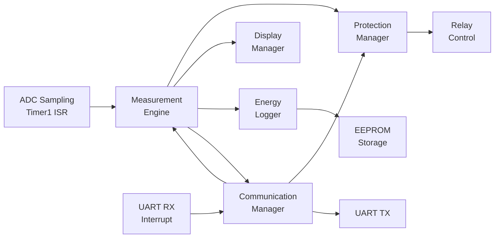
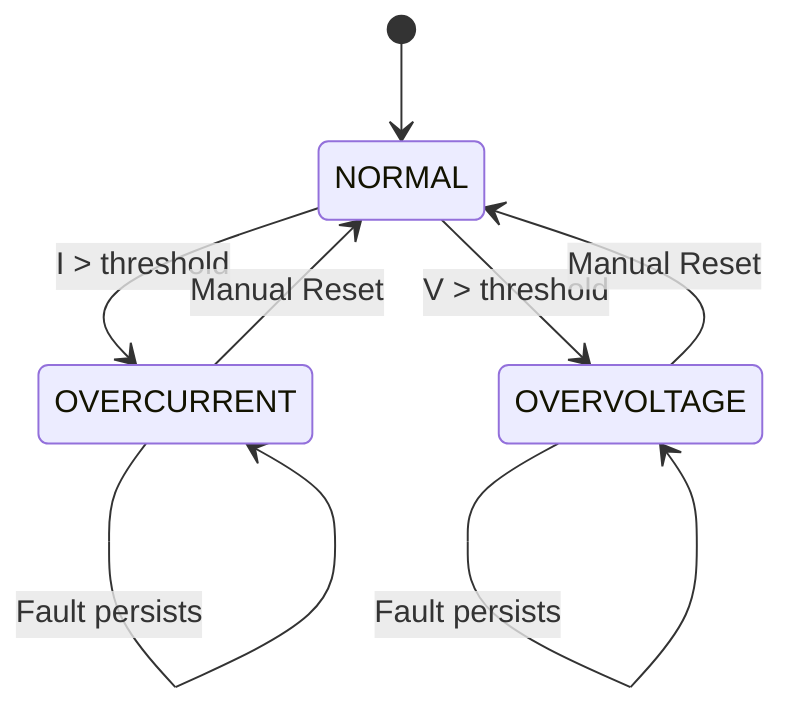

# High-Level Design (HLD)

**Project**: Smart Energy Management System  
**Component**: Embedded System Architecture  
**Version**: 1.0

---

## 1. System Overview

The Smart Energy Management System is a **real-time energy monitoring and protection device** based on **ATmega32 microcontroller** with capabilities for voltage/current measurement, power/energy calculation, protection (overcurrent/overvoltage), and wireless communication.

---

## 2. Software Architecture

### 2.1 Layered Architecture

```
┌─────────────────────────────────────────────────┐
│         Application Layer (App)                 │
│  ┌──────────────┐  ┌──────────────┐            │
│  │ Measurement  │  │ Protection   │            │
│  │ Engine       │  │ Manager      │            │
│  └──────────────┘  └──────────────┘            │
│  ┌──────────────┐  ┌──────────────┐            │
│  │ Energy       │  │ Communication│            │
│  │ Logger       │  │ Manager      │            │
│  └──────────────┘  └──────────────┘            │
│  ┌──────────────┐  ┌──────────────┐            │
│  │ Display      │  │ Calibration  │            │
│  │ Manager      │  │ Manager      │            │
│  └──────────────┘  └──────────────┘            │
├─────────────────────────────────────────────────┤
│    Hardware Abstraction Layer (HAL)             │
│  ┌──────┐ ┌──────┐ ┌──────┐ ┌──────┐          │
│  │Voltage│ │Current│ │ LCD  │ │Relay │          │
│  │Sensor │ │Sensor │ │      │ │      │          │
│  └──────┘ └──────┘ └──────┘ └──────┘          │
│  ┌──────┐ ┌──────┐ ┌──────┐                   │
│  │ RGB  │ │Buzzer│ │ HC05 │                   │
│  │ LED  │ │      │ │/ESP01│                   │
│  └──────┘ └──────┘ └──────┘                   │
├─────────────────────────────────────────────────┤
│  Microcontroller Abstraction Layer (MCAL)       │
│  ┌─────┐ ┌─────┐ ┌──────┐ ┌──────┐ ┌──────┐  │
│  │ DIO │ │ ADC │ │TIMER0│ │TIMER1│ │ UART │  │
│  └─────┘ └─────┘ └──────┘ └──────┘ └──────┘  │
│  ┌─────┐ ┌─────┐ ┌─────┐ ┌─────┐             │
│  │EEPROM│ │ SPI │ │ TWI │ │ GIE │             │
│  └─────┘ └─────┘ └─────┘ └─────┘             │
└───────────────────────────────────────────────── ┘
```

### 2.2 Layer Responsibilities

**Application Layer**:

- High-level business logic
- Measurement orchestration
- Protection algorithms
- Display management
- Communication protocol handling

**HAL Layer**:

- Hardware module drivers (sensors, actuators, display, communication)
- Abstracts hardware details from application
- Provides clean interfaces for hardware access

**MCAL Layer**:

- Low-level peripheral drivers
- Direct register manipulation
- Interrupt service routines
- Hardware initialization

---

## 3. Key Components

### 3.1 Measurement Engine

**Purpose**: Measure V, I, P, E in real-time

**Inputs**:

- ADC Channel 0 (Voltage sensor)
- ADC Channel 1 (Current sensor)

**Outputs**:

- RMS Voltage (float, Volts)
- RMS Current (float, Amperes)
- Power (float, Watts)
- Energy (float, kWh)

**Algorithm**:

1. Sample ADC at 100 Hz (Timer1 interrupt)
2. Accumulate samples in buffer
3. Calculate RMS: √(Σ samples² / N)
4. Apply calibration factors
5. Calculate power: P = V × I × PF
6. Integrate power for energy: E += P × Δt

---

### 3.2 Protection Manager

**Purpose**: Detect faults and trigger protection

**Monitors**:

- Current > threshold → Overcurrent
- Voltage > threshold → Overvoltage

**Actions**:

- Disconnect relay (load OFF)
- Update display (show fault)
- Set RGB LED to RED
- Activate buzzer alert
- Send communication alert

**Debouncing**: Require 3 consecutive readings above threshold (300ms)

---

### 3.3 Energy Logger

**Purpose**: Persist energy data to EEPROM

**Strategy**:

- Save energy counter every 60 seconds
- Save on significant change (>0.1 kWh)
- Save calibration data on change

**EEPROM Map**:

- 0x0000: Energy (4 bytes, float)
- 0x0004: Voltage cal factor (2 bytes)
- 0x0006: Current cal factor (2 bytes)
- 0x0008: Current zero offset (2 bytes)
- 0x000A: Power factor (2 bytes)
- 0x000C+: Thresholds and config

---

### 3.4 Communication Manager

**Purpose**: Handle UART protocol with Mobile/Dashboard

**Supported Commands**:

- 0x05: GET_RMS_DATA
- 0x09: RELAY_CONTROL
- 0x02: CALIBRATE_SENSORS
- 0x0E: RESET_ENERGY

**Dual Format Support**:

- Mobile App: Scaled integers, Big-Endian
- Dashboard: Float32, Little-Endian

---

### 3.5 Display Manager

**Purpose**: Manage LCD and status indicators

**LCD Content** (rotating every 2 sec):

- Screen 1: Voltage & Current
- Screen 2: Power & Energy
- Screen 3: Status & Relay state

**RGB LED**:

- Green = OK
- Yellow = Warning
- Red = Fault
- Blue = Communicating

---

## 4. Data Flow



---

## 5. Execution Model

**Bare-Metal Superloop**:

```c
main() {
    // Init
    GIE_Enable();
    ME_Init();
    PM_Init();
    EL_Init();
    DM_Init();
    CM_Init();

    // Superloop (10 Hz)
    while(1) {
        ME_Update();           // Measure
        PM_Update();           // Check protection
        DM_Update();           // Update display
        EL_Task();             // Save to EEPROM
        CM_Task();             // Handle commands
        _delay_ms(100);        // 100ms cycle
    }
}
```

**Interrupts**:

- Timer1 COMPA: ADC sampling trigger (100 Hz)
- UART RX: Command reception (asynchronous)

---

## 6. State Machine (Protection Manager)



**States**:

- **NORMAL**: All within limits, relay ON (if enabled)
- **OVERCURRENT**: Current fault, relay OFF
- **OVERVOLTAGE**: Voltage fault, relay OFF

---

## 7. Safety Considerations

**Fail-Safe Defaults**:

- Relay OFF on power-up
- Relay OFF on MCU reset
- Relay OFF on any fault

**Protection Response Time**:

- Detection: ≤300ms (3 samples @ 100ms)
- Action: ≤100ms (relay disconnect)
- Total: ≤500ms

**Watchdog** (optional):

- 500ms timeout
- Reset on hang/crash

---

**Document Version**: 1.0  
**Last Updated**: January 2026
