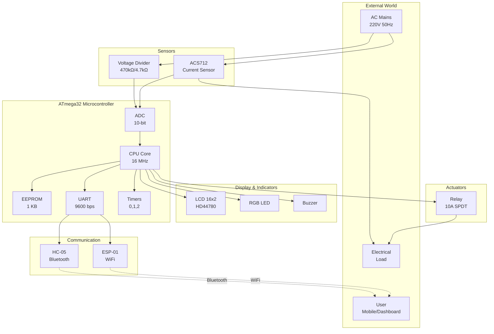
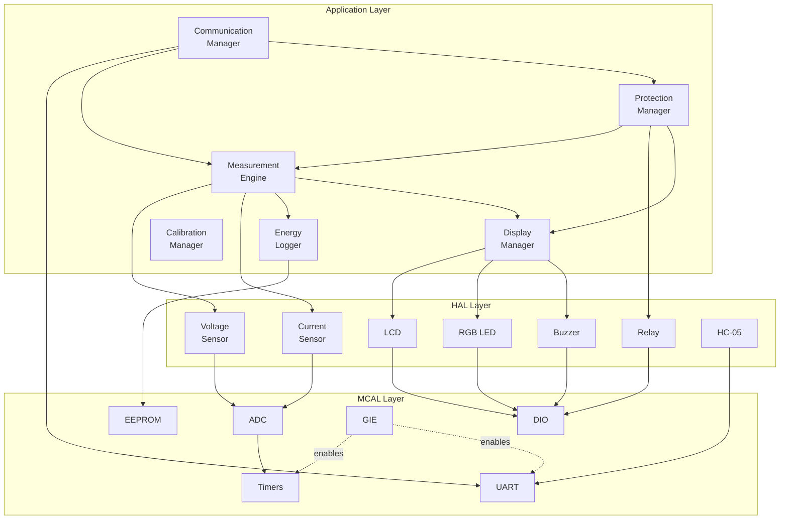

# System Block Diagram

**Project**: Smart Energy Management System  
**Version**: 1.0

---

## 1. System Overview Diagram



---

## 2. Hardware Architecture

### 2.1 Power Supply

- **Input**: 5V DC (from wall adapter or USB)
- **Regulators**:
  - 5V rail → ATmega32, LCD, relay, sensors
  - 3.3V rail (AMS1117) → HC-05/ESP-01
- **Protection**: Reverse polarity (Schottky diode), overcurrent (fuse)

### 2.2 Measurement Path

**Voltage Measurement**:

```
AC Mains → Voltage Divider (100:1) → Rectifier → Filter → ADC PA0
```

**Current Measurement**:

```
AC Load Line → ACS712 → RC Filter → ADC PA1
```

### 2.3 Control Path

**Protection Logic**:

```
ADC → CPU (Protection Manager) → Relay Driver (ULN2003) → Relay → Load
```

### 2.4 Communication Path

```
CPU (UART) ↔ Level Shifter ↔ HC-05/ESP-01 ↔ Mobile/Dashboard
```

---

## 3. Software Block Diagram



---

## 4. Data Flow

### 4.1 Measurement Data Flow

1. Timer1 triggers ADC conversion (100 Hz)
2. ADC ISR stores sample in buffer
3. Measurement Engine processes samples (RMS calculation)
4. Results flow to:
   - Protection Manager (fault checking)
   - Display Manager (LCD update)
   - Energy Logger (EEPROM storage)
   - Communication Manager (transmit to user)

### 4.2 Command Data Flow

1. UART RX interrupt receives data
2. Communication Manager parses command
3. Command routed to appropriate module:
   - GET_DATA → Measurement Engine
   - RELAY_CONTROL → Protection Manager
   - CALIBRATE → Calibration Manager
   - RESET_ENERGY → Energy Logger
4. Response generated and transmitted via UART

---

## 5. Communication Variants

### Version 1: Bluetooth (HC-05)

```
Mobile App ←→ Bluetooth SPP ←→ HC-05 ←→ UART ←→ ATmega32
```

### Version 2: WiFi (ESP-01)

```
Dashboard ←→ WiFi/WebSocket ←→ ESP-01 ←→ UART ←→ ATmega32
```

---

**Document Version**: 1.0  
**Last Updated**: January 2026
