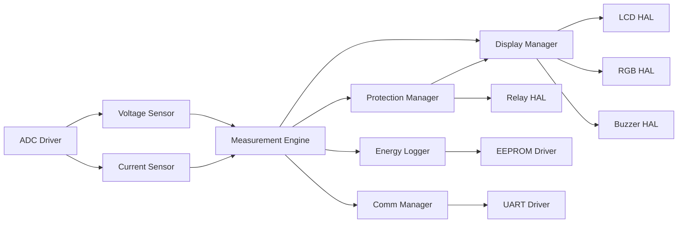

# 🔌 Interface Control Document (ICD)

**Interface Control Document (ICD)**

**Smart Energy Management System - Module Interface Specifications**

_Developed by Gestell Company - Professional Embedded Solutions_

---

## 📋 Table of Contents

- [MCAL Layer Interfaces](#-mcal-layer-interfaces)
- [HAL Layer Interfaces](#-hal-layer-interfaces)
- [Application Layer Interfaces](#-application-layer-interfaces)
- [Data Flow](#-data-flow-between-modules)
- [Callback Mechanisms](#-callback-mechanisms)

---

## 🔗 Related Documentation

| Document                                         | Description           | Status       |
| ------------------------------------------------ | --------------------- | ------------ |
| **[LLD.md](../LLD/LLD.md)**                      | Low-Level Design      | ✅ Available |
| **[SRS.md](../../02_Requirements/SRS/SRS.md)**   | Software Requirements | ✅ Available |
| **[Memory_Map.md](../Memory_Map/Memory_Map.md)** | Memory Layout         | ✅ Available |

---

## 🔌 MCAL Layer Interfaces

### 1.1 DIO Driver

**File**: `DIO_Interface.h`

**Purpose**: Provides generic digital input/output operations for GPIO pins

#### Functions

| Function Name       | Purpose                       | Parameters                                         | Return Type |
| ------------------- | ----------------------------- | -------------------------------------------------- | ----------- |
| DIO_SetPinDirection | Configure pin as input/output | port (uint8_t), pin (uint8_t), direction (uint8_t) | void        |
| DIO_SetPin          | Write HIGH or LOW to pin      | port (uint8_t), pin (uint8_t), value (uint8_t)     | void        |
| DIO_ReadPin         | Read current pin state        | port (uint8_t), pin (uint8_t)                      | uint8_t     |
| DIO_TogglePin       | Toggle pin state              | port (uint8_t), pin (uint8_t)                      | void        |

#### Constants

| Constant Name | Value | Description                |
| ------------- | ----- | -------------------------- |
| PORTA         | 0     | Port A identifier          |
| PORTB         | 1     | Port B identifier          |
| PORTC         | 2     | Port C identifier          |
| PORTD         | 3     | Port D identifier          |
| INPUT         | 0     | Pin direction: input       |
| OUTPUT        | 1     | Pin direction: output      |
| LOW           | 0     | Pin logic level: low (0V)  |
| HIGH          | 1     | Pin logic level: high (5V) |

---

### 1.2 ADC Driver

**File**: `ADC_Interface.h`

**Purpose**: Provides analog-to-digital conversion for voltage and current sensors

#### Functions

| Function Name       | Purpose                         | Parameters                  | Return Type |
| ------------------- | ------------------------------- | --------------------------- | ----------- |
| ADC_Init            | Initialize ADC peripheral       | None                        | void        |
| ADC_Read            | Blocking read of ADC channel    | channel (uint8_t)           | uint16_t    |
| ADC_StartConversion | Start conversion (non-blocking) | channel (uint8_t)           | void        |
| ADC_GetResult       | Get last conversion result      | None                        | uint16_t    |
| ADC_SetCallback     | Register ISR callback function  | callback (function pointer) | void        |

#### Configuration Parameters

| Parameter       | Value          | Description                   |
| --------------- | -------------- | ----------------------------- |
| Resolution      | 10-bit         | ADC resolution (0-1023)       |
| Reference       | AVCC           | AVCC pin as voltage reference |
| Prescaler       | 128            | ADC clock = F_CPU/128         |
| Conversion Time | ~13 ADC clocks | Time for one conversion       |

---

### 1.3 UART Driver

**File**: `UART_Interface.h`

**Purpose**: Provides serial communication for Bluetooth/WiFi modules

#### Functions

| Function Name        | Purpose                         | Parameters                  | Return Type |
| -------------------- | ------------------------------- | --------------------------- | ----------- |
| UART_Init            | Initialize UART peripheral      | baud_rate (uint32_t)        | void        |
| UART_SendByte        | Transmit single byte            | data (uint8_t)              | void        |
| UART_SendString      | Transmit null-terminated string | str (const char\*)          | void        |
| UART_ReceiveByte     | Blocking receive single byte    | None                        | uint8_t     |
| UART_IsDataAvailable | Check if RX buffer has data     | None                        | bool        |
| UART_SetRxCallback   | Register RX ISR callback        | callback (function pointer) | void        |

#### Typical Configuration

| Parameter | Value    | Description               |
| --------- | -------- | ------------------------- |
| Baud Rate | 9600 bps | Standard for HC-05/ESP-01 |
| Data Bits | 8        | 8-bit data                |
| Stop Bits | 1        | 1 stop bit                |
| Parity    | None     | No parity checking        |

---

### 1.4 Timer1 Driver

**File**: `TIMER1_Interface.h`

**Purpose**: Provides 16-bit timer for periodic ADC sampling

#### Functions

| Function Name           | Purpose                         | Parameters                  | Return Type |
| ----------------------- | ------------------------------- | --------------------------- | ----------- |
| TIMER1_Init             | Initialize Timer1 in CTC mode   | None                        | void        |
| TIMER1_SetCompareA      | Set compare match A value       | value (uint16_t)            | void        |
| TIMER1_SetCompareB      | Set compare match B value       | value (uint16_t)            | void        |
| TIMER1_SetCallbackCompA | Register compare A ISR callback | callback (function pointer) | void        |
| TIMER1_SetCallbackCompB | Register compare B ISR callback | callback (function pointer) | void        |
| TIMER1_Start            | Start timer counting            | None                        | void        |
| TIMER1_Stop             | Stop timer counting             | None                        | void        |

#### Timer Configuration

| Parameter        | Value        | Description                   |
| ---------------- | ------------ | ----------------------------- |
| Mode             | CTC (Mode 4) | Clear Timer on Compare Match  |
| Prescaler        | 64           | Timer clock = F_CPU/64        |
| Compare Value    | 1250         | For 100ms interrupt @ 8MHz    |
| Interrupt Source | COMPA        | Compare Match A generates IRQ |

---

### 1.5 EEPROM Driver

**File**: `EEPROM_Interface.h`

**Purpose**: Provides non-volatile storage for configuration and energy data

#### Functions

| Function Name     | Purpose                          | Parameters                                                | Return Type |
| ----------------- | -------------------------------- | --------------------------------------------------------- | ----------- |
| EEPROM_ReadByte   | Read single byte from EEPROM     | address (uint16_t)                                        | uint8_t     |
| EEPROM_WriteByte  | Write single byte to EEPROM      | address (uint16_t), data (uint8_t)                        | void        |
| EEPROM_ReadBlock  | Read multiple bytes (block)      | address (uint16_t), buffer (uint8_t\*), length (uint16_t) | void        |
| EEPROM_WriteBlock | Write multiple bytes (block)     | address (uint16_t), buffer (uint8_t\*), length (uint16_t) | void        |
| EEPROM_IsBusy     | Check if write operation ongoing | None                                                      | bool        |

#### EEPROM Characteristics

| Characteristic    | Value          | Description                |
| ----------------- | -------------- | -------------------------- |
| Total Size        | 1024 bytes     | ATmega32 EEPROM capacity   |
| Write Time        | ~3.3 ms        | Time per byte write        |
| Endurance         | 100,000 cycles | Minimum write/erase cycles |
| Operating Voltage | 2.7V - 5.5V    | Valid operation range      |

---

## 2. HAL Layer Interfaces

### 2.1 Voltage Sensor

**File**: `Voltage_Interface.h`

**Purpose**: Abstract interface for AC voltage measurement via voltage divider

#### Functions

| Function Name                | Purpose                          | Parameters     | Return Type |
| ---------------------------- | -------------------------------- | -------------- | ----------- |
| VoltageSensor_Init           | Initialize voltage sensor        | None           | void        |
| VoltageSensor_ReadRaw        | Read raw ADC value               | None           | uint16_t    |
| VoltageSensor_ReadVoltage    | Read calibrated voltage in Volts | None           | float       |
| VoltageSensor_SetCalibration | Set calibration factor           | factor (float) | void        |

#### Data Flow

**Scaling Formula**: `Voltage = (ADC_Value × 5.0 / 1024) × Divider_Ratio × Calibration_Factor`

---

### 2.2 Current Sensor (ACS712)

**File**: `hCurrent_Interface.h`

**Purpose**: Abstract interface for ACS712 Hall-effect current sensor

#### Functions

| Function Name                | Purpose                            | Parameters        | Return Type |
| ---------------------------- | ---------------------------------- | ----------------- | ----------- |
| CurrentSensor_Init           | Initialize current sensor          | None              | void        |
| CurrentSensor_ReadRaw        | Read raw ADC value                 | None              | uint16_t    |
| CurrentSensor_ReadCurrent    | Read calibrated current in Amperes | None              | float       |
| CurrentSensor_SetZeroOffset  | Set zero current offset            | offset (uint16_t) | void        |
| CurrentSensor_SetCalibration | Set calibration factor             | factor (float)    | void        |
| CurrentSensor_Calibrate      | Auto-calibrate zero offset         | None              | void        |

#### Sensor Characteristics

| Characteristic      | Value      | Description               |
| ------------------- | ---------- | ------------------------- |
| Model               | ACS712-30A | 30A bidirectional sensor  |
| Sensitivity         | 66 mV/A    | Output voltage per ampere |
| Zero Current Output | 2.5V       | Output at 0A (VCC/2)      |
| Response Time       | <5 µs      | Sensor response time      |

---

### 2.3 LCD Driver

**File**: `LCD_Interface.h`

**Purpose**: Abstract interface for 16x2 character LCD (HD44780-compatible)

#### Functions

| Function Name        | Purpose                      | Parameters                              | Return Type |
| -------------------- | ---------------------------- | --------------------------------------- | ----------- |
| LCD_Init             | Initialize LCD in 4-bit mode | None                                    | void        |
| LCD_Clear            | Clear display                | None                                    | void        |
| LCD_SetCursor        | Position cursor              | row (uint8_t), col (uint8_t)            | void        |
| LCD_WriteChar        | Write single character       | c (char)                                | void        |
| LCD_WriteString      | Write string                 | str (const char\*)                      | void        |
| LCD_WriteNumber      | Write integer number         | num (int32_t)                           | void        |
| LCD_CreateCustomChar | Define custom character      | location (uint8_t), pattern (uint8_t\*) | void        |

#### LCD Configuration

| Parameter     | Value          | Description                     |
| ------------- | -------------- | ------------------------------- |
| Mode          | 4-bit          | Uses 4 data lines (D4-D7)       |
| Display Type  | 16x2           | 16 columns, 2 rows              |
| Pins Used     | 6 GPIO         | RS, EN, D4, D5, D6, D7          |
| Character Set | ASCII + Custom | Standard ASCII + 8 custom chars |

---

### 2.4 Relay Control

**File**: `RELAY_Interface.h`

**Purpose**: Control load relay for protection actions

#### Functions

| Function Name  | Purpose                        | Parameters | Return Type |
| -------------- | ------------------------------ | ---------- | ----------- |
| Relay_Init     | Initialize relay control pin   | None       | void        |
| Relay_ON       | Energize relay (connect load)  | None       | void        |
| Relay_OFF      | De-energize relay (disconnect) | None       | void        |
| Relay_Toggle   | Toggle relay state             | None       | void        |
| Relay_GetState | Get current relay state        | None       | bool        |

#### Return Values

| Function       | Return Value | Meaning                          |
| -------------- | ------------ | -------------------------------- |
| Relay_GetState | true         | Relay is ON (load connected)     |
| Relay_GetState | false        | Relay is OFF (load disconnected) |

---

### 2.5 RGB LED

**File**: `RGB_Interface.h`

**Purpose**: Visual status indication using RGB LED

#### Functions

| Function Name          | Purpose                 | Parameters                                     | Return Type |
| ---------------------- | ----------------------- | ---------------------------------------------- | ----------- |
| RGB_Init               | Initialize RGB LED pins | None                                           | void        |
| RGB_SetColor           | Set custom RGB color    | red (uint8_t), green (uint8_t), blue (uint8_t) | void        |
| RGB_SetColorPredefined | Set predefined color    | color (RGBColor_t enum)                        | void        |
| RGB_Off                | Turn off LED            | None                                           | void        |

#### Predefined Colors

| Color Name  | Red | Green | Blue | Usage                |
| ----------- | --- | ----- | ---- | -------------------- |
| RGB_OFF     | 0   | 0     | 0    | LED off              |
| RGB_RED     | 255 | 0     | 0    | Fault condition      |
| RGB_GREEN   | 0   | 255   | 0    | Normal operation     |
| RGB_BLUE    | 0   | 0     | 255  | Configuration mode   |
| RGB_YELLOW  | 255 | 255   | 0    | Warning              |
| RGB_CYAN    | 0   | 255   | 255  | Calibration mode     |
| RGB_MAGENTA | 255 | 0     | 255  | Communication active |
| RGB_WHITE   | 255 | 255   | 255  | System test          |

---

### 2.6 Buzzer

**File**: `Buzzer_Interface.h`

**Purpose**: Audible alerts for protection events

#### Functions

| Function Name  | Purpose                       | Parameters                                                         | Return Type |
| -------------- | ----------------------------- | ------------------------------------------------------------------ | ----------- |
| Buzzer_Init    | Initialize buzzer control pin | None                                                               | void        |
| Buzzer_ON      | Turn buzzer on continuously   | None                                                               | void        |
| Buzzer_OFF     | Turn buzzer off               | None                                                               | void        |
| Buzzer_Beep    | Single beep with duration     | duration_ms (uint16_t)                                             | void        |
| Buzzer_Pattern | Play beep pattern             | count (uint8_t), beep_duration (uint16_t), gap_duration (uint16_t) | void        |

#### Typical Patterns

| Event Type   | Pattern Description                 | Implementation              |
| ------------ | ----------------------------------- | --------------------------- |
| Overcurrent  | 5 short beeps (200ms ON, 100ms OFF) | Buzzer_Pattern(5, 200, 100) |
| Overvoltage  | 3 long beeps (500ms ON, 200ms OFF)  | Buzzer_Pattern(3, 500, 200) |
| Sensor Fault | Continuous beeping                  | Buzzer_ON() until cleared   |
| Button Press | Single short beep                   | Buzzer_Beep(100)            |

---

## 3. Application Layer Interfaces

### 3.1 Measurement Engine

**File**: `MeasurementEngine_Interface.h`

**Purpose**: Core measurement calculations (RMS, power, energy)

#### Functions

| Function Name     | Purpose                           | Parameters | Return Type |
| ----------------- | --------------------------------- | ---------- | ----------- |
| ME_Init           | Initialize measurement engine     | None       | void        |
| ME_Update         | Update all measurements           | None       | void        |
| ME_GetVoltageRMS  | Get RMS voltage                   | None       | float       |
| ME_GetCurrentRMS  | Get RMS current                   | None       | float       |
| ME_GetPower       | Get instantaneous power           | None       | float       |
| ME_GetEnergy      | Get cumulative energy (kWh)       | None       | float       |
| ME_ResetEnergy    | Reset energy counter to zero      | None       | void        |
| ME_SetPowerFactor | Set power factor for calculations | pf (float) | void        |

#### Data Structure: MeasurementData_t

| Field Name  | Data Type | Description                  |
| ----------- | --------- | ---------------------------- |
| voltage_rms | float     | RMS voltage in Volts         |
| current_rms | float     | RMS current in Amperes       |
| power_watts | float     | Instantaneous power in Watts |
| energy_kwh  | float     | Cumulative energy in kWh     |
| timestamp   | uint32_t  | Timestamp in milliseconds    |

---

### 3.2 Protection Manager

**File**: `ProtectionManager_Interface.h`

**Purpose**: Overcurrent and overvoltage protection logic

#### Functions

| Function Name              | Purpose                          | Parameters              | Return Type        |
| -------------------------- | -------------------------------- | ----------------------- | ------------------ |
| PM_Init                    | Initialize protection manager    | None                    | void               |
| PM_Update                  | Update protection checks         | None                    | void               |
| PM_SetOvercurrentThreshold | Set overcurrent trip threshold   | threshold_amps (float)  | void               |
| PM_SetOvervoltageThreshold | Set overvoltage trip threshold   | threshold_volts (float) | void               |
| PM_IsProtectionTriggered   | Check if protection is active    | None                    | bool               |
| PM_GetStatus               | Get current protection status    | None                    | ProtectionStatus_t |
| PM_Reset                   | Reset protection (manual action) | None                    | void               |

#### Protection Status Enumeration

| Status Name       | Numeric Value | Description                 |
| ----------------- | ------------- | --------------------------- |
| PROT_NORMAL       | 0             | No protection triggered     |
| PROT_OVERCURRENT  | 1             | Overcurrent detected        |
| PROT_OVERVOLTAGE  | 2             | Overvoltage detected        |
| PROT_SENSOR_FAULT | 3             | Sensor malfunction detected |

---

### 3.3 Energy Logger

**File**: `EnergyLogger_Interface.h`

**Purpose**: Persistent storage of energy data to EEPROM

#### Functions

| Function Name                    | Purpose                            | Parameters          | Return Type |
| -------------------------------- | ---------------------------------- | ------------------- | ----------- |
| App_EnergyLogger_Init            | Initialize energy logger           | None                | void        |
| App_EnergyLogger_Update          | Update energy log entry            | log (EnergyLog_t\*) | void        |
| App_EnergyLogger_Task            | Periodic task (save to EEPROM)     | None                | void        |
| App_EnergyLogger_GetStoredEnergy | Retrieve stored energy from EEPROM | None                | float       |
| App_EnergyLogger_ResetEnergy     | Reset stored energy                | None                | void        |

#### Data Structure: EnergyLog_t

| Field Name | Data Type | Description             |
| ---------- | --------- | ----------------------- |
| timestamp  | uint32_t  | Log timestamp (seconds) |
| voltage    | float     | Voltage at log time     |
| current    | float     | Current at log time     |
| power      | float     | Power at log time       |
| energy_kwh | float     | Cumulative energy       |

---

### 3.4 Communication Manager

**File**: `App_CommManager.h`

**Purpose**: Handle UART communication with mobile/dashboard

#### Functions

| Function Name                  | Purpose                          | Parameters                                     | Return Type |
| ------------------------------ | -------------------------------- | ---------------------------------------------- | ----------- |
| App_CommManager_Init           | Initialize communication manager | None                                           | void        |
| App_CommManager_Task           | Periodic communication task      | None                                           | void        |
| App_CommManager_SendData       | Transmit measurement data        | None                                           | void        |
| App_CommManager_ProcessCommand | Process received command         | cmd (uint8_t), data (uint8_t\*), len (uint8_t) | void        |

#### Command IDs

| Command ID        | Hex Value | Description                  |
| ----------------- | --------- | ---------------------------- |
| CMD_GET_RMS_DATA  | 0x05      | Request RMS measurement data |
| CMD_RELAY_CONTROL | 0x09      | Control relay ON/OFF         |
| CMD_CALIBRATE     | 0x02      | Trigger sensor calibration   |
| CMD_RESET_ENERGY  | 0x0E      | Reset energy counter         |
| CMD_UPDATE_WIFI   | 0x0C      | Update WiFi credentials      |

---

### 3.5 Display Manager

**File**: `DisplayManager_Interface.h`

**Purpose**: Manage LCD display content and screen rotation

#### Functions

| Function Name       | Purpose                                 | Parameters                                 | Return Type |
| ------------------- | --------------------------------------- | ------------------------------------------ | ----------- |
| DM_Init             | Initialize display manager              | None                                       | void        |
| DM_Update           | Update display (handle rotation)        | None                                       | void        |
| DM_ShowMeasurements | Display voltage, current, power, energy | v (float), i (float), p (float), e (float) | void        |
| DM_ShowStatus       | Display status message                  | status_text (const char\*)                 | void        |
| DM_ShowFault        | Display fault message                   | fault_text (const char\*)                  | void        |

#### Display Screens

| Screen ID | Content Line 1 | Content Line 2     | Rotation Time |
| --------- | -------------- | ------------------ | ------------- |
| Screen 1  | Voltage (V)    | Current (A)        | 2 seconds     |
| Screen 2  | Power (W)      | Energy (kWh)       | 2 seconds     |
| Screen 3  | System Status  | (OK/FAULT/WARNING) | 2 seconds     |

---

### 3.6 Calibration Manager

**File**: `Calibration_Manager_Interface.h`

**Purpose**: Sensor calibration and coefficient storage

#### Functions

| Function Name                          | Purpose                             | Parameters                | Return Type |
| -------------------------------------- | ----------------------------------- | ------------------------- | ----------- |
| CalibrationManager_Init                | Initialize calibration manager      | None                      | void        |
| CalibrationManager_CalibrateVoltage    | Calibrate voltage sensor            | reference_voltage (float) | void        |
| CalibrationManager_CalibrateCurrent    | Calibrate current sensor            | reference_current (float) | void        |
| CalibrationManager_CalibrateZeroOffset | Calibrate current sensor zero point | None                      | void        |
| CalibrationManager_SaveToEEPROM        | Save calibration data to EEPROM     | None                      | void        |
| CalibrationManager_LoadFromEEPROM      | Load calibration data from EEPROM   | None                      | void        |

---

## 4. Data Flow Between Modules

**Data Flow Description**:

1. **ADC Driver** samples analog inputs from voltage divider and ACS712 sensor
2. **Sensor HAL** modules convert raw ADC values to physical units (V, A)
3. **Measurement Engine** receives sensor data and calculates RMS, power, energy
4. **Protection Manager** monitors for fault conditions and controls relay
5. **Display Manager** shows measurements on LCD and controls RGB LED
6. **Energy Logger** saves energy data to EEPROM periodically
7. **Communication Manager** transmits data via UART to external devices

---

## 5. Callback Mechanisms

### 5.1 Timer1 ISR Callback Mechanism

**Purpose**: Allow application layer to register periodic sampling function

**Mechanism Description**:

1. **MCAL Timer1 Driver** maintains a function pointer variable for the callback
2. **Application** registers its callback function using `TIMER1_SetCallbackCompA()`
3. **Timer1 Compare Match ISR** checks if callback is registered (not NULL)
4. **ISR** invokes the registered callback function
5. **Application callback** performs ADC sampling or other periodic tasks

### 5.2 ADC Conversion Complete Callback

**Purpose**: Notify application when ADC conversion completes

**Mechanism Description**:

1. **MCAL ADC Driver** maintains callback function pointer
2. **Application** registers callback using `ADC_SetCallback()`
3. **ADC Interrupt** fires when conversion complete
4. **ADC ISR** reads result and passes to registered callback
5. **Application callback** stores value in buffer for RMS calculation

### 5.3 UART Receive Callback

**Purpose**: Handle incoming bytes from mobile/dashboard

**Mechanism Description**:

1. **MCAL UART Driver** maintains RX callback function pointer
2. **Communication Manager** registers callback using `UART_SetRxCallback()`
3. **UART RX Interrupt** fires when byte received
4. **UART ISR** reads byte and passes to registered callback
5. **Communication Manager callback** implements frame parsing state machine

---

## 📞 Support & Contact

**Project Information**:

- **Project Name**: Smart Energy Management System
- **Development Company**: Gestell - Professional Embedded Solutions

**Technical Support**: Hisham4Ahmed@gmail.com

---

## 📄 Document Control

| Attribute            | Value                            |
| -------------------- | -------------------------------- |
| **Document Type**    | Interface Control Document (ICD) |
| **Document Status**  | Active                           |
| **Document Version** | 2.0                              |
| **Last Updated**     | January 2026                     |
| **Prepared By**      | Gestell Engineering Team         |
| **Target Platform**  | ATmega32 Microcontroller         |

---

**Built with ❤️ by Gestell Team**

_Professional Embedded Systems Engineering_

**Copyright © 2025-2026 Gestell Company - All Rights Reserved**

