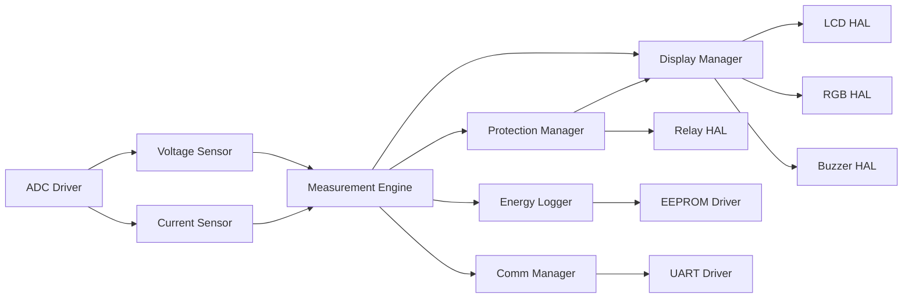

# Interface Control Document (ICD)

**Project**: Smart Energy Management System  
**Component**: Module Interface Specifications  
**Version**: 1.0

---

## 1. MCAL Layer Interfaces

### 1.1 DIO Driver

**File**: `DIO_Interface.h`

**Functions**:

```c
void DIO_SetPinDirection(uint8_t port, uint8_t pin, uint8_t direction);
void DIO_SetPin(uint8_t port, uint8_t pin, uint8_t value);
uint8_t DIO_ReadPin(uint8_t port, uint8_t pin);
void DIO_TogglePin(uint8_t port, uint8_t pin);
```

**Constants**:

```c
// Ports
#define PORTA 0
#define PORTB 1
#define PORTC 2
#define PORTD 3

// Directions
#define INPUT  0
#define OUTPUT 1

// Values
#define LOW  0
#define HIGH 1
```

---

### 1.2 ADC Driver

**File**: `ADC_Interface.h`

**Functions**:

```c
void ADC_Init(void);
uint16_t ADC_Read(uint8_t channel);
void ADC_StartConversion(uint8_t channel);
uint16_t ADC_GetResult(void);
void ADC_SetCallback(void (*callback)(uint16_t));
```

**Configuration**:

```c
#define ADC_RESOLUTION     10        // 10-bit
#define ADC_REFERENCE      AVCC      // AVCC as reference
#define ADC_PRESCALER      128       // F_CPU/128
```

---

### 1.3 UART Driver

**File**: `UART_Interface.h`

**Functions**:

```c
void UART_Init(uint32_t baud_rate);
void UART_SendByte(uint8_t data);
void UART_SendString(const char* str);
uint8_t UART_ReceiveByte(void);
bool UART_IsDataAvailable(void);
void UART_SetRxCallback(void (*callback)(uint8_t));
```

---

### 1.4 Timer1 Driver

**File**: `TIMER1_Interface.h`

**Functions**:

```c
void TIMER1_Init(void);
void TIMER1_SetCompareA(uint16_t value);
void TIMER1_SetCompareB(uint16_t value);
void TIMER1_SetCallbackCompA(void (*callback)(void));
void TIMER1_SetCallbackCompB(void (*callback)(void));
void TIMER1_Start(void);
void TIMER1_Stop(void);
```

---

### 1.5 EEPROM Driver

**File**: `EEPROM_Interface.h`

**Functions**:

```c
uint8_t EEPROM_ReadByte(uint16_t address);
void EEPROM_WriteByte(uint16_t address, uint8_t data);
void EEPROM_ReadBlock(uint16_t address, uint8_t* buffer, uint16_t length);
void EEPROM_WriteBlock(uint16_t address, const uint8_t* buffer, uint16_t length);
bool EEPROM_IsBusy(void);
```

---

## 2. HAL Layer Interfaces

### 2.1 Voltage Sensor

**File**: `Voltage_Interface.h`

**Functions**:

```c
void VoltageSensor_Init(void);
uint16_t VoltageSensor_ReadRaw(void);
float VoltageSensor_ReadVoltage(void);
void VoltageSensor_SetCalibration(float factor);
```

**Data Flow**:

```
ADC PA0 → Raw ADC value → Apply divider scaling → Apply calibration → Voltage (V)
```

---

### 2.2 Current Sensor (ACS712)

**File**: `hCurrent_Interface.h`

**Functions**:

```c
void CurrentSensor_Init(void);
uint16_t CurrentSensor_ReadRaw(void);
float CurrentSensor_ReadCurrent(void);
void CurrentSensor_SetZeroOffset(uint16_t offset);
void CurrentSensor_SetCalibration(float factor);
void CurrentSensor_Calibrate(void);  // Auto-calibrate zero offset
```

---

### 2.3 LCD Driver

**File**: `LCD_Interface.h`

**Functions**:

```c
void LCD_Init(void);
void LCD_Clear(void);
void LCD_SetCursor(uint8_t row, uint8_t col);
void LCD_WriteChar(char c);
void LCD_WriteString(const char* str);
void LCD_WriteNumber(int32_t num);
void LCD_CreateCustomChar(uint8_t location, uint8_t* pattern);
```

---

### 2.4 Relay Control

**File**: `RELAY_Interface.h`

**Functions**:

```c
void Relay_Init(void);
void Relay_ON(void);
void Relay_OFF(void);
void Relay_Toggle(void);
bool Relay_GetState(void);
```

---

### 2.5 RGB LED

**File**: `RGB_Interface.h`

**Functions**:

```c
void RGB_Init(void);
void RGB_SetColor(uint8_t red, uint8_t green, uint8_t blue);
void RGB_SetColorPredefined(RGBColor_t color);
void RGB_Off(void);
```

**Predefined Colors**:

```c
typedef enum {
    RGB_OFF,
    RGB_RED,
    RGB_GREEN,
    RGB_BLUE,
    RGB_YELLOW,
    RGB_CYAN,
    RGB_MAGENTA,
    RGB_WHITE
} RGBColor_t;
```

---

### 2.6 Buzzer

**File**: `Buzzer_Interface.h`

**Functions**:

```c
void Buzzer_Init(void);
void Buzzer_ON(void);
void Buzzer_OFF(void);
void Buzzer_Beep(uint16_t duration_ms);
void Buzzer_Pattern(uint8_t count, uint16_t beep_duration, uint16_t gap_duration);
```

---

## 3. Application Layer Interfaces

### 3.1 Measurement Engine

**File**: `MeasurementEngine_Interface.h`

**Functions**:

```c
void ME_Init(void);
void ME_Update(void);
float ME_GetVoltageRMS(void);
float ME_GetCurrentRMS(void);
float ME_GetPower(void);
float ME_GetEnergy(void);
void ME_ResetEnergy(void);
void ME_SetPowerFactor(float pf);
```

**Data Structure**:

```c
typedef struct {
    float voltage_rms;
    float current_rms;
    float power_watts;
    float energy_kwh;
    uint32_t timestamp;
} MeasurementData_t;
```

---

### 3.2 Protection Manager

**File**: `ProtectionManager_Interface.h`

**Functions**:

```c
void PM_Init(void);
void PM_Update(void);
void PM_SetOvercurrentThreshold(float threshold_amps);
void PM_SetOvervoltageThreshold(float threshold_volts);
bool PM_IsProtectionTriggered(void);
ProtectionStatus_t PM_GetStatus(void);
void PM_Reset(void);
```

**Data Structure**:

```c
typedef enum {
    PROT_NORMAL,
    PROT_OVERCURRENT,
    PROT_OVERVOLTAGE,
    PROT_SENSOR_FAULT
} ProtectionStatus_t;
```

---

### 3.3 Energy Logger

**File**: `EnergyLogger_Interface.h`

**Functions**:

```c
void App_EnergyLogger_Init(void);
void App_EnergyLogger_Update(const EnergyLog_t* log);
void App_EnergyLogger_Task(void);
float App_EnergyLogger_GetStoredEnergy(void);
void App_EnergyLogger_ResetEnergy(void);
```

**Data Structure**:

```c
typedef struct {
    uint32_t timestamp;
    float voltage;
    float current;
    float power;
    float energy_kwh;
} EnergyLog_t;
```

---

### 3.4 Communication Manager

**File**: `App_CommManager.h`

**Functions**:

```c
void App_CommManager_Init(void);
void App_CommManager_Task(void);
void App_CommManager_SendData(void);
void App_CommManager_ProcessCommand(uint8_t cmd, uint8_t* data, uint8_t len);
```

**Command IDs**:

```c
#define CMD_GET_RMS_DATA      0x05
#define CMD_RELAY_CONTROL     0x09
#define CMD_CALIBRATE         0x02
#define CMD_RESET_ENERGY      0x0E
#define CMD_UPDATE_WIFI       0x0C
```

---

### 3.5 Display Manager

**File**: `DisplayManager_Interface.h`

**Functions**:

```c
void DM_Init(void);
void DM_Update(void);
void DM_ShowMeasurements(float v, float i, float p, float e);
void DM_ShowStatus(const char* status_text);
void DM_ShowFault(const char* fault_text);
```

---

### 3.6 Calibration Manager

**File**: `Calibration_Manager_Interface.h`

**Functions**:

```c
void CalibrationManager_Init(void);
void CalibrationManager_CalibrateVoltage(float reference_voltage);
void CalibrationManager_CalibrateCurrent(float reference_current);
void CalibrationManager_CalibrateZeroOffset(void);
void CalibrationManager_SaveToEEPROM(void);
void CalibrationManager_LoadFromEEPROM(void);
```

---

## 4. Data Flow Between Modules



---

## 5. Callback Mechanisms

### 5.1 Timer1 ISR Callback

```c
// In Timer1 driver
static void (*timer1_compA_callback)(void) = NULL;

void TIMER1_SetCallbackCompA(void (*callback)(void)) {
    timer1_compA_callback = callback;
}

ISR(TIMER1_COMPA_vect) {
    if (timer1_compA_callback != NULL) {
        timer1_compA_callback();
    }
}

// In Application
void ADC_Sampling_ISR(void) {
    // Sample ADC channels
}

TIMER1_SetCallbackCompA(ADC_Sampling_ISR);
```

---

**Document Version**: 1.0  
**Last Updated**: January 2026  
**Maintained By**: Gestell Engineering Team
