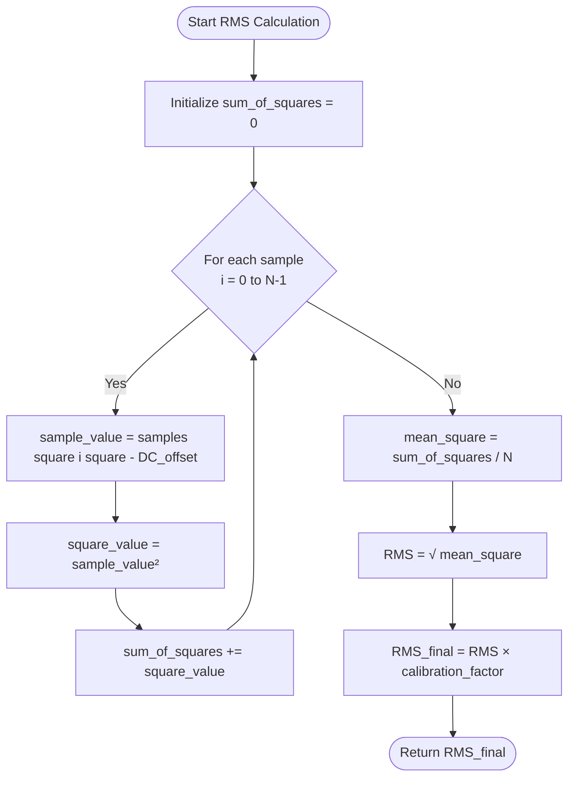
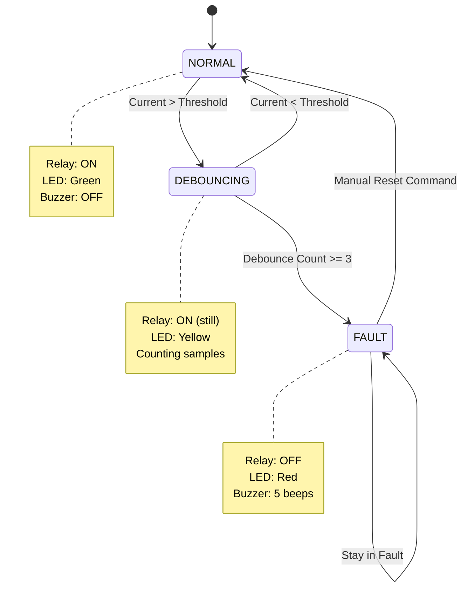
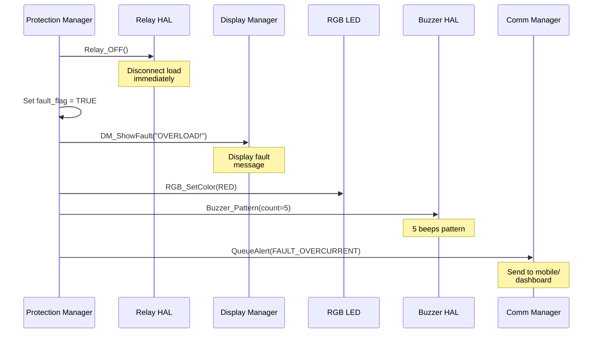
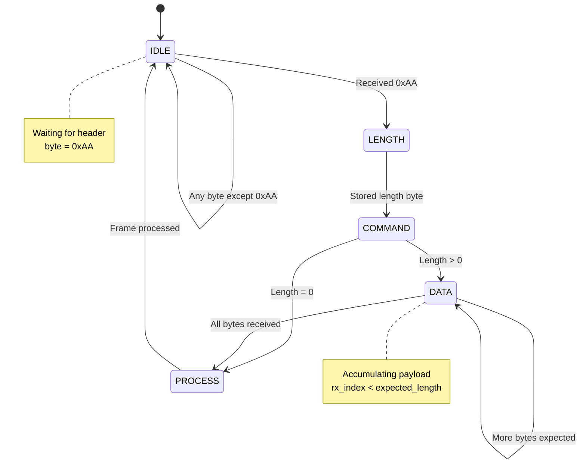
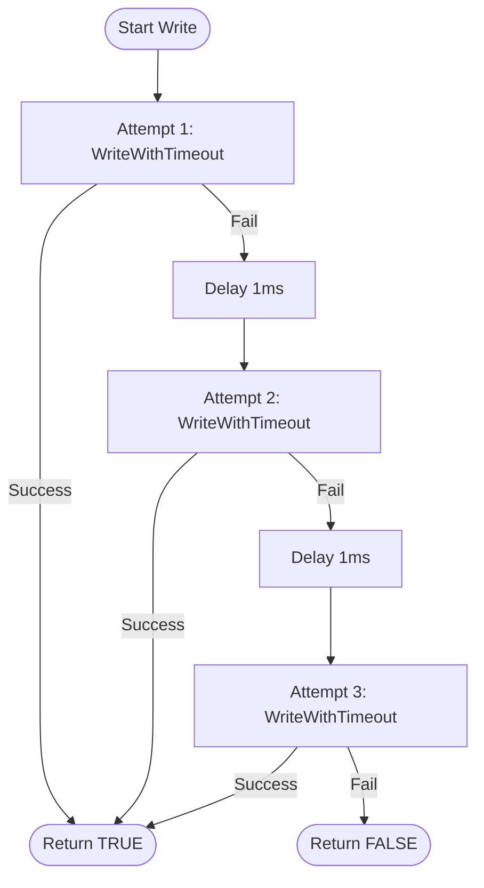
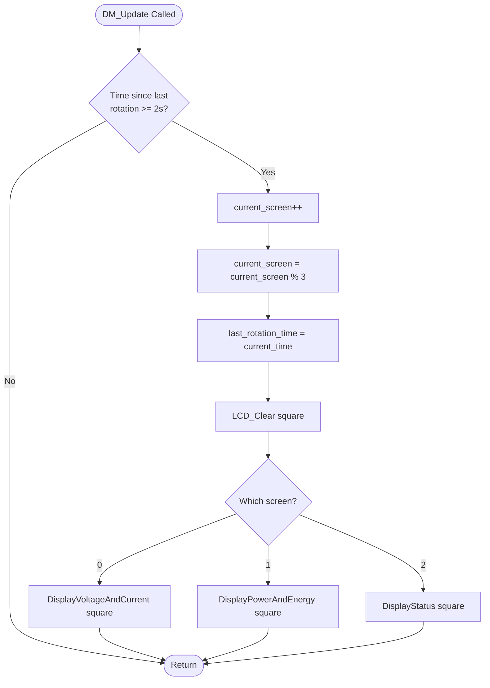
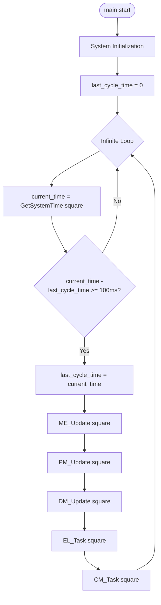
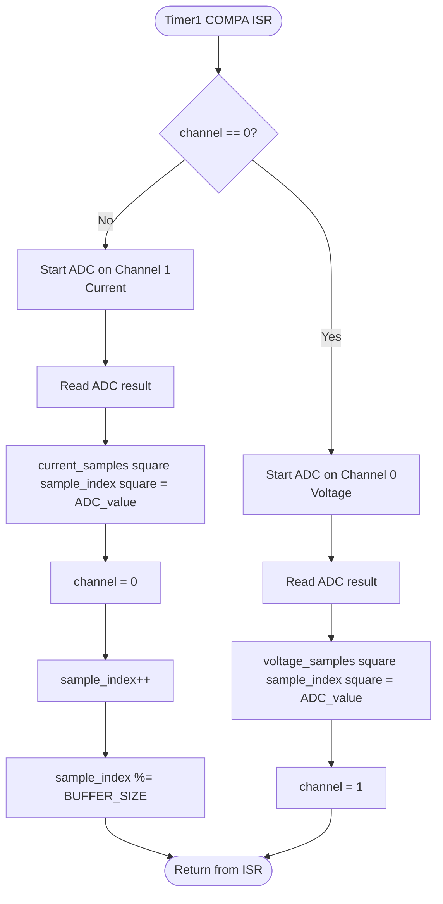

# ⚙️ Low-Level Design (LLD)

<div align="center">


**Low-Level Design (LLD)**

**Smart Energy Management System - Detailed Algorithm & Implementation Design**

_Developed by Gestell Company - Professional Embedded Solutions_

</div>

---

## 📋 Table of Contents

- [Measurement Algorithms](#-measurement-algorithms)
- [Protection Logic](#-protection-logic)
- [Communication Protocol Implementation](#-communication-protocol-implementation)
- [EEPROM Management](#-eeprom-management)
- [Display Manager Logic](#-display-manager-logic)
- [RGB LED Color Control](#-rgb-led-color-control)
- [Timing and Scheduling](#-timing-and-scheduling)

---

## 🔗 Related Documentation

| Document                                              | Description           | Status       |
| ----------------------------------------------------- | --------------------- | ------------ |
| **[HLD.md](../../03_System_Architecture/HLD/HLD.md)** | High-Level Design     | ✅ Available |
| **[SRS.md](../../02_Requirements/SRS/SRS.md)**        | Software Requirements | ✅ Available |
| **[Memory_Map.md](../Memory_Map/Memory_Map.md)**      | Memory Layout         | ✅ Available |

---

## 🧮 Measurement Algorithms

### 1.1 RMS Calculation Algorithm

**Purpose**: Calculate RMS (Root Mean Square) for AC voltage and current

**Description**: The RMS algorithm processes a buffer of ADC samples to compute the effective (RMS) value of AC signals. This is essential for accurate voltage and current measurement.

**Algorithm Steps**:



**Input Parameters**:

| Parameter          | Type       | Description                                   |
| ------------------ | ---------- | --------------------------------------------- |
| samples[]          | uint16_t[] | Array of ADC readings                         |
| N                  | uint16_t   | Number of samples (typically 128)             |
| DC_offset          | uint16_t   | DC bias offset (typically 512 for 10-bit ADC) |
| calibration_factor | float      | Scaling factor for physical units             |

**Output**: RMS value as floating-point number

**Optimization Techniques**:

- Use **integer arithmetic** for accumulation (avoid floating-point in ISR)
- Keep buffer size as **power of 2** (e.g., 128) for efficient division using bit-shift
- Apply **fixed-point math** where possible to reduce computation time
- Perform square root and calibration only once per buffer (not per sample)

---

### 1.2 Power Calculation

**Purpose**: Calculate instantaneous power from RMS voltage and current

**Formula**:

```
P = V_RMS × I_RMS × Power_Factor
```

**Calculation Steps**:

1. **Obtain V_RMS**: Read RMS voltage from voltage sensor module
2. **Obtain I_RMS**: Read RMS current from current sensor module
3. **Retrieve Power Factor**: Load power factor from EEPROM (default value: 0.95 for resistive loads)
4. **Multiply**: Compute power in Watts using the formula above
5. **Return Power**: Provide result to application layer

**Typical Values**:

| Parameter    | Typical Value | Unit | Notes                      |
| ------------ | ------------- | ---- | -------------------------- |
| V_RMS        | 0 - 300       | V    | AC mains voltage           |
| I_RMS        | 0 - 30        | A    | Load current               |
| Power Factor | 0.85 - 1.0    | -    | Configurable, default 0.95 |
| Power Output | 0 - 9000      | W    | Maximum theoretical power  |

---

### 1.3 Energy Integration

**Purpose**: Calculate cumulative energy consumption over time

**Mathematical Formula**:

```
E(t) = E(t-1) + P × Δt
```

Where:

- `E(t)` = Energy at current time
- `E(t-1)` = Energy at previous calculation
- `P` = Instantaneous power in Watts
- `Δt` = Time interval in seconds

**Implementation Description**:

The energy integration algorithm maintains a cumulative energy counter in Joules. At each measurement cycle:

1. **Read Current Time**: Get system timestamp in milliseconds
2. **Calculate Time Delta**: Compute elapsed time since last calculation
3. **Calculate Energy Increment**: Energy_increment = Power × (time_delta / 1000)
4. **Update Cumulative Energy**: Add increment to total energy in Joules
5. **Update Timestamp**: Store current time for next calculation
6. **Convert to kWh**: When reporting, convert Joules to kWh by dividing by 3,600,000

**Data Storage**:

| Variable          | Type     | Range              | Description                       |
| ----------------- | -------- | ------------------ | --------------------------------- |
| energy_joules     | float    | 0 to 35,964,000    | Internal counter (up to 9999 kWh) |
| last_time_ms      | uint32_t | 0 to 4,294,967,295 | Last calculation timestamp        |
| energy_kwh_output | float    | 0.0 to 9999.99     | User-facing energy in kWh         |

**Precision Considerations**:

- Time resolution: **1 millisecond** (system tick)
- Energy resolution: **~0.001 kWh** (1 Wh)
- Maximum trackable energy: **9999 kWh** before counter reset

---

## 2. Protection Logic

### 2.1 Overcurrent Detection FSM

**Purpose**: Implement debounced overcurrent protection with finite state machine

#### State Diagram



#### State Definitions

| State Name | Description                                  | Entry Actions              |
| ---------- | -------------------------------------------- | -------------------------- |
| NORMAL     | Current within safe limits                   | Clear debounce counter     |
| DEBOUNCING | Current exceeded threshold, counting samples | Increment debounce counter |
| FAULT      | Protection triggered, load disconnected      | Relay OFF, activate alarms |

#### Transition Conditions

| From State | To State   | Condition                     | Actions                     |
| ---------- | ---------- | ----------------------------- | --------------------------- |
| NORMAL     | DEBOUNCING | Current > threshold           | debounce_count = 1          |
| DEBOUNCING | FAULT      | debounce_count >= 3           | TriggerProtection()         |
| DEBOUNCING | NORMAL     | Current < threshold           | debounce_count = 0          |
| FAULT      | NORMAL     | Manual reset command received | ResetProtection(), Relay ON |

#### Algorithm Description

The overcurrent protection uses a **3-sample debouncing** mechanism to avoid false triggers from transient spikes:

1. **Normal Operation**: Monitor current value every measurement cycle (100ms)
2. **Threshold Exceeded**: If current > threshold, enter DEBOUNCING state
3. **Debounce Counting**: Continue monitoring; if current stays high for 3 consecutive samples (300ms), trigger fault
4. **Fault State**: Disconnect relay, activate alarms, wait for manual reset
5. **False Alarm Prevention**: If current drops below threshold during debouncing, return to NORMAL

**Parameter Configuration**:

| Parameter             | Default Value | Range      | Description               |
| --------------------- | ------------- | ---------- | ------------------------- |
| Overcurrent Threshold | 20.0 A        | 5.0 - 30.0 | Trip current level        |
| Debounce Count        | 3 samples     | 1 - 5      | Consecutive high readings |
| Debounce Time         | 300 ms        | 100 - 500  | Total debounce duration   |

---

### 2.2 Protection Actions

**Purpose**: Execute protection sequence when fault is detected

**Response Time Requirement**: Maximum **100ms** from fault detection to relay disconnection

#### Protection Sequence



#### Execution Order (Priority)

| Step | Action               | Duration   | Priority | Description                        |
| ---- | -------------------- | ---------- | -------- | ---------------------------------- |
| 1    | Relay_OFF()          | ~1 ms      | CRITICAL | Disconnect load immediately        |
| 2    | Set fault flag       | <1 μs      | HIGH     | Mark fault in memory               |
| 3    | Update LCD           | ~10 ms     | MEDIUM   | Display "OVERLOAD!" or "OVERVOLT!" |
| 4    | Set RGB LED to RED   | <1 ms      | MEDIUM   | Visual indication                  |
| 5    | Start buzzer pattern | ~2 s total | LOW      | Audible alarm (5 beeps)            |
| 6    | Queue comm alert     | ~5 ms      | LOW      | Notify mobile/dashboard            |

**Total Execution Time**: Approximately **15-20 ms** (well under 100ms requirement)

---

## 3. Communication Protocol Implementation

### 3.1 Frame Parser State Machine

**Purpose**: Parse incoming UART frames for command processing

#### Frame Format

| Field   | Size (bytes) | Description                   |
| ------- | ------------ | ----------------------------- |
| Header  | 1            | Fixed value: 0xAA             |
| Length  | 1            | Data payload length (0-32)    |
| Command | 1            | Command ID                    |
| Data    | 0-32         | Command parameters (optional) |

#### State Diagram



#### State Descriptions

| State   | Description                     | Actions Performed                         |
| ------- | ------------------------------- | ----------------------------------------- |
| IDLE    | Waiting for frame header (0xAA) | Reset rx_index, discard any other bytes   |
| LENGTH  | Reading payload length byte     | Store expected_length                     |
| COMMAND | Reading command ID byte         | Store command_id, check if data expected  |
| DATA    | Accumulating payload bytes      | Store bytes in rx_buffer, increment index |
| PROCESS | Complete frame received         | Call ProcessCommand(), return to IDLE     |

#### Algorithm Description

The frame parser operates as an interrupt-driven state machine:

1. **UART RX ISR**: Each received byte triggers the ISR
2. **State Check**: Current state determines how byte is processed
3. **Header Detection**: If in IDLE and byte is 0xAA, move to LENGTH state
4. **Length Storage**: Store length byte, move to COMMAND state
5. **Command Storage**: Store command ID, check if payload expected
6. **Data Accumulation**: If payload exists, collect bytes until length reached
7. **Frame Processing**: When complete, invoke command processing function
8. **State Reset**: Return to IDLE to await next frame

**Error Handling**:

- Invalid length (>32): Discard frame, return to IDLE
- Timeout between bytes (>500ms): Reset state machine to IDLE
- Checksum mismatch (if implemented): Discard frame, request retransmission

---

### 3.2 Data Format Conversion

#### Mobile App Protocol (Scaled Integer, Big-Endian)

**Purpose**: Transmit measurement data to mobile app via Bluetooth

**Data Encoding**:

| Parameter | Data Type | Scaling Factor | Example: 220.5V → Encoded |
| --------- | --------- | -------------- | ------------------------- |
| Voltage   | uint16_t  | × 10           | 220.5 × 10 = 2205         |
| Current   | uint16_t  | × 100          | 5.20 × 100 = 520          |
| Power     | uint16_t  | × 10           | 1146.6 × 10 = 11466       |
| Energy    | uint32_t  | × 100          | 2.50 × 100 = 250          |

**Frame Structure**:

| Byte Index | Field             | Value | Description         |
| ---------- | ----------------- | ----- | ------------------- |
| 0          | Header            | 0xAA  | Frame start marker  |
| 1          | Length            | 10    | Payload size        |
| 2          | Command           | 0x05  | CMD_GET_RMS_DATA    |
| 3          | Voltage High Byte | MSB   | Big-endian encoding |
| 4          | Voltage Low Byte  | LSB   |                     |
| 5          | Current High Byte | MSB   |                     |
| 6          | Current Low Byte  | LSB   |                     |
| 7          | Power High Byte   | MSB   |                     |
| 8          | Power Low Byte    | LSB   |                     |
| 9          | Energy Byte 3     | MSB   | 32-bit value        |
| 10         | Energy Byte 2     |       |                     |
| 11         | Energy Byte 1     |       |                     |
| 12         | Energy Byte 0     | LSB   |                     |

**Byte Order**: Big-Endian (MSB transmitted first)

---

#### Dashboard Protocol (Float32, Little-Endian)

**Purpose**: Transmit measurement data to web dashboard via WiFi

**Data Encoding**:

| Parameter | Data Type | Encoding | Size (bytes) |
| --------- | --------- | -------- | ------------ |
| Voltage   | float32   | IEEE 754 | 4            |
| Current   | float32   | IEEE 754 | 4            |
| Power     | float32   | IEEE 754 | 4            |
| Energy    | float32   | IEEE 754 | 4            |

**Frame Structure**:

| Byte Index | Field             | Description             |
| ---------- | ----------------- | ----------------------- |
| 0          | Header            | 0xAA frame marker       |
| 1          | Length            | 16 (4 floats × 4 bytes) |
| 2          | Command           | 0x05 (CMD_GET_RMS_DATA) |
| 3-6        | Voltage (float32) | Little-endian IEEE 754  |
| 7-10       | Current (float32) | Little-endian IEEE 754  |
| 11-14      | Power (float32)   | Little-endian IEEE 754  |
| 15-18      | Energy (float32)  | Little-endian IEEE 754  |

**Byte Order**: Little-Endian (LSB transmitted first)

**Conversion Method**: Using union type to access float as byte array, then transmit bytes in order [0], [1], [2], [3]

---

## 4. EEPROM Management

### 4.1 Write Strategy with Timeout

**Purpose**: Implement safe EEPROM write with timeout protection

**Problem**: EEPROM write operations can take up to 3.3ms. If system hangs during write, we need timeout mechanism.

**Algorithm Description**:

1. **Record Start Time**: Capture system timestamp before write
2. **Initiate Write**: Execute EEPROM write command
3. **Wait with Timeout**: Poll EEPROM busy flag
   - If busy flag clears: Write completed successfully
   - If timeout exceeded (5ms): Abort and return error
4. **Verify Write**: Read back written value to confirm correctness
5. **Return Status**: Return success or failure

**Timeout Parameters**:

| Parameter        | Value  | Rationale                              |
| ---------------- | ------ | -------------------------------------- |
| Timeout Duration | 5 ms   | ~1.5× typical write time (3.3ms)       |
| Polling Interval | 100 µs | Check busy flag every 100 microseconds |

---

### 4.2 Retry Mechanism

**Purpose**: Improve EEPROM write reliability with automatic retries

**Algorithm Description**:

The retry mechanism attempts up to **3 write operations** before declaring permanent failure:



**Retry Parameters**:

| Parameter         | Value  | Description                          |
| ----------------- | ------ | ------------------------------------ |
| Max Attempts      | 3      | Total write attempts                 |
| Inter-Retry Delay | 1 ms   | Delay between attempts               |
| Success Rate      | >99.9% | Expected success rate with 3 retries |

**Use Cases**:

- **Configuration Save**: Store protection thresholds, power factor
- **Energy Counter**: Periodic saves every 1 minute or 0.1 kWh change
- **Calibration Data**: Store sensor calibration coefficients

---

## 5. Display Manager Logic

### 5.1 Screen Rotation

**Purpose**: Automatically cycle through different information screens on 16x2 LCD

**Screen Definitions**:

| Screen ID     | Line 1 Content   | Line 2 Content  | Display Duration |
| ------------- | ---------------- | --------------- | ---------------- |
| SCREEN_V_I    | `V: XXX.X V`     | `I: XX.XX A`    | 2 seconds        |
| SCREEN_P_E    | `P: XXXX.X W`    | `E: XXX.XX kWh` | 2 seconds        |
| SCREEN_STATUS | `Status: xxxxxx` | `Relay: ON/OFF` | 2 seconds        |

#### Rotation Algorithm



**Implementation Details**:

- **Timing Source**: Uses system millisecond timer
- **Rotation Interval**: 2000 ms (2 seconds) configurable
- **Screen Count**: 3 screens total (modulo 3 arithmetic for wrap-around)
- **Thread Safety**: Only called from main loop (no ISR interference)

---

### 5.2 LCD Content Formatting

**Purpose**: Format floating-point measurements for 16-character LCD display

#### Display Format Specifications

**Screen 1: Voltage and Current**

```
Line 1: "V: 220.5 V      "  (Total: 16 chars)
Line 2: "I:  5.20 A      "  (Total: 16 chars)
```

Format Details:

- Voltage: 1 decimal place, right-aligned in field of 5 characters
- Current: 2 decimal places, right-aligned in field of 6 characters
- Padding: Trailing spaces to clear previous content

**Screen 2: Power and Energy**

```
Line 1: "P: 1146.6 W     "  (Total: 16 chars)
Line 2: "E: 25.50 kWh    "  (Total: 16 chars)
```

Format Details:

- Power: 1 decimal place, accommodates 0.0 to 9999.9 W
- Energy: 2 decimal places, accommodates 0.00 to 9999.99 kWh
- Units: "W" for Watts, "kWh" for kilowatt-hours

**Screen 3: System Status**

```
Line 1: "Status: OK      "  or  "Status: FAULT   "
Line 2: "Relay: ON       "  or  "Relay: OFF      "
```

Possible Status Values:

- `OK`: Normal operation
- `OVERLOAD`: Overcurrent protection triggered
- `OVERVOLT`: Overvoltage protection triggered
- `FAULT`: General fault condition

**Character Formatting**:

| Data Type | Format String | Example Output | Description              |
| --------- | ------------- | -------------- | ------------------------ |
| Voltage   | `"%.1f"`      | `220.5`        | 1 decimal place          |
| Current   | `"%5.2f"`     | ` 5.20`        | 5-char field, 2 decimals |
| Power     | `"%.1f"`      | `1146.6`       | 1 decimal place          |
| Energy    | `"%.2f"`      | `25.50`        | 2 decimal places         |

---

## 6. RGB LED Color Control

### 6.1 Color Mixing and PWM Control

**Purpose**: Control RGB LED to display system status using PWM color mixing

#### Color Control Method

The RGB LED uses three separate GPIO pins, each capable of PWM output:

| LED Channel | Pin Assignment | PWM Source      | Intensity Range |
| ----------- | -------------- | --------------- | --------------- |
| Red         | PB1            | Timer1 OCR1A    | 0 - 255         |
| Green       | PB2            | Timer1 OCR1B    | 0 - 255         |
| Blue        | PB3            | Software/Timer0 | 0 - 255         |

#### Predefined System Colors

| Color Name | Red Value | Green Value | Blue Value | System State            |
| ---------- | --------- | ----------- | ---------- | ----------------------- |
| GREEN      | 0         | 255         | 0          | Normal operation        |
| YELLOW     | 255       | 255         | 0          | Warning condition       |
| RED        | 255       | 0           | 0          | Fault/protection active |
| BLUE       | 0         | 0           | 255        | Configuration mode      |
| CYAN       | 0         | 255         | 255        | Calibration active      |
| MAGENTA    | 255       | 0           | 255        | Communication active    |
| WHITE      | 255       | 255         | 255        | System test mode        |
| OFF        | 0         | 0           | 0          | LED disabled            |

#### Color Setting Algorithm

For custom RGB color (red, green, blue):

1. **Set Red Intensity**: Write red value (0-255) to Timer1 OCR1A register
2. **Set Green Intensity**: Write green value (0-255) to Timer1 OCR1B register
3. **Set Blue Intensity**:
   - If blue > 128: Set PB3 HIGH (simplified ON/OFF control)
   - If blue ≤ 128: Set PB3 LOW
4. **PWM Frequency**: Typically 1 kHz - 10 kHz (high enough to avoid flicker)

**Note**: Full 8-bit PWM for blue channel requires Timer0 or software PWM implementation. For simplicity, blue often uses binary ON/OFF control.

---

## 7. Timing and Scheduling

### 7.1 Main Loop Timing (100ms Cycle)

**Purpose**: Coordinate periodic tasks in non-blocking main loop

#### Main Loop Structure



#### Task Execution Schedule

| Task Name             | Function Called | Frequency | Execution Time | Purpose                      |
| --------------------- | --------------- | --------- | -------------- | ---------------------------- |
| Measurement Engine    | ME_Update()     | 100 ms    | ~5 ms          | Calculate RMS, power, energy |
| Protection Manager    | PM_Update()     | 100 ms    | ~2 ms          | Check for fault conditions   |
| Display Manager       | DM_Update()     | 100 ms    | ~10 ms         | Update LCD, rotate screens   |
| Energy Logger         | EL_Task()       | 100 ms    | ~1 ms          | Periodic EEPROM saves        |
| Communication Manager | CM_Task()       | 100 ms    | ~3 ms          | Send data via UART           |

**Total Task Time**: ~21 ms (leaves 79 ms idle per cycle)

**Advantages of 100ms Cycle**:

- Sufficient update rate for human perception (10 Hz)
- Allows real-time responsiveness for protection (max 100ms response)
- Low CPU utilization (21% duty cycle)
- Compatible with energy integration accuracy

---

### 7.2 Timer1 ISR (ADC Sampling at 100 Hz)

**Purpose**: Periodic ADC sampling for voltage and current measurement

#### Timer1 Configuration

| Parameter      | Value        | Calculation                      |
| -------------- | ------------ | -------------------------------- |
| Timer Mode     | CTC (Mode 4) | Clear Timer on Compare Match     |
| Prescaler      | 64           | Timer clock = 8MHz / 64 = 125kHz |
| Compare Value  | 1250         | Interrupt every 1250 ticks       |
| Interrupt Rate | 100 Hz       | 125kHz / 1250 = 100 Hz           |
| Period         | 10 ms        | 1 / 100 Hz                       |

#### ISR Algorithm Description

The Timer1 Compare Match ISR performs alternating ADC sampling:



**Channel Allocation**:

| ADC Channel | Physical Input | Signal Type    | Sampling Rate |
| ----------- | -------------- | -------------- | ------------- |
| Channel 0   | PA0            | Voltage Sensor | 50 Hz         |
| Channel 1   | PA1            | Current Sensor | 50 Hz         |

**Note**: Channels alternate each ISR (100 Hz), so each channel sampled at 50 Hz effective rate.

**Sample Buffer**:

| Buffer Name       | Data Type  | Size  | Description                   |
| ----------------- | ---------- | ----- | ----------------------------- |
| voltage_samples[] | uint16_t[] | 128   | Circular buffer for V samples |
| current_samples[] | uint16_t[] | 128   | Circular buffer for I samples |
| sample_index      | uint8_t    | 0-127 | Current write position        |

**ISR Execution Time**: Approximately **50-100 µs** (must complete before next ISR in 10ms)

---

## 📞 Support & Contact

**Project Information**:

- **Project Name**: Smart Energy Management System
- **Development Company**: Gestell - Professional Embedded Solutions

**Technical Support**: Hisham4Ahmed@gmail.com

---

## 📄 Document Control

| Attribute            | Value                    |
| -------------------- | ------------------------ |
| **Document Type**    | Low-Level Design (LLD)   |
| **Document Status**  | Active                   |
| **Document Version** | 2.0                      |
| **Last Updated**     | January 2026             |
| **Prepared By**      | Gestell Engineering Team |
| **Target Platform**  | ATmega32 Microcontroller |

---

<div align="center">

**Built with ❤️ by Gestell Team**

_Professional Embedded Systems Engineering_

**Copyright © 2025-2026 Gestell Company - All Rights Reserved**

</div>
