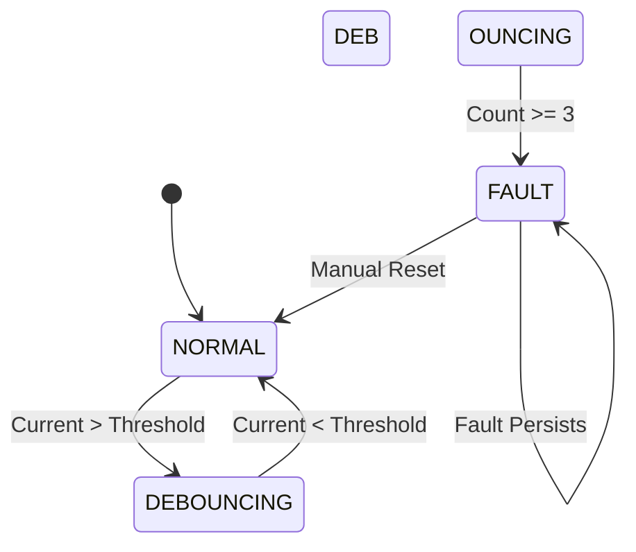
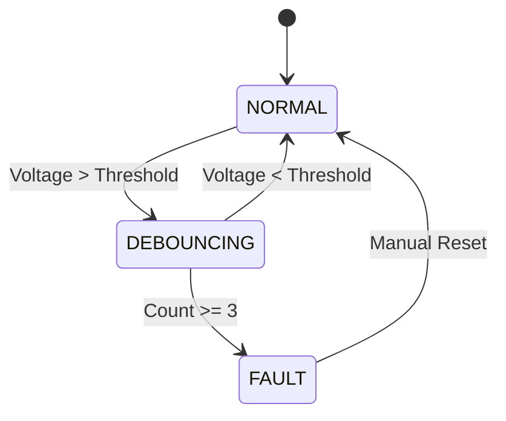
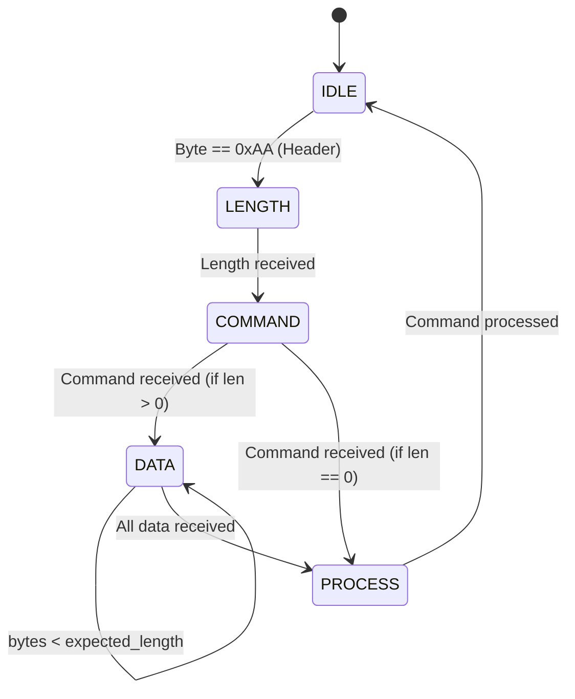
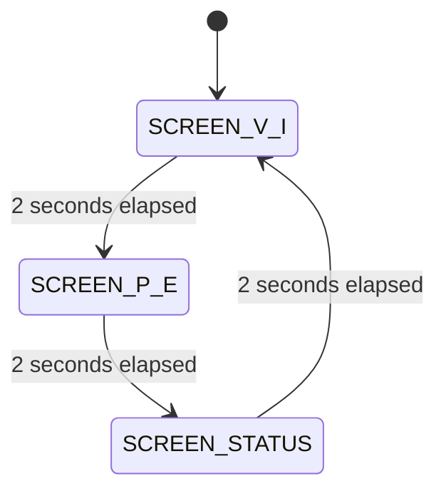
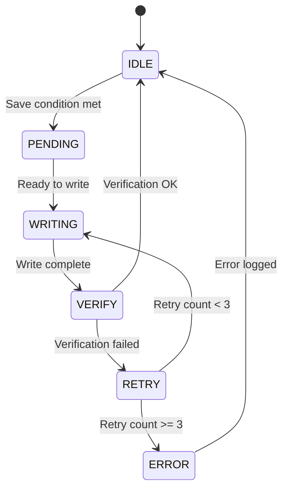
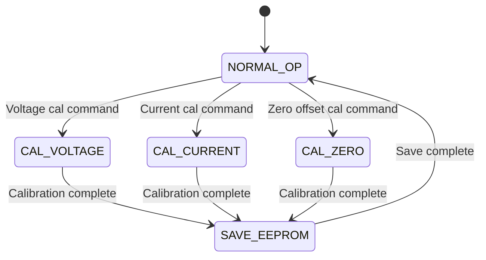
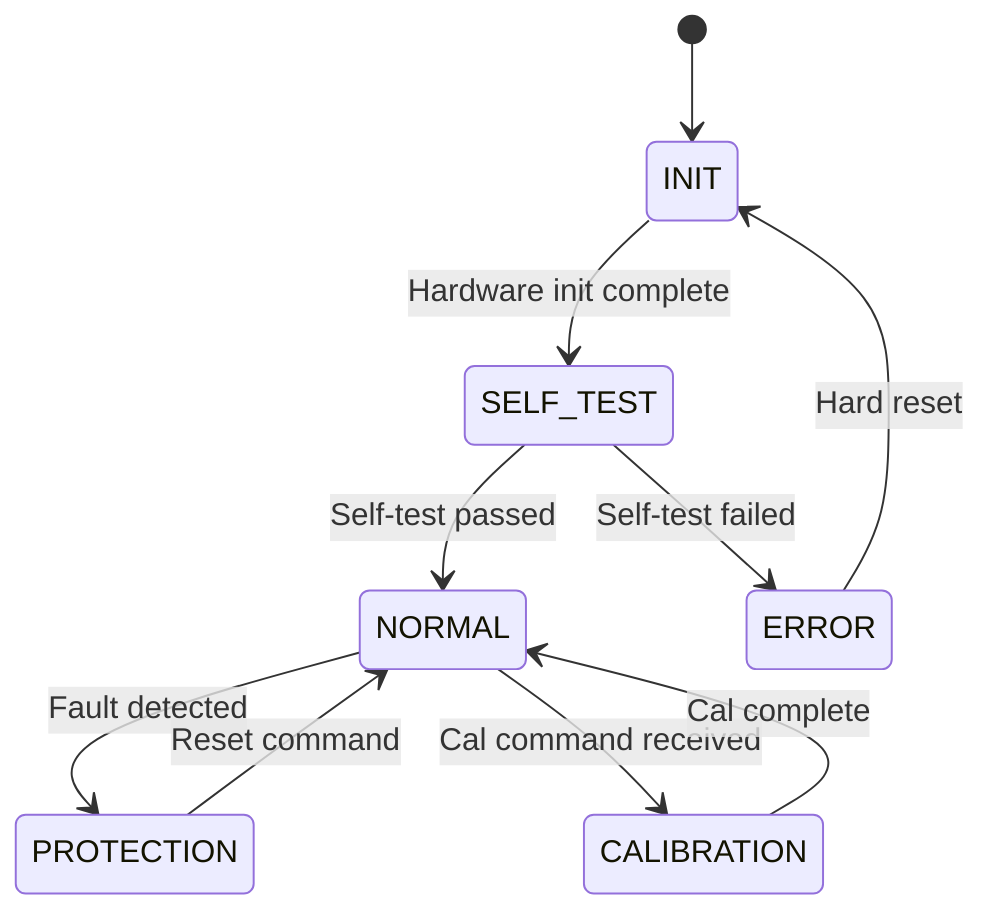

# State Machines

**Project**: Smart Energy Management System  
**Version**: 1.0

---

## 1. Protection Manager FSM

### 1.1 Overcurrent Protection State Machine

**States**:

- **NORMAL**: Current within safe limits, relay ON (if enabled)
- **DEBOUNCING**: Current exceeded, counting consecutive samples
- **FAULT**: Protection triggered, relay OFF, alert active

**Transitions**:
| From | To | Condition | Action |
|------|-----|-----------|--------|
| NORMAL | DEBOUNCING | I > I_threshold | debounce_count = 1 |
| DEBOUNCING | FAULT | debounce_count >= 3 | Trigger protection |
| DEBOUNCING | NORMAL | I < I_threshold | debounce_count = 0 |
| FAULT | NORMAL | Reset command | Clear fault flags |

**Actions on FAULT Entry**:

1. Relay OFF
2. Display "OVERLOAD!"
3. RGB LED RED
4. Buzzer 3 beeps
5. Send alert via UART

---

### 1.2 Overvoltage Protection State Machine

**States**: Same as overcurrent

**Transitions**: Similar logic, V instead of I

**Actions on FAULT Entry**:

1. Relay OFF
2. Display "OVERVOLT!"
3. RGB LED RED
4. Buzzer 5 beeps
5. Send alert via UART

---

## 2. Communication Manager FSM

### 2.1 UART Receive State Machine

**States**:

- **IDLE**: Waiting for frame header (0xAA)
- **LENGTH**: Reading length byte
- **COMMAND**: Reading command ID
- **DATA**: Reading data payload
- **PROCESS**: Processing complete frame

**Variables**:

- `rx_state`: Current state
- `expected_length`: Number of data bytes
- `rx_index`: Current data byte index
- `command_id`: Received command

---

## 3. Display Manager FSM

### 3.1 Screen Rotation State Machine

**States**:

- **SCREEN_V_I**: Display Voltage & Current
- **SCREEN_P_E**: Display Power & Energy
- **SCREEN_STATUS**: Display Status & Relay state

**Transition**: Every 2 seconds (configurable)

---

## 4. Energy Logger FSM

### 4.1 EEPROM Save State Machine

**Save Conditions**:

- Timer elapsed (60 seconds)
- Energy change > threshold (0.1 kWh)
- Manual save command

**States**:

- **IDLE**: No pending save
- **PENDING**: Save requested, waiting for safe time
- **WRITING**: Writing to EEPROM
- **VERIFY**: Reading back to verify
- **RETRY**: Retrying failed write
- **ERROR**: Write failed after retries

---

## 5. Calibration Manager FSM

### 5.1 Calibration State Machine

**States**:

- **NORMAL_OP**: Normal operation, calibration ready
- **CAL_VOLTAGE**: Calibrating voltage sensor
- **CAL_CURRENT**: Calibrating current sensor
- **CAL_ZERO**: Calibrating current zero offset
- **SAVE_EEPROM**: Saving calibration to EEPROM

---

## 6. System Controller State Diagram (Overall)

**System States**:

- **INIT**: Power-up initialization
- **SELF_TEST**: ADC, EEPROM, UART checks
- **NORMAL**: Normal operation (measurement, protection)
- **PROTECTION**: Protection triggered (relay OFF)
- **CALIBRATION**: Calibration in progress
- **ERROR**: Critical error (requires reset)

---

**Document Version**: 1.0  
**Last Updated**: January 2026  
**Maintained By**: Gestell Engineering Team
