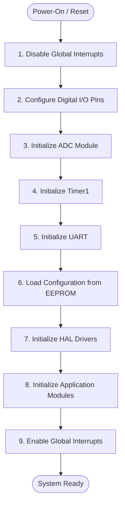

# BSP Overview

**Project**: Smart Energy Management System  
**Component**: Board Support Package  
**Version**: 1.0

---

## 1. Introduction

The Board Support Package (BSP) provides hardware-specific initialization and configuration for the Smart Energy Management System based on **ATmega32 microcontroller**.

---

## 2. BSP Components

### 2.1 Clock Configuration

- **Crystal**: 16 MHz external crystal oscillator
- **CPU Clock**: 16 MHz (no prescaler)
- **Timer Clocks**: Derived from CPU clock
- **ADC Clock**: CPU/128 = 125 kHz

### 2.2 Power Management

- **Main Rail**: 5V DC (from adapter or USB)
- **Regulator**: LM7805 (optional) or direct 5V input
- **3.3V Rail**: AMS1117-3.3 for communication modules (HC-05/ESP-01)

### 2.3 Reset Configuration

- **Reset Pin**: Active LOW with 10kΩ pull-up
- **Power-On Reset**: Automatic on power application
- **External Reset**: Via button or ISP programmer
- **Capacitor**: 100nF for debouncing

### 2.4 Watchdog Configuration

- **Default**: Disabled
- **Production**: Optional enable for fault recovery (500ms timeout)

---

## 3. Fuse Bit Configuration

**Recommended Settings for ATmega32**:

| Fuse     | Value | Description                           |
| -------- | ----- | ------------------------------------- |
| **LOW**  | 0xFF  | External crystal, slowly rising power |
| **HIGH** | 0xC9  | JTAG disabled, BOD 4.0V, boot to app  |

**Detailed Fuse Bits**:

- **CKSEL** = 1111: External crystal oscillator (>8 MHz)
- **SUT** = 10: Slowly rising power
- **CKOPT** = 0: Full rail-to-rail swing (for 16 MHz)
- **BOOTRST** = 1: Boot from application section (0x0000)
- **JTAGEN** = 1: JTAG interface disabled (frees up PC2-PC5 pins)
- **BODLEVEL** = 0: Brown-out detection at 4.0V
- **BODEN** = 0: Brown-out detection enabled

**Programming Method**:
The fuse bits are programmed using the AVR programming tool (avrdude) through the USBasp programmer interface. The LOW fuse is set to value 0xFF and HIGH fuse to value 0xC9 using memory write operations to the fuse byte regions.

---

## 4. Peripheral Initialization Order

The BSP performs hardware initialization in a carefully sequenced order to ensure proper system startup:

**Initialization Sequence Flow**:

**Detailed Initialization Steps**:

1. **Disable Global Interrupts**: Prevents interrupt execution during configuration to ensure atomicity
2. **Configure Digital I/O Pins**: Sets direction (input/output) and initial states for all pins used by peripherals
3. **Initialize ADC**: Configures ADC reference voltage (AVCC), prescaler (/128), and channel selection
4. **Initialize Timer1**: Configures 16-bit timer in CTC mode for periodic ADC sampling triggers (100 Hz)
5. **Initialize UART**: Sets baud rate (9600 bps), data format (8N1), and enables transmitter/receiver
6. **Load EEPROM Configuration**: Reads saved calibration data, energy counter, and system settings from non-volatile memory
7. **Initialize HAL Drivers**: Initializes higher-level hardware drivers (sensors, LCD, communication modules)
8. **Initialize Application Modules**: Initializes application-layer modules (measurement engine, protection manager, etc.)
9. **Enable Global Interrupts**: Activates interrupt system for timer and UART operation

**Critical Dependencies**:

- EEPROM must be initialized before HAL/Application layers to provide calibration data
- Interrupts remain disabled until all peripherals are configured to prevent spurious triggers
- Each initialization function performs internal verification before proceeding

---

## 5. Board-Specific Pin Mapping

The BSP configuration file defines all hardware pin assignments for the ATmega32 microcontroller. These definitions map logical functions to physical pins.

**System Clock Configuration**:

- CPU frequency defined as: 16,000,000 Hz (16 MHz)
- This value is used by all timing-dependent functions (delays, UART baud rate calculation, Timer prescalers)

**Board Identification**:

- Board name: "Energy Monitor v1.0"
- Hardware version: Major 1, Minor 0

**Pin Assignments by Function**:

**Relay Control**:

- Port: PORTB
- Pin number: 0 (PB0)
- Function: Controls relay driver circuit (ULN2003) to energize/de-energize the load relay

**RGB LED Channels**:

- Red channel: PORTB Pin 1 (PB1) - PWM capable (OC1A)
- Green channel: PORTB Pin 2 (PB2) - PWM capable (OC1B)
- Blue channel: PORTB Pin 3 (PB3) - Digital output

**Buzzer Output**:

- Port: PORTB
- Pin number: 4 (PB4)
- Function: Controls active buzzer for audible alerts

**LCD Interface** (4-bit mode):

- Register Select (RS): PORTD Pin 2 (PD2) - Selects command vs data mode
- Enable (E): PORTD Pin 3 (PD3) - Triggers LCD read/write operations
- Data Bus: PORTD Pins 4-7 (PD4-PD7) - 4-bit data transfer (D4-D7 on LCD)

**ADC Input Channels**:

- Voltage sensor: Channel 0 (PA0) - Reads rectified voltage divider output
- Current sensor: Channel 1 (PA1) - Reads ACS712 analog output

**UART Communication Pins**:

- Transmit (TX): Pin PD1 (hardware-fixed)
- Receive (RX): Pin PD0 (hardware-fixed)

---

## 6. BSP Programming Interface

The Board Support Package provides the following high-level functions for system initialization and control:

### 6.1 System Initialization Function

**Function Name**: BSP_Init  
**Purpose**: Performs complete hardware initialization sequence  
**Parameters**: None  
**Return Value**: None (void)

**Function Behavior**:
This function executes the complete peripheral initialization sequence as described in section 4. It configures the microcontroller clock, all I/O pins, peripheral modules (ADC, Timers, UART), loads configuration from EEPROM, and initializes all hardware abstraction and application layers. Upon completion, the system is in a fully operational state with interrupts enabled.

### 6.2 System De-initialization Function

**Function Name**: BSP_DeInit  
**Purpose**: Safely disables all peripherals and enters low-power state  
**Parameters**: None  
**Return Value**: None (void)

**Function Behavior**:
This function performs the reverse of initialization by systematically disabling all peripheral modules, setting output pins to safe states (LOW/off), and optionally entering a low-power sleep mode. This function is used before system shutdown or when transitioning to ultra-low-power standby mode. It ensures the relay is de-energized, buzzer is silenced, and all communication interfaces are properly closed.

### 6.3 Hardware Version Query Function

**Function Name**: BSP_GetHardwareVersion  
**Purpose**: Returns the current hardware board version  
**Parameters**: None  
**Return Value**: 16-bit unsigned integer (uint16_t)

**Return Value Format**:
The version is encoded as: (Major Version × 256) + Minor Version  
Example: Version 1.0 returns: (1 × 256) + 0 = 256 = 0x0100

This allows software to adapt behavior based on hardware revision, enabling firmware compatibility across multiple board versions.

### 6.4 Software Reset Function

**Function Name**: BSP_Reset  
**Purpose**: Triggers a complete microcontroller reset via watchdog timer  
**Parameters**: None  
**Return Value**: Does not return (function causes system reset)

**Function Behavior**:
This function activates the watchdog timer with minimum timeout and enters an infinite loop, causing a watchdog-triggered reset after approximately 15 milliseconds. This provides a reliable software reset mechanism that clears all registers, reinitializes the stack pointer, and restarts execution from the reset vector (address 0x0000). This is preferable to jumping directly to address zero as it ensures complete hardware state reset.

---

## 7. Hardware Dependencies

**Required Hardware**:

- ATmega32A-PU (DIP-40 package)
- 16 MHz crystal + 22pF capacitors
- 5V power supply (regulated)
- 3.3V regulator for comm modules
- Pull-up resistor on RESET (10kΩ)
- Decoupling capacitors (100nF on VCC/AVCC)

**Optional Hardware**:

- LC filter on AVCC (10µH + 100nF)
- TVS diode for ESD protection
- LED indicators

---

## 8. See Also

- [Clock_Configuration.md](Clock_Configuration.md) - Detailed clock setup
- [Pin_Configuration.md](Pin_Configuration.md) - Complete pin mapping
- [HRS.md](../../02_Requirements/HRS/HRS.md) - Hardware specifications

---

**Document Version**: 1.0  
**Last Updated**: January 2026  
**Maintained By**: Gestell Engineering Team
