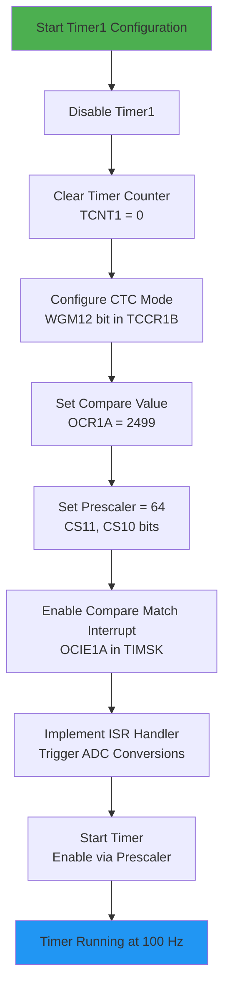
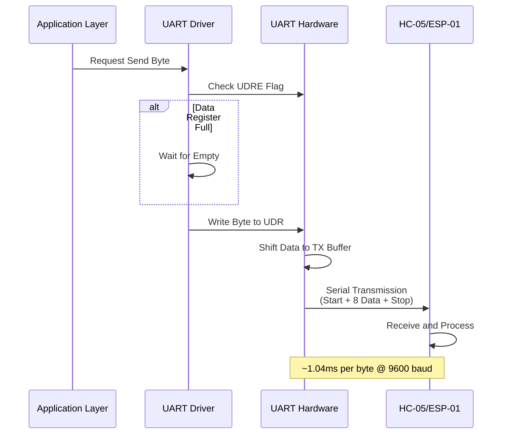
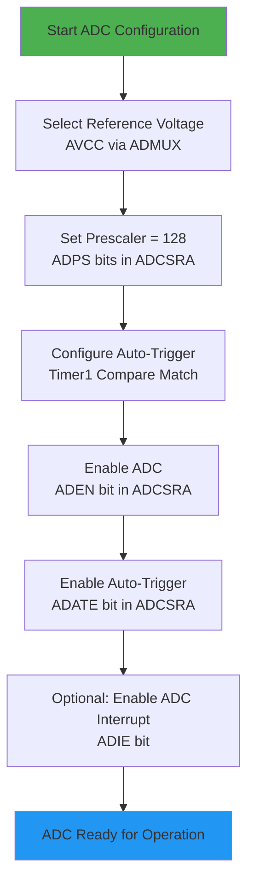
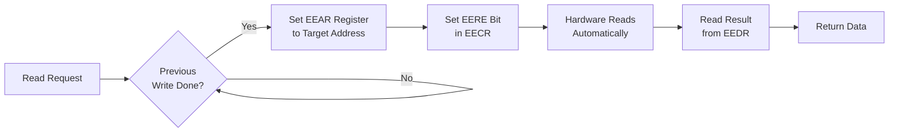
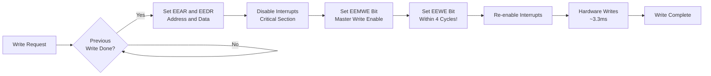

# 🔩 Peripheral Configuration Guide - ATmega32

**Project**: Smart Energy Management System  
**Platform**: ATmega32 Microcontroller  
**Version**: 1.0

---

## 📋 Overview

This guide describes the detailed configuration procedures for all peripherals used in the Smart Energy Management System. Each peripheral section provides conceptual understanding, timing calculations, register configurations, and implementation flows using **text descriptions and diagrams only**.

---

## ⏱️ Timer1 - ADC Sampling Trigger (100 Hz)

### Purpose

Generate a precise 100 Hz periodic interrupt to trigger analog-to-digital conversions for voltage and current measurements.

### Operating Requirements

**Mode**: CTC (Clear Timer on Compare Match)

- Timer automatically resets when reaching compare value
- Generates interrupt on match for deterministic timing
- No timer overflow, only compare match events

**Timing Calculation**:

```
Target Interrupt Frequency = 100 Hz (10ms period)
CPU Clock Frequency = 16 MHz
Selected Prescaler = 64

Timer Ticks Required Formula:
Compare_Value = (CPU_Clock / (Prescaler × Target_Frequency)) - 1

Substituting values:
Compare_Value = (16,000,000 / (64 × 100)) - 1
Compare_Value = (16,000,000 / 6,400) - 1
Compare_Value = 2,500 - 1
Compare_Value = 2,499

Verification:
Actual_Frequency = 16,000,000 / (64 × 2,500) = 100 Hz ✓
Period = 1 / 100 = 0.01 seconds = 10ms ✓
```

### Configuration Flow Diagram



### Detailed Implementation Steps

**Step 1: Disable Timer During Configuration**

- Reason: Prevent spurious interrupts during setup
- Action: Clear all clock select bits (CS12, CS11, CS10) in TCCR1B register
- This stops the timer temporarily

**Step 2: Clear Timer Counter**

- Write zero to TCNT1 (16-bit Timer Counter register)
- Ensures timer starts from known state
- Prevents immediate unwanted compare match

**Step 3: Configure CTC Mode**

- Access TCCR1B (Timer/Counter 1 Control Register B)
- Set bit WGM12 to logic 1
- Clear bits WGM13, WGM11, WGM10 (in TCCR1A)
- Result: Top value is OCR1A, timer resets on match

**Step 4: Set Compare Match Value**

- Write 2499 to OCR1A (Output Compare Register 1A)
- This is the target count for 100 Hz operation
- When TCNT1 reaches 2499, compare match occurs

**Step 5: Configure Clock Prescaler**

- Select prescaler value of 64
- Set CS11 = 1 and CS10 = 1 in TCCR1B
- Clear CS12 = 0
- Effective timer clock = 16MHz / 64 = 250 kHz

**Step 6: Enable Compare Match Interrupt**

- Access TIMSK (Timer Interrupt Mask Register)
- Set OCIE1A bit to logic 1
- This enables Timer1 Compare Match A interrupt
- ISR vector: TIMER1_COMPA_vect

**Step 7: Implement Interrupt Service Routine**

- ISR executes every 10ms when TCNT1 reaches OCR1A
- ISR should be kept minimal (< 50 microseconds execution)
- Typical actions: Set flag for ADC conversion, increment sample counter
- ISR must NOT perform lengthy operations (no delays, no I/O operations)

### Register Configuration Summary

| Register | Bits to Configure | Value   | Purpose             |
| -------- | ----------------- | ------- | ------------------- |
| TCCR1A   | WGM11, WGM10      | Both 0  | CTC mode (part 1)   |
| TCCR1B   | WGM13, WGM12      | 0, 1    | CTC mode (part 2)   |
| TCCR1B   | CS12, CS11, CS10  | 0, 1, 1 | Prescaler = 64      |
| OCR1A    | All 16 bits       | 2499    | Compare match value |
| TIMSK    | OCIE1A            | 1       | Enable interrupt    |
| TCNT1    | All 16 bits       | 0       | Clear counter       |

### Timing Accuracy Considerations

**Clock Source**: External 16 MHz crystal provides ±50 ppm accuracy
**Prescaler**: Hardware divider, no additional error
**Compare Match**: Deterministic, no jitter
**Overall Accuracy**: Better than ±0.01% for ADC sampling timing

---

## 📡 UART - Communication Interface (9600 baud)

### Purpose

Provide serial communication with Bluetooth (HC-05) or WiFi (ESP-01) modules for remote monitoring and control.

### Communication Specifications

- **Baud Rate**: 9600 bits per second
- **Data Format**: 8 data bits, No parity, 1 stop bit (8N1 standard)
- **Direction**: Full-duplex (both transmit and receive)
- **Hardware Pins**: PD0 (RXD), PD1 (TXD) - hardware fixed locations
- **Voltage Levels**: 5V logic (requires level shifting to 3.3V for modules)

### Baud Rate Generation

**UBRR Calculation Formula**:

```
UBRR_Value = (F_CPU / (16 × Desired_Baud_Rate)) - 1

For 9600 baud at 16 MHz:
UBRR = (16,000,000 / (16 × 9600)) - 1
UBRR = (16,000,000 / 153,600) - 1
UBRR = 104.167 - 1
UBRR = 103.167

Round to nearest integer: UBRR = 103

Actual Baud Rate Achieved:
Actual_Baud = 16,000,000 / (16 × (103 + 1))
Actual_Baud = 16,000,000 / 1,664
Actual_Baud = 9,615.38 baud

Error Percentage:
Error = ((9,615.38 - 9,600) / 9,600) × 100%
Error = +0.16% (well within ±2% tolerance)
```

### Data Transmission Flow



### Configuration Implementation Steps

**Step 1: Calculate and Configure Baud Rate**

- Calculate UBRR value using formula above
- UBRR for 9600 baud = 103 (decimal) = 0x0067 (hexadecimal)
- Write high byte (0x00) to UBRRH register
- Write low byte (0x67) to UBRRL register
- Baud rate generator now configured

**Step 2: Set Frame Format**

- Access UCSRC (UART Control and Status Register C)
- Set UCSZ1 and UCSZ0 bits to 1 (for 8-bit character size)
- Clear UCSZ2 bit in UCSRB (ensuring 8-bit mode)
- Clear UPM1 and UPM0 bits (disables parity)
- Clear USBS bit (selects 1 stop bit)
- Result: 8N1 frame format

**Step 3: Enable Transmitter**

- Access UCSRB (UART Control and Status Register B)
- Set TXEN bit to logic 1 (enables transmission hardware)
- TX pin (PD1) automatically configured as output

**Step 4: Enable Receiver**

- In same UCSRB register, set RXEN bit to logic 1
- RX pin (PD0) automatically configured as input
- Enables reception circuitry

**Step 5: Enable Receive Interrupt (Optional)**

- In UCSRB, set RXCIE bit to enable RX complete interrupt
- Allows asynchronous command reception without polling
- ISR vector: USART_RXC_vect
- Must also enable global interrupts

### Transmission Procedure

**Polling Method**:

1. Check UDRE (UART Data Register Empty) flag in UCSRA
2. If UDRE = 0, wait in loop (previous transmission ongoing)
3. When UDRE = 1, hardware buffer is ready
4. Write data byte to UDR (UART Data Register)
5. Hardware automatically:
   - Clears UDRE flag
   - Adds start bit
   - Shifts out 8 data bits
   - Adds stop bit
   - Sets UDRE flag when complete

**Timing**: Each byte takes approximately 1.04ms to transmit

### Reception Procedure

**Interrupt-Driven Method** (Recommended):

1. UART hardware receives serial data automatically
2. When complete byte received, RXC flag sets
3. If RXCIE enabled, ISR executes immediately
4. ISR reads byte from UDR
5. Reading UDR clears RXC flag
6. Byte processed in ISR or queued for main loop

**Frame Error Detection**:

- Hardware sets FE (Frame Error) flag if invalid stop bit
- Access via UCSRA register
- Indicates communication problem (wrong baud rate, noise)

### Register Configuration Summary

| Register | Configuration      | Purpose                   |
| -------- | ------------------ | ------------------------- |
| UBRRH    | 0x00               | Baud rate high byte       |
| UBRRL    | 103 (0x67)         | Baud rate low byte (9600) |
| UCSRB    | RXEN=1, TXEN=1     | Enable RX and TX          |
| UCSRB    | RXCIE=1 (optional) | Enable RX interrupt       |
| UCSRC    | UCSZ1=1, UCSZ0=1   | 8-bit data                |
| UCSRC    | UPM1=0, UPM0=0     | No parity                 |
| UCSRC    | USBS=0             | 1 stop bit                |
| UDR      | Data byte          | TX/RX data register       |

---

## 🔄 ADC - Analog to Digital Converter

### Purpose

Convert analog voltage and current sensor signals into digital values for measurement processing.

### ADC Specifications

- **Resolution**: 10-bit (values 0-1023)
- **Reference Voltage**: AVCC (5V, filtered from main VCC)
- **Input Channels**: 8 multiplexed channels (PA0-PA7)
- **Conversion Time**: 13 ADC clock cycles per conversion
- **Sample Rate**: Determined by Timer1 trigger (100 Hz)

### ADC Clock Configuration

**ADC Clock Frequency Calculation**:

```
ADC operates optimally between 50 kHz and 200 kHz

CPU Clock = 16 MHz
Selected Prescaler = 128

ADC_Clock = CPU_Clock / Prescaler
ADC_Clock = 16,000,000 / 128
ADC_Clock = 125 kHz ✓ (within optimal range)

Single Conversion Time:
Time = 13 cycles / 125 kHz
Time = 104 microseconds
```

### ADC Operating Modes

**Free-Running Mode**: Continuous conversions (NOT used in this project)
**Single Conversion Mode**: One conversion per trigger (NOT used)
**Auto-Trigger Mode**: Conversion triggered by Timer1 Compare Match (USED ✓)

### Configuration Flow



### Detailed Configuration Steps

**Step 1: Select Reference Voltage**

- Access ADMUX (ADC Multiplexer Selection) register
- Set REFS0 bit = 1, REFS1 bit = 0
- This selects AVCC as reference voltage
- AVCC should be filtered via LC circuit (10µH + 100nF)

**Step 2: Configure Result Alignment**

- In ADMUX, clear ADLAR bit for right-alignment
- Result: ADC result in ADCH:ADCL with right justification
- Lower 10 bits contain conversion result

**Step 3: Set ADC Prescaler**

- Access ADCSRA (ADC Control and Status Register A)
- Set ADPS2=1, ADPS1=1, ADPS0=1 (prescaler = 128)
- This gives optimal 125 kHz ADC clock

**Step 4: Configure Auto-Trigger Source**

- Access SFIOR (Special Function I/O Register) or ADCSRB on some variants
- Set auto-trigger source to Timer1 Compare Match A
- Typical bit configuration: ADTS2=0, ADTS1=1, ADTS0=1

**Step 5: Enable ADC Module**

- In ADCSRA, set ADEN bit to 1
- Powers up ADC circuitry
- Requires ~100µs settling time

**Step 6: Enable Auto-Trigger Mode**

- In ADCSRA, set ADATE bit to 1
- ADC now waits for trigger events from Timer1

**Step 7: Optional - Enable ADC Interrupt**

- In ADCSRA, set ADIE bit to enable conversion complete interrupt
- ISR vector: ADC_vect
- Allows immediate processing of conversion results

### Channel Selection

**For Voltage Measurement (PA0)**:

- In ADMUX, set MUX bits = 00000 (channel 0)
- Conversion triggered automatically every 10ms

**For Current Measurement (PA1)**:

- In ADMUX, set MUX bits = 00001 (channel 1)
- Alternate with voltage channel for interleaved sampling

### Reading Conversion Result

**Procedure**:

1. Wait for conversion complete (ADIF flag or via interrupt)
2. Read ADCL first (low byte)
3. Then read ADCH (high byte)
4. Combine: Result = (ADCH << 8) | ADCL
5. Result is 10-bit value (0-1023)

**Voltage Conversion**:

```
Digital_Value = ADC_Result
Analog_Voltage = (Digital_Value × Reference_Voltage) / 1024
Analog_Voltage = (Digital_Value × 5.0) / 1024
```

---

## 💾 EEPROM - Non-Volatile Storage

### Purpose

Store critical system data (energy counter, calibration values, configuration) that must persist through power cycles.

### EEPROM Characteristics

- **Size**: 1024 bytes (1 KB)
- **Write Time**: 3.3 milliseconds per byte (blocking)
- **Write Endurance**: Minimum 100,000 erase/write cycles per location
- **Data Retention**: 20 years at 25°C, 10 years at 85°C
- **Address Range**: 0x0000 to 0x03FF

### Memory Allocation Map

| Address Range | Size    | Purpose                | Update Frequency        |
| ------------- | ------- | ---------------------- | ----------------------- |
| 0x0000-0x0003 | 4 bytes | Energy counter (float) | Every 60 seconds        |
| 0x0004-0x0005 | 2 bytes | Voltage calibration    | On calibration only     |
| 0x0006-0x0007 | 2 bytes | Current calibration    | On calibration only     |
| 0x0008-0x0009 | 2 bytes | Current zero offset    | On calibration only     |
| 0x000A-0x000B | 2 bytes | Power factor           | On configuration change |
| 0x000C-0x000D | 2 bytes | Overcurrent threshold  | On configuration change |
| 0x000E-0x000F | 2 bytes | Overvoltage threshold  | On configuration change |
| 0x0010        | 1 byte  | System flags           | On configuration change |
| 0x0011-0x03FF | --      | Reserved               | Future expansion        |

### Read Operation Sequence



**Implementation Steps - Read**:

1. **Wait for Write Completion**
   - Poll EEWE bit in EECR (EEPROM Control Register)
   - Loop while EEWE = 1 (previous write in progress)
   - Maximum wait: 3.3ms if write just started

2. **Set Target Address**
   - Write address (0-1023) to EEAR (EEPROM Address Register)
   - EEAR is 10-bit register for 1KB address space
   - Ensure address is within valid range

3. **Initiate Read**
   - Set EERE bit in EECR to logic 1
   - Hardware performs read automatically
   - Read completes in 4 clock cycles (~250ns @ 16MHz)

4. **Retrieve Data**
   - Read EEDR (EEPROM Data Register)
   - Data is valid immediately after EERE set
   - No waiting required for reads

### Write Operation Sequence



**Implementation Steps - Write**:

1. **Wait for Previous Write**
   - Check EEWE bit in EECR, loop while set
   - Ensures EEPROM is ready for new write

2. **Set Address and Data**
   - Write target address to EEAR
   - Write data byte to EEDR
   - Both registers must be set before write sequence

3. **Disable Interrupts** (Critical!)
   - Clear global interrupt enable (I-bit in SREG)
   - Prevents timing violation in next steps
   - EEPROM write sequence is time-critical

4. **Set Master Write Enable**
   - Set EEMWE bit in EECR to logic 1
   - This enables write capability for 4 clock cycles
   - Time window: 250ns @ 16MHz
   - EEMWE auto-clears after 4 cycles

5. **Start Write Operation**
   - Set EEWE bit within 4 cycles of EEMWE
   - If timing missed, write won't occur (safety feature)
   - Hardware begins 3.3ms write process

6. **Re-enable Interrupts**
   - Restore global interrupt enable
   - Critical section complete

7. **Optional: Wait for Completion**
   - Can poll EEWE bit until it clears
   - Or proceed immediately (non-blocking)
   - Subsequent EEPROM access will wait automatically

### Write Protection Strategy

**Wear Leveling Approach**:

- Energy counter: Write maximum once per minute (limiting to ~35 writes/day)
- Calibration: Write only on user calibration (< 10 times in product lifetime)
- Configuration: Write only on change (infrequent)
- Expected lifetime: > 10 years even with daily energy saves

**Safety Mechanisms**:

- Timed write sequence prevents accidental corruption
- Interrupt disable ensures atomic operation
- Previous write check prevents overlapping writes

### Critical Timing Requirements

⚠️ **4-Cycle Window**: EEWE must be set within 4 CPU cycles of EEMWE  
⚠️ **Interrupts Disabled**: During EEMWE→EEWE sequence to prevent timing violation  
⚠️ **Single-Byte Writes**: No block write mode; must write byte-by-byte  
⚠️ **Write Delay**: 3.3ms blocking time affects real-time performance

---

## 📞 Contact & Support

**Email**: Hisham4Ahmed@gmail.com  
**Company**: Gestell - Professional Embedded Solutions  
**LinkedIn**: https://www.linkedin.com/company/gestell-company

---

**Document Version**: 1.0  
**Last Updated**: January 2026  
**Maintained By**: Gestell Engineering Team

---

<div align="center">

**Copyright © 2025-2026 Gestell Company**

_Professional Industrial Control Solutions_

</div>
