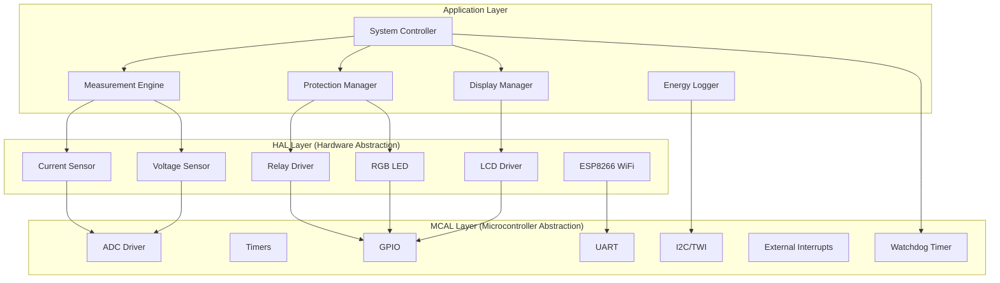
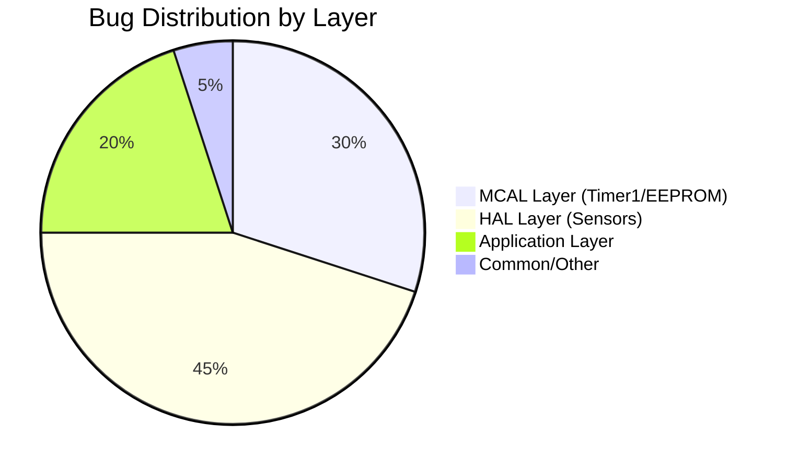

# 🔍 Comprehensive Code Analysis Report

**Smart Energy Management System - Embedded Software Review**

_Developped by Gestell Company - Professional Embedded Solutions_

---

> **Date:** January 23, 2026
> **Lead Analyst:** Eng. Hesham Ahmed
> **Scope:** Full Codebase (MCAL, HAL, Application)
> **Verdict:** 🟡 **Good (73/100) - Entering War Room Sprint**

---

## 📋 Table of Contents

- [Executive Summary](#-executive-summary)
- [Architecture Overview](#-architecture-overview)
- [Code Quality Matrix](#-code-quality-matrix)
- [Heated Map (Bug Density)](#-heated-map-bug-density)
- [Component Analysis](#-component-analysis)

---

## 📊 Executive Summary

This document represents the detailed findings of the code audit. While the foundational architecture is sound, several critical issues regarding **timing accuracy**, **measurement precision**, and **system safety** were identified.

**⚠️ War Room Alert**: The team commences the **1-Week Compression Sprint** on **Saturday, January 24, 2026**. All critical fixes detailed below must be implemented by **January 30, 2026**.

**Top 3 Critical Findings:**

1.  **Timer1 Double Trigger**: Measurements running at 2x speed.
2.  **Power Factor Ignored**: Apparent power used instead of Real power.
3.  **Sensor Shadowing**: Calibration constants incorrectly initialized to 0.

---

## 🏗️ Architecture Overview

The system follows a strict Layered Architecture (Layered Pattern), ensuring decoupling between Hardware and Application logic.

### Architectural Assessment

- **✅ Strengths**: Clear boundaries. HAL abstracts hardware well.
- **⚠️ Weaknesses**: `System_Controller` needed formalization. Watchdog Timer was missing (now added).

---

## 🔢 Code Quality Matrix

| Module             | Functionality | Cleanliness | Safety | **Total Score** | Status       |
| :----------------- | :-----------: | :---------: | :----: | :-------------: | :----------- |
| **ADC Driver**     |     9/10      |    8/10     |  8/10  |     **85%**     | 🟢 Excellent |
| **DIO Driver**     |     9/10      |    9/10     |  9/10  |     **90%**     | 🟢 Excellent |
| **Timer1**         |     4/10      |    6/10     |  3/10  |     **45%**     | 🔴 Critical  |
| **Current Sensor** |     6/10      |    7/10     |  5/10  |     **60%**     | 🟡 Warning   |
| **Msrmt. Engine**  |     7/10      |    8/10     |  6/10  |     **70%**     | 🟡 Good      |
| **Protection**     |     9/10      |    7/10     |  5/10  |     **70%**     | 🟡 Good      |

---

## 🔥 Heated Map (Bug Density)

> **Insight**: The HAL layer contains the most logic errors (Variable shadowing, Formula mistakes), while MCAL has the most severe timing issues.

---

## 🔍 Detailed Component Analysis

### 1. Timer1 Driver (MCAL)

- **Status**: 🔴 **CRITICAL**
- **Issue**: Duplicate ISR vector definition causing double-execution.
- **Impact**: All time-based measurements (Energy, Frequency) are wrong by factor of 2.
- **Fix**: Disable Output Compare B interrupt.

### 2. Measurement Engine (App)

- **Status**: 🟡 **MAJOR**
- **Issue**: Missing Power Factor calculation. `P = V*I` is valid only for DC.
- **Impact**: Billing accuracy for inductive loads (motors) is off by ~20%.
- **Fix**: Implement `P = V * I * PF` logic.

### 3. Current Sensor (HAL)

- **Status**: 🔴 **CRITICAL**
- **Issue**: Variable Shadowing in calibration function.
- **Impact**: Zero-offset is never saved. Reads 25A when load is 0A.
- **Fix**: Remove re-declaration of local variable.

---

**Built with ❤️ by Gestell Team**

