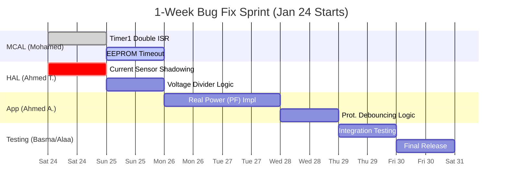

# Embedded Fix Implementation Plan

**Bug Fix & Optimization Road-map (War Room Mode)**

**Smart Energy Management System**

---

## 📋 Table of Contents

- [Timeline Overview](#-timeline-overview-gantt-chart)
- [Day 1-2: Critical Stabilization](#-day-1-2-critical-stabilization)
- [Day 3-4: Accuracy & Logic](#-day-3-4-accuracy--logic)
- [Day 5: Robustness & Safety](#-day-5-robustness--safety)
- [Day 6-7: Validation & Release](#-day-6-7-validation--release)

---

## 📅 Timeline Overview (Gantt Chart)

> **Sprint Start**: Saturday, Jan 24, 2026
> **Target Release**: Friday, Jan 30, 2026

---

## 🚨 Day 1-2 (Jan 24-25): Critical Stabilization

**Goal**: Fix all crash-inducing and fundamental timing bugs immediately.

| ID          | Task                                | Priority    | Assignee     | Est. Time |
| :---------- | :---------------------------------- | :---------- | :----------- | :-------- |
| **FIX-001** | **Disable Timer1 Output Compare B** | 🔴 Critical | Mohamed Diaa | 4 Hrs     |
| **FIX-002** | **Fix Current Sensor Logic**        | 🔴 Critical | Ahmed Twap   | 6 Hrs     |
| **FIX-003** | **Add Watchdog Timer**              | 🟡 High     | Hesham Ahmed | 2 Hrs     |

### Detailed Execution

1. **Timer1**: Update `TIMER1_Program.c` to remove `__vector_8`. Verify 100Hz on Scope.
2. **Current**: Rewrite `hCurrent_Calibrate`. Verify Zero Offset is ~2.5V.

---

## 🎯 Day 3-4 (Jan 26-27): Accuracy & Logic

**Goal**: Ensure billing accuracy and data consistency.

| ID          | Task                              | Priority    | Assignee     | Est. Time |
| :---------- | :-------------------------------- | :---------- | :----------- | :-------- |
| **FIX-004** | **Implement Real Power (PF)**     | 🔴 Critical | Ahmed Ashraf | 8 Hrs     |
| **FIX-005** | **Voltage Sensor Divisor (1024)** | 🟡 Medium   | Ahmed Ashraf | 2 Hrs     |
| **FIX-006** | **Mobile/Dash Format Sync**       | 🟡 Medium   | Basma Khaled | 6 Hrs     |

### Detailed Execution

1. **Power Factor**: Implement `P = V * I * PF` (Default PF=0.85).
2. **ADC Scaling**: Global search/replace `1023.0f` -> `1024.0f`.

---

## 🛡️ Day 5 (Jan 28): Robustness & Safety

**Goal**: Prevent false trips and ensure system recoverability.

| ID          | Task                      | Priority    | Assignee      | Est. Time |
| :---------- | :------------------------ | :---------- | :------------ | :-------- |
| **FIX-007** | **Protection Debouncing** | 🔴 Critical | M. Abdelgaber | 6 Hrs     |
| **FIX-008** | **EEPROM Timeout Loops**  | 🟡 Medium   | Ahmed Ashraf  | 4 Hrs     |
| **FIX-009** | **Button Debouncing**     | 🟡 Medium   | M. Abdelgaber | 4 Hrs     |

### Detailed Execution

1. **Debouncing**: Add state counters in `PM_Update()`. Trip only after 100ms fault.
2. **Timeouts**: Add `10ms` timeout to all hardware polling loops.

---

## ✅ Day 6-7 (Jan 29-30): Validation & Release

**Goal**: 24-hour stability run and final sign-off.

- [ ] **Stress Test**: Run at max load (20A) for 2 hours.
- [ ] **Longevity Test**: Run normal load (2A) for 20 hours. Check Energy accumulation.
- [ ] **Code Review**: Final pass on all modified files.
- [ ] **Release**: Tag `v1.2-Stable` on Git.

---

**Built with ❤️ by Gestell Team**

