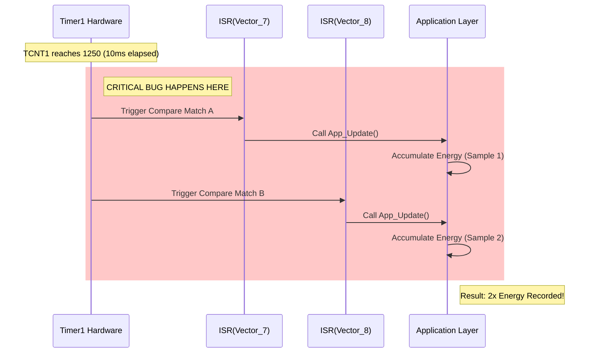

# 🛠️ Task 01: Fix Timer1 Duplicate ISR (Critical Timing Bug)

<div align="center">


-orange>)
-black>)

**MCAL Layer Critical Fix | Timing & Interrupts**

</div>

---

## 📋 Task Overview & Metadata

| Attribute        | Details                                                           |
| :--------------- | :---------------------------------------------------------------- |
| **Task ID**      | `FIX-001`                                                         |
| **Priority**     | 🔴 **CRITICAL**                                                   |
| **Assignee**     | **Mohamed Diaa**                                                  |
| **Component**    | **MCAL** > **Timer1 Driver**                                      |
| **Bug Type**     | **Logic Error / Interrupt Vector Conflict**                       |
| **Impact**       | Sampling rate is **200Hz** (Double) -> **Double Billing Energy**. |
| **Dependencies** | 🏁 **None** (Core System Issue)                                   |
| **Blocker**      | 🚀 **YES** (Must fix before Release)                              |
| **Deadline**     | **Saturday, Jan 24, 2026**                                        |

---

## 🐛 Detailed Problem Description

### Context

The Smart Energy Management System relies on **Timer1** to generate a precise **10ms time base (100Hz)**. This time base is used to trigger the `Meausrement_Update()` function, which captures voltage and current samples.

### The Defect

The current implementation of the Timer1 Driver (`mTIMER1_Init`) inadvertently enables **two separate interrupt sources** for the same timer, both configured to trigger at the same counter value (TOP = 1250).

1.  **Output Compare A Match Interrupt** (`OCIE1A`)
2.  **Output Compare B Match Interrupt** (`OCIE1B`)

Furthermore, **both Interrupt Service Routines (ISRs)** (`__vector_7` and `__vector_8`) call the **same global callback function** (`Timer1_Global_Callback`).

### The Result

Every 10ms, the timer reaches the TOP value (1250).

1.  **IRQ A Fires**: Application takes Sample 1.
2.  **IRQ B Fires** (immediately after): Application takes Sample 2.

**Net Result**: The application processes **200 samples per second** instead of 100. Since energy integration assumes a fixed `dt = 0.01s` (10ms), the total calculated energy is multiplied by 2.

---

## 🔍 Root Cause Analysis

### Code Analysis (`TIMER1_Program.c`)

```c
// ❌ FLAWED CODE
void mTIMER1_Init(void)
{
    // ... Timer Configuration ...

    // Setting Output Compare Register A to 1250 (10ms)
    OCR1A = 1250;

    // Setting Output Compare Register B to 1250 (10ms) -> UNNECESSARY
    OCR1B = 1250;

    // Enabling Interrupts
    SetBit(TIMSK_Reg, OCIE1A_Bit); // ✅ Correct: Enable Match A
    SetBit(TIMSK_Reg, OCIE1B_Bit); // ❌ FAULT: Enable Match B (Duplicate Trigger)
}

// ❌ DUPLICATE ISR
void __vector_7(void) { if(Cb) Cb(); } // Match A Handler
void __vector_8(void) { if(Cb) Cb(); } // Match B Handler
```

### Visual Representation



---

## 🛠️ Step-by-Step Implementation Plan

### Step 1: Open the Target File

- **Path**: `Mcal/Timer1/TIMER1_Program.c`

### Step 2: Modify Initialization Function (`mTIMER1_Init`)

Locate the initialization function and ensure **only** `OCIE1A` is enabled. Explicitly disable `OCIE1B` to be safe.

**Change This:**

```c
SetBit(TIMSK_Reg, OCIE1A_Bit);
SetBit(TIMSK_Reg, OCIE1B_Bit); // <-- DELETE THIS LINE
```

**To This:**

```c
/* Enable Compare Match A Interrupt ONLY */
SetBit(TIMSK_Reg, OCIE1A_Bit);

/* Explicitly Disable Compare Match B Interrupt */
ClearBit(TIMSK_Reg, OCIE1B_Bit);
```

### Step 3: Remove or Disable the Duplicate ISR

Locate `__vector_8` (Timer1 Compare Match B ISR) and remove its body or comment it out entirely to save flash memory and preventing accidental triggering.

**Change This:**

```c
void __vector_8(void) __attribute__((signal));
void __vector_8(void)
{
    if(Timer1_Global_Callback != NULL)
    {
        Timer1_Global_Callback();
    }
}
```

**To This:**

```c
/* Vector 8 (Compare Match B) is NOT USED */
/*
void __vector_8(void) __attribute__((signal));
void __vector_8(void)
{
    // Empty
}
*/
```

---

## 🧪 Verification & Testing Plan

After applying the fix, perform the following tests to validate the solution.

### Test 1: Frequency Validatoin (Oscilloscope/Logic Analyzer)

1.  **Setup**: Configure a GPIO pin (e.g., `PIN_A0`) to toggle inside the main application callback.
2.  **Action**: Run the system.
3.  **Measurement**: Connect scope to `PIN_A0`.
4.  **Expected Pass Criteria**:
    - Pulse Width: **10ms**
    - Period: **20ms** (50Hz signal for a toggle every 10ms)
    - **FAILURE CONDITION**: If Period is 10ms (100Hz signal), the ISR is still double-triggering.

### Test 2: Sample Counting

1.  **Setup**: Add a global counter `g_SampleCount` in the callback.
2.  **Action**: Print the counter value to UART every 1 real second.
3.  **Expected Pass Criteria**:
    - Counter should increase by exactly **100** every second.
    - If counter increases by **200**, the bug is **NOT FIXED**.

### Test 3: Load Simulation

1.  **Setup**: Connect a known resistive load (e.g., 100W Bulb).
2.  **Action**: Run for exactly 1 hour (3600 seconds).
3.  **Calculation**: `E = P * t = 100W * 1h = 0.1 kWh`.
4.  **Expected Pass Criteria**: System reports **0.1 kWh** (±1%).
5.  **Failure Criteria**: System reports **0.2 kWh**.

---

<div align="center">
**Gestell Company - Internal Engineering Document**
</div>
