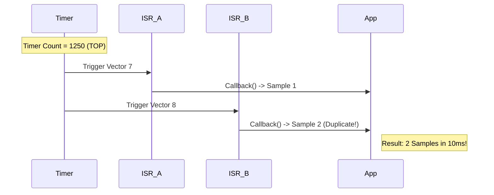

# 🛠️ Task 01: Fix Timer1 Duplicate ISR

<div align="center">


-orange>)

**MCAL Layer Critical Fix**

</div>

---

## 📋 Task Information

| Attribute        | Details                                                                |
| :--------------- | :--------------------------------------------------------------------- |
| **Priority**     | 🔴 **CRITICAL**                                                        |
| **Assignee**     | Mohamed Diaa                                                           |
| **Component**    | MCAL Layer - Timer1 Driver                                             |
| **Bug Type**     | Logic Error / Timing Defect                                            |
| **Impact**       | Measurements running at **200Hz** instead of **100Hz** (Double Speed). |
| **Dependencies** | 🏁 **None** (Core System Clock Issue)                                  |
| **Blocker**      | 🚀 **YES** - Affects all billing/energy accuracy.                      |
| **Deadline**     | **Sunday, Jan 25, 2026**                                               |

---

## 🐛 Problem Description

### Current Issue

The Timer1 driver enables both **Compare Match A** and **Compare Match B** interrupts. Both ISR vectors (`__vector_7` and `__vector_8`) invoke the **same global callback**.

### Impact Analysis

- **Sampling Rate**: Doubled (200Hz) vs Intended (100Hz).
- **Energy Calculation**: Accumulates 2x faster (1kWh becomes 2kWh).
- **Freq Calculation**: Time-between-zero-crossings is halved.

### 🔍 Root Cause

```c
// Timer1 Config
OCR1A = 1250;
OCR1B = 1250; // Triggers at same time as A!

// Interrupts
SetBit(TIMSK, OCIE1A);
SetBit(TIMSK, OCIE1B); // The culprit
```

---

## ⚙️ Visual Analysis



---

## 🛠️ Implementation Plan

### Step 1: Disable Output Compare B

**File**: `Mcal/Timer1/TIMER1_Program.c`

```c
void mTIMER1_Init(void)
{
    // ... config ...

    /* Enable Compare Match A Interrupt ONLY */
    SetBit(TIMSK_Reg, OCIE1A_Bit);  // ✅ Enable
    ClearBit(TIMSK_Reg, OCIE1B_Bit);  // ✅ Disable (Fix)
}
```

### Step 2: Clean Up ISR Vector

Remove the `__vector_8` implementation entirely or verify it is empty/commented out.

```c
/* Vector 8 is removed/disabled */
// void __vector_8(void) { ... }
```

---

## 🧪 Verification Plan

| Test Case           | Procedure                                    | Expected Result                 |
| :------------------ | :------------------------------------------- | :------------------------------ |
| **Frequency Check** | Toggle GPIO in Callback. Measure with Scope. | Period = **20ms** (50Hz Toggle) |
| **Sample Count**    | Count callbacks in 1 sec using UART log.     | Count = **100** ±1              |
| **Energy Load**     | 100W Load for 1 Hour.                        | Energy = **0.1 kWh** (not 0.2)  |

---

<div align="center">
**Gestell Company - Internal Task Document**
</div>
