# 🛠️ Task 02: Fix Current Sensor Variable Shadowing

<div align="center">


-orange>)
-black>)

**HAL Layer Critical Fix | C Scope & Logic Error**

</div>

---

## 📋 Task Overview & Metadata

| Attribute        | Details                                                             |
| :--------------- | :------------------------------------------------------------------ |
| **Task ID**      | `FIX-002`                                                           |
| **Priority**     | 🔴 **CRITICAL**                                                     |
| **Assignee**     | **Ahmed Twap**                                                      |
| **Component**    | **HAL** > **ACS712 Sensor Driver**                                  |
| **Bug Type**     | **Variable Shadowing / Scope Error**                                |
| **Impact**       | Zero-Offset ignored -> **False Current Readings** (e.g. 25A at 0A). |
| **Dependencies** | 🏁 **None**                                                         |
| **Blocker**      | 🚀 **YES** (Prevents accurate metering)                             |
| **Deadline**     | **Saturday, Jan 24, 2026**                                          |

---

## 🐛 Detailed Problem Description

### Context

The ACS712 Current Sensor outputs a voltage centered around 2.5V (Vcc/2) when 0 Amps is flowing. To get accurate readings, the system performs a **Calibration Routine** on startup to measure this specific "Zero Voltage" (e.g., 2.48V or 2.52V) to account for component tolerances.

### The Defect

In the `hCurrent_Calibrate()` function, the developer intended to calculate the offset and store it in a variable named `VoltageConversion`. However, inside the `if/else` logic blocks, they **re-declared** the variable using the `float` keyword.

In C, declaring a variable with the same name inside a block `{ ... }` creates a **new local variable** that "shadows" (hides) the variable in the outer scope.

### The Result

1.  Outer `VoltageConversion` is initialized to `0.0`.
2.  Code enters `if` block.
3.  **New** inner `VoltageConversion` is created, calculated (e.g., 2.50V).
4.  Code exits `if` block. **Inner variable is destroyed.**
5.  Global calibration value is assigned the **Outer** `VoltageConversion` (which is still 0.0).
6.  **System Fail**: Sensor offset is 0V. Any read of actual 2.5V is interpreted as huge current.

---

## 🔍 Root Cause Analysis

### Code Analysis (`hCurrent_Program.c`)

```c
// ❌ FLAWED CODE
void hCurrent_Calibrate(void)
{
    // [A] Outer Variable
    float VoltageConversion = 0.0f;

    if (Calibration.Samples < MIN_SAMPLES)
    {
        // ❌ FAULT: 'float' keyword creates a NEW local variable
        float VoltageConversion = (Calibration.Prev_Avg / ADC_MAX) * VREF;
        // The value 2.5V is stored HERE...
    }
    else
    {
        // ❌ FAULT: 'float' keyword creates a NEW local variable
        float VoltageConversion = (Calibration.Curr_Avg / ADC_MAX) * VREF;
    }
    // ... Inner variables die here.

    // [B] Global Assignment
    // This assigns '0.0f' (Outer value) to the global offset!
    ACS712_ZERO_OFFSET = VoltageConversion;
}
```

### Visual Representation

```mermaid
graph TB
    subgraph "Function Scope: hCurrent_Calibrate"
        Outer[Outer Variable: VoltageConversion]
        Init[Initialize = 0.0]

        Outer --> Init

        subgraph "IF Block"
            Inner1[Inner Variable: VoltageConversion]
            Calc1[Calc = 2.45V]
            Inner1 -->|Shadows Outer| Calc1
        end

        subgraph "ELSE Block"
            Inner2[Inner Variable: VoltageConversion]
            Calc2[Calc = 2.55V]
            Inner2 -->|Shadows Outer| Calc2
        end

        FinalAssign[ACS712_ZERO_OFFSET = Outer Variable]
        Result[Result = 0.0V]

        Note1[Inner variables are deleted <br/> when block ends]

        Init --> FinalAssign
        FinalAssign --> Result
    end

    style Inner1 fill:#282869,stroke:#333,stroke-width:2px
    style Inner2 fill:#282869,stroke:#333,stroke-width:2px
    style Outer fill:#000000,stroke:#333,stroke-width:2px
```



---

## 🛠️ Step-by-Step Implementation Plan

### Step 1: Open the Target File

- **Path**: `Hal/ACS712CurntSnsr/hCurrent_Program.c`

### Step 2: Locate the Calibration Function

Find `void hCurrent_Calibrate(void)`.

### Step 3: Remove the Type Declaration

Delete the `float` keyword inside the `if` and `else` blocks. This ensures the assignment targets the **outer** variable.

**Change This:**

```c
if (condition)
{
    float VoltageConversion = ... ; // ❌ Wrong
}
```

**To This:**

```c
if (condition)
{
    VoltageConversion = ... ; // ✅ Correct (Assignment to existing var)
}
```

### Step 4: Verify Logic

Ensure that `VoltageConversion` is defined **once** at the top of the function.

```c
void hCurrent_Calibrate(void)
{
    float VoltageConversion = 0.0f; // Defined Here ONCE

    if (...)
    {
        VoltageConversion = ...; // Updated Here
    }
    else
    {
        VoltageConversion = ...; // Or Here
    }

    ACS712_ZERO_OFFSET = VoltageConversion; // Used Here
}
```

---

## 🧪 Verification & Testing Plan

### Test 1: Zero-Load Calibration

1.  **Setup**: Disconnect any load from the sensor (0 Amps flowing).
2.  **Action**: Power on the system (Calibration runs at startup).
3.  **Debug**: Use a customized UART print or variable watch in debugger.
4.  **Check**: Read the value of `ACS712_ZERO_OFFSET`.
5.  **Pass Criteria**: Value is between **2.3V and 2.7V** (Typical Vcc/2).
6.  **Fail Criteria**: Value is **0.0V**.

### Test 2: Accuracy Verification

1.  **Setup**: Connect a known load (e.g., 2A).
2.  **Action**: Measure current on display/UART.
3.  **Pass Criteria**: Display shows **2.0A** (±0.1A).
4.  **Fail Criteria**: If the bug exists, the system will read (Current + 25A) -> **27.0A**, because it treats the 2.5V zero-point as 2.5V of signal!

---

<div align="center">
**Gestell Company - Internal Engineering Document**
</div>
