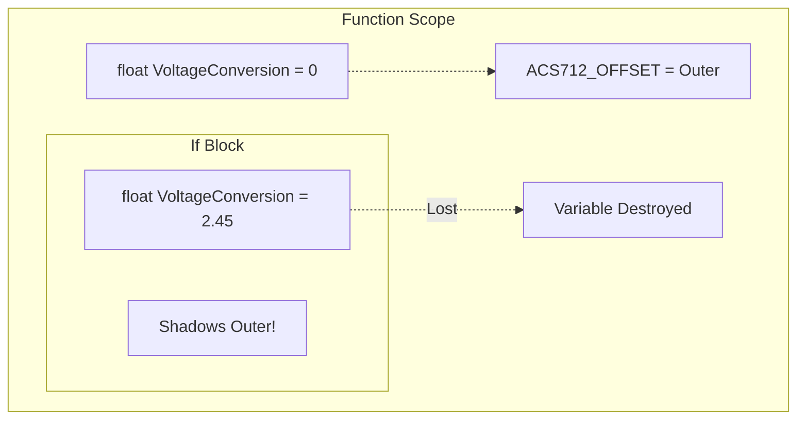

# 🛠️ Task 02: Fix Current Sensor Variable Shadowing

<div align="center">


-orange>)

**HAL Layer Critical Fix**

</div>

---

## 📋 Task Information

| Attribute        | Details                                                             |
| :--------------- | :------------------------------------------------------------------ |
| **Priority**     | 🔴 **CRITICAL**                                                     |
| **Assignee**     | Ahmed Twap                                                          |
| **Component**    | HAL Layer - ACS712 Current Sensor                                   |
| **Bug Type**     | Variable Scope Error (C-Language Shadowing)                         |
| **Impact**       | Zero-Offset calibration is **always 0V** (Reading ~25A at No Load). |
| **Dependencies** | 🏁 **None** (HAL Driver Issue)                                      |
| **Blocker**      | 🚀 **YES** - Prevents system initialization and accurate readings.  |
| **Deadline**     | **Sunday, Jan 25, 2026**                                            |

---

## 🐛 Problem Description

### Current Issue

In `hCurrent_Calibrate()`, the calibration result is stored in a **locally declared variable** inside an `if/else` block, which shares the same name as the outer variable. The outer variable (responsible for the actual update) remains 0.

### 🔍 Root Cause

```c
float VoltageConversion = 0; // Outer

if (condition) {
    float VoltageConversion = calculated_value; // ❌ INNER (Shadow)
    // Inner variable dies here
}

ACS712_ZERO_OFFSET = VoltageConversion; // ❌ Uses Outer (0)
```

---

## ⚙️ Visual Analysis



---

## 🛠️ Implementation Plan

### Step 1: Fix Variable Scope

**File**: `Hal/ACS712CurntSnsr/hCurrent_Program.c`

```c
void hCurrent_Calibrate(void)
{
    float VoltageConversion = 0.0f;

    if (Calibration.Samples < MIN_SAMPLES)
    {
        /* Assignment ONLY (Remove 'float') */
        VoltageConversion = (Calibration.Prev_Avg / ADC_MAX) * VREF;
    }
    else
    {
        VoltageConversion = (Calibration.Curr_Avg / ADC_MAX) * VREF;
    }

    /* Update Global Config */
    ACS712_ZERO_OFFSET = VoltageConversion;
}
```

---

## 🧪 Verification Plan

| Test Case           | Procedure                | Expected Result                  |
| :------------------ | :----------------------- | :------------------------------- |
| **Zero Load Calib** | Run Calibrate() with 0A. | `ACS712_ZERO_OFFSET` ≈ **2.50V** |
| **Zero Load Read**  | Read Current() with 0A.  | Current ≈ **0.00 A**             |
| **Full Load**       | 10A Load via Reference.  | Current ≈ **10.0 A** (±5%)       |

---

<div align="center">
**Gestell Company - Internal Task Document**
</div>
