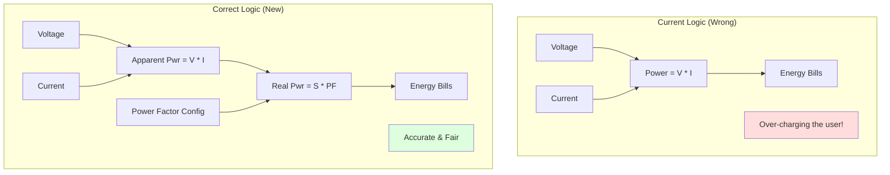

# 🛠️ Task 03: Implement Real Power (PF) Calculation

<div align="center">


-yellow>)


**Application Layer Feature | Physics & Accuracy**

</div>

---

## 📋 Task Overview & Metadata

| Attribute        | Details                                                    |
| :--------------- | :--------------------------------------------------------- |
| **Task ID**      | `FIX-003`                                                  |
| **Priority**     | 🟠 **MAJOR**                                               |
| **Assignee**     | **Ahmed Ashraf**                                           |
| **Component**    | **App** > **Measurement Engine**                           |
| **Bug Type**     | **Incorrect Physical Model**                               |
| **Impact**       | Calculating Apparent Power (VA) instead of Real Power (W). |
| **Dependencies** | 🔗 **Task 01** & **Task 02**                               |
| **Blocker**      | ❌ **NO** (System works, but inaccurate)                   |
| **Deadline**     | **Sunday, Jan 25, 2026**                                   |

---

## 🐛 Detailed Problem Description

### Context

In AC circuits, power is not simply Voltage × Current. That formula ($P=VI$) gives **Apparent Power ($S$)**, measured in Volt-Amperes (VA).
The **Real Power ($P$)**, measured in Watts (W), which is what utility meters bill for, is calculated as:
$$P = V_{rms} \times I_{rms} \times PowerFactor$$

Where **Power Factor ($PF$)** is the cosine of the phase difference ($\cos \phi$) between voltage and current waves.

### The Defect

The current `Measurement_Update` function performs the following:

```c
float Power = V_RMS * I_RMS; // This is Apparent Power!
Energy += Power * dt;
```

It completely ignores the Power Factor (effectively assuming $PF=1.0$, which is only true for purely resistive loads like heaters).

### The Result

- **Heater (Resistive)**: PF = 1.0. Error = 0%.
- **Computer/LED (Capacitive)**: PF ≈ 0.9. Error = +10%.
- **Motor/Pump (Inductive)**: PF ≈ 0.7 - 0.8. **Error = +20% to +30%**.

---

## 🔍 Visual Analysis



---

## 🛠️ Step-by-Step Implementation Plan

### Step 1: Update Configuration Header

**File**: `App/MeasurementEngine/Measurement_Config.h`

Add configuration macros to allow the system to use a fixed power factor (since phase-measurement hardware might not be ready yet, an estimated average PF is better than assuming 1.0).

```c
/* Power Factor Configuration */
#define ME_USE_FIXED_POWER_FACTOR    1          // 1: Use Fixed, 0: Measure (Future)
#define ME_DEFAULT_POWER_FACTOR      0.85f      // Average for Residential Loads
```

### Step 2: Modify Measurement Logic

**File**: `App/MeasurementEngine/Measurement_Program.c`

Locate the `ME_Update()` function. Split the power calculation into Apparent and Real components.

**Current Code:**

```c
ME_Power = ME_Vrms * ME_Irms;
ME_Energy += ME_Power * 0.01;
```

**New Code:**

```c
/* 1. Calculate Apparent Power (VA) */
float ApparentPower = ME_Vrms * ME_Irms;

/* 2. Determine Power Factor */
float PowerFactor = 1.0f;

#if ME_USE_FIXED_POWER_FACTOR == 1
    PowerFactor = ME_DEFAULT_POWER_FACTOR;
#else
    // Future: Call Zero-Crossing Logic here to measure phase
    PowerFactor = ME_GetMeasuredPF();
#endif

/* 3. Calculate Real Power (Watts) */
ME_Power_Watts = ApparentPower * PowerFactor;

/* 4. Accumulate Energy (Watt-Seconds / Joules) */
ME_Energy_Accumulator += (ME_Power_Watts * ME_SAMPLING_PERIOD_SEC); // 0.01s
```

### Step 3: Update Data Structs (Optional but Recommended)

If the system displays data, ensure we are displaying "Watts" (Real Power) on the screen, not VA. Update `ME_GetRealPower()` getters to return the new calculated value.

---

## 🧪 Verification & Testing Plan

### Test 1: Unit Test with Resistive Load

1.  **Setup**: Connect a 1000W Heater.
2.  **Config**: Temporarily set `ME_DEFAULT_POWER_FACTOR` to **1.0**.
3.  **Measurement**: System should read ~1000W.
4.  **Result**: Baseline confirmed.

### Test 2: Inductive Load Emulation

1.  **Setup**: Connect a Load that draws 220V, 1A (Apparent = 220VA).
2.  **Config**: Set `ME_DEFAULT_POWER_FACTOR` to **0.80**.
3.  **Calculation**: `P = 220 * 1 * 0.8 = 176 Watts`.
4.  **Action**: Check Display/UART log.
5.  **Pass Criteria**: Reading is **176W**.
6.  **Fail Criteria**: Reading is **220W** (Fix not applied).

### Test 3: Energy Integration

1.  Run the 220V/1A/PF0.8 setup for 1 hour.
2.  **Expected Energy**: `0.176 kWh`.
3.  **Old Logic Result**: `0.220 kWh` (Significant deviation).

---

<div align="center">
**Gestell Company - Internal Engineering Document**
</div>
