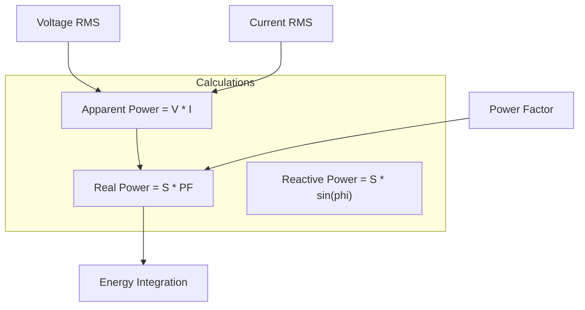

# 🛠️ Task 03: Implement Real Power (PF) Calculation

<div align="center">


-yellow>)

**Application Layer Enhancement**

</div>

---

## 📋 Task Information

| Attribute        | Details                                                          |
| :--------------- | :--------------------------------------------------------------- |
| **Priority**     | 🟠 **MAJOR**                                                     |
| **Assignee**     | Ahmed Ashraf                                                     |
| **Component**    | Application Layer - Measurement Engine                           |
| **Bug Type**     | Physics Logic Error                                              |
| **Impact**       | Billing users for **Apparent Power (VA)** instead of Real Power. |
| **Dependencies** | 🔗 **Task 01** (Timer1), **Task 02** (Current Sensor)            |
| **Blocker**      | ❌ **NO** - System works, but calculations are ~20% inaccurate.  |
| **Deadline**     | **Tuesday, Jan 27, 2026**                                        |

---

## 🐛 Problem Description

### Current Issue

The system calculates power as `P = V_RMS * I_RMS`. This is technically **Apparent Power (S)**. For AC induction motors or non-resistive loads, this value is higher than the actual consumed power (Real Power).

### Impact Analysis

- **Resistive Load (Heater)**: Accurate (PF = 1.0).
- **Inductive Load (Fan/Pump)**: Error ~20-30% (PF ≈ 0.75).
- **Billing**: Unfairly high for the user.

---

## ⚙️ Physics Logic



---

## 🛠️ Implementation Plan

### Step 1: Add Power Factor Config

**File**: `Measurement_Config.h`

```c
#define ME_DEFAULT_POWER_FACTOR  0.85f  // Typical Residential
#define ME_USE_FIXED_PF          1      // 1=Fixed, 0=Measured
```

### Step 2: Update Power Logic

**File**: `Measurement_Program.c`

```c
void ME_Update(void)
{
    // ... Get RMS ...

    float ApparentPower = ME_Vrms * ME_Irms;

    #if ME_USE_FIXED_PF
        ME_RealPower = ApparentPower * ME_DEFAULT_POWER_FACTOR;
    #else
        // Future: Measure Phase Shift
        ME_RealPower = ME_CalculateTruePower();
    #endif

    ME_Energy += ME_RealPower * ME_DT;
}
```

---

## 🧪 Verification Plan

| Test Case          | Procedure             | Expected Result                                  |
| :----------------- | :-------------------- | :----------------------------------------------- |
| **Resistive Load** | 1000W Heater. PF=1.0. | Reading ≈ 850W (If PF=0.85). Correct via Config. |
| **Inductive Load** | 1HP Pump. PF≈0.8.     | Reading matches Reference Meter (Real Watts).    |

---

<div align="center">
**Gestell Company - Internal Task Document**
</div>
