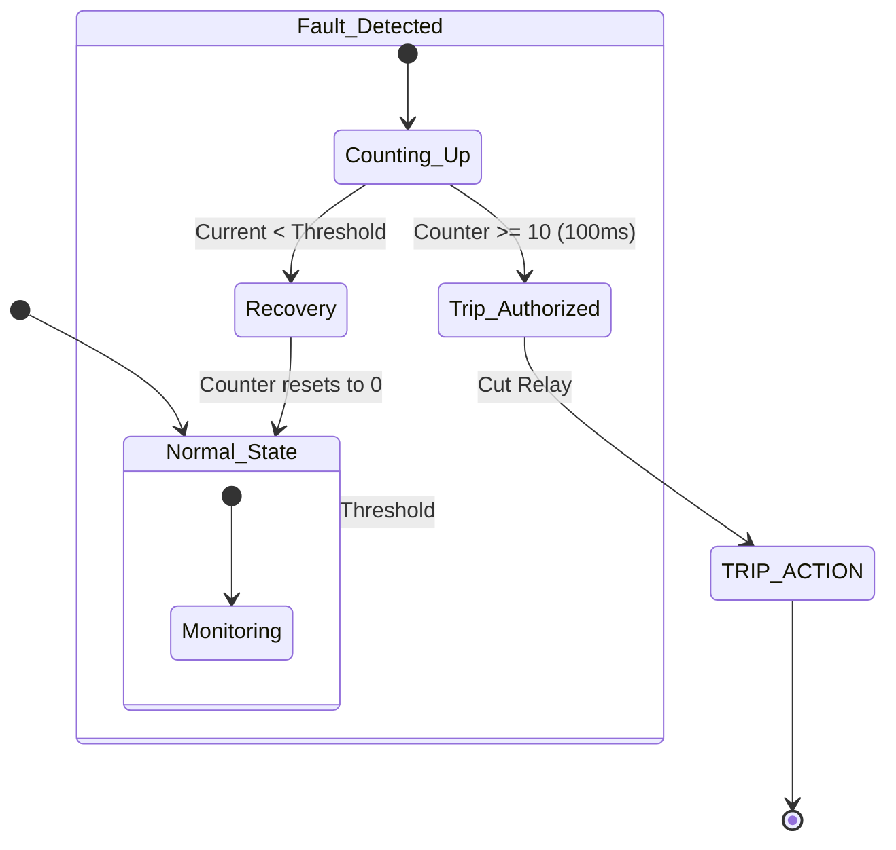

# 🛠️ Task 04: Fix Protection Manager Debouncing (Inrush Handling)

<div align="center">


-orange>)


**Application Layer Critical Fix | Safety & Reliability**

</div>

---

## 📋 Task Overview & Metadata

| Attribute        | Details                                                          |
| :--------------- | :--------------------------------------------------------------- |
| **Task ID**      | `FIX-007`                                                        |
| **Priority**     | 🔴 **CRITICAL**                                                  |
| **Assignee**     | **Mohamed Abdelgaber**                                           |
| **Component**    | **App** > **Protection Manager**                                 |
| **Bug Type**     | **Transient Signal Misinterpretation**                           |
| **Impact**       | False trips on motor inrush currents -> **Unusable for Motors**. |
| **Dependencies** | 🔗 **Task 01** & **Task 02**                                     |
| **Blocker**      | 🚀 **YES** (Must fix for Industrial usage)                       |
| **Deadline**     | **Wednesday, Jan 28, 2026**                                      |

---

## 🐛 Detailed Problem Description

### Context

Electrical protection systems must distinguish between **Real Faults** (Short Circuits, Sustained Overloads) and **Transient Events** (Inrush Currents, Noise Spikes).

- **Inrush Current**: When a motor starts, it can draw 5x-10x its rated current for a short duration (e.g., 50ms - 100ms).
- **Noise**: An ADC spike due to EMI might last 1-2 samples (10-20ms).

### The Defect

The current `PM_Update` function logic is too simplistic:

```c
if (Current > Max_Current_Threshold) {
    Trigger_Trip(); // ❌ TOO FAST!
}
```

If the threshold is 10A, and a 5A motor starts (drawing 25A for 50ms), the system trips instantly.

### The Solution: Hysteresis & Debouncing

We need a **Time-Based Filter** (Debouncer). The condition must persist for a strictly defined duration (e.g., **100ms**) before we authorize a trip.

---

## 🔍 Visual Analysis (State Machine)



---

## 🛠️ Step-by-Step Implementation Plan

### Step 1: Update Configuration

**File**: `App/ProtectionManager/ProtectionManager_Config.h`
Define the timing parameters. Since the system tick is 10ms (from Timer1):

- 100ms Debounce = 10 Ticks.

```c
/* Debounce Settings */
#define PM_TRIP_DELAY_TICKS      10      // 10 * 10ms = 100ms Tolerated Overload
#define PM_RESET_DELAY_TICKS     20      // 20 * 10ms = 200ms Stability required to reset
#define PM_CURRENT_HYSTERESIS    1.0f    // 1 Amp drop required to stop counting
```

### Step 2: Implement Logic

**File**: `App/ProtectionManager/ProtectionManager_Program.c`

Modify the update loop to use a static counter.

```c
static uint8_t Fault_Counter = 0;

void PM_Update(void)
{
    float current = ME_GetRmsCurrent();

    // Check for Over-Current
    if (current > PM_MAX_CURRENT_THRESHOLD)
    {
        Fault_Counter++;

        // Only Trip if condition persists
        if (Fault_Counter >= PM_TRIP_DELAY_TICKS)
        {
            PM_ExecuteTrip("Over Current");
            Fault_Counter = PM_TRIP_DELAY_TICKS; // Clamp
        }
    }
    else
    {
        // Gradual Decay (or Instant Reset)
        if (Fault_Counter > 0)
        {
            Fault_Counter--;
        }
    }
}
```

### Step 3: Short Circuit Exception (Optional but Smart)

If the current is MASSIVE (e.g., > 50A), we should trip **instantly** without waiting 100ms, as this is likely a dead short, not a motor startup.

```c
// Instant Trip for Short Circuit (Safety)
if (current > (PM_MAX_CURRENT_THRESHOLD * 3))
{
    PM_ExecuteTrip("Short Circuit");
}
```

---

## 🧪 Verification & Testing Plan

### Test 1: Noise Immunity

1.  **Setup**: Inject a single 20A pulse (lasting 10ms/1 cycle) using a signal generator or test code.
2.  **Expected**: `Fault_Counter` becomes 1, then goes back to 0. **NO TRIP**.

### Test 2: Motor Simulation (Inrush)

1.  **Setup**: Inject 20A for 60ms (6 cycles), then drop to 2A.
2.  **Expected**: `Fault_Counter` reaches 6. Threshold is 10. **NO TRIP**.

### Test 3: True Overload

1.  **Setup**: Inject 12A (Assumes 10A Limit) for 200ms.
2.  **Expected**: `Fault_Counter` climbs... 1, 2... at Tick 10 (100ms), System **TRIPS**. Relay opens.

---

<div align="center">
**Gestell Company - Internal Engineering Document**
</div>
