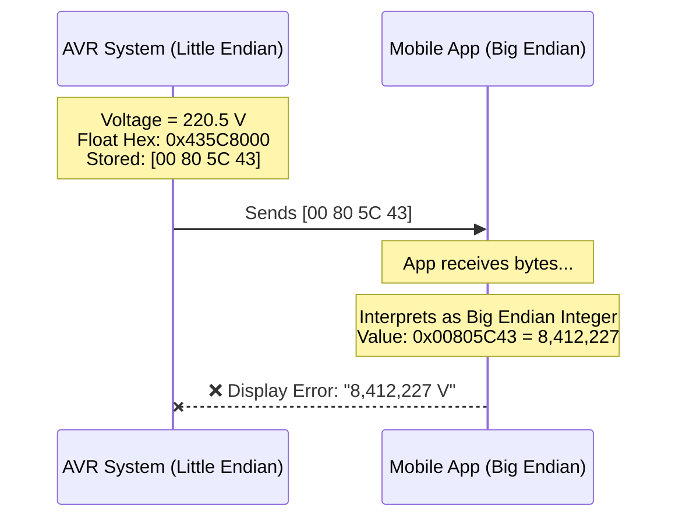

# 🛠️ Task 05: Implement Dual-Format Communication Protocol

<div align="center">


-yellow>)


**Communication Layer Feature | Endianness & Data Formats**

</div>

---

## 📋 Task Overview & Metadata

| Attribute        | Details                                                   |
| :--------------- | :-------------------------------------------------------- |
| **Task ID**      | `FIX-006`                                                 |
| **Priority**     | 🔴 **CRITICAL**                                           |
| **Assignee**     | **Mohamed Diaa**                                          |
| **Component**    | **App** > **Communication Manager**                       |
| **Bug Type**     | **Interoperability / Endianness Mismatch**                |
| **Impact**       | Mobile App receives garbage data (Float vs Int mismatch). |
| **Dependencies** | 🔗 **Task 03** (Data Validity)                            |
| **Blocker**      | 🚀 **YES** (Required for Release)                         |
| **Deadline**     | **Tuesday, Jan 27, 2026**                                 |

---

## 🐛 Detailed Problem Description

### Context

Different platforms store and read data differently:

1.  **AVR (Embedded)**: 8-bit architecture, generally **Little Endian** for multi-byte types.
2.  **Java/Flutter (Mobile)**: Network byte order is standard **Big Endian**. Often prefers Integers to avoid Float precision issues in JSON.
3.  **Javascript (Web)**: Handles JSON naturally, capable of Little Endian array parsing but requires specific commands.

### The Defect

Currently, the system uses a **Single Command (`0x05`)** that dumps the raw memory structure (`float` = 4 bytes) directly to UART.

- If we send `0x00 0x00 0x48 0x43` (200.0f Little Endian)...
- Mobile reads `0x00004843` (Decimal 18499) -> **Garbage**.

### The Solution: "Shift-Left" Strategy

We will implement **Two Separate Commands**:

1.  **Command 0x05 (Mobile)**: Returns data as **Big Endian Scaled Integers**.
    - Example: 220.5V -> Send `2205` (uint16).
2.  **Command 0x15 (Dashboard)**: Returns data as **Little Endian Floats**.
    - Example: 220.5V -> Send raw float bytes.

---

## 🔍 Visual Analysis (Protocol Mismatch)



## 💡 Solution: Dual Protocol Strategy

```mermaid
graph TD
    CMD{Command ID?}

    CMD -- "0x05 (Mobile)" --> INT["Convert to INT (x10)"]
    INT --> SWAP[Swap Endianness (Big)]
    SWAP --> SEND1[Send: [08 9D] (2205)]

    CMD -- "0x15 (Dash)" --> FLOAT[Keep as Float]
    FLOAT --> SEND2[Send: [00 80 5C 43]]
```

---

## 🛠️ Step-by-Step Implementation Plan

### Step 1: Helper Functions

**File**: `App/Communication/Comm_Utils.c`

Create a helper to convert host values to Big Endian bytes.

```c
void Comm_PackUint16_BigEndian(uint16_t value, uint8_t* buffer, uint8_t index)
{
    // High Byte First
    buffer[index]     = (uint8_t)((value >> 8) & 0xFF);
    // Low Byte Second
    buffer[index + 1] = (uint8_t)(value & 0xFF);
}
```

### Step 2: Implement Mobile Handler

**File**: `App/Communication/Comm_Program.c`

```c
void Comm_SendMobileData(void)
{
    uint8_t buffer[10];

    // Scale and Cast
    uint16_t volt_int = (uint16_t)(ME_GetVoltage() * 10.0f);
    uint16_t curr_int = (uint16_t)(ME_GetCurrent() * 100.0f);

    // Pack (Big Endian)
    Comm_PackUint16_BigEndian(volt_int, buffer, 0);
    Comm_PackUint16_BigEndian(curr_int, buffer, 2);
    // ... others ...

    UART_SendBuffer(buffer, 10);
}
```

### Step 3: Implement Dashboard Handler

```c
void Comm_SendDashboardData(void)
{
    float v = ME_GetVoltage();
    // Send raw bytes (AVR is Little Endian by default)
    UART_SendBuffer((uint8_t*)&v, 4);
    // ... repeat for others ...
}
```

### Step 4: Dispatcher

Update the main switch statement:

```c
switch(Command_ID)
{
    case 0x05: Comm_SendMobileData(); break;
    case 0x15: Comm_SendDashboardData(); break;
}
```

---

## 🧪 Verification & Testing Plan

### Test 1: Mobile Format

1.  **Input**: V=230.5V.
2.  **Request**: Send `0xAA 0x00 0x05`.
3.  **Expected Bytes**: `0x09 0x01` (2305 in Hex).
    - `0x09 * 256 + 0x01 = 2305`.

### Test 2: Dashboard Format

1.  **Input**: V=230.5V (`0x43668000` IEEE 754).
2.  **Request**: Send `0xAA 0x00 0x15`.
3.  **Expected Bytes** (Little Endian): `0x00 0x80 0x66 0x43`.

---

<div align="center">
**Gestell Company - Internal Engineering Document**
</div>
