# 🛠️ Task 06: Add EEPROM Timeout Protection

<div align="center">


-orange>)
-black>)

**MCAL Layer Safety Fix | Robustness**

</div>

---

## 📋 Task Overview & Metadata

| Attribute        | Details                                                    |
| :--------------- | :--------------------------------------------------------- |
| **Task ID**      | `FIX-008` (Linked to Task 06)                              |
| **Priority**     | ⚠️ **MEDIUM**                                              |
| **Assignee**     | **Ahmed Ashraf**                                           |
| **Component**    | **MCAL** > **EEPROM Driver**                               |
| **Bug Type**     | **Infinite Blocking Loop**                                 |
| **Impact**       | Hardware Failure causes **System Freeze** (Infinite Wait). |
| **Dependencies** | 🏁 **None**                                                |
| **Blocker**      | ❌ **NO** (Enhancement)                                    |
| **Deadline**     | **Wednesday, Jan 28, 2026**                                |

---

## 🐛 Detailed Problem Description

### Context

The AVR Internal EEPROM requires time to complete a write cycle (typically **3.4ms to 8.5ms**). The datasheet specifies checking the `EEWE` (EEPROM Write Enable) bit to know when the write is done.

### The Defect

The current driver implementation uses a **Blocking Wait** without a fallback:

```c
// ❌ DANGEROUS CODE
void mEEPROM_WriteByte(u16 Address, u8 Data)
{
    // Wait until previous write is completed
    while(GetBit(EECR, EEWE) == 1)
    {
        // Cycles forever if Hardware failure keeps EEWE high!
    }
    // ... proceed to write
}
```

If the hardware glitches, or voltage is unstable, `EEWE` might persist (or appear to), locking the CPU.

### The Solution: Timeout Counter

We must limit the wait time. If the EEPROM takes longer than **10ms**, something is wrong. We should abort and return an Error Status.

---

## 🔍 Visual Analysis

```mermaid
flowchart TD
    Start[Write Byte Request] --> Check{Is EEWE == 1?}

    Check -- Yes --> Inc[Increment Counter]
    Inc --> Delay[Wait 100us]
    Delay --> Limit{Counter > 100?}

    Limit -- No --> Check
    Limit -- Yes (Timeout) --> Error[Return TIMER_OUT_ERROR]

    Check -- No (Ready) --> Write[Perform Write Sequence]
    Write --> Success[Return OK]

    style Error fill:#282869
    style Success fill:#282869
```



---

## 🛠️ Step-by-Step Implementation Plan

### Step 1: Update API Return Type

**File**: `Mcal/EEPROM/mEEPROM_Interface.h`

Change the function return type from `void` or `u8` to `Std_ReturnType` (or equivalent enum) to propagate the error.

```c
// Old: void mEEPROM_WriteByte(u16 Address, u8 Data);
// New:
Std_ReturnType mEEPROM_WriteByte(u16 Address, u8 Data);
```

### Step 2: Implement Timeout Logic

**File**: `Mcal/EEPROM/mEEPROM_Program.c`

```c
Std_ReturnType mEEPROM_WriteByte(u16 Address, u8 Data)
{
    u32 Local_TimeoutCounter = 0;

    /* 1. Wait for completion of previous write with Timeout */
    while(GetBit(EECR, EEWE) == 1)
    {
        Local_TimeoutCounter++;
        _delay_us(100); // Wait 100 microseconds

        // 100 * 100us = 10,000us = 10ms
        if(Local_TimeoutCounter > 100)
        {
            return E_TIMEOUT; // 🚨 ABORT: Hardware not responding
        }
    }

    /* 2. Critical Section & Write Sequence */
    cli();
    EECR |= (1<<EEMWE);
    EECR |= (1<<EEWE);
    sei();

    return E_OK;
}
```

### Step 3: Handle Return Value in Application

Update `App/Persistence/DataPersistence.c` (or wherever it's used) to check the result.

```c
if (mEEPROM_WriteByte(...) == E_TIMEOUT)
{
    // Log Error
    // Skip saving
}
```

---

## 🧪 Verification & Testing Plan

### Test 1: Normal Operation (Performance)

1.  **Action**: Perform 100 sequential writes.
2.  **Monitor**: Measure time taken.
3.  **Expectation**: Each write takes ~4ms. returns `E_OK`.

### Test 2: Timeout Simulation (Fault Injection)

1.  **Hack**: Inside `mEEPROM_WriteByte`, temporarily comment out the valid `while` condition and replace with `while(1)`.
2.  **Action**: Call the function.
3.  **Observation**: The function should return `E_TIMEOUT` after exactly 10ms.
4.  **Success**: System does NOT hang. Main loop continues running.

---

<div align="center">
**Gestell Company - Internal Engineering Document**
</div>
