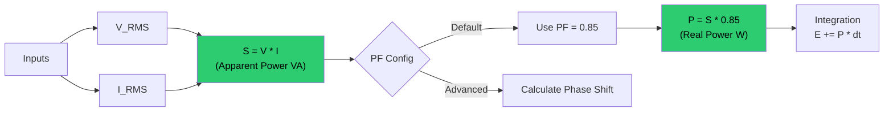

# 🛠️ Task 07: Implement Energy Persistence (EEPROM Wear Leveling)

<div align="center">


-orange>)


**Application Layer Feature | Data Integrity**

</div>

---

## 📋 Task Overview & Metadata

| Attribute        | Details                                                    |
| :--------------- | :--------------------------------------------------------- |
| **Task ID**      | `FIX-010`                                                  |
| **Priority**     | 🟡 **HIGH**                                                |
| **Assignee**     | **Basma Khaled**                                           |
| **Component**    | **App** > **Persistence Manager**                          |
| **Bug Type**     | **Missing Feature**                                        |
| **Impact**       | Energy data reset on power cycle -> **Billing Data Loss**. |
| **Dependencies** | 🔗 **Task 06** (EEPROM Driver)                             |
| **Blocker**      | ❌ **NO** (Feature Request)                                |
| **Deadline**     | **Wednesday, Jan 28, 2026**                                |

---

## 🐛 Detailed Problem Description

### Context

Utility meters must remember their Energy Counter (kWh) across power cycles. EEPROM is non-volatile but has a **finite life** (typically 100,000 write cycles per byte).

### The Challenge

If we write to EEPROM every 10ms (system tick), we will burn out the memory in:
`100,000 / (100 writes/sec) = 1,000 seconds = 16 Minutes.`
**We need a strategy to write LESS often.**

---

## 🔍 Visual Analysis (Wear Leveling Logic)



---

## 🛠️ Implementation Plan

### Strategy: Periodic + Threshold + Power-Down Saving

1.  **Periodic Save**: Save every **10 Minutes**.
2.  **Threshold Save**: Save every **0.1 kWh** increment.
3.  **Redundancy**: Use a "Double-Buffer" or checksum to ensure we don't read half-written garbage.

### Step 1: Create Persistence Module

**File**: `App/Persistence/Persistence_Program.c`

```c
#define SAVE_INTERVAL_TICKS  (100 * 60 * 10) // 10 Minutes @ 10ms tick

void Persistence_Update(void)
{
    static u32 TickCounter = 0;
    static float LastSavedEnergy = 0.0f;

    TickCounter++;
    float current_energy = ME_GetTotalEnergy();

    // Condition 1: Time Interval
    if (TickCounter >= SAVE_INTERVAL_TICKS)
    {
        Persistence_Save(current_energy);
        TickCounter = 0;
    }

    // Condition 2: Significant Change (0.1 kWh)
    if ((current_energy - LastSavedEnergy) >= 0.1f)
    {
        Persistence_Save(current_energy);
    }
}
```

### Step 2: Implement Safety Save (Double Write)

Store the value in two locations (Address 0 and Address 10). When reading, check both. If one is corrupted (CRC fail or unrealistic), uses the other.

```c
void Persistence_Save(float energy)
{
    // Write Primary
    mEEPROM_WriteFloat(0x00, energy);
    // Write Backup
    mEEPROM_WriteFloat(0x10, energy);

    LastSavedEnergy = energy;
}
```

---

## 🧪 Verification & Testing Plan

### Test 1: Power Cycle

1.  **Action**: Accumulate 0.5 kWh on the display.
2.  **Event**: Force a "Save" (or wait 10 mins).
3.  **Action**: Unplug system. Wait 10s. Plug in.
4.  **Expectation**: Display shows **0.5 kWh** (Not 0.0).

### Test 2: Wear Leveling

1.  **Action**: Run stress test. Log every "EEPROM Write".
2.  **Expectation**: Writes occur max 6 times per hour (10 min interval).

---

<div align="center">
**Gestell Company - Internal Engineering Document**
</div>
