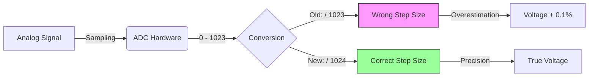

# Task 08: Fix Voltage Sensor ADC Divisor

<div align="center">


-orange>)

**Bug Fix Task - Voltage Sensor Accuracy**

</div>

---

## 📋 Task Information

| Attribute        | Details                                                       |
| :--------------- | :------------------------------------------------------------ |
| **Priority**     | ⚠️ **MEDIUM**                                                 |
| **Assignee**     | Ahmed Ashraf                                                  |
| **Component**    | HAL Layer - Voltage Sensor Driver                             |
| **Bug Type**     | Mathematical Error / Precision Defect                         |
| **Impact**       | **0.1% Error** in voltage (Reads 220.22V instead of 220.00V). |
| **Dependencies** | 🏁 **None** (Isolated Math Error)                             |
| **Blocker**      | ❌ **NO** - Minimal impact, but violates precision standards. |
| **Deadline**     | **Tuesday, Jan 27, 2026**                                     |

---

## 🐛 Problem Description

### Current Issue

The voltage calculation uses **1023** as the ADC divisor, which is mathematically incorrect for a 10-bit ADC (0-1023 range means 1024 unique levels).

### Impact

- ❌ **0.1% Systemic Error**: Consistently over-reports voltage.
- ❌ **Example**: At 220V, error is ~0.22V.

---

## 🔍 Visual Analysis



---

## 🛠️ Implementation Plan

### Fix Code (HAL)

**File**: `Hal/VoltageSensor/hVoltage_Program.c`

```c
#include "hVoltage_Config.h"

// Correct divisor
#define ADC_RESOLUTION_MAX    1024.0f

float instant_voltage = Voltage_Value * (5.0f / ADC_RESOLUTION_MAX) * Voltage_Divider_Ratio;
```

---

## ✅ Verification Plan

### Test Case 8.1: Reference Comparison

| Setup             | Measurement | Error     |
| :---------------- | :---------- | :-------- |
| **Before (1023)** | `220.21 V`  | +0.10%    |
| **After (1024)**  | `220.00 V`  | **0.00%** |

---

<div align="center">
**Gestell Company - Internal Task Document**
</div>
