# 🛠️ Task 08: Fix Voltage Sensor ADC Divisor (Precision)

<div align="center">


-orange>)


**HAL Layer Precision Fix | Math Error**

</div>

---

## 📋 Task Overview & Metadata

| Attribute        | Details                                        |
| :--------------- | :--------------------------------------------- |
| **Task ID**      | `FIX-005`                                      |
| **Priority**     | ⚠️ **MEDIUM**                                  |
| **Assignee**     | **Ahmed Ashraf**                               |
| **Component**    | **HAL** > **Voltage Sensor Driver**            |
| **Bug Type**     | **Mathematical Precision Error**               |
| **Impact**       | Consistently over-reports voltage by **0.1%**. |
| **Dependencies** | 🏁 **None**                                    |
| **Blocker**      | ❌ **NO** (Minor Accuracy Issue)               |
| **Deadline**     | **Tuesday, Jan 27, 2026**                      |

---

## 🐛 Detailed Problem Description

### The Math

The ATmega32 ADC is **10-bit**. It produces values from **0 to 1023**.
The number of distinct "steps" or levels is **1024** ($2^{10}$).

### The Defect

The code divides by the maximum value (1023) instead of the number of steps (1024).

---

## 🔍 Visual Analysis (Resolution Scaling)

```mermaid
graph LR
    Input["Analog Input (2.5V)"] --> ADC["ADC Hardware (10-Bit)"]
    ADC --> Reading[Read Value: 512]

    Reading --> WRONG{Divide by 1023}
    Reading --> CORRECT{Divide by 1024}

    WRONG --> ERR[50.05% of Scale]
    CORRECT --> ACC[50.00% of Scale]

    ERR --> OUT_ERR[Output: 2.502 V]
    ACC --> OUT_ACC[Output: 2.500 V]

    style OUT_ERR fill:#282869
    style OUT_ACC fill:#282869
```



---

## 🛠️ Implementation Plan

### Step 1: Update Config

**File**: `Hal/VoltageSensor/hVoltage_Config.h` or `Program.c`

Find the macro used for calculation.

**Change This:**

```c
#define ADC_MAX_VALUE    1023.0f
```

**To This:**

```c
#define ADC_RESOLUTION   1024.0f
```

### Step 2: Update Formula

**File**: `Hal/VoltageSensor/hVoltage_Program.c`

```c
float hVoltage_GetInstant(void)
{
    u16 adc_reading = ADC_Read(VOLTAGE_CHANNEL);

    // Calculation
    // formula: (ADC / 1024) * Vref * DividerRatio
    float voltage = ((float)adc_reading / ADC_RESOLUTION) * VREF_VOLTAGE * VOLTAGE_DIVIDER_RATIO;

    return voltage;
}
```

---

## 🧪 Verification & Testing Plan

### Test 1: Precision Check

1.  **Setup**: Use a Fluke Multimeter to inject exactly 2.500V into the ADC pin.
2.  **Expected ADC**: 512.
3.  **Calculation Check**:
    - Old: `2.5V * (512/1023)` = **2.502V** (Error)
    - New: `2.5V * (512/1024)` = **2.500V** (Perfect)

---

<div align="center">
**Gestell Company - Internal Engineering Document**
</div>
