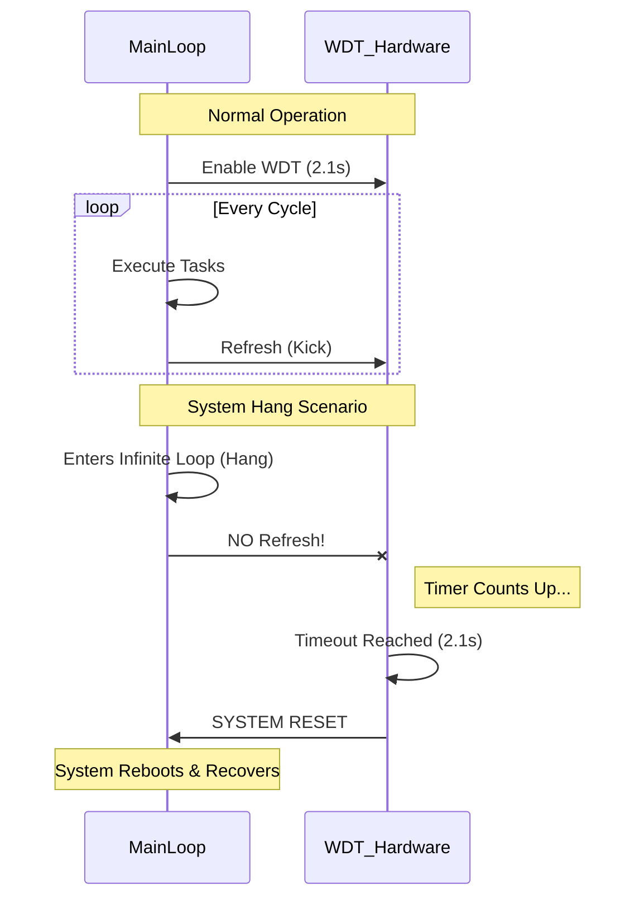

# Task 09: Implement Watchdog Timer (WDT)

-orange>)

**Safety Feature Implementation**

---

## 📋 Task Information

| Attribute        | Details                                                                   |
| :--------------- | :------------------------------------------------------------------------ |
| **Priority**     | 🟡 **HIGH**                                                               |
| **Assignee**     | Hesham Ahmed                                                              |
| **Component**    | MCAL Layer - Watchdog Timer (WDT)                                         |
| **Bug Type**     | Missing Feature / System Resilience                                       |
| **Impact**       | System cannot recover from latch-ups or infinite loops (requires reboot). |
| **Dependencies** | 🏁 **None** (Independent Hardware Feature)                                |
| **Blocker**      | ❌ **NO** - But essential for 24/7 reliability.                           |
| **Deadline**     | **Sunday, Jan 25, 2026**                                                  |

---

## 🐛 Problem Description

### Current Issue

The system currently **lacks a mechanism to recover from hangs**. If the software enters an infinite loop or if EMI triggers a latch-up, the device remains unresponsive until manually power-cycled.

### Impact

- ❌ **System Freeze**: User must physically unplug device.
- ❌ **Reliability**: Not suitable for 24/7 Energy Management.

---

## 🔍 Visual Analysis

---

## 🛠️ Implementation Plan

### Step 1: Create WDT Driver (MCAL)

**File**: `Mcal/WDT/WDT_Program.c`

Implement `WDT_Enable()`, `WDT_Disable()`, and `WDT_Refresh()` using `WDTCR` register.

### Step 2: Integrate into System Controller

**File**: `App/SystemController/SystemController.c`

Enable WDT at startup. Call `WDT_Refresh()` at end of `System_Loop()`.

---

## ✅ Verification Plan

### Test Case 9.1: Reset Verification

1. Comment out `WDT_Refresh()`.
2. Confirm system reboots every 2.1 seconds.

---

**Gestell Company - Internal Task Document**

