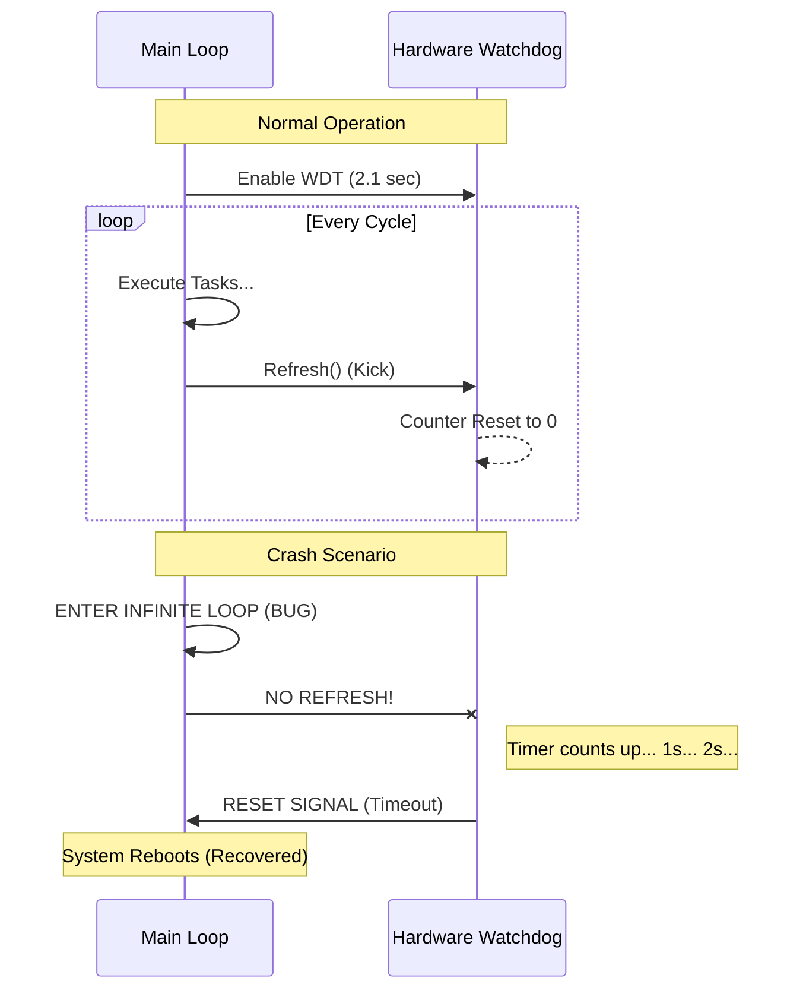

# 🛠️ Task 09: Implement Watchdog Timer (WDT)

<div align="center">


-orange>)


**MCAL Layer Driver | System Safety**

</div>

---

## 📋 Task Overview & Metadata

| Attribute        | Details                                                        |
| :--------------- | :------------------------------------------------------------- |
| **Task ID**      | `FIX-003`                                                      |
| **Priority**     | ⚠️ **HIGH**                                                    |
| **Assignee**     | **Hesham Ahmed**                                               |
| **Component**    | **MCAL** > **Watchdog Timer**                                  |
| **Bug Type**     | **Missing Feature / Safety Prevention**                        |
| **Impact**       | System freezes permanently on crash (Requires manual restart). |
| **Dependencies** | 🏁 **None**                                                    |
| **Blocker**      | ❌ **NO** (Reliability Feature)                                |
| **Deadline**     | **Sunday, Jan 25, 2026**                                       |

---

## 🐛 Detailed Problem Description

### Context

A **Watchdog Timer (WDT)** is an independent hardware counter that counts up. If it reaches its max value (Timeout), it resets the microcontroller. The software must "kick" (reset) the WDT periodically to prove it is still alive and running correctly.

### The Missing Feature

The current system has no WDT enabled. If the code enters a deadlock (e.g., `while(1)` in EEPROM driver), the screen freezes and the system stops metering.

---

## 🔍 Visual Analysis (Safety Mechanism)



---

## 🛠️ Implementation Plan

### Step 1: Create WDT Driver

**File**: `Mcal/WDT/WDT_Program.c`

We need to configure the `WDTCR` (Watchdog Timer Control Register).
Target Timeout: **2.1 Seconds** (Prescaler = 111).

```c
void mWDT_Enable(void)
{
    /*
       WDE = 1 (Watchdog Enable)
       WDP2, WDP1, WDP0 = 1 (Prescaler for 2.1s at 5V)
    */
    WDTCR = (1<<WDE) | (1<<WDP2) | (1<<WDP1) | (1<<WDP0);
}

void mWDT_Disable(void)
{
    /* Timed Sequence required to disable WDT */
    WDTCR |= (1<<WDTOE) | (1<<WDE);
    WDTCR = 0x00;
}

void mWDT_Refresh(void)
{
    /* Assembly instruction to reset WDT */
    asm("WDR");
}
```

### Step 2: System Integration

**File**: `App/SystemController/SystemController.c`

1.  **Init**: Call `mWDT_Enable()` at the very beginning of `main()`.
2.  **Loop**: Call `mWDT_Refresh()` at the bottom of the `while(1)` super-loop.

---

## 🧪 Verification & Testing Plan

### Test 1: Reset Test

1.  **Setup**: Introduce a fake bug. Add `while(1);` inside a button handler.
2.  **Action**: Press the button to trigger the infinite loop.
3.  **Observation**: System freezes for ~2 seconds.
4.  **Result**: System **Restarts** automatically (Display showing splash screen).

---

<div align="center">
**Gestell Company - Internal Engineering Document**
</div>
