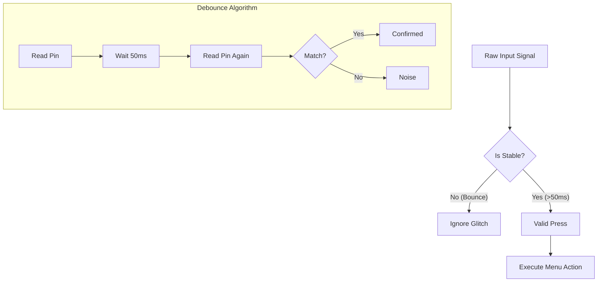

# 🛠️ Task 10: Implement Button Debouncing

<div align="center">


-orange>)


**HAL Layer Driver | UX Improvement**

</div>

---

## 📋 Task Overview & Metadata

| Attribute        | Details                              |
| :--------------- | :----------------------------------- |
| **Task ID**      | `FIX-009`                            |
| **Priority**     | ⚠️ **MEDIUM**                        |
| **Assignee**     | **Mohamed Abdelgaber**               |
| **Component**    | **HAL** > **Button Driver**          |
| **Bug Type**     | **Signal Noise / Mechanical Bounce** |
| **Impact**       | Poor UX (Skipping menu items).       |
| **Dependencies** | 🏁 **None**                          |
| **Blocker**      | ❌ **NO** (Enhancement)              |
| **Deadline**     | **Wednesday, Jan 28, 2026**          |

---

## 🐛 Detailed Problem Description

### Context

Mechanical buttons use metal contacts. When pressed blocking, the metal pieces vibrate/bounce for **5ms to 20ms** before making solid contact. The microcontroller (running at MHz speed) sees these bounces as logic transitions: `High -> Low -> High -> Low`.

---

## 🔍 Visual Analysis (Signal Cleanup)



---

## 🛠️ Implementation Plan

### Step 1: Implement Blocking Debounce (Simplest)

Since our system tick is 10ms, we can use a small delay inside the button read function.

**Preferred Method: State Verification**
Check the button. If active, wait **50ms**. Check again. If STILL active, it's a real press.

**File**: `Hal/Button/hButton_Program.c`

```c
ButtonState_t hButton_GetState(Button_t btn)
{
    if (GPIO_Read(btn.Pin) == PRESSED)
    {
        // Detected an edge. Wait for stability.
        _delay_ms(50);

        // Check again
        if (GPIO_Read(btn.Pin) == PRESSED)
        {
            // Wait for Release? (Optional)
            while(GPIO_Read(btn.Pin) == PRESSED);

            return BTN_CLICKED;
        }
    }
    return BTN_IDLE;
}
```

---

## 🧪 Verification & Testing Plan

### Test 1: Navigation Test

1.  **Action**: Open Configuration Menu.
2.  **Input**: Press "UP" button 10 times quickly.
3.  **Result**: Selection moves exactly 10 slots.
4.  **Fail**: Selection moves 15-20 slots.

---

<div align="center">
**Gestell Company - Internal Engineering Document**
</div>
