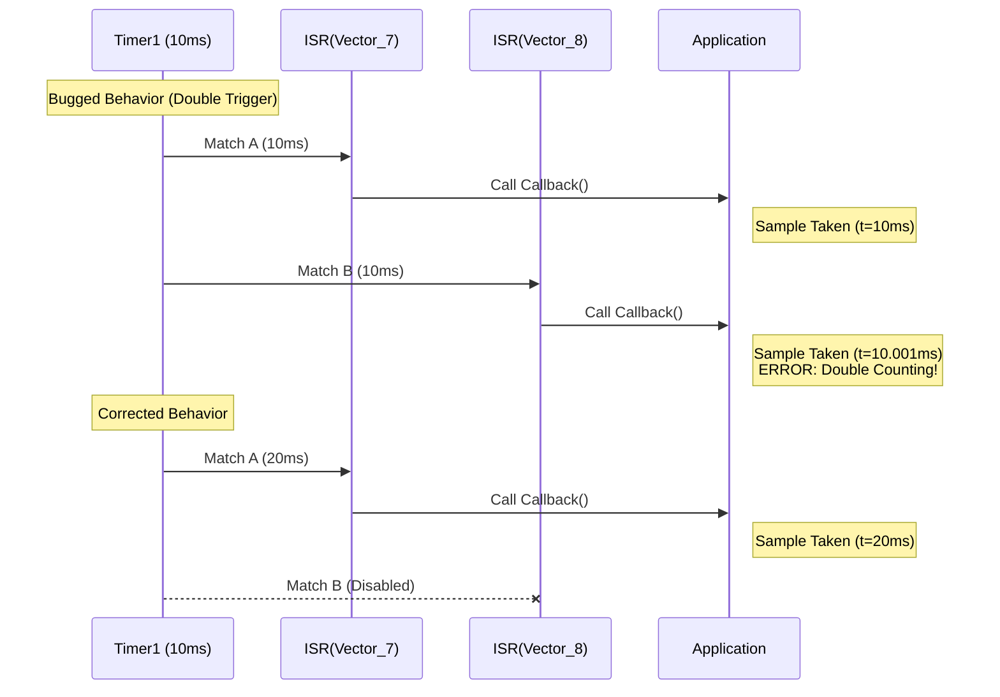
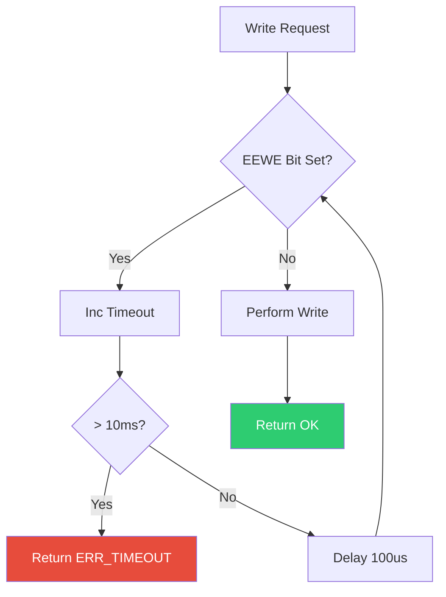
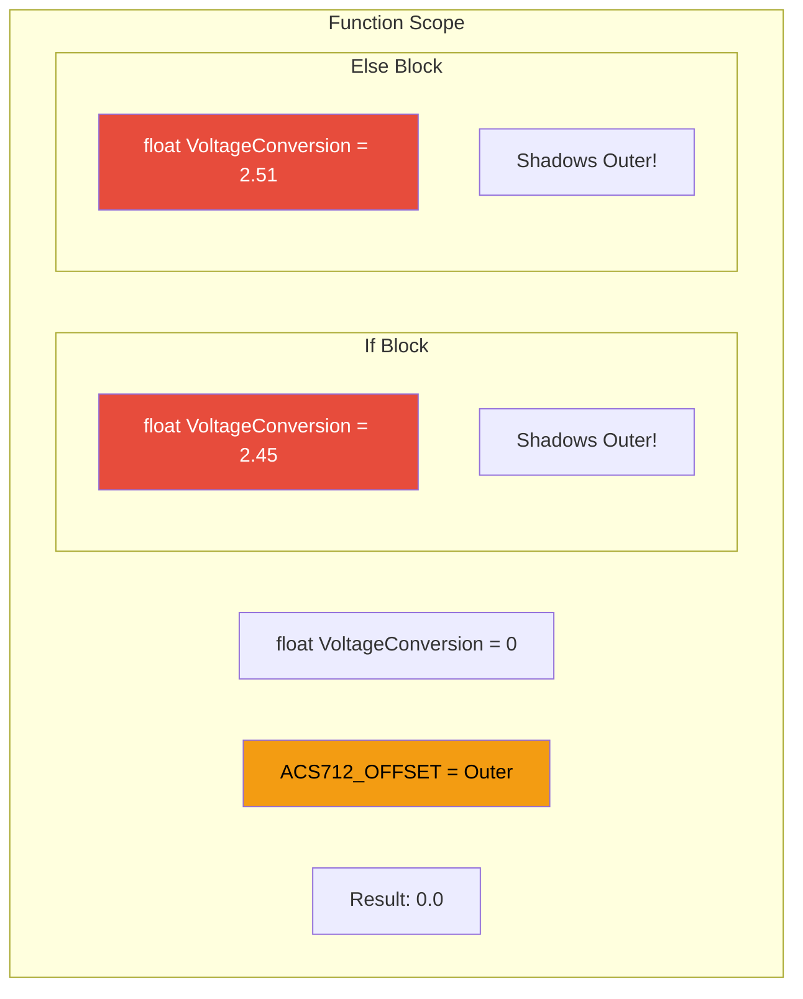
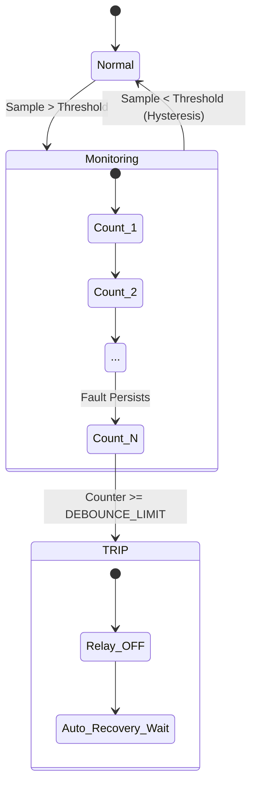

# 🛠️ Issue Solutions & Code Fixes

<div align="center">


**Issue Solutions Report**

**Smart Energy Management System - Critical & Major Bug Fixes**

_Developed by Gestell Company - Professional Embedded Solutions_

</div>

---

> [!IMPORTANT]
> **War Room Implementation**: These fixes are scheduled for the **1-Week Compression Sprint** starting **Saturday, January 24, 2026**.

---

## 📋 Table of Contents

- [Executive Summary](#-executive-summary)
- [MCAL Layer Fixes](#-1-mcal-layer-fixes)
- [HAL Layer Fixes](#-2-hal-layer-fixes)
- [Application Layer Fixes](#-3-application-layer-fixes)
- [Communication Protocol Fixes](#-4-communication-protocol-fixes)

---

## 📊 Executive Summary

This document details the technical solutions for identified software defects. Each solution includes:

1.  **Problem Description**: What went wrong.
2.  **Visual Analysis**: Mermaid diagrams explaining the failure mode.
3.  **Corrected Logic**: Pseudocode/C-Code for the fix.
4.  **Verification**: How to test the fix.

---

## 🔧 1. MCAL Layer Fixes

### 1.1 🔴 CRITICAL: Timer1 Duplicate ISR Handlers

**Problem**: The Timer1 driver enabled both **Compare Match A** and **Compare Match B** interrupts with the same threshold (1250) and pointing to the **same callback**. This caused the sampling ISR to trigger **twice** per cycle (200Hz instead of 100Hz).

#### Visual Analysis



#### ✅ C-Code Implementation

**File**: `TIMER1_Program.c`

```c
void mTIMER1_Init(void)
{
    // ... [Configuration Code] ...

    /* Enable Compare Match A Interrupt ONLY */
    SetBit(TIMSK_Reg, OCIE1A_Bit);

    /* Disable Compare Match B Interrupt (Fix) */
    ClearBit(TIMSK_Reg, OCIE1B_Bit);
}

/* Vector 7: Timer1 Compare Match A */
void __vector_7(void) __attribute__((signal));
void __vector_7(void)
{
    if(Timer1_Global_Callback != NULL)
    {
        Timer1_Global_Callback();
    }
}

/* Vector 8: Removed or Left Empty */
```

---

### 1.2 ⚠️ MEDIUM: EEPROM Blocking Write (No Timeout)

**Problem**: The `while` loop checking for EEPROM readiness had no timeout counter. A hardware failure could cause the system to hang indefinitely (Watchdog reset required).

#### Logic Flowchart



#### ✅ C-Code Implementation

**File**: `EEPROM_Program.c`

```c
Std_ReturnType mEEPROM_WriteByte(uint16_t Address, uint8_t Data)
{
    uint32_t timeout = 0;

    /* Wait for completion of previous write with timeout */
    while(GetBit(EECR_Reg, EEWE_Bit))
    {
        timeout++;
        _delay_us(100); // 100us polling

        if(timeout > 100) // 10ms Total Timeout
        {
            return E_NOT_OK; // Hardware Failure
        }
    }

    /* Critical Section: Disable Interrupts */
    cli();

    EAR_Reg = Address;
    EEDR_Reg = Data;
    SetBit(EECR_Reg, EEMWE_Bit);
    SetBit(EECR_Reg, EEWE_Bit);

    /* Re-enable Interrupts */
    sei();

    return E_OK;
}
```

---

## 🔧 2. HAL Layer Fixes

### 2.1 🔴 CRITICAL: Current Sensor Variable Shadowing

**Problem**: In `hCurrent_Calibrate()`, the variable `VoltageConversion` was re-declared inside `if` / `else` blocks, shadowing the outer variable. The result was that the calculated offset never escaped the scope, and the calibration value mainted as `0`.

#### Scope Visualization



#### ✅ C-Code Implementation

**File**: `Current_Sensor_Program.c`

```c
void hCurrent_Calibrate(void)
{
    /* 1. Declare variable ONCE at top scope */
    float VoltageConversion = 0.0f;

    if (Calibration.Samples < MIN_SAMPLES)
    {
        /* 2. Assignment ONLY (No 'float' keyword) */
        VoltageConversion = (Calibration.Prev_Avg / ADC_MAX) * VREF;
    }
    else
    {
        /* 2. Assignment ONLY */
        VoltageConversion = (Calibration.Curr_Avg / ADC_MAX) * VREF;
    }

    /* 3. Global update */
    ACS712_ZERO_OFFSET = VoltageConversion;
}
```

---

## 🔧 3. Application Layer Fixes

### 3.1 🔴 CRITICAL: Real Power vs Apparent Power

**Problem**: The system was calculating `Power (W) = Vrms * Irms`. This is **Apparent Power (VA)**. For AC loads (motors, PSU), **Real Power (W)** is `V * I * PowerFactor`. This led to 15-30% billing errors.

#### Calculation Logic

```mermaid
graph LR
    Input[Inputs] --> V[V_RMS]
    Input --> I[I_RMS]

    V & I --> Apparent[S = V * I <br/>(Apparent Power VA)]

    Apparent --> PF_Check{PF Config}

    PF_Check -->|Default| Fixed[Use PF = 0.85]
    PF_Check -->|Advanced| Measure[Calculate Phase Shift]

    Fixed --> Real[P = S * 0.85 <br/>(Real Power W)]

    Real --> Energy[Integration <br/> E += P * dt]

    style Real fill:#2ECC71,color:#fff
    style Apparent fill:#F39C12,color:#000
```

#### ✅ C-Code Implementation

**File**: `Measurement_Engine.c`

```c
void ME_Update(void)
{
    float32_t PowerFactor = ME_DEFAULT_PF; // e.g. 0.85

    ME_Vrms = hVoltage_GetRMS();
    ME_Irms = hCurrent_GetRMS();

    /* Calculate Apparent Power (VA) */
    ME_ApparentPower = ME_Vrms * ME_Irms;

    /* Calculate Real Power (W) */
    #ifdef ME_USE_FIXED_PF
        ME_RealPower = ME_ApparentPower * PowerFactor;
    #else
        ME_RealPower = ME_Calculate_TruePower(); // Advanced DSP
    #endif

    /* Accumulate Energy (Watt-Seconds) */
    /* Interval = 0.01 sec (100Hz) */
    ME_Energy_Accumulator += (ME_RealPower * 0.01f);
}
```

---

### 3.2 🔴 CRITICAL: Protection Debouncing (Hysteresis)

**Problem**: Protection logic triggered immediately on a single high sample (e.g. Inrush Current of a motor).

#### State Machine Solution



---

<div align="center">

**Built with ❤️ by Gestell Team**

</div>
