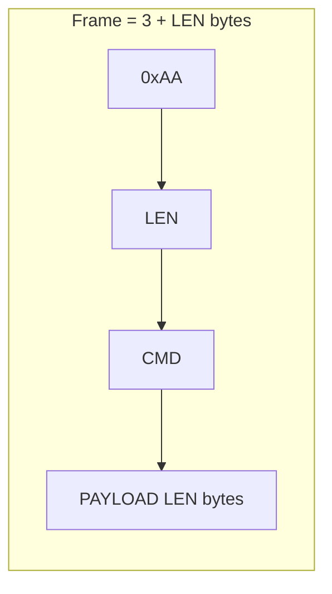
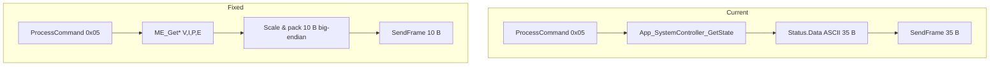
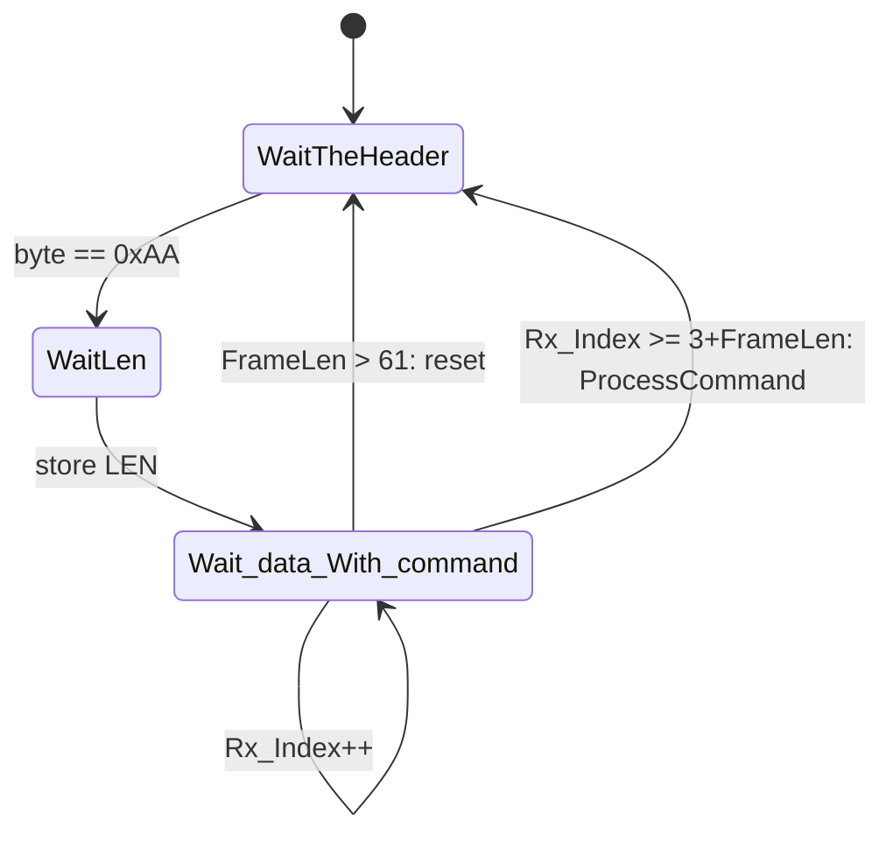
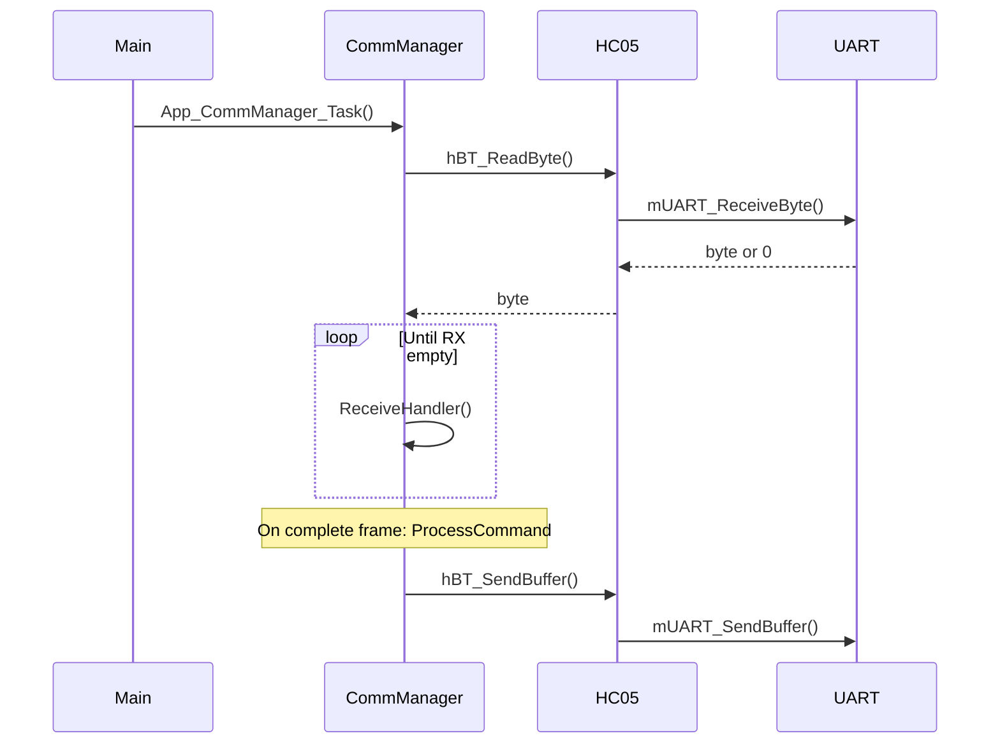
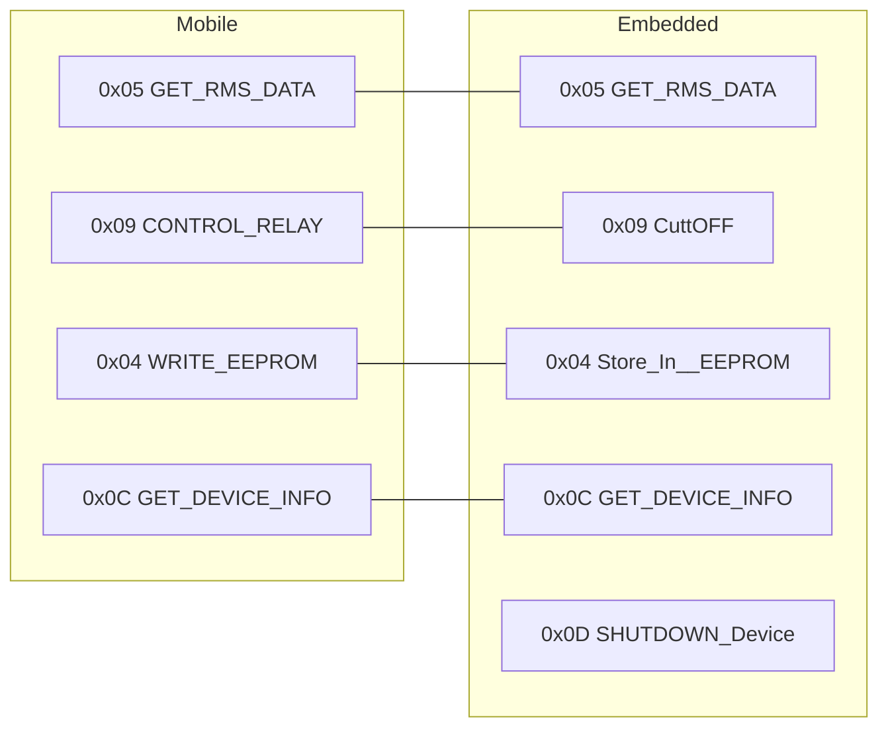

# Communication Stack: CommunicationManager, HC05, UART – Deep Analysis & Complete Fix Guide

**Document Version:** 2.0  
**Language:** English  
**Scope:** `App/CommunicationManager`, `Hal/HC05`, `Mcal/UART`, integration with `main.c` and Timer0.  
**Purpose:** Detailed root-cause analysis, protocol alignment, and production-ready fixes so any developer can implement corrections correctly.  
**References:** `MOBILE_APP_COMM_PROTOCOL.md`, `COMM_PROTOCOL_TEST_CASES.md`, `Embedded_EEPROM_Communication_Analysis_Report.md`.

---

## Table of Contents

1. [Executive Summary & Severity Matrix](#1-executive-summary--severity-matrix)
2. [Protocol Reference (Byte-Level)](#2-protocol-reference-byte-level)
3. [Deep Analysis by Module](#3-deep-analysis-by-module)
4. [Root Cause & Impact per Issue](#4-root-cause--impact-per-issue)
5. [Complete Fix Implementation](#5-complete-fix-implementation)
6. [Edge Cases & Robustness](#6-edge-cases--robustness)
7. [Diagrams](#7-diagrams)
8. [Verification & Test Mapping](#8-verification--test-mapping)
9. [Troubleshooting](#9-troubleshooting)

---

## 1. Executive Summary & Severity Matrix

### 1.1 Summary

The embedded communication stack (CommunicationManager → HC05 → UART) does **not** conform to the mobile app’s binary framed protocol. As a result:

- The app cannot parse GET_RMS_DATA (embedded sends ASCII; app expects 10-byte binary).
- GET_DEVICE_INFO is missing and command ID 0x0C is used for SHUTDOWN instead.
- CONTROL_RELAY and WRITE_EEPROM (reset energy) are not implemented as specified.
- Frame parsing has a wrong completion condition and no protection against oversized LEN.

Fixing these requires changes in **App_CommManager.h**, **App_CommManager.c**, and optionally **Config.h**; HC05 and UART are used correctly and do not need logic changes.

### 1.2 Severity Matrix

| ID | Issue | Severity | Protocol Ref | File(s) |
|----|--------|----------|--------------|---------|
| P1 | GET_RMS_DATA response: ASCII 35 B instead of 10 B binary | **Critical** | §4.1 MOBILE_APP_COMM_PROTOCOL | App_CommManager.c |
| P2 | Command 0x0C: embedded SHUTDOWN vs mobile GET_DEVICE_INFO | **Critical** | §3.1, §4.4 | App_CommManager.h, .c |
| P3 | GET_DEVICE_INFO (0x0C) not implemented | **Critical** | §4.4 | App_CommManager.c |
| P4 | CONTROL_RELAY (0x09): payload not parsed, relay not driven | **High** | §4.2 | App_CommManager.c |
| P5 | WRITE_EEPROM (0x04): reset energy not handled | **High** | §4.3 | App_CommManager.c |
| P6 | ReceiveHandler: frame completion `Rx_Index >= FrameLen` wrong; no LEN cap | **High** | §2.1 | App_CommManager.c |
| P7 | SendFrame: rejects `data==NULL` or `len==0`; cannot send ACK-only frame | **Medium** | §2.1 | App_CommManager.c |
| P8 | stringtoNumber() used for binary payloads (SetOverLoad_*) | **Medium** | §2 – binary, not ASCII | App_CommManager.c |
| P9 | HC05_Module / Timer0_Module Disable in Config | **Medium** | – | Config.h |
| P10 | GET_RMS_DATA uses System Controller state not updated by main | **High** | – | main.c / App_CommManager.c |

---

## 2. Protocol Reference (Byte-Level)

Source: **MOBILE_APP_COMM_PROTOCOL.md**.

### 2.1 Frame Format

```text
[HEADER][LEN][CMD][PAYLOAD...]
  1 B    1 B  1 B   LEN B
```

- **HEADER** = `0xAA`.
- **LEN** = number of payload bytes only (0–255).
- **CMD** = command ID.
- **PAYLOAD** = exactly LEN bytes.

Total frame length = **3 + LEN** bytes. Mobile waits for `3 + LEN` bytes before processing.

### 2.2 Endianness & Scaling (Mobile Decode)

- All multi-byte values: **big-endian** (MSB first).
- GET_RMS_DATA response (10 bytes):
  - `voltage = ((b0<<8)|b1) / 10.0`   → embedded sends `(uint16_t)(V * 10)`.
  - `current = ((b2<<8)|b3) / 100.0` → embedded sends `(uint16_t)(I * 100)`.
  - `power   = ((b4<<8)|b5) / 10.0`   → embedded sends `(uint16_t)(P * 10)`.
  - `energy  = ((b6<<24)|(b7<<16)|(b8<<8)|b9) / 100.0` → embedded sends `(uint32_t)(Energy * 100)` (e.g. Wh×100).

### 2.3 Commands Required by Mobile

| CMD | Name | Request (App→Emb) | Response (Emb→App) |
|-----|------|-------------------|--------------------|
| 0x05 | GET_RMS_DATA | `AA 00 05` | `AA 0A 05` + 10 bytes (V,I,P,E) |
| 0x0C | GET_DEVICE_INFO | `AA 00 0C` | `AA 07 0C` + 7 bytes (DeviceID, Vmax, Imax, Pmax) |
| 0x09 | CONTROL_RELAY | `AA 02 09 [INDEX][STATE]` | None |
| 0x04 | WRITE_EEPROM (reset energy) | `AA 04 04 00 00 00 00` | None |

---

## 3. Deep Analysis by Module

### 3.1 CommunicationManager – File-Level

**Files:** `App/CommunicationManager/App_CommManager.h`, `App_CommManager.c`.

#### 3.1.1 App_CommManager_Init() (lines 88–96)

- **Current:** Calls `hBT_Init()`, `mTIMER0_Init()`, `mTIMER0_StartDelay(Scheduling_Time, App_CommManager_Task)`.
- **Issue:** If `Timer0_Module` or `HC05_Module` is Disable in Config, one of these may be no-op or excluded; Comm task then runs only from main loop (main does call `App_CommManager_Task()` every 100 ms). No bug in Init logic itself; dependency on Config.

#### 3.1.2 App_CommManager_Task() (lines 104–120)

- **Current:** Reads bytes from `hBT_ReadByte()` into circular buffer `Datareceived`, then calls `App_CommManager_ReceiveHandler()`.
- **Analysis:** Correct. UART RX is interrupt-driven; Task drains the UART buffer into CommManager buffer and runs the parser. No change needed.

#### 3.1.3 App_CommManager_SendFrame() (lines 128–151)

- **Current:**
  - Builds `[0xAA][len][Command][data[0..len-1]]`.
  - **If `data == NULL` or `len == 0`:** returns without sending.
- **Issues:**
  - Protocol allows LEN=0 (e.g. ACK frame). Rejecting `len==0` prevents sending valid frames with no payload.
  - For GET_RMS_DATA we always have payload (10 bytes); the critical fix is building the correct 10-byte payload elsewhere, not SendFrame’s signature.

#### 3.1.4 App_CommManager_ReceiveHandler() (lines 159–223)

- **Current state machine:** WaitTheHeader → WaitLen → Wait_data_With_command. On each byte, stores in `LocalFrameBuffer[Rx_Index++]` and in Wait_data_With_command checks `if (Rx_Index >= FrameLen)` then calls ProcessCommand.
- **Bug 1 – Completion condition:** Protocol: total bytes = 3 + LEN. So we need **Rx_Index >= 3 + FrameLen**. Current code uses **Rx_Index >= FrameLen**. For LEN=0 we have Rx_Index = 3 after reading CMD; 3 >= 0 is true → correct by accident. For LEN=2 we need 5 bytes; when Rx_Index becomes 5, 5 >= 2 is true → correct. So for small LEN the bug is **conceptual** (wrong formula); for **large LEN** (e.g. LEN=100) we would need 103 bytes but would treat “frame complete” after 100 bytes → **wrong** and could mis-parse.
- **Bug 2 – Overflow:** `LocalFrameBuffer[Max_Buffer_size]` with Max_Buffer_size=64. If LEN=255, we need 3+255=258 bytes → buffer overflow. **Must cap or reject** LEN (e.g. require LEN <= Max_Buffer_size - 3).

#### 3.1.5 App_CommManager_ProcessCommand() (lines 230–281)

- **frame** = `&LocalFrameBuffer[1]`, so:
  - `frame[0]` = LEN, `frame[1]` = CMD, `frame[2..]` = payload (LEN bytes).

| Case | Current behaviour | Protocol / required behaviour |
|------|-------------------|------------------------------|
| GET_RMS_DATA (0x05) | Sends `App_SystemController_GetState().Data` (ASCII, 35 B). | Send 10 B binary (V,I,P,E) from ME, scaled and big-endian. |
| Get_Logged_DATA (0x06) | Uses `stringtoNumber(frame)` (wrong for binary) and sends "Done". | TBD in protocol; keep or fix when spec is defined. |
| Update_EEPROM (0x08) | Updates logger and sends text. | Not in mobile table as required; optional. |
| CuttOFF (0x09) | Sends CuttoFF_Message; no relay control. | Parse frame[2]=RELAY_INDEX, frame[3]=STATE; call hRelay_On/Off. |
| Store_In__EEPROM (0x04) | **Missing.** | On `AA 04 04 00 00 00 00`: reset energy, save EEPROM. |
| GET_DEVICE_INFO (0x0C) | **Missing;** 0x0C used for SHUTDOWN_Device. | Add GET_DEVICE_INFO; send 7 B (DeviceID, Vmax, Imax, Pmax). |
| SHUTDOWN_Device (0x0C) | Handles power-down. | Move to 0x0D so 0x0C = GET_DEVICE_INFO. |
| SetOverLoad_* (0x0A, 0x0B) | `stringtoNumber(frame)` → wrong for binary payload. | If app sends binary, parse 16-bit big-endian from payload. |

#### 3.1.6 stringtoNumber() (lines 65–76)

- **Current:** `sum = sum*10 + Frame[i+2]` over `i = 0..Frame[0]-3`. Assumes payload is ASCII digits. Protocol is **binary**; payload bytes are not ASCII. So for any command that sends binary values (e.g. limits), this function is **wrong**. SetOverLoad_* currently use it; if those commands are ever used with binary payloads, parsing must be changed to binary (e.g. big-endian uint16 from frame[2], frame[3]).

#### 3.1.7 Command IDs (App_CommManager.h lines 76–91)

- **Current:** SHUTDOWN_Device = 0x0C, ShowModeState = 0x0D. Mobile: 0x0C = GET_DEVICE_INFO. So 0x0C must be GET_DEVICE_INFO on embedded; SHUTDOWN must move (e.g. 0x0D).

### 3.2 HC05 – File-Level

**File:** `Hal/HC05/HC05_Program.c`.

- **hBT_Init():** Calls mUART_Init(BT_Config), UART_Tx_Init(), UART_Rx_Init(). Correct.
- **hBT_ReadByte / hBT_SendBuffer:** Forward to UART. Correct.
- **Config:** HC05_Config.h defines BT_BAUDRATE (e.g. 9600). UART is 8N1. No logic bug; only ensure HC05_Module is Enable when using Bluetooth.

### 3.3 UART – File-Level

**Files:** `Mcal/UART/UART_Init.c`, `UART_Rx.c`, `UART_Tx.c`.

- **mUART_Init():** Sets baud (from F_CPU and Config->BaudRate), 8N1, enables RXEN/TXEN. Does **not** enable RXCIE here; that is done in **UART_Rx_Init()**.
- **UART_Rx_Init():** Initializes RX circular buffer (size UART_RX_BUFFER_SIZE = 64), sets **RXCIE** (receive interrupt). So bytes are stored in buffer by ISR.
- **mUART_ReceiveByte():** Returns one byte from buffer if not empty. Used by HC05 → CommManager Task. Correct.
- **ISR __vector_13:** Reads UDR, puts byte in UART_RxBuffer. Correct.

No protocol or framing bugs in UART; only dependency on UART_Module == Enable.

### 3.4 main.c – Integration

- **Init:** ME_Init(), App_EnergyLogger_Init(), PM_Init(), DM_Init(), App_CommManager_Init(). **Does not** call App_SystemController_Init().
- **Loop:** ME_Update(), PM_Update(), DM_*, App_EnergyLogger_*, App_CommManager_Task(), _delay_ms(100).
- **Impact:** GET_RMS_DATA uses `App_SystemController_GetState().Data`. System Controller is never initialized or updated by main, so that buffer is stale/empty. Even if it were updated, it is ASCII; protocol requires 10-byte binary. **Fix:** Build GET_RMS_DATA response inside ProcessCommand from **ME_GetVoltageRMS(), ME_GetCurrentRMS(), ME_GetActivePower(), ME_GetEnergy()** (and optionally g_SystemData for persistent energy), not from System Controller.

### 3.5 Timer0

- CommManager registers `App_CommManager_Task` with mTIMER0_StartDelay(Scheduling_Time, 5). If Timer0_Module is Enable, the task runs periodically from ISR; if Disable, it runs only from main (every 100 ms). Both are valid; enabling Timer0 gives more frequent RX polling.

---

## 4. Root Cause & Impact per Issue

| ID | Root cause | Impact | Fix strategy |
|----|------------|--------|--------------|
| P1 | Response built from System Controller ASCII buffer; protocol expects 10 B binary with specific scaling. | App cannot decode RMS; dashboard stays empty/wrong. | In ProcessCommand(GET_RMS_DATA), build 10-byte payload from ME_* and scaling; SendFrame(payload, 0x05, 10). |
| P2 | Embedded enum assigns 0x0C to SHUTDOWN; mobile assigns 0x0C to GET_DEVICE_INFO. | Same ID, different semantics; device info never works. | Define GET_DEVICE_INFO = 0x0C, SHUTDOWN_Device = 0x0D (and adjust ShowModeState if needed). |
| P3 | No case for 0x0C as “device info” in ProcessCommand. | App sends AA 00 0C; embedded does not respond with 7 bytes. | Add case GET_DEVICE_INFO; build 7 B from g_SystemData; SendFrame(..., 7). |
| P4 | CuttOFF case only sends text; does not read payload or call relay HAL. | Relay does not turn ON/OFF from app. | Parse frame[2]=RELAY_INDEX, frame[3]=STATE; validate index; call hRelay_On/Off. |
| P5 | No case for Store_In__EEPROM (0x04). | Reset energy from app has no effect. | Add case; if payload is four zero bytes, ME_ResetEnergy(), g_SystemData.EnergyCounter=0, SystemData_SaveToEEPROM(). |
| P6 | Completion uses Rx_Index >= FrameLen; protocol requires 3+LEN bytes; no cap on LEN. | Wrong parse for large LEN; possible buffer overflow. | Use Rx_Index >= 3 + FrameLen; reject or cap FrameLen (e.g. FrameLen > Max_Buffer_size-3 → reset state). |
| P7 | SendFrame returns when data==NULL or len==0. | Cannot send ACK-only frame (0xAA 00 CMD). | Allow len==0: send only Header+LEN+CMD (3 bytes). |
| P8 | stringtoNumber treats payload as ASCII. | Wrong values for any binary payload (e.g. limits). | For SetOverLoad_* use binary parse (e.g. (frame[2]<<8)|frame[3]) or leave as-is if commands are unused. |
| P9 | Config disables HC05 and Timer0. | BT path or Timer0 task may be excluded. | Enable HC05_Module and Timer0_Module when using Bluetooth and Timer0 scheduling. |
| P10 | GET_RMS_DATA uses System Controller state; main never updates it. | Data is stale/wrong even before format fix. | Remove dependency: build response from ME_* (and g_SystemData for energy if desired). |

---

## 5. Complete Fix Implementation

### 5.1 App_CommManager.h – Command IDs

**Replace the enum (lines 76–91) with:**

```c
enum
{
        Calibrate_Sensors               = 0x02,
        Read_From_EEPROM                = 0x03,
        Store_In__EEPROM                = 0x04,
        GET_RMS_DATA                    = 0x05,
        Get_Logged_DATA                 = 0x06,
        Notification_To_User            = 0x07,
        Update_EEPROM                   = 0x08,
        CuttOFF                         = 0x09,
        SetOverLoad_Current_Limit       = 0x0A,
        SetOverLoad_Voltage_Limit       = 0x0B,
        GET_DEVICE_INFO                 = 0x0C,   /* mobile: device limits/info; MUST respond with 7 bytes */
        SHUTDOWN_Device                 = 0x0D,   /* moved from 0x0C to align with mobile */
        ShowModeState                   = 0x0E
};
```

Update any switch/case that uses `SHUTDOWN_Device` to the new value 0x0D (no code change if using the enum name).

---

### 5.2 App_CommManager.c – Includes

**Add at top (after existing includes):**

```c
#include "../MeasurementEngine/MeasurementEngine_Interface.h"
#include "../../Common/SystemDataManager/SystemDataManager.h"
#include "../../Hal/RelayControl/RELAY_Interface.h"
#include "../../Hal/RelayControl/RELAY_Config.h"
```

---

### 5.3 App_CommManager.c – SendFrame (allow len==0)

**Replace SendFrame (lines 128–151) with:**

```c
void App_CommManager_SendFrame(uint8_t *data, uint8_t Command, uint16_t len)
{
    uint8_t Frame_Setting[Max_Buffer_size];
    Frame_Setting[0] = FRAME_HEADER;
    Frame_Setting[1] = (uint8_t)len;
    Frame_Setting[2] = Command;

    if (len > 0 && data != Null)
    {
        uint16_t i = 0;
        for (; i < len && i < Max_Buffer_size - 3; i++)
            Frame_Setting[i + 3] = data[i];
        len = i;
    }
    else
    {
        len = 0;
    }

    hBT_SendBuffer(Frame_Setting, 3 + len);
}
```

This sends at least Header+LEN+CMD (3 bytes); if len>0 and data!=Null, appends payload up to buffer limit.

---

### 5.4 App_CommManager.c – ReceiveHandler (completion + overflow)

**Replace the block inside Wait_data_With_command (lines 198–218) with:**

```c
        case Wait_data_With_command:
            LocalFrameBuffer[Rx_Index] = value;
            Rx_Index++;

            /* Protocol: total bytes = 3 + FrameLen (LEN = payload only). Reject oversized LEN. */
            if (FrameLen > Max_Buffer_size - 3)
            {
                CurrentState = WaitTheHeader;
                Rx_Index = 0;
                Ishandling = 0;
                return;
            }
            if (Rx_Index >= 3 + FrameLen)
            {
                SystemController.Event = EVENT_COMM_RECEIVED_CMD;
                SystemController.CmdID = LocalFrameBuffer[2];
                App_CommManager_ProcessCommand(&LocalFrameBuffer[1]);
                CurrentState = WaitTheHeader;
                Rx_Index = 0;
                Ishandling = 0;
                return;
            }
            break;
```

---

### 5.5 App_CommManager.c – ProcessCommand (full replacement)

**Replace the entire switch in ProcessCommand (lines 241–279) with the following.** Ensure `frame` = &LocalFrameBuffer[1], so frame[0]=LEN, frame[1]=CMD, frame[2..]=payload.

```c
    switch (frame[1])
    {
    case GET_RMS_DATA:
        {
            float v = ME_GetVoltageRMS();
            float i = ME_GetCurrentRMS();
            float p = ME_GetActivePower();
            float e_j = ME_GetEnergy();
            /* Mobile expects energy/100; commonly Wh. So send (Wh * 100) as uint32 big-endian. */
            uint32_t e_wh_x100 = (uint32_t)((e_j / 3600.0f) * 100.0f);

            uint16_t v16 = (uint16_t)(v * 10.0f);
            uint16_t i16 = (uint16_t)(i * 100.0f);
            uint16_t p16 = (uint16_t)(p * 10.0f);

            uint8_t rmsPayload[10];
            rmsPayload[0] = (uint8_t)(v16 >> 8);
            rmsPayload[1] = (uint8_t)(v16 & 0xFF);
            rmsPayload[2] = (uint8_t)(i16 >> 8);
            rmsPayload[3] = (uint8_t)(i16 & 0xFF);
            rmsPayload[4] = (uint8_t)(p16 >> 8);
            rmsPayload[5] = (uint8_t)(p16 & 0xFF);
            rmsPayload[6] = (uint8_t)(e_wh_x100 >> 24);
            rmsPayload[7] = (uint8_t)(e_wh_x100 >> 16);
            rmsPayload[8] = (uint8_t)(e_wh_x100 >> 8);
            rmsPayload[9] = (uint8_t)(e_wh_x100 & 0xFF);
            App_CommManager_SendFrame(rmsPayload, GET_RMS_DATA, 10);
        }
        break;

    case GET_DEVICE_INFO:
        {
            uint8_t devPayload[7];
            devPayload[0] = g_SystemData.DeviceID;
            uint16_t vmax = g_SystemData.OvervoltageLimit;
            uint16_t imax = g_SystemData.OvercurrentLimit;
            uint16_t pmax = (uint16_t)(vmax * imax);
            devPayload[1] = (uint8_t)(vmax >> 8);
            devPayload[2] = (uint8_t)(vmax & 0xFF);
            devPayload[3] = (uint8_t)(imax >> 8);
            devPayload[4] = (uint8_t)(imax & 0xFF);
            devPayload[5] = (uint8_t)(pmax >> 8);
            devPayload[6] = (uint8_t)(pmax & 0xFF);
            App_CommManager_SendFrame(devPayload, GET_DEVICE_INFO, 7);
        }
        break;

    case CuttOFF:
        {
            uint8_t relayIndex = frame[2];
            uint8_t state      = frame[3];
            if (relayIndex < hRELAY_NUM)
            {
                if (state)
                    hRelay_On(relayIndex);
                else
                    hRelay_Off(relayIndex);
            }
        }
        break;

    case Store_In__EEPROM:
        if (frame[0] >= 4 && frame[2] == 0 && frame[3] == 0 && frame[4] == 0 && frame[5] == 0)
        {
            ME_ResetEnergy();
            g_SystemData.EnergyCounter = 0;
            SystemData_SaveToEEPROM();
        }
        break;

    case Get_Logged_DATA:
        App_EnergyLogger_ReadLog(stringtoNumber(frame), &Status.RamData);
        App_CommManager_SendFrame((uint8_t*)"Done", SystemController.CmdID, 4);
        break;

    case Update_EEPROM:
        App_EnergyLogger_Update(&Status.RamData);
        App_CommManager_SendFrame((uint8_t*)UpdatedEEPROM_Message, SystemController.CmdID, UpdatedEEPROM_Message_length);
        break;

    case Calibrate_Sensors:
        break;

    case SetOverLoad_Current_Limit:
        if (frame[0] >= 2)
            g_SystemData.OvercurrentLimit = (uint16_t)((frame[2] << 8) | frame[3]);
        break;

    case SetOverLoad_Voltage_Limit:
        if (frame[0] >= 2)
            g_SystemData.OvervoltageLimit = (uint16_t)((frame[2] << 8) | frame[3]);
        break;

    case SHUTDOWN_Device:
        SystemController.Event = EVENT_Power_Down;
        App_SystemController_HandleEvent(SystemController);
        break;

    default:
        break;
    }
```

**Notes:**

- GET_RMS_DATA: Uses ME_* and sends 10 bytes with scaling and big-endian as per protocol. Energy sent as Wh×100 (from Joules ÷ 3600 × 100). If your product uses kWh×100 or another convention, adjust `e_wh_x100` accordingly.
- GET_DEVICE_INFO: Uses DeviceID, OvervoltageLimit, OvercurrentLimit, and a derived Pmax; adjust if you have separate max power in SystemData.
- SetOverLoad_*: Parsed as 16-bit big-endian from payload (frame[2], frame[3]) with length check; change only if you define a different format.

---

### 5.6 Config.h (optional)

To use Bluetooth and Timer0-based Comm task:

```c
#define Timer0_Module               Enable
#define HC05_Module                 Enable
```

---

## 6. Edge Cases & Robustness

### 6.1 Invalid or Oversized LEN

- **Risk:** LEN=255 → 3+255 bytes → overflow of LocalFrameBuffer[64].
- **Fix:** In Wait_data_With_command, if `FrameLen > Max_Buffer_size - 3`, reset state machine and discard (already in §5.4).

### 6.2 Unknown CMD

- **Current:** `default:` in switch does nothing. **OK:** ignore unknown commands without crash (CP-TC-601).

### 6.3 CONTROL_RELAY invalid index

- **Fix:** Check `relayIndex < hRELAY_NUM` before calling hRelay_On/Off (included in §5.5).

### 6.4 WRITE_EEPROM payload check

- **Fix:** Verify LEN>=4 and payload bytes are zero before reset (included in §5.5).

### 6.5 Null / short payload for SetOverLoad_*

- **Fix:** Check `frame[0] >= 2` before reading frame[2], frame[3] (included in §5.5).

---

## 7. Diagrams

### 7.1 Frame Layout (Protocol)



### 7.2 GET_RMS_DATA: Current vs Fixed



### 7.3 Receive State Machine (Corrected)



### 7.4 Stack: main → CommManager → HC05 → UART



### 7.5 Command ID Mapping (After Fix)



---

## 8. Verification & Test Mapping

| Test case (COMM_PROTOCOL_TEST_CASES.md) | What to verify | Owner |
|----------------------------------------|----------------|-------|
| CP-TC-101 | Embedded receives `AA 00 05` every ~1 s | App / link |
| CP-TC-102 | Embedded responds with `AA 0A 05` + 10 bytes; app shows V,I,P,E correctly | Embedded (packing) |
| CP-TC-201 | Embedded receives `AA 00 0C` | App |
| CP-TC-202 | Embedded responds with `AA 07 0C` + 7 bytes; app shows device info | Embedded |
| CP-TC-301, CP-TC-302 | App sends `AA 02 09 [idx][state]`; relay turns ON/OFF | Embedded |
| CP-TC-401 | App sends `AA 04 04 00 00 00 00`; energy counter resets | Embedded |
| CP-TC-601 | Unknown CMD (e.g. 0x03, 0x06): embedded does not crash | Embedded |

Checklist after applying fixes:

- [ ] App_CommManager.h: GET_DEVICE_INFO=0x0C, SHUTDOWN_Device=0x0D.
- [ ] App_CommManager.c: GET_RMS_DATA builds 10 B from ME_*, big-endian, scaling; SendFrame(..., 10).
- [ ] App_CommManager.c: GET_DEVICE_INFO case; 7 B; SendFrame(..., 7).
- [ ] App_CommManager.c: CuttOFF parses frame[2],[3]; hRelay_On/Off; index < hRELAY_NUM.
- [ ] App_CommManager.c: Store_In__EEPROM case; reset energy + EEPROM.
- [ ] App_CommManager.c: ReceiveHandler uses Rx_Index >= 3+FrameLen; FrameLen capped.
- [ ] App_CommManager.c: SendFrame allows len==0 and sends 3+len bytes.
- [ ] Config.h: HC05_Module and Timer0_Module Enable if required.
- [ ] Build and run CP-TC-102, CP-TC-202, CP-TC-301/302, CP-TC-401.

---

## 9. Troubleshooting

| Symptom | Likely cause | Action |
|---------|--------------|--------|
| App never shows V,I,P,E | GET_RMS_DATA response wrong format or not sent | Ensure 10-byte binary response; check UART TX. |
| App shows nonsense numbers | Wrong scaling or endianness | Verify V×10, I×100, P×10, E×100 and big-endian. |
| Device info never updates | GET_DEVICE_INFO not implemented or wrong CMD | Implement 0x0C with 7 bytes; ensure 0x0C not used for SHUTDOWN. |
| Relay does not change from app | Payload not parsed or HAL not called | Parse frame[2], frame[3]; call hRelay_On/Off; check relay init. |
| Reset energy has no effect | Store_In__EEPROM not handled | Add case 0x04; reset ME and g_SystemData; save EEPROM. |
| Parser lock-up or crash | Oversized LEN or wrong completion | Cap FrameLen; use Rx_Index >= 3+FrameLen. |
| No bytes received on embedded | UART/HC05 not enabled or wrong baud | Enable UART_Module, HC05_Module; verify baud (e.g. 9600). |
| Comm task never runs | Timer0 disabled and main not calling Task | Enable Timer0 or ensure main calls App_CommManager_Task() every loop. |

---

**End of document.** This guide provides a detailed analysis and complete, copy-paste-ready fixes for the communication stack so that embedded behaviour matches the mobile protocol and passes the relevant test cases.
