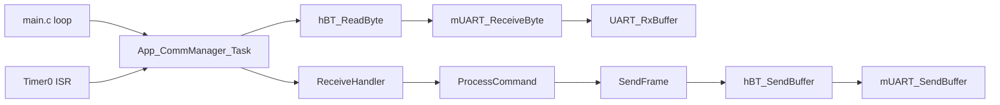
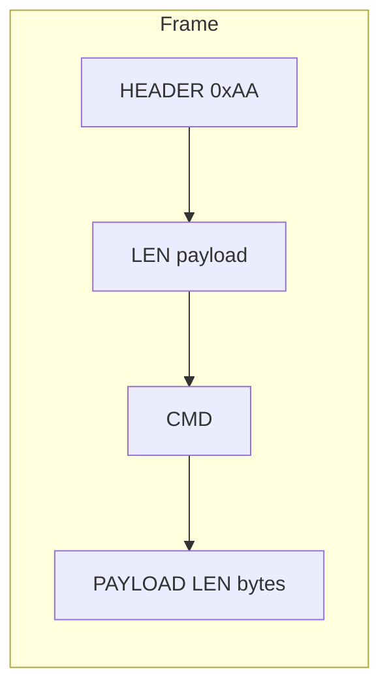
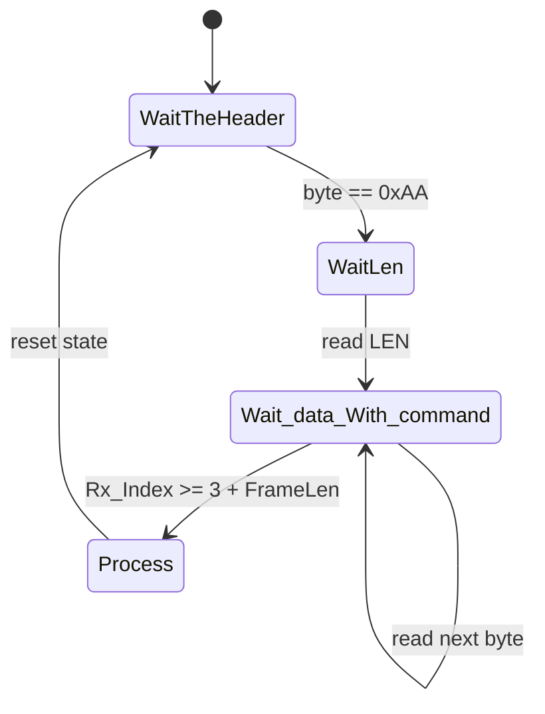
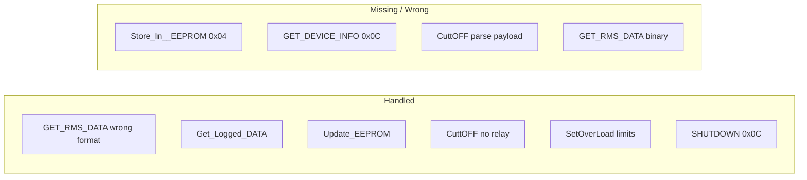

# Communication Manager, HC05, UART, Timer0 & main.c – Fix Guide (README)

**Language:** English  
**Scope:** CommunicationManager, HC05, UART, Timer0, main.c  
**Purpose:** Complete, direct fix steps with exact code (error vs correction) and diagrams so that anyone reading can solve the communication problems.  
**Constraint:** This document describes the fixes; it does **not** modify the original source files. Apply changes manually or via patch.

**Reference:** Mobile protocol is defined in `Firmware/Mobile/Src/doc/MOBILE_APP_COMM_PROTOCOL.md`. The embedded side must match frame format and payload definitions for the mobile app to work.

---

## Table of Contents

1. [Module Analysis Summary](#1-module-analysis-summary)
2. [Problems Overview](#2-problems-overview)
3. [Fix Steps (Checklist)](#3-fix-steps-checklist)
4. [Code: Error vs Correction](#4-code-error-vs-correction)
5. [Diagrams](#5-diagrams)
6. [Verification Checklist](#6-verification-checklist)
7. [References](#7-references)

---

## 1. Module Analysis Summary

### 1.1 Communication Manager (`App/CommunicationManager`)

| Item | Status |
|------|--------|
| **Frame format** | `[HEADER 0xAA][LEN][CMD][PAYLOAD...]` – matches mobile. |
| **Init** | Calls `hBT_Init()` and `mTIMER0_Init()` + `mTIMER0_StartDelay(5, App_CommManager_Task)`. |
| **Task** | `App_CommManager_Task()` reads bytes from HC05 (UART) into a circular buffer and runs `ReceiveHandler()`. |
| **Issues** | GET_RMS_DATA sends ASCII string (35 B) instead of 10 B binary; frame completion uses `Rx_Index >= FrameLen` instead of `3 + FrameLen`; Store_In__EEPROM (0x04), GET_DEVICE_INFO (0x0C), CuttOFF (0x09) payload handling missing or wrong; Command ID 0x0C = SHUTDOWN on embedded but GET_DEVICE_INFO on mobile. |

### 1.2 HC05 (`Hal/HC05`)

| Item | Status |
|------|--------|
| **Role** | Wrapper over UART: `hBT_Init()` → `mUART_Init()`, `hBT_ReadByte`/`hBT_SendBuffer` → UART Rx/Tx. |
| **Config** | `BT_BAUDRATE` 9600 in HC05_Config.h. |
| **Issues** | None in HC05 code itself. If `HC05_Module` is **Disable** in Config.h, ensure it is **Enable** when using Bluetooth; otherwise the HAL may be excluded from build (if guarded elsewhere). |

### 1.3 UART (`Mcal/UART`)

| Item | Status |
|------|--------|
| **Init** | Sets baud rate, 8N1; does **not** enable RX interrupt in UART_Init.c (RX interrupt is enabled in UART_Rx_Init()). |
| **Rx** | Circular buffer; `UART_Rx_Init()` enables RXCIE; ISR `__vector_13` puts byte in buffer. |
| **Tx** | Circular buffer; `mUART_SendByte` enables UDRIE; ISR `__vector_14` sends next byte. |
| **Issues** | None critical for protocol. Baud rate must match HC05 (9600). |

### 1.4 Timer0 (`Mcal/Timer0`)

| Item | Status |
|------|--------|
| **Role** | CTC mode; `mTIMER0_StartDelay(delay_ms, callback)` schedules a callback to run every `delay_ms`. `mTIMER0_TickHandler()` is called from ISR `__vector_10` and decrements counters, then calls callback when counter reaches 0. |
| **Comm Manager** | Schedules `App_CommManager_Task` every **5 ms** (Scheduling_Time). |
| **Issues** | If `Timer0_Module` is **Disable** in Config.h, Timer0 code may still be linked (no `#if` in TIMER0_Program.c); ensure Timer0 is **Enable** if you rely on timer-driven Comm Task. **main.c also calls `App_CommManager_Task()`** every loop (after 100 ms delay), so comm can work without Timer0. |

### 1.5 main.c

| Item | Status |
|------|--------|
| **Init** | ME_Init, App_EnergyLogger_Init, PM_Init, DM_Init, **App_CommManager_Init**. Does **not** call **App_SystemController_Init()**. |
| **Loop** | ME_Update, PM_Update, DM, EnergyLogger, **App_CommManager_Task()**, then _delay_ms(100). |
| **Issues** | System Controller is never initialized or updated, so `App_SystemController_GetState().Data` (used for GET_RMS_DATA response) is never filled by `Update_Rms_Data()` and is wrong/stale. GET_RMS_DATA must use **binary 10-byte** payload from current V, I, P, E (e.g. from ME) and must not depend on System Controller’s ASCII string. |

---

## 2. Problems Overview

| # | Problem | Where | Effect |
|---|---------|--------|--------|
| 1 | **GET_RMS_DATA** response is ASCII string (35 B) | App_CommManager.c ProcessCommand | Mobile expects **10 bytes binary** (V, I, P, E with scaling). App shows garbage or nothing. |
| 2 | **Frame completion** check wrong | App_CommManager.c ReceiveHandler | `Rx_Index >= FrameLen`; should be `Rx_Index >= 3 + FrameLen` (LEN = payload length). Can mis-parse or drop frames. |
| 3 | **Store_In__EEPROM (0x04)** not handled | App_CommManager.c ProcessCommand | Mobile sends reset energy; embedded does nothing. |
| 4 | **CuttOFF (0x09)** payload not parsed, relay not driven | App_CommManager.c ProcessCommand | Mobile sends RELAY_INDEX, STATE; embedded only sends text back, does not call relay HAL. |
| 5 | **GET_DEVICE_INFO (0x0C)** missing; 0x0C = SHUTDOWN on embedded | App_CommManager.h / ProcessCommand | Mobile uses 0x0C for device info (7-byte response). Embedded uses 0x0C for shutdown. Conflict; device info never sent. |
| 6 | **main.c** does not call App_SystemController_Init | main.c | Status.Data and Status.RamData never updated by System Controller; GET_RMS_DATA uses wrong/stale data even if format were fixed. |
| 7 | **SendFrame** returns without sending when `data == NULL` or `len == 0` | App_CommManager.c | For GET_RMS_DATA we send payload so OK; for consistency, allow sending header+len+cmd only when len=0 if protocol needs it. |
| 8 | **Config.h**: Timer0_Module, HC05_Module Disable | Common/Config.h | If modules are excluded by `#if`, UART/Timer0 may not run; enable them when using Bluetooth and timer-based Comm Task. |

---

## 3. Fix Steps (Checklist)

Apply in an order that respects dependencies.

| Step | File | Action |
|------|------|--------|
| 1 | **Config.h** | Set `Timer0_Module` and `HC05_Module` to **Enable** if you use Bluetooth and timer-based Comm Task. |
| 2 | **App_CommManager.c** | In **ReceiveHandler**, change frame completion condition from `Rx_Index >= FrameLen` to `Rx_Index >= 3 + FrameLen`. |
| 3 | **App_CommManager.c** | In **ProcessCommand** for **GET_RMS_DATA**: build a **10-byte binary** payload (V×10, I×100, P×10, E×100, big-endian) from ME (or single source of truth), then call `App_CommManager_SendFrame(payload, GET_RMS_DATA, 10)`. Do **not** use `App_SystemController_GetState().Data`. |
| 4 | **App_CommManager.c** | In **ProcessCommand**, add case **Store_In__EEPROM (0x04)**: reset energy (e.g. ME_ResetEnergy(), update g_SystemData.EnergyCounter, SystemData_SaveToEEPROM). Do not send response (mobile does not expect one). |
| 5 | **App_CommManager.c** | In **ProcessCommand** for **CuttOFF (0x09)**: read RELAY_INDEX from `frame[2]`, STATE from `frame[3]`; call `hRelay_On(relayId)` or `hRelay_Off(relayId)` according to STATE. Optionally remove or keep the text response (mobile does not require it). |
| 6 | **App_CommManager.h** | Resolve **0x0C** conflict: e.g. rename **SHUTDOWN_Device** to another ID (e.g. 0x0D or 0x0E) and use **0x0C** for GET_DEVICE_INFO. |
| 7 | **App_CommManager.c** | In **ProcessCommand**, add case **GET_DEVICE_INFO (0x0C)**: build 7-byte payload (DeviceID, Vmax, Imax, Pmax; 16-bit big-endian); call `App_CommManager_SendFrame(payload, 0x0C, 7)`. |
| 8 | **main.c** (optional) | If you want System Controller to own state: call **App_SystemController_Init()** after other inits and ensure its update runs (e.g. from a timer or from main loop). Then GET_RMS_DATA can still use ME for binary payload (recommended); do not use Status.Data for GET_RMS_DATA. |

---

## 4. Code: Error vs Correction

### 4.1 Frame Completion Condition (ReceiveHandler)

**File:** `Firmware/Embedded/Src/App/CommunicationManager/App_CommManager.c`  
**Function:** `App_CommManager_ReceiveHandler`

**Wrong (current):**

```c
        case Wait_data_With_command:
            LocalFrameBuffer[Rx_Index] = value;
            Rx_Index++;
            /* ... */
            if (Rx_Index >= FrameLen)
            {
                /* Frame Complete */
```

**Why it’s wrong:** Protocol defines **LEN** as **payload length only**. So after Header (1) + LEN (1) we have 2 bytes. We still need **CMD (1)** + **Payload (FrameLen bytes)** = 1 + FrameLen bytes. Total bytes in buffer = 1 + 2 + (1 + FrameLen) = **3 + FrameLen**. So we must check **Rx_Index >= 3 + FrameLen**. With `Rx_Index >= FrameLen`, for FrameLen = 0 we have Rx_Index = 3 after reading CMD, and 3 >= 0 is true (correct by accident). For FrameLen = 2 we need 5 bytes; when Rx_Index = 5, 5 >= 2 is true (correct). For FrameLen = 10 we need 13 bytes; when Rx_Index = 13, 13 >= 10 is true (correct). So the condition happens to work for small LEN but is semantically wrong and can break for other cases; the correct condition is explicit.

**Correct (fix):**

```c
        case Wait_data_With_command:
            LocalFrameBuffer[Rx_Index] = value;
            Rx_Index++;
            /* Full frame: Header(1) + LEN(1) + CMD(1) + Payload(FrameLen) = 3 + FrameLen bytes */
            if (Rx_Index >= 3 + FrameLen)
            {
                /* Frame Complete */
```

---

### 4.2 GET_RMS_DATA: Send Binary 10-Byte Payload (Not ASCII)

**File:** `Firmware/Embedded/Src/App/CommunicationManager/App_CommManager.c`  
**Function:** `App_CommManager_ProcessCommand`

**Wrong (current):**

```c
    case GET_RMS_DATA:
        App_CommManager_SendFrame((uint8_t*)App_SystemController_GetState().Data, GET_RMS_DATA, RMS_Message_length);
        break;
```

**Why it’s wrong:** `App_SystemController_GetState().Data` is an **ASCII string** (e.g. "I= 00.00V= 00.00P= 00.00E= 00.00"), length 35. The mobile app expects **10 bytes binary**: V (uint16, V×10), I (uint16, I×100), P (uint16, P×10), E (uint32, E×100), **big-endian**. So the formats do not match. Also, main.c does not call App_SystemController_Init(), so Status.Data is never updated.

**Correct (fix):**

You need a **10-byte buffer** built from current V, I, P, E (from **Measurement Engine** or your single source of truth). Energy can be in Wh or Joules converted to the scale the app expects (e.g. Energy×100 as in protocol).

Add a helper (e.g. in App_CommManager.c or a shared module) and use it in ProcessCommand:

```c
/* Build 10-byte GET_RMS_DATA payload: V(2) I(2) P(2) E(4) big-endian, scaled as per mobile protocol */
#define RMS_PAYLOAD_LEN 10
static void BuildRmsPayload(uint8_t *out)
{
    float V = ME_GetVoltageRMS();
    float I = ME_GetCurrentRMS();
    float P = ME_GetActivePower();
    float E_J = ME_GetEnergy();
    /* Mobile expects energy / 100.0 → send E_Wh * 100 or (E_J/3600)*100 etc. as uint32 */
    uint32_t E_scaled = (uint32_t)(E_J / 36.0f);  /* E_J/3600*100 = Wh*100 */

    uint16_t v16 = (uint16_t)(V * 10.0f);
    uint16_t i16 = (uint16_t)(I * 100.0f);
    uint16_t p16 = (uint16_t)(P * 10.0f);

    out[0] = (uint8_t)(v16 >> 8);
    out[1] = (uint8_t)(v16 & 0xFF);
    out[2] = (uint8_t)(i16 >> 8);
    out[3] = (uint8_t)(i16 & 0xFF);
    out[4] = (uint8_t)(p16 >> 8);
    out[5] = (uint8_t)(p16 & 0xFF);
    out[6] = (uint8_t)(E_scaled >> 24);
    out[7] = (uint8_t)(E_scaled >> 16);
    out[8] = (uint8_t)(E_scaled >> 8);
    out[9] = (uint8_t)(E_scaled & 0xFF);
}
```

Then in ProcessCommand:

```c
    case GET_RMS_DATA:
        {
            uint8_t rmsPayload[RMS_PAYLOAD_LEN];
            BuildRmsPayload(rmsPayload);
            App_CommManager_SendFrame(rmsPayload, GET_RMS_DATA, RMS_PAYLOAD_LEN);
        }
        break;
```

**Include:** MeasurementEngine_Interface.h (for ME_GetVoltageRMS, etc.). Ensure ME is updated (e.g. ME_Update() in main/PM) before this runs.

---

### 4.3 Store_In__EEPROM (0x04) – Reset Energy

**File:** `Firmware/Embedded/Src/App/CommunicationManager/App_CommManager.c`  
**Function:** `App_CommManager_ProcessCommand`

**Wrong (current):** There is **no** `case Store_In__EEPROM:` in the switch. So when the mobile sends `AA 04 04 00 00 00 00`, the embedded does nothing.

**Correct (fix):** Add a case and call ME reset + EEPROM persist (and optionally SystemData):

```c
    case Store_In__EEPROM:
        /* Mobile sends AA 04 04 00 00 00 00 to reset energy counter */
        ME_ResetEnergy();
        g_SystemData.EnergyCounter = 0;
        SystemData_SaveToEEPROM();
        /* No response required by mobile */
        break;
```

**Include:** MeasurementEngine_Interface.h (ME_ResetEnergy), SystemDataManager.h (g_SystemData, SystemData_SaveToEEPROM).

---

### 4.4 CuttOFF (0x09) – Parse Payload and Drive Relay

**File:** `Firmware/Embedded/Src/App/CommunicationManager/App_CommManager.c`  
**Function:** `App_CommManager_ProcessCommand`

**Wrong (current):**

```c
    case CuttOFF:
        App_CommManager_SendFrame((uint8_t*)CuttoFF_Message, SystemController.CmdID, Cutoff_message_length);
        break;
```

**Why it’s wrong:** Mobile sends payload **RELAY_INDEX (byte 0)**, **STATE (byte 1)**. Embedded ignores payload and does not call relay HAL. `frame` is `&LocalFrameBuffer[1]`, so **frame[2]** = first payload byte = RELAY_INDEX, **frame[3]** = second payload byte = STATE.

**Correct (fix):**

```c
    case CuttOFF:
        {
            uint8_t relayIndex = frame[2];
            uint8_t state      = frame[3];
            if (state == 0x01)
                hRelay_On(relayIndex);
            else
                hRelay_Off(relayIndex);
        }
        /* Optional: send ack; mobile does not require it */
        break;
```

**Include:** RELAY_Interface.h (hRelay_On, hRelay_Off). Ensure relayIndex is within valid range (e.g. 0..3) if your HAL expects it.

---

### 4.5 GET_DEVICE_INFO (0x0C) – Resolve ID Conflict and Implement

**File:** `Firmware/Embedded/Src/App/CommunicationManager/App_CommManager.h`

**Wrong (current):** Command IDs:

```c
        SHUTDOWN_Device                 = 0x0C,
        ShowModeState                   = 0x0D
```

Mobile uses **0x0C** for **GET_DEVICE_INFO** (request device limits/info). Embedded uses **0x0C** for SHUTDOWN_Device. Same ID, different command.

**Correct (fix):** Use 0x0C for GET_DEVICE_INFO and move SHUTDOWN to another ID, e.g.:

```c
        CuttOFF                         = 0x09,
        SetOverLoad_Current_Limit       = 0x0A,
        SetOverLoad_Voltage_Limit       = 0x0B,
        GET_DEVICE_INFO                 = 0x0C,   /* was SHUTDOWN_Device */
        SHUTDOWN_Device                = 0x0E,   /* moved to 0x0E */
        ShowModeState                   = 0x0D
```

Then in **ProcessCommand**, add a case for **GET_DEVICE_INFO (0x0C)** and **keep** the existing SHUTDOWN_Device case but with the new value 0x0E:

```c
    case GET_DEVICE_INFO:
        {
            uint8_t devInfo[7];
            devInfo[0] = g_SystemData.DeviceID;
            uint16_t vmax = g_SystemData.OvervoltageLimit;
            uint16_t imax = g_SystemData.OvercurrentLimit;
            uint16_t pmax = (uint16_t)(vmax * imax); /* or your Pmax definition */
            devInfo[1] = (uint8_t)(vmax >> 8);
            devInfo[2] = (uint8_t)(vmax & 0xFF);
            devInfo[3] = (uint8_t)(imax >> 8);
            devInfo[4] = (uint8_t)(imax & 0xFF);
            devInfo[5] = (uint8_t)(pmax >> 8);
            devInfo[6] = (uint8_t)(pmax & 0xFF);
            App_CommManager_SendFrame(devInfo, GET_DEVICE_INFO, 7);
        }
        break;
```

Update any code that compared CmdID to 0x0C for shutdown to use the new SHUTDOWN_Device value (0x0E).

---

### 4.6 main.c – Optional: Call System Controller Init

**File:** `Firmware/Embedded/Src/main.c`

**Wrong (current):** Init sequence does not call **App_SystemController_Init()**. So System Controller state (Status.Data, Status.RamData) is never initialized or updated by its update loop.

**Correct (fix):** If you want System Controller to run (e.g. for display/mode/events), add after other inits:

```c
    /* System Controller: optional – coordinates state/mode; GET_RMS_DATA should use ME binary payload, not Status.Data */
    App_SystemController_Init();
```

**Note:** Even after this, **GET_RMS_DATA** response must be the **10-byte binary** payload built from ME (see §4.2), not `App_SystemController_GetState().Data`.

---

### 4.7 Config.h – Enable Timer0 and HC05 When Using Bluetooth

**File:** `Firmware/Embedded/Src/Common/Config.h`

**Wrong (current):**

```c
#define Timer0_Module               Disable /**< Enable or Disable the Timer0 Module */
#define HC05_Module           Disable /**< Enable or Disable the HC05 Module */
```

**Why it matters:** If your build uses these macros to exclude Timer0 or HC05, then (1) App_CommManager_Task will not run from the timer, (2) hBT_Init / UART may not be linked or inited. main.c **does** call App_CommManager_Task() in the loop, so comm can work without Timer0; but HC05/UART must be present for Bluetooth.

**Correct (fix):** When you need Bluetooth and (optionally) timer-driven Comm Task:

```c
#define Timer0_Module               Enable  /**< Enable for Comm Manager periodic task */
#define HC05_Module                 Enable  /**< Enable for Bluetooth over UART */
```

---

### 4.8 SendFrame: Allow Sending Frame with Zero Payload (Optional)

**File:** `Firmware/Embedded/Src/App/CommunicationManager/App_CommManager.c`  
**Function:** `App_CommManager_SendFrame`

**Wrong (current):**

```c
    if (data != Null && len != 0)
    {
        /* ... copy payload, send ... */
        hBT_SendBuffer(Frame_Setting, Total_length);
    }
    else
    {
        return;
    }
```

**Why it matters:** If you ever need to send a frame with **LEN = 0** (header + len + cmd only), the current code returns without sending. For GET_RMS_DATA you always send 10 bytes, so this is optional.

**Correct (fix):** Send the 3-byte header (Header, LEN, CMD) always; copy payload only when `data != NULL` and `len > 0`:

```c
    if (data != Null && len > 0)
    {
        int i = 0;
        for (; i < len; i++)
            Frame_Setting[i + 3] = data[i];
    }
    uint16_t Total_length = 3 + len;
    hBT_SendBuffer(Frame_Setting, Total_length);
```

So when `len == 0`, you send the 3-byte frame (Header, LEN, CMD) without payload. When `len > 0` and `data != NULL`, you copy payload and send. Do not call with `data == NULL` and `len > 0` (would be a bug).

---

## 5. Diagrams

### 5.1 Data Flow: main → Comm Manager → HC05 → UART



### 5.2 Frame Format (Protocol)



### 5.3 Receive State Machine (Correct Completion)



### 5.4 GET_RMS_DATA Response (Wrong vs Right)

```mermaid
flowchart TB
  subgraph Wrong["Wrong (current)"]
    W1[App_SystemController_GetState().Data]
    W2[ASCII string 35 bytes]
    W3[Mobile expects 10 B binary]
  end
  subgraph Right["Correct (fix)"]
    R1[ME_GetVoltageRMS etc.]
    R2[Build 10 B: V*10 I*100 P*10 E*100]
    R3[SendFrame payload 10]
  end
  W1 --> W2 --> W3
  R1 --> R2 --> R3
```

### 5.5 Command Handling (ProcessCommand) – What Exists vs What’s Missing



---

## 6. Verification Checklist

After applying fixes:

- [ ] **Config.h:** Timer0_Module and HC05_Module are **Enable** when using Bluetooth and timer-based Comm Task.
- [ ] **ReceiveHandler:** Frame completion uses **Rx_Index >= 3 + FrameLen**.
- [ ] **GET_RMS_DATA:** Response is **10 bytes** binary (V, I, P, E scaled, big-endian), built from ME (or single source); not ASCII from Status.Data.
- [ ] **Store_In__EEPROM (0x04):** Case added; resets energy (ME + g_SystemData) and saves to EEPROM.
- [ ] **CuttOFF (0x09):** RELAY_INDEX and STATE read from frame[2], frame[3]; hRelay_On/Off called.
- [ ] **GET_DEVICE_INFO (0x0C):** Command ID 0x0C used for device info; 7-byte response sent; SHUTDOWN moved to another ID (e.g. 0x0E).
- [ ] **main.c:** Optionally calls App_SystemController_Init() if you use System Controller; GET_RMS_DATA still uses ME binary payload.
- [ ] **Build:** Compiles; ME, SystemDataManager, Relay HAL included where used.
- [ ] **Runtime:** With mobile app, GET_RMS_DATA shows correct V/I/P/E; relay control works; device info request returns 7 bytes; reset energy works.

---

## 7. References

| Document / Path | Description |
|-----------------|-------------|
| MOBILE_APP_COMM_PROTOCOL.md | Mobile ↔ Embedded frame format, command IDs, payload definitions (GET_RMS_DATA, CONTROL_RELAY, WRITE_EEPROM, GET_DEVICE_INFO). |
| App_CommManager.c / .h | Communication Manager implementation and API. |
| main.c | Init order and main loop (ME, PM, DM, Logger, Comm Task). |
| Config.h | Timer0_Module, HC05_Module, UART_Module. |
| HC05_Program.c, UART_*.c | HAL and MCAL for Bluetooth (UART). |
| TIMER0_Program.c | Timer0 and scheduled task (App_CommManager_Task). |

---

**End of README.** Apply the corrections above in the order that fits your build (Config first, then frame fix, then command handling) so that communication with the mobile app works and anyone reading this can fix the problems step by step.
