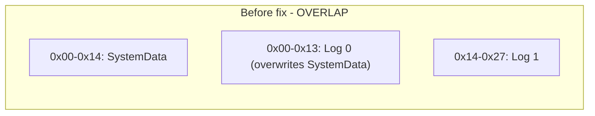
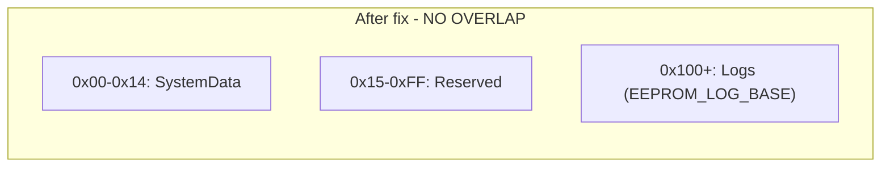
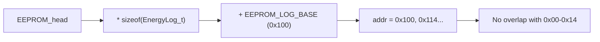
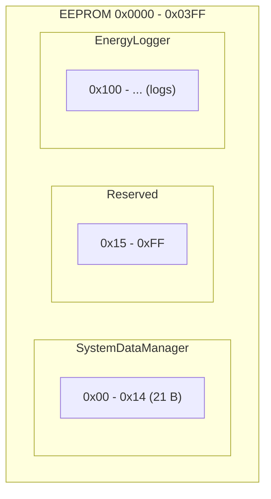
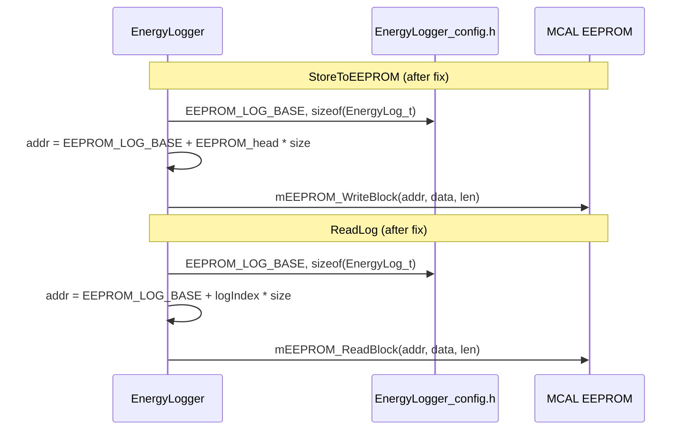

# EEPROM, EnergyLogger & SystemDataManager – Fix Guide (README)

**Language:** English  
**Scope:** EnergyLogger, SystemDataManager, MCAL EEPROM  
**Purpose:** Complete, direct fix steps with exact code (error vs correction) and diagrams.  
**Constraint:** This document describes the fixes; it does **not** modify the original source files. Apply the changes manually or via patch.

---

## Table of Contents

1. [Module Analysis Summary](#1-module-analysis-summary)
2. [EEPROM Layout – Problem and Target](#2-eeprom-layout--problem-and-target)
3. [Fix Steps](#3-fix-steps)
4. [Code: Error vs Correction](#4-code-error-vs-correction)
5. [Diagrams](#5-diagrams)
6. [Verification Checklist](#6-verification-checklist)

---

## 1. Module Analysis Summary

### 1.1 MCAL EEPROM (`Mcal/EEPROM`)

| Item | Status |
|------|--------|
| **EEPROM_Program.c** | Byte/block read/write correct; bounds check uses `AVR_EEPROM_MAXAddress` (1023). |
| **EEPROM_Private.h** | Defines `Device_ID_Add` (0x00) and scattered addresses; used as base by SystemDataManager. |
| **Issue** | No single documented “memory map” shared by both SystemData and EnergyLogger; layout is split and EnergyLogger ignores `EEPROM_LOG_BASE`. |

**Conclusion:** EEPROM driver is fine. Fixes are in **how** EnergyLogger and SystemDataManager use addresses (see below).

---

### 1.2 SystemDataManager (`Common/SystemDataManager`)

| Item | Status |
|------|--------|
| **Base address** | Uses `Device_ID_Add` (0x00) from `EEPROM_Private.h` (via `EEPROM_Interface.h`). |
| **Size** | Writes `sizeof(SystemData_t)` = **21 bytes** → uses **0x00–0x14**. |
| **Issue** | None in isolation; conflict appears when EnergyLogger also writes from 0x00. |

**Conclusion:** No code change needed in SystemDataManager. Ensure EnergyLogger does **not** use 0x00–0x14 (use `EEPROM_LOG_BASE`).

---

### 1.3 EnergyLogger (`App/EnergyLogger`)

| Item | Status |
|------|--------|
| **EEPROM_LOG_BASE** | Defined in `EnergyLogger_config.h` as `0x100` but **never used** in `EnergyLogger_Program.c`. |
| **StoreToEEPROM** | Uses `addr = EEPROM_head * sizeof(EnergyLog_t)` → first log at **0x00** → **overlaps SystemData**. |
| **ReadLog** | Same: `addr = logIndex * sizeof(EnergyLog_t)` → reads from 0x00. |

**Conclusion:** Both **StoreToEEPROM** and **ReadLog** must add `EEPROM_LOG_BASE` to the computed address so logs live above SystemData (e.g. from 0x100).

---

## 2. EEPROM Layout – Problem and Target

### 2.1 Current (Wrong) Layout

- **SystemDataManager:** 0x00–0x14 (21 bytes).
- **EnergyLogger:** 0x00, 0x14 (20), 0x28, … (assuming `EnergyLog_t` = 20 bytes).
- **Result:** Logs overwrite SystemData; SystemData overwrites first log(s).

### 2.2 Target (Correct) Layout

- **SystemDataManager:** 0x00–0x14 (unchanged).
- **Reserved:** 0x15–0xFF (optional; avoids touching SystemData).
- **EnergyLogger:** from **0x100** (`EEPROM_LOG_BASE`): log 0 at 0x100, log 1 at 0x114, etc.

So the **only code changes** are in **EnergyLogger**: use `EEPROM_LOG_BASE` when computing EEPROM addresses.

---

## 3. Fix Steps

Apply these in order.

| Step | File | Action |
|------|------|--------|
| 1 | `App/EnergyLogger/EnergyLogger_Program.c` | In **App_EnergyLogger_StoreToEEPROM**, set log address to `EEPROM_LOG_BASE + EEPROM_head * sizeof(EnergyLog_t)`. |
| 2 | `App/EnergyLogger/EnergyLogger_Program.c` | In **App_EnergyLogger_ReadLog**, set read address to `EEPROM_LOG_BASE + logIndex * sizeof(EnergyLog_t)`. |
| 3 | (Optional) | Add a short comment in `EnergyLogger_config.h` that `EEPROM_LOG_BASE` must be ≥ size of SystemData region (e.g. 0x15) and is used by StoreToEEPROM/ReadLog. |

No changes are required in:

- `Mcal/EEPROM/*` (driver stays as-is).
- `Common/SystemDataManager/*` (base 0x00 and size 21 bytes are correct).

---

## 4. Code: Error vs Correction

### 4.1 EnergyLogger – StoreToEEPROM

**Location:** `Firmware/Embedded/Src/App/EnergyLogger/EnergyLogger_Program.c`  
**Function:** `App_EnergyLogger_StoreToEEPROM`

**Wrong (current):**

```c
    EnergyLog_t logToeeprom = EnergyRAM.buffer[EnergyRAM.front];

    /* Calculate byte address in EEPROM */
    uint16_t addr = EEPROM_head * sizeof(EnergyLog_t); 
    mEEPROM_WriteBlock(addr, (uint8_t*)&logToeeprom, sizeof(EnergyLog_t));
```

**Why it’s wrong:** `addr` starts at 0, so the first log is written at 0x00 and overwrites SystemData (0x00–0x14).

**Correct (fix):**

```c
    EnergyLog_t logToeeprom = EnergyRAM.buffer[EnergyRAM.front];

    /* Calculate byte address in EEPROM: logs start at EEPROM_LOG_BASE to avoid overlap with SystemData (0x00-0x14) */
    uint16_t addr = EEPROM_LOG_BASE + (uint16_t)(EEPROM_head * sizeof(EnergyLog_t));
    mEEPROM_WriteBlock(addr, (uint8_t*)&logToeeprom, sizeof(EnergyLog_t));
```

**Change in one line:**  
Replace  
`uint16_t addr = EEPROM_head * sizeof(EnergyLog_t);`  
with  
`uint16_t addr = EEPROM_LOG_BASE + (uint16_t)(EEPROM_head * sizeof(EnergyLog_t));`  
and ensure `EnergyLogger_config.h` is included (it already is via `EnergyLogger_Interface.h`).

---

### 4.2 EnergyLogger – ReadLog

**Location:** `Firmware/Embedded/Src/App/EnergyLogger/EnergyLogger_Program.c`  
**Function:** `App_EnergyLogger_ReadLog`

**Wrong (current):**

```c
    if (logIndex >= EEPROM_count)
    {
        return; 
    }

    uint16_t addr = logIndex * sizeof(EnergyLog_t);
    mEEPROM_ReadBlock(addr, (uint8_t*)readLog, sizeof(EnergyLog_t));
```

**Why it’s wrong:** Reads from 0x00 for `logIndex == 0`, which is SystemData, not a log.

**Correct (fix):**

```c
    if (logIndex >= EEPROM_count)
    {
        return; 
    }

    uint16_t addr = EEPROM_LOG_BASE + (uint16_t)(logIndex * sizeof(EnergyLog_t));
    mEEPROM_ReadBlock(addr, (uint8_t*)readLog, sizeof(EnergyLog_t));
```

**Change in one line:**  
Replace  
`uint16_t addr = logIndex * sizeof(EnergyLog_t);`  
with  
`uint16_t addr = EEPROM_LOG_BASE + (uint16_t)(logIndex * sizeof(EnergyLog_t));`

---

### 4.3 Optional: EEPROM Bounds in EnergyLogger

If you want to avoid writing/reading beyond the chip’s EEPROM size (e.g. 1024 bytes), you can add a bounds check **without changing the original EEPROM driver**. For example, in **StoreToEEPROM**, after computing `addr`:

**Optional addition (after computing `addr`):**

```c
    uint16_t addr = EEPROM_LOG_BASE + (uint16_t)(EEPROM_head * sizeof(EnergyLog_t));
    if (addr + sizeof(EnergyLog_t) - 1 > AVR_EEPROM_MAXAddress)
    {
        /* Wrap or skip; e.g. reset EEPROM_head to 0 for circular use */
        return;
    }
```

This requires including the EEPROM private/interface header that defines `AVR_EEPROM_MAXAddress` (already available via `EEPROM_Interface.h`). This is **optional**; the **mandatory** fix is using `EEPROM_LOG_BASE` in both StoreToEEPROM and ReadLog.

---

## 5. Diagrams

### 5.1 EEPROM Layout – Before vs After

**Before (wrong):**



**After (correct):**



### 5.2 EEPROM Address Calculation – EnergyLogger

**Wrong:**


**Correct:**



### 5.3 Module Ownership of EEPROM Regions



### 5.4 Data Flow – Store and Read



---

## 6. Verification Checklist

After applying the fixes:

- [ ] **EnergyLogger_Program.c**  
  - [ ] In `App_EnergyLogger_StoreToEEPROM`, `addr` is computed as `EEPROM_LOG_BASE + (uint16_t)(EEPROM_head * sizeof(EnergyLog_t))`.  
  - [ ] In `App_EnergyLogger_ReadLog`, `addr` is computed as `EEPROM_LOG_BASE + (uint16_t)(logIndex * sizeof(EnergyLog_t))`.

- [ ] **No changes** to `SystemDataManager.c/h` or `Mcal/EEPROM/*` for this fix.

- [ ] **Build**  
  - [ ] Project compiles without errors.  
  - [ ] `EEPROM_LOG_BASE` (0x100) is defined in `EnergyLogger_config.h` and is ≥ 0x15.

- [ ] **Runtime (if possible)**  
  - [ ] After boot, SystemData (e.g. magic, device ID) is still valid after EnergyLogger has written logs.  
  - [ ] Reading back a stored log (e.g. index 0) returns data from the log region (0x100+), not from SystemData.

---

## Summary Table

| Module | File | Change |
|--------|------|--------|
| EnergyLogger | `EnergyLogger_Program.c` | In **StoreToEEPROM**: use `addr = EEPROM_LOG_BASE + (uint16_t)(EEPROM_head * sizeof(EnergyLog_t))`. |
| EnergyLogger | `EnergyLogger_Program.c` | In **ReadLog**: use `addr = EEPROM_LOG_BASE + (uint16_t)(logIndex * sizeof(EnergyLog_t))`. |
| SystemDataManager | — | No change. |
| MCAL EEPROM | — | No change. |

This README gives the **full, direct fix** for the EEPROM layout conflict between EnergyLogger and SystemDataManager, with exact **error vs correction** code and diagrams, without modifying the original code inside the repo until you apply the steps above.
