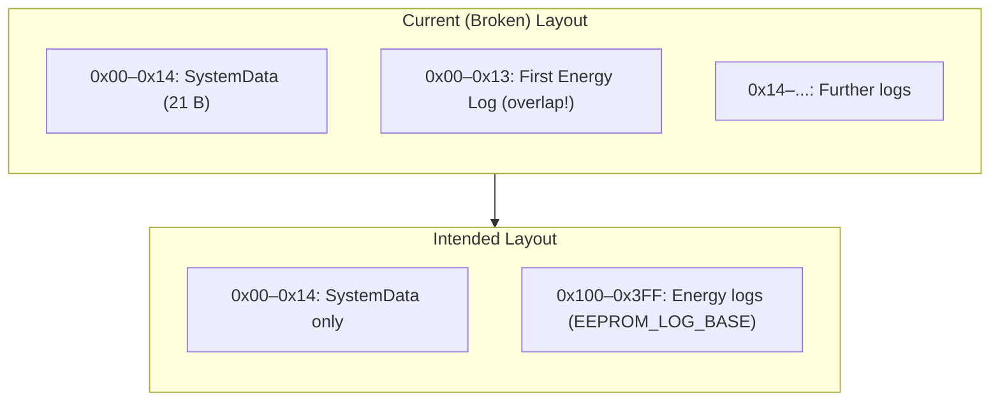
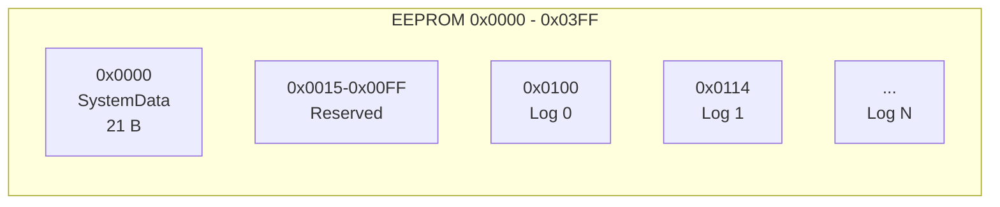
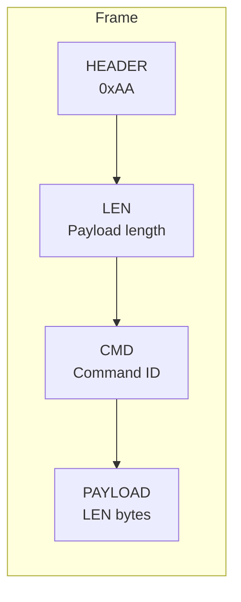
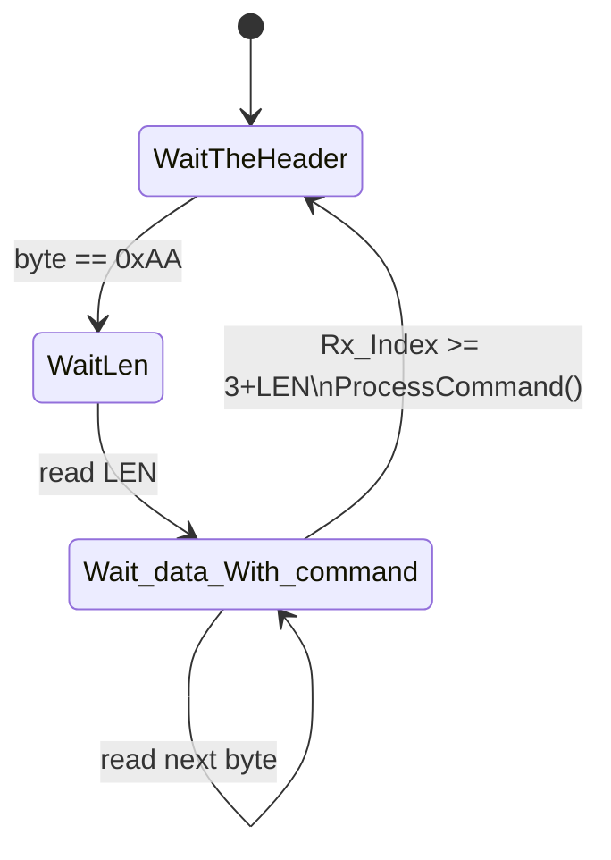
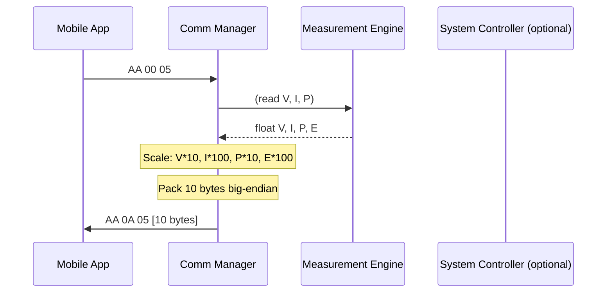

# Embedded Firmware – EEPROM & Communication Analysis Report

<div align="center">


**Smart Energy Management System**

**Comprehensive Analysis: EEPROM, Communication, and Missing Items**

*Document Version 1.0 | January 2026 | Gestell Company*

</div>

---

## Table of Contents

1. [Executive Summary](#1-executive-summary)
2. [EEPROM Analysis](#2-eeprom-analysis)
3. [Communication Analysis](#3-communication-analysis)
4. [Integration & Main Flow Issues](#4-integration--main-flow-issues)
5. [Missing Items Checklist](#5-missing-items-checklist)
6. [Diagrams](#6-diagrams)
7. [Recommendations for ESP Migration](#7-recommendations-for-esp-migration)
8. [References](#8-references)

---

## 1. Executive Summary

This report provides a **full analysis** of the Embedded firmware under `Firmware/Embedded/Src`, with emphasis on **EEPROM usage** and **Communication (App Comm Manager, framing, mobile protocol)**. It identifies **gaps and bugs** that prevent the project from working correctly from the embedded side, assuming future connectivity via **ESP** (Bluetooth is not in scope for the current version).

### Key Findings

| Area | Severity | Summary |
|------|----------|---------|
| **EEPROM layout** | **Critical** | SystemData and Energy Logger use overlapping EEPROM regions; Logger does not use `EEPROM_LOG_BASE`. |
| **Protocol vs mobile** | **Critical** | GET_RMS_DATA response is ASCII string; mobile expects **binary 10-byte** payload. Command ID **0x0C** is GET_DEVICE_INFO on mobile but SHUTDOWN on embedded. |
| **Main flow** | **Critical** | `main.c` does **not** call `App_SystemController_Init()`; System Controller state and RMS string are never updated for Comm Manager. |
| **Config** | **High** | `Timer0_Module` and `HC05_Module` are **Disabled** in `Config.h`; Comm Manager depends on both. |
| **Commands** | **High** | WRITE_EEPROM (0x04) reset energy, GET_DEVICE_INFO (0x0C), RELAY payload parsing, READ_EEPROM (0x03) not implemented or misaligned. |

---

## 2. EEPROM Analysis

### 2.1 Implemented Components

- **MCAL EEPROM** (`Mcal/EEPROM/`): Byte and block read/write; address range 0x0000–0x03FF (1024 bytes). Implementation is correct for the hardware.
- **SystemDataManager** (`Common/SystemDataManager/`): Holds `SystemData_t` (device ID, calibration, energy counter, limits, RMS shadow). Load/save use **single block** at base address `Device_ID_Add` (0x00).
- **EnergyLogger** (`App/EnergyLogger/`): RAM circular buffer + periodic flush to EEPROM. Uses **byte address** `EEPROM_head * sizeof(EnergyLog_t)` **without** adding `EEPROM_LOG_BASE`.

### 2.2 EEPROM Layout Conflict (Critical)

Two different layouts are in use:

1. **SystemDataManager**  
   - Writes `sizeof(SystemData_t)` bytes starting at **0x00** (from `EEPROM_Private.h`: `Device_ID_Add 0x00`).  
   - `SystemData_t` is 21 bytes → uses **0x00–0x14**.

2. **EnergyLogger**  
   - Uses `addr = EEPROM_head * sizeof(EnergyLog_t)` with **no base offset**.  
   - First log is at **0x00**, then 20, 40, … (assuming `EnergyLog_t` ~20 bytes).  
   - **EEPROM_LOG_BASE (0x100)** is defined in `EnergyLogger_config.h` but **never used** in `EnergyLogger_Program.c`.

Result: **Energy logs overwrite SystemData** (and vice versa). This is a critical bug.

### 2.3 EEPROM Memory Map (Current vs Intended)

The following diagram shows the **current** (broken) and **intended** layout.



**Recommended EEPROM map (aligned with Doc):**

| Start | Size | Content | Owner |
|-------|------|---------|--------|
| 0x0000 | 21 | SystemData_t (magic, ID, cal, energy, limits, checksum, RMS shadow) | SystemDataManager |
| 0x0015–0x00FF | — | Reserved / future config | — |
| 0x0100 | N × sizeof(EnergyLog_t) | Energy log entries | EnergyLogger (use EEPROM_LOG_BASE) |

### 2.4 Missing / Incomplete EEPROM Behaviour

- **Energy reset (WRITE_EEPROM 0x04)**: Mobile sends `AA 04 04 00 00 00 00` to reset energy. Embedded has no handler for command **0x04** (Store_In__EEPROM) that: sets internal energy to 0, calls `ME_ResetEnergy()` (or equivalent), and updates/persists `g_SystemData.EnergyCounter` and EEPROM.
- **EnergyLogger** does not use `EEPROM_LOG_BASE` when computing `addr` in `App_EnergyLogger_StoreToEEPROM()` and `App_EnergyLogger_ReadLog()`.
- **SystemDataManager** does not include `EEPROM_Private.h` directly; it relies on `EEPROM_Interface.h` including it. That works but creates a hidden dependency on a “private” symbol `Device_ID_Add` for the base address.

---

## 3. Communication Analysis

### 3.1 Frame Format (Embedded vs Mobile)

Both sides use the same structure in principle:

```text
[HEADER][LEN][CMD][PAYLOAD...]
  1 B    1 B  1 B   LEN B
```

- **HEADER** = 0xAA  
- **LEN** = payload length only  
- **CMD** = command id  
- **PAYLOAD** = LEN bytes  

Embedded `App_CommManager_SendFrame()` builds the frame correctly (Header, LEN, CMD, Payload). **ReceiveHandler** state machine (WaitTheHeader → WaitLen → Wait_data_With_command) is correct for this format; completion condition should be “received **3 + LEN** bytes” (i.e. Rx_Index >= 3 + FrameLen). Current code uses `Rx_Index >= FrameLen`; for typical small LEN values it can still fire after the correct number of bytes, but the condition is misleading and should be explicitly **Rx_Index >= 3 + FrameLen** for clarity and correctness for large LEN.

### 3.2 Command ID Mismatch (Critical)

Mobile app (see `MOBILE_APP_COMM_PROTOCOL.md`) and embedded use **different semantics** for the same IDs:

| CMD (hex) | Mobile (Protocol Doc) | Embedded (App_CommManager.h) | Issue |
|-----------|------------------------|------------------------------|--------|
| 0x03 | Read EEPROM | Read_From_EEPROM | Not implemented in ProcessCommand |
| 0x04 | Write EEPROM (reset energy) | Store_In__EEPROM | **Not handled** in ProcessCommand |
| 0x05 | GET_RMS_DATA | GET_RMS_DATA | Response format wrong (see below) |
| 0x06 | Get logged data | Get_Logged_DATA | Uses stringtoNumber(frame) and different semantics |
| 0x07 | Notification (Emb→App) | Notification_To_User | Not sent by embedded in a structured way |
| 0x08 | Update EEPROM | Update_EEPROM | Different from mobile usage |
| 0x09 | Control relay | CuttOFF | **Payload not parsed**; relay not driven by command |
| 0x0A | Protection safe | SetOverLoad_Current_Limit | Embedded uses for current limit only |
| 0x0B | Calibrate | (missing in enum) | Calibrate_Sensors = 0x02 in embedded |
| **0x0C** | **GET_DEVICE_INFO** | **SHUTDOWN_Device** | **Conflict:** same ID, different command |
| 0x0D | — | ShowModeState | Embedded-only |

So: **0x0C** must be resolved (e.g. reserve 0x0C for GET_DEVICE_INFO on both sides and use another ID for shutdown if needed).

### 3.3 GET_RMS_DATA (0x05) – Response Format Mismatch (Critical)

- **Mobile expects** (binary, big-endian):  
  - Voltage (uint16) = V×10  
  - Current (uint16) = I×100  
  - Power (uint16) = P×10  
  - Energy (uint32) = E×100  
  → **10 bytes** payload.

- **Embedded sends**:  
  `App_SystemController_GetState().Data` which is a **string** built by `Update_Rms_Data()` (e.g. `"I= 00.00V= 00.00P= 00.00E= 00.00"`), length **35** (`RMS_Message_length`).  
  So embedded sends **ASCII**, mobile expects **binary 10-byte**. They are **incompatible**.

To match the mobile app, the embedded side must:

- Build a **10-byte** payload: V, I, P, E with the scaling above (big-endian).
- Use **current** measurement source (ME or System Controller), not a stale or unused state (see also Section 4).

### 3.4 GET_DEVICE_INFO (0x0C) – Not Implemented

Mobile sends `AA 00 0C` and expects a **7-byte** payload:  
`[DEVICE_ID, Vmax(2), Imax(2), Pmax(2)]` (big-endian for 16-bit).  

Embedded has **no** case for 0x0C as “device info”; 0x0C is used as SHUTDOWN_Device. So GET_DEVICE_INFO is **missing** and must be implemented (and 0x0C reassigned as above).

### 3.5 CONTROL_RELAY (0x09) – Payload Ignored

Mobile sends payload: `[RELAY_INDEX, STATE]` (2 bytes).  

Embedded `ProcessCommand` for `CuttOFF` only sends a text message back (`CuttoFF_Message`); it does **not**:

- Parse RELAY_INDEX and STATE from the frame, or  
- Call `hRelay_On()` / `hRelay_Off()` (or equivalent).  

So relay is not controlled by the command.

### 3.6 WRITE_EEPROM (0x04) – Reset Energy Not Handled

Mobile uses **0x04** with payload `00 00 00 00` to reset the energy counter. Embedded has **no** `case Store_In__EEPROM` that:

- Resets internal energy (e.g. ME and/or EnergyLogger and/or `g_SystemData.EnergyCounter`).
- Persists to EEPROM.

So “reset energy” from the app does nothing on the embedded side.

### 3.7 SendFrame When Payload Is Empty

`App_CommManager_SendFrame()` returns without sending if `data == NULL` or `len == 0`. For commands that have **no payload** in the request but **do** have a response (e.g. GET_RMS_DATA with 10-byte payload), the **response** path does pass a non-null buffer and length, so this is only a problem for “response with zero payload”. For GET_RMS_DATA the fix is to send the 10-byte payload as above; for GET_DEVICE_INFO the response has 7 bytes. So the main fix is correct payload construction, not necessarily changing the “len==0” branch, but it is worth allowing sending a frame with LEN=0 (Header + LEN + CMD only) if the protocol ever requires it.

### 3.8 Transport Dependency (HC-05 / UART)

Communication Manager is tied to **HC05** (UART): `App_CommManager_Init()` calls `hBT_Init()`, and `App_CommManager_Task()` / `SendFrame` use `hBT_ReadByte` / `hBT_SendBuffer`. There is no abstraction for “transport” (e.g. UART vs ESP serial/Wi‑Fi). For migration to **ESP**, a transport abstraction (e.g. send/receive callbacks or a small HAL) will be needed so the same framing and command handling can run over ESP.

---

## 4. Integration & Main Flow Issues

### 4.1 main.c Does Not Use System Controller

- **main.c** initializes: ME, EnergyLogger, PM, DM, **App_CommManager** (and optionally Timer1 test). It **does not** call **`App_SystemController_Init()`**.
- The **System Controller** is the place that:
  - Calls `Update_Rms_Data()` (which fills `Status.Data` with the ASCII string),
  - Updates `Status.RamData` from ME in `App_SystemController_Update()`,
  - And is the one referenced by Comm Manager for GET_RMS_DATA.

Because `App_SystemController_Init()` and the controller’s update loop are never run:

- `Status.RamData` and `Status.Data` are never updated by the controller.
- GET_RMS_DATA response is either stale or empty, and in any case in the **wrong format** (string instead of 10-byte binary).

So even if the protocol were fixed, **main** must either:

- Use the System Controller as the single place for init and periodic update (and keep ME/PM/DM/Comm under it), or  
- Ensure the same data source and formatting used for GET_RMS_DATA are updated from **main** (and then Comm Manager should not depend on System Controller state for RMS).

### 4.2 Timer0 and HC05 Disabled in Config.h

- **Timer0_Module** is **Disable** in `Config.h`.  
  `App_CommManager_Init()` calls `mTIMER0_Init()` and `mTIMER0_StartDelay(Scheduling_Time, App_CommManager_Task)`. If Timer0 is not compiled or not started, the periodic **App_CommManager_Task()** (which pulls bytes from UART and runs the receive state machine) may never run, so communication will not work.

- **HC05_Module** is **Disable**.  
  The HC05 driver does not appear to be wrapped in `#if (HC05_Module == Enable)`; if it were, `hBT_Init()` / read/send would be stubs or no-ops. As written, enabling UART but disabling HC05 is a configuration inconsistency. For “we are not working on Bluetooth”, having HC05 disabled is consistent, but then Comm Manager has no active transport until ESP (or another UART path) is wired.

### 4.3 Double Initialization and Duplicate Logic

- **main.c** initializes ME, EnergyLogger, PM, DM, Comm Manager and then runs a loop that:  
  - Calls ME_Update(), PM_Update(), DM_ShowMeasurements(), App_EnergyLogger_Update(), App_EnergyLogger_Task(), App_CommManager_Task().  
- **System_Controller_Program.c** in `App_SystemController_Init()` also initializes DM, PM, ME, SystemData, Comm Manager, EnergyLogger and starts a **Timer0**-based delay for `App_SystemController_Update()`.  

So there are two possible “masters” of the same modules. If both main and System Controller are used as-is, some modules would be initialized twice and there would be two update paths (main loop vs Timer0 callback). The design should pick **one** entry point (e.g. main calls only System Controller init and then either a superloop that only calls `App_SystemController_Update()` and `App_CommManager_Task()`, or a scheduler that runs both).

### 4.4 Energy Units (Joules vs kWh)

- **ME_GetEnergy()** returns **Joules**.  
- Mobile and UI often use **kWh** (energy_kwh).  
- main.c converts: `E_kWh = E_Joules / 3600000.0f`.  
- System Controller / EnergyLogger use `energy_kwh`.  

For GET_RMS_DATA, the protocol doc says energy is sent as a value that the app divides by 100 (e.g. Wh or scaled kWh). The embedded side must send a value consistent with that (e.g. Wh×100 or kWh×100) and use a single definition (e.g. always work in Wh or kWh in one place) to avoid scaling bugs.

---

## 5. Missing Items Checklist

Use this list to track what is missing or broken from the embedded side.

### 5.1 EEPROM

- [ ] **Use EEPROM_LOG_BASE** in EnergyLogger when computing EEPROM address for logs (Store and Read).
- [ ] **Reserve 0x00–0x14** for SystemData only; keep logs at 0x100+ (or agreed range) to avoid overlap.
- [ ] **Handle WRITE_EEPROM (0x04)** for reset energy: clear runtime energy, update `g_SystemData.EnergyCounter`, persist to EEPROM, and optionally notify ME/Logger.
- [ ] (Optional) Document or enforce a single EEPROM memory map in one place (e.g. `EEPROM_Private.h` or a dedicated map header) and use it from both SystemDataManager and EnergyLogger.

### 5.2 Communication – Protocol Alignment

- [ ] **GET_RMS_DATA (0x05)**  
  - Respond with **10 bytes** binary: V×10, I×100, P×10, E×100 (big-endian).  
  - Use a single source of truth for V, I, P, E (ME or controller updated from ME).
- [ ] **GET_DEVICE_INFO (0x0C)**  
  - Implement response with **7 bytes**: DeviceID, Vmax, Imax, Pmax (big-endian).  
  - Reassign embedded **SHUTDOWN_Device** to another CMD (e.g. 0x0D or 0x0E) so 0x0C = GET_DEVICE_INFO on both sides.
- [ ] **CONTROL_RELAY (0x09)**  
  - Parse payload bytes 0 and 1 (RELAY_INDEX, STATE).  
  - Call HAL relay On/Off based on STATE; support at least one relay index.
- [ ] **Frame completion**  
  - In ReceiveHandler, use explicit condition **Rx_Index >= 3 + FrameLen** (and ensure no off-by-one).
- [ ] (Optional) **READ_EEPROM (0x03)** and **Update EEPROM (0x08)**  
  - Define payload/response format and implement if required by mobile/dashboard.

### 5.3 Integration & Config

- [ ] **Single entry point**  
  - Either main.c calls **App_SystemController_Init()** and a single update path (System Controller + Comm Manager task), or main.c owns all init and update and Comm Manager gets RMS data from a shared structure updated from main (not from System Controller).
- [ ] **Enable Timer0** (or the scheduler that runs `App_CommManager_Task`) when communication is required.
- [ ] **Transport**  
  - Keep HC05 disabled if not used; when moving to ESP, add a transport layer (e.g. UART/ESP send/receive) and keep the same framing and ProcessCommand in App Comm Manager.

### 5.4 Optional / Future

- [ ] **Notification (0x07)**  
  - When protection or fault occurs, send an unsolicited frame (0x07) with a small payload (e.g. event id) so the app can show alerts.
- [ ] **Checksum/CRC**  
  - Protocol doc says mobile does not use it; if added later, both sides must be updated.
- [ ] **Calibration (0x02/0x0B)**  
  - Align command IDs with mobile and implement calibration trigger and response if needed.

---

## 6. Diagrams

### 6.1 High-Level Software Architecture (Current)

```mermaid
flowchart TB
  subgraph Main["main.c (current)"]
    ME[Measurement Engine]
    EL[Energy Logger]
    PM[Protection Manager]
    DM[Display Manager]
    CM[Comm Manager]
    ME --> EL
    ME --> PM
    ME --> DM
    ME --> CM
  end

  subgraph Unused["Not used by main.c"]
    SC[System Controller]
  end

  CM -.->|"Expects GetState().Data"| SC
  SC -.->|"Never updated"| ME

  subgraph Storage["EEPROM"]
    SDM[SystemDataManager\n0x00-0x14]
    ELOG[EnergyLogger\n0x00+ (overlap!)]
  end

  EL --> ELOG
  SDM --> EEPROM[(EEPROM)]
  ELOG --> EEPROM
```

### 6.2 EEPROM Layout (Recommended)



### 6.3 Frame Format (Protocol)



### 6.4 Receive State Machine (Embedded)



### 6.5 GET_RMS_DATA – Intended Data Flow (After Fix)



---

## 7. Recommendations for ESP Migration

Since the next version will use **ESP** instead of Bluetooth:

1. **Keep**  
   - Frame format (0xAA, LEN, CMD, PAYLOAD).  
   - Command set and payload definitions from the mobile protocol doc.  
   - App_CommManager parsing and ProcessCommand logic (after fixing payload handling and command IDs).

2. **Introduce**  
   - A **transport interface** (e.g. `SendBytes()`, `RegisterReceiveCallback()` or poll `GetReceivedByte()`).  
   - ESP-side driver that feeds the same framing (e.g. UART to ESP, or Wi‑Fi socket with same frame format).  
   - No dependency on HC05; optionally keep UART for local debug.

3. **Align**  
   - All command IDs and payload layouts with `MOBILE_APP_COMM_PROTOCOL.md`.  
   - EEPROM map (SystemData + Energy logs with EEPROM_LOG_BASE) and use it consistently.  
   - One init/update flow (either System Controller or main) so RMS and device info responses use correct, up-to-date data.

4. **Optional**  
   - Move framing and command handling to a shared module that can be used by both ATmega32 (with UART) and ESP (with UART/Wi‑Fi), to avoid re-implementing protocol on ESP.

---

## 8. References

| Document | Path | Description |
|----------|------|-------------|
| Mobile protocol | `Firmware/Mobile/Src/doc/MOBILE_APP_COMM_PROTOCOL.md` | Binary frame format, command IDs, payload definitions |
| Memory map (doc) | `Doc/Embedded/New/04_Detailed_Design/Memory_Map/Memory_Map.md` | EEPROM/SRAM layout (target) |
| ICD | `Doc/Embedded/New/04_Detailed_Design/Interface_Control_Document_ICD/Interface_Control_Document_ICD.md` | Module interfaces |
| Embedded Src | `Firmware/Embedded/Src/` | App, Common, Hal, Mcal, main.c |

---

<div align="center">

**End of Report**

*Prepared for Smart Energy Management System – Embedded EEPROM & Communication Analysis*

**Copyright © 2025–2026 Gestell Company – All Rights Reserved**

</div>
