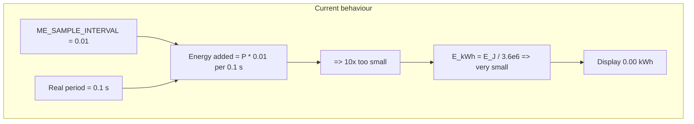
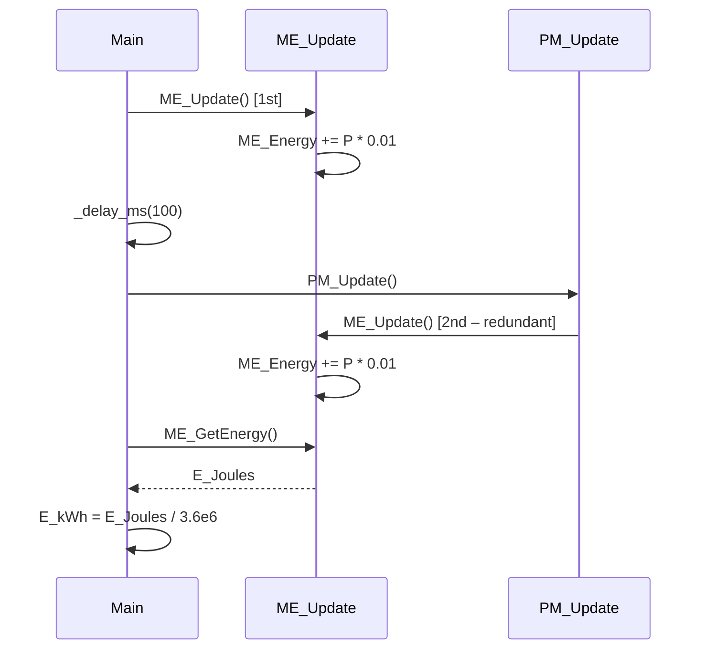
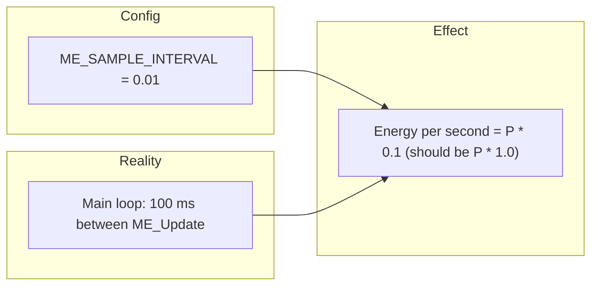

# Measurement Engine – Energy Always Zero: Analysis Report

**Language:** English  
**Scope:** `Firmware/Embedded/Src/App/MeasurementEngine` and related call chain (main, PM, HAL, ADC)  
**Issue:** Energy always appears as zero.  
**Purpose:** Detailed analysis of all causes, with exact code (error vs correction) and diagrams.  
**Constraint:** This document describes problems and fixes; it does **not** modify the original source files.

---

## Table of Contents

1. [Executive Summary](#1-executive-summary)
2. [How Energy Is Calculated (Data Flow)](#2-how-energy-is-calculated-data-flow)
3. [Root Causes – Detailed](#3-root-causes--detailed)
4. [Code: Error vs Correction](#4-code-error-vs-correction)
5. [Diagrams](#5-diagrams)
6. [Verification Checklist](#6-verification-checklist)
7. [References](#7-references)

---

## 1. Executive Summary

Energy can appear “always zero” for several reasons in the current design:

| # | Cause | Severity | Effect |
|---|--------|----------|--------|
| 1 | **ME_SAMPLE_INTERVAL vs real call period** | **High** | Energy is undercounted by 10×; in kWh with 2 decimals it shows **0.00** for a long time. |
| 2 | **Display / units** | **High** | Energy in Joules is converted to kWh; small values (e.g. &lt; 0.01 kWh) display as **0.00** with 2 decimals. |
| 3 | **Power always zero (V or I = 0)** | **High** | If voltage or current HAL returns 0, `ME_Active_Power` is 0, so `ME_Energy` never increases. |
| 4 | **Units bug in System_Controller** | Medium | `ME_GetEnergy()` (Joules) is stored in `energy_kwh` without conversion. |
| 5 | **Double ME_Update()** | Low | main and PM_Update() both call ME_Update(); redundant and can confuse timing. |
| 6 | **ADC / Timer1 not started** | Medium (config-dependent) | If ADC never gets samples, ReadRMS can block or return 0; depends on ADC trigger and Timer1. |

The most likely situation is a **combination of (1) and (2)**: energy is accumulating but 10× too small, and when shown in kWh with 2 decimals it looks like “always zero”.

---

## 2. How Energy Is Calculated (Data Flow)

### 2.1 Formula in Measurement Engine

In `MeasurementEngine_Progarm.c`:

```c
/* Energy accumulation: Energy (J) = Power (W) * Time (s) */
ME_Energy += ME_Active_Power * ME_SAMPLE_INTERVAL;
```

- **ME_Energy**: accumulated energy in **Joules** (Watt·seconds).
- **ME_Active_Power**: Vrms × Irms × PowerFactor (from voltage/current HAL).
- **ME_SAMPLE_INTERVAL**: time in **seconds** that is assumed to pass between two consecutive `ME_Update()` calls.

So energy increases only when:

1. `ME_Update()` is called regularly.
2. `ME_Active_Power > 0` (i.e. voltage and current readings are non-zero).
3. `ME_SAMPLE_INTERVAL` matches the **actual** time between calls; otherwise energy is wrong (e.g. 10× too small).

### 2.2 Call Chain

- **main.c** (every loop): `ME_Update()` → then `E_Joules = ME_GetEnergy()` → `E_kWh = E_Joules / 3600000.0f` → display / log.
- **ProtectionManager**: `PM_Update()` also calls `ME_Update()` (so ME_Update is called twice per main loop).
- **System_Controller** (if used): `Status.RamData.energy_kwh = ME_GetEnergy();` → **bug:** stores Joules in a field named `energy_kwh`.

### 2.3 Where “Zero” Can Appear

- **ME_Energy** stays 0 if `ME_Active_Power` is always 0 (sensors/ADC return 0).
- **ME_Energy** grows too slowly if `ME_SAMPLE_INTERVAL` is much smaller than the real period (e.g. 0.01 s vs 0.1 s).
- **Display** shows 0.00 if the value in kWh is very small (e.g. &lt; 0.005) and the UI shows 2 decimal places.

---

## 3. Root Causes – Detailed

### 3.1 ME_SAMPLE_INTERVAL Mismatch (Main Likely Cause)

**Location:** `MeasurementEngine_Config.h`

**Current:**

```c
#define ME_SAMPLE_INTERVAL   0.01f   /* 10 ms */
```

**Reality:** In `main.c`, the loop runs `ME_Update()` then `_delay_ms(100)`, so the **actual** period between two `ME_Update()` calls is **100 ms = 0.1 s**.

So each time we do:

- `ME_Energy += ME_Active_Power * 0.01f`

but we only call this every **0.1 s**. So per second we add:

- `ME_Energy += Power * 0.01 * 10 = Power * 0.1` (J/s)

Correct would be:

- `ME_Energy += Power * 1.0` (J/s)

So energy is **10× too small**. Example: 100 W for 1 minute → 6000 J correct, but we get 600 J. In kWh: 600 / 3 600 000 ≈ 0.000166 kWh → displayed as **0.00 kWh** with 2 decimals. So the user sees “energy always zero” even though `ME_Energy` is not literally 0.

**Fix:** Set `ME_SAMPLE_INTERVAL` to the **actual** period between `ME_Update()` calls (e.g. **0.1f** if the main loop delay is 100 ms). If the delay changes, update the macro or compute the interval at runtime.

---

### 3.2 Display / Units (kWh with Few Decimals)

**Location:** Wherever energy is shown (e.g. Display Manager, LCD).

Energy in Joules is converted to kWh:

- `E_kWh = E_Joules / 3600000.0f`

For small energy (e.g. first minutes of operation), `E_kWh` is very small (e.g. 0.0001–0.001). If the display uses 2 decimal places, it will show **0.00** until enough energy has accumulated.

**Fix (optional):**

- Show more decimals (e.g. 4), or
- Show in **Wh** (E_Wh = E_Joules / 3600.0f) so numbers are larger at low energy, or
- Fix the 10× undercount first (correct `ME_SAMPLE_INTERVAL`); then kWh will grow 10× faster and reach 0.01 sooner.

---

### 3.3 Power Always Zero (V or I = 0)

If `hVoltage_ReadRMS()` or `hCurrent_ReadRMS()` always returns 0, then:

- `ME_Apparent_Power = ME_Vrms * ME_Irms = 0`
- `ME_Active_Power = 0`
- `ME_Energy += 0` every time → **ME_Energy stays 0**.

Possible reasons:

- **ADC not running:** ADC is started by `mADC_StartGroup()` in `PM_Init()`. The first conversion is started there; the ISR starts the next conversion. So ADC does **not** depend on Timer1 for the chain to run. If `PM_Init()` is not called before the main loop, or `mADC_StartGroup()` is skipped, no samples → ReadRMS can block or use stale/zero data.
- **Timer1 (when used as trigger):** `ADC_Config.h` can set trigger to `ADC_TIMER1_COMPARE_MATCH_B`. If Timer1 is disabled in `Config.h` (`Timer1_Module Disable`), the **hardware** trigger never fires. In the current code the **ISR** still starts the next conversion with `SetBit(ADCSRA_Reg, ADSC_bit)`, so the ADC chain can still run without Timer1. So this is only a problem if the ADC were changed to rely solely on Timer1 trigger.
- **Wrong channel / scaling:** Voltage uses channel 1, current channel 0. If wiring or scaling is wrong, readings can be 0.
- **Blocking in ReadRMS:** `hVoltage_ReadRMS()` and `hCurrent_ReadRMS()` wait for 200 samples each. If the ADC callback is never called (e.g. ADC not started), the code blocks forever in `while (New_Sample_Flag == 0)` and never returns; then the user would see a hang, not “energy zero”. So “energy zero” usually means ReadRMS **does** return, but with 0 or very small values.

**Fix:** Ensure `PM_Init()` (or equivalent) calls `mADC_StartGroup()` after voltage/current init; verify ADC channels and scaling so that V and I are non-zero when load is present.

---

### 3.4 Units Bug: Joules Stored in energy_kwh

**Location:** `System_Controller_Program.c` (in `App_SystemController_Update()`)

**Current:**

```c
Status.RamData.energy_kwh = ME_GetEnergy();
```

**Problem:** `ME_GetEnergy()` returns **Joules**, but the field is `energy_kwh`. So we store Joules in a variable named kWh. Any code that treats this as kWh (e.g. display, mobile) will show wrong values.

**Fix:** Convert to kWh before assigning, e.g.:

```c
Status.RamData.energy_kwh = ME_GetEnergy() / 3600000.0f;
```

(and ensure `ME_GetEnergy()` is in Joules).

---

### 3.5 Double ME_Update()

**Locations:** `main.c` and `ProtectionManager__Program.c`

**Current:** main loop does:

1. `ME_Update();`
2. … then later `PM_Update();` which calls `ME_Update();` again.

So **ME_Update()** runs twice per loop. Energy is added twice per 100 ms, but with the same V and I. So energy still accumulates; the issue is:

- Redundant work (two full RMS reads per loop).
- If one day `ME_SAMPLE_INTERVAL` is interpreted as “time between two updates”, the effective interval is wrong (50 ms instead of 100 ms).

**Fix (optional):** Call `ME_Update()` only once per loop (e.g. only in main, and let PM use `ME_GetVoltageRMS()` etc. without calling `ME_Update()` again).

---

### 3.6 Summary Table

| Cause | File / Place | Fix |
|-------|----------------|-----|
| ME_SAMPLE_INTERVAL too small | MeasurementEngine_Config.h | Set to 0.1f (or actual period in s). |
| Display 0.00 | Display / UI | Use more decimals or Wh; or fix interval first. |
| Power = 0 (V/I = 0) | HAL / ADC / PM_Init | Ensure mADC_StartGroup(), channels, scaling. |
| Joules in energy_kwh | System_Controller_Program.c | Divide by 3600000.0f when assigning. |
| Double ME_Update | main.c + PM | Call ME_Update() only once per loop. |

---

## 4. Code: Error vs Correction

### 4.1 ME_SAMPLE_INTERVAL (Critical for “Energy Zero”)

**File:** `Firmware/Embedded/Src/App/MeasurementEngine/MeasurementEngine_Config.h`

**Wrong (current):**

```c
/**
 * @def ME_SAMPLE_INTERVAL
 * @brief Sampling period between consecutive ME_Update() calls in seconds.
 */
#define ME_SAMPLE_INTERVAL   0.01f   /* 10 ms */
```

**Why it’s wrong:** The main loop calls `ME_Update()` every **100 ms** (after `_delay_ms(100)`). Using 0.01 s makes energy 10× too small, so kWh stays below 0.01 for a long time and displays as 0.00.

**Correct (fix):**

```c
/**
 * @def ME_SAMPLE_INTERVAL
 * @brief Sampling period between consecutive ME_Update() calls in seconds.
 *        Must match the actual period in the main loop (e.g. 100 ms = 0.1 s).
 */
#define ME_SAMPLE_INTERVAL   0.1f   /* 100 ms – match main loop _delay_ms(100) */
```

If the main loop delay changes (e.g. 50 ms or 200 ms), set this to 0.05f or 0.2f accordingly.

---

### 4.2 System_Controller: Joules → kWh

**File:** `Firmware/Embedded/Src/App/System_Controller/System_Controller_Program.c`  
**Function:** `App_SystemController_Update()` (where RamData is updated)

**Wrong (current):**

```c
Status.RamData.energy_kwh = ME_GetEnergy();
```

**Why it’s wrong:** `ME_GetEnergy()` returns Joules; `energy_kwh` should hold kWh.

**Correct (fix):**

```c
Status.RamData.energy_kwh = ME_GetEnergy() / 3600000.0f;   /* J -> kWh */
```

---

### 4.3 Optional: Single ME_Update() per Loop

**File:** `Firmware/Embedded/Src/App/ProtectionManager/ProtectionManager__Program.c`  
**Function:** `PM_Update()`

**Current:** First line is `ME_Update();`, and main already called `ME_Update()` before `PM_Update()`.

**Optional fix:** Remove `ME_Update()` from `PM_Update()` and rely on main’s single `ME_Update()`; PM then only uses `ME_GetVoltageRMS()`, `ME_GetActivePower()`, etc. This avoids double update and keeps a single, clear “measurement moment” per loop.

---

## 5. Diagrams

### 5.1 Energy Accumulation (Intended)


### 5.2 Why Energy Looks Zero (Main Path)



### 5.3 Call Order in Main Loop



### 5.4 ME_SAMPLE_INTERVAL vs Real Period



---

## 6. Verification Checklist

After applying fixes:

- [ ] **ME_SAMPLE_INTERVAL** equals the actual time (in seconds) between two `ME_Update()` calls (e.g. 0.1f for 100 ms).
- [ ] **System_Controller** (if used): `energy_kwh` is set from `ME_GetEnergy() / 3600000.0f`, not from `ME_GetEnergy()` alone.
- [ ] **PM_Init()** is called before the main loop and calls **mADC_StartGroup()** so ADC produces samples.
- [ ] **Voltage/Current:** With a known load, `ME_GetVoltageRMS()` and `ME_GetCurrentRMS()` are non-zero so `ME_GetActivePower()` and energy can grow.
- [ ] **Display:** If energy is still small, use more decimals or Wh so it is visible.
- [ ] (Optional) **ME_Update()** is called only once per main loop.

---

## 7. References

| Item | Path |
|------|------|
| Measurement Engine | `Firmware/Embedded/Src/App/MeasurementEngine/` |
| Config | `MeasurementEngine_Config.h` (ME_SAMPLE_INTERVAL) |
| main.c | `Firmware/Embedded/Src/main.c` (loop, delay, E_kWh) |
| ProtectionManager | `Firmware/Embedded/Src/App/ProtectionManager/ProtectionManager__Program.c` (PM_Init, PM_Update) |
| System_Controller | `Firmware/Embedded/Src/App/System_Controller/System_Controller_Program.c` (energy_kwh) |
| ADC | `Firmware/Embedded/Src/Mcal/ADC/` (StartGroup, ISR) |
| Config.h | `Firmware/Embedded/Src/Common/Config.h` (Timer1_Module) |

---

**End of report.** Apply the corrections above (especially `ME_SAMPLE_INTERVAL` and Joules→kWh in System_Controller) to fix “energy always zero” and wrong units; then verify with a known load and display format.
