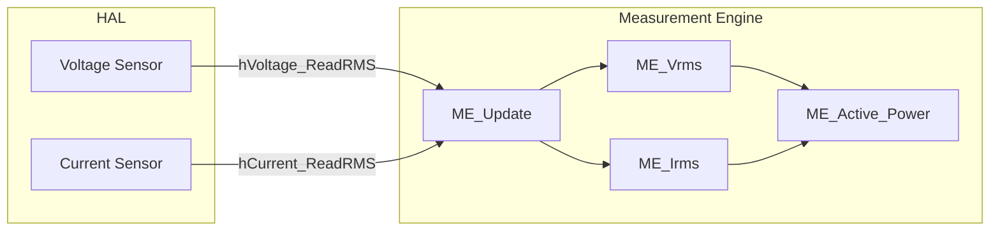
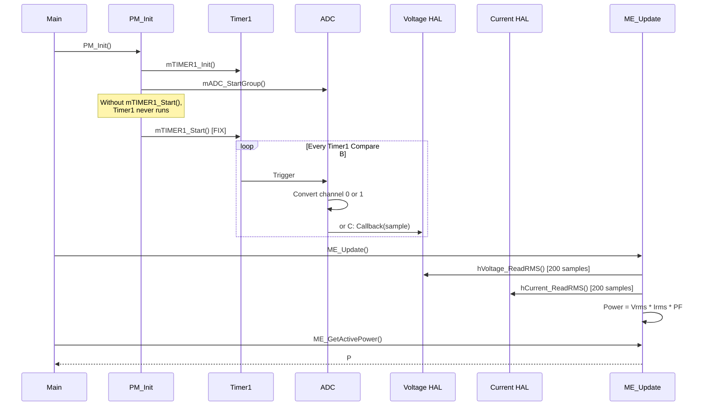
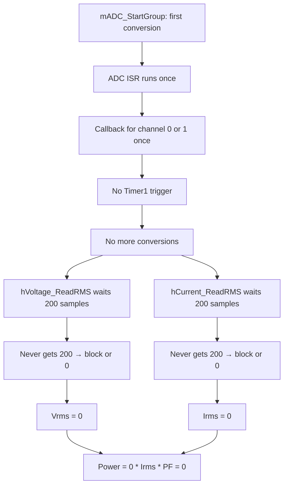
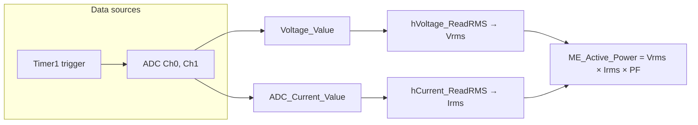
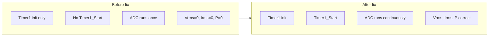

# Measurement Engine – Power Always Zero: Full Analysis Report

**Language:** English  
**Scope:** `Firmware/Embedded/Src/App/MeasurementEngine` and dependency chain (Voltage HAL, Current HAL, ADC, Timer1)  
**Purpose:** Detailed analysis of why **Power** is always zero, with root causes, exact code (error vs correction), and diagrams.  
**Constraint:** This document describes the problems and fixes; it does **not** modify the original source files. Apply changes manually or via patch.

---

## Table of Contents

1. [Executive Summary](#1-executive-summary)
2. [How Power Is Calculated](#2-how-power-is-calculated)
3. [Root Cause Analysis](#3-root-cause-analysis)
4. [Detailed Problem List](#4-detailed-problem-list)
5. [Code: Error vs Correction](#5-code-error-vs-correction)
6. [Diagrams](#6-diagrams)
7. [Fix Steps Summary](#7-fix-steps-summary)
8. [Verification Checklist](#8-verification-checklist)

---

## 1. Executive Summary

**Symptom:** Power is always zero.

**Formula in code:**  
`Power = Vrms × Irms × PowerFactor`  
So if **Power = 0**, then at least one of **Vrms** or **Irms** is zero (or both).

**Main root causes identified:**

| # | Root cause | Effect |
|---|------------|--------|
| 1 | **Timer1 is never started** | ADC is triggered by Timer1 Compare Match B. Without Timer1 running, only the first ADC conversion runs; no continuous samples. Voltage/Current RMS need 200 samples each; they never get them → **Vrms and Irms stay 0** → Power = 0. |
| 2 | **main.c uses `ME_GetPower()`** | The Measurement Engine API exposes **`ME_GetActivePower()`**, not `ME_GetPower()`. If the project links to something else or the symbol is missing, **P** can be wrong or always zero. |
| 3 | **Timer1_Module is Disable in Config.h** | If the build excludes Timer1 when disabled, **mTIMER1_Init()** may still be called from PM_Init(), but **mTIMER1_Start()** is never called anywhere → timer never runs. |
| 4 | **ADC callbacks depend on continuous conversions** | Voltage and Current drivers wait in a loop for `New_Sample_Flag` / `New_Current_Sample_Flag` (200 samples). If the ADC ISR rarely or never runs (no Timer1 trigger), they block forever or use stale/zero values → **Vrms = 0, Irms = 0**. |

**Conclusion:** The most direct fix is to **start Timer1** after init (call `mTIMER1_Start()` where the ADC trigger is used) and to use **`ME_GetActivePower()`** in main (or add an alias). The rest of this document goes through each layer and gives exact code corrections.

---

## 2. How Power Is Calculated

### 2.1 Data Flow (High Level)



### 2.2 Formula in Code

**File:** `MeasurementEngine_Progarm.c`  
**Function:** `ME_Update()`

```c
ME_Vrms = hVoltage_ReadRMS();
ME_Irms = hCurrent_ReadRMS();

ME_Apparent_Power = ME_Vrms * ME_Irms;
#if Load_Type == Resistive_Load
    ME_Active_Power = ME_Apparent_Power * Resistive_Load_PF;
#elif Load_Type == AVG_Residential_Load
    ME_Active_Power = ME_Apparent_Power * AVG_Residential_Load_PF;
#endif
```

So:

- **ME_Active_Power = Vrms × Irms × PF**
- If **Vrms = 0** or **Irms = 0** → **ME_Active_Power = 0**

So the problem is **upstream**: why are **Vrms** and/or **Irms** zero?

---

## 3. Root Cause Analysis

### 3.1 Chain: Power ← Vrms, Irms ← ADC samples ← ADC trigger (Timer1)

| Layer | What it does | What can go wrong |
|-------|------------------|-------------------|
| **Measurement Engine** | Calls `hVoltage_ReadRMS()` and `hCurrent_ReadRMS()`, then `Power = Vrms × Irms × PF`. | Correct if Vrms and Irms are correct. |
| **Voltage HAL** | `hVoltage_ReadRMS()` waits for **200** samples (flag set by ADC callback), uses `Voltage_Value` (set in callback). | If ADC callback never runs or runs with 0, **Vrms = 0**. |
| **Current HAL** | `hCurrent_ReadRMS()` waits for **200** samples (flag set by ADC callback), uses `ADC_Current_Value` (set in callback). | If ADC callback never runs or runs with 0, **Irms = 0**. |
| **ADC** | Round-robin: Channel 0 (current) → Channel 1 (voltage). **Trigger:** Timer1 Compare Match B. **First conversion** started by `mADC_StartGroup()`. | If Timer1 never fires after the first conversion, only **one** conversion runs → only one channel gets one sample → we never get 200 samples per channel. |
| **Timer1** | In **ADC_Config.h**: `ADC_TRIGGER_SOURCE = ADC_TIMER1_COMPARE_MATCH_B`. Timer1 must run to trigger ADC periodically. | **mTIMER1_Start() is never called** in the project → Timer1 counter never runs → ADC trigger never fires → no continuous samples. |

So the main root cause is: **Timer1 is never started**, so the ADC does not get continuous conversions, so the Voltage and Current drivers never get 200 samples, so Vrms and Irms stay zero, so **Power stays zero**.

### 3.2 Why Voltage_Value and ADC_Current_Value Stay 0

- **Voltage:** `Voltage_Value` is set only in `hVoltage_Callback(uint16_t dummy)` (ADC channel 1 callback). If the ADC ISR rarely runs (no Timer1 trigger), the callback is rarely called and `Voltage_Value` stays at initial **0.0f**.
- **Current:** `ADC_Current_Value` is set only in `hcurrent_CallBack(uint16_t dummy)` (ADC channel 0 callback). Same as above → stays **0**.

So all “instant” values used in RMS are 0 → **Vrms = 0, Irms = 0** → **Power = 0**.

### 3.3 main.c Uses Wrong API Name

In **main.c** (around line 94):

```c
float P = ME_GetPower();
```

The Measurement Engine interface only declares **`ME_GetActivePower()`**. There is no **`ME_GetPower()`** in the engine. So either:

- The project does not link (undefined reference to `ME_GetPower`), or  
- Another object defines `ME_GetPower` (e.g. returning 0 or wrong value).

**Correct call:** `ME_GetActivePower()`.

---

## 4. Detailed Problem List

| # | Problem | Location | Severity |
|---|---------|----------|----------|
| 1 | **Timer1 is never started** | No call to `mTIMER1_Start()` after `mTIMER1_Init()`. ADC trigger (Timer1 Compare B) never fires → no continuous ADC samples. | **Critical** |
| 2 | **main.c uses ME_GetPower()** | main.c line ~94: `float P = ME_GetPower();` — API is `ME_GetActivePower()`. | **High** |
| 3 | **Timer1_Module = Disable** | Config.h: `Timer1_Module Disable`. If build excludes Timer1, or if you expect Timer1 to be “off”, the ADC trigger path is broken. | **High** |
| 4 | **Init order** | PM_Init() calls mTIMER1_Init() and mADC_StartGroup() but never mTIMER1_Start(). So first conversion runs once, then no more. | **Critical** |

---

## 5. Code: Error vs Correction

### 5.1 Start Timer1 After ADC / Measurement Init (Critical)

**Problem:** ADC is configured to use **Timer1 Compare Match B** as trigger. Timer1 is initialized in PM_Init() but **never started**, so the ADC runs only the first conversion started by `mADC_StartGroup()` and then stops.

**Where to fix:** Wherever you want the ADC to run continuously (e.g. right after starting the ADC group). Typically **PM_Init()** (same place that calls `mADC_StartGroup()`), or a single “sensors start” function.

**Wrong (current):** Timer1 is never started.

```c
void PM_Init()
{
    // ...
    mTIMER1_Init();         /* Initialize Timer1 */
    // ... hCurrent_Init(); hVoltage_Init(); ...
    mADC_StartGroup();      /* Start ADC conversions */
    // mTIMER1_Start();     /* NOT CALLED */
}
```

**Correct (fix):** Start Timer1 so that it generates Compare Match B and triggers the ADC periodically.

```c
void PM_Init()
{
    // ...
    mTIMER1_Init();         /* Initialize Timer1 for ADC trigger */
    // ... hCurrent_Init(); hVoltage_Init(); ...
    mADC_StartGroup();      /* Start first ADC conversion */
    mTIMER1_Start();        /* Start Timer1 so ADC trigger (Compare B) runs → continuous V/I sampling */
}
```

**Alternative:** If you prefer not to touch PM_Init(), you can call `mTIMER1_Start()` once from main after all inits (e.g. after `PM_Init()`), so that the ADC trigger is active before the first `ME_Update()`.

---

### 5.2 main.c: Use ME_GetActivePower() Instead of ME_GetPower()

**Problem:** main.c uses `ME_GetPower()`, which is not part of the Measurement Engine API. Power is returned by `ME_GetActivePower()`.

**Location:** `Firmware/Embedded/Src/main.c` (around line 94).

**Wrong (current):**

```c
float P = ME_GetPower();
```

**Correct (fix):**

```c
float P = ME_GetActivePower();
```

If you want to keep the name `ME_GetPower` in the rest of the code, you can add a macro or wrapper in one place, e.g.:

```c
#define ME_GetPower   ME_GetActivePower
```

and then keep using `ME_GetPower()` in main. The important point is that the implementation used must be the one that returns **ME_Active_Power** (from `ME_Update()`).

---

### 5.3 (Optional) Enable Timer1 in Config If Excluded From Build

**Problem:** In **Config.h**, **Timer1_Module** is **Disable**. If your build system excludes Timer1 when disabled, the ADC trigger path will not work until Timer1 is enabled and linked.

**Location:** `Firmware/Embedded/Src/Common/Config.h`

**Current:**

```c
#define Timer1_Module               Disable /**< Enable or Disable the Timer1 Module */
```

**If you need Timer1 for ADC sampling:**

```c
#define Timer1_Module               Enable  /**< Required for ADC trigger (Timer1 Compare B) → V/I sampling → Power */
```

Only change this if your build actually excludes Timer1 when Disable; otherwise fixing the “never start” (5.1) is enough.

---

## 6. Diagrams

### 6.1 Intended Flow When Everything Works



### 6.2 What Happens When Timer1 Is Not Started



### 6.3 Power Calculation Chain



### 6.4 Fix Summary (Timer1 + main)



---

## 7. Fix Steps Summary

Apply in this order:

| Step | File / place | Action |
|------|----------------------|--------|
| 1 | **PM_Init()** (e.g. `ProtectionManager__Program.c`) | After `mADC_StartGroup()`, add **`mTIMER1_Start();`** so Timer1 runs and triggers the ADC. |
| 2 | **main.c** | Replace **`ME_GetPower()`** with **`ME_GetActivePower()`** (or add `#define ME_GetPower ME_GetActivePower` and keep using `ME_GetPower()`). |
| 3 | **Config.h** (optional) | If the build excludes Timer1 when disabled, set **`Timer1_Module Enable`** so Timer1 is compiled and linked. |

No change is required inside the Measurement Engine logic (formula or getters) for “Power always zero”; the fix is **Timer1 start** and **correct Power API** in main.

---

## 8. Verification Checklist

After applying the fixes:

- [ ] **Timer1:** `mTIMER1_Start()` is called once after `mTIMER1_Init()` and `mADC_StartGroup()` (e.g. in PM_Init or in main after PM_Init).
- [ ] **main.c:** Power is read with `ME_GetActivePower()` (or via a defined alias).
- [ ] **Build:** Project compiles and links; no undefined reference to `ME_GetPower` unless you defined it.
- [ ] **Runtime:** After a short delay (e.g. 1–2 seconds), `ME_GetVoltageRMS()` and `ME_GetCurrentRMS()` return non-zero when load/supply is present; `ME_GetActivePower()` is non-zero when both V and I are non-zero.
- [ ] **Config:** If you rely on Timer1 for ADC, Timer1 module is enabled in Config if your build uses it.

---

## Summary Table

| Issue | Cause | Fix |
|-------|--------|-----|
| Power always zero | Vrms and/or Irms are 0 | Fix upstream: ADC must get 200 samples per channel. |
| No ADC samples | ADC trigger = Timer1 Compare B; Timer1 never started | Call **mTIMER1_Start()** after mADC_StartGroup() (e.g. in PM_Init). |
| Wrong Power in main | main uses ME_GetPower() | Use **ME_GetActivePower()** (or alias). |
| Timer1 “off” in config | Timer1_Module Disable | Set **Enable** if build excludes Timer1 when disabled. |

This document gives a **full, direct analysis** of why Power is always zero, with **exact code (error vs correction)** and **diagrams**, without modifying the original repo until you apply the steps above.
