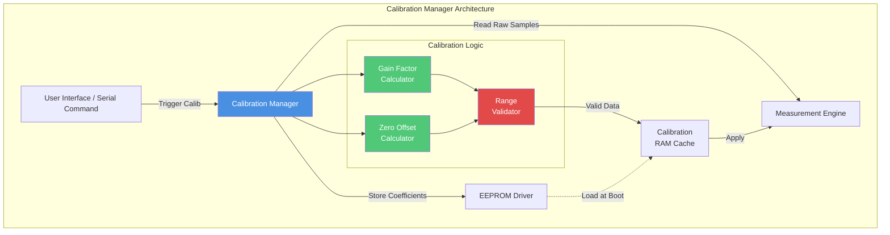
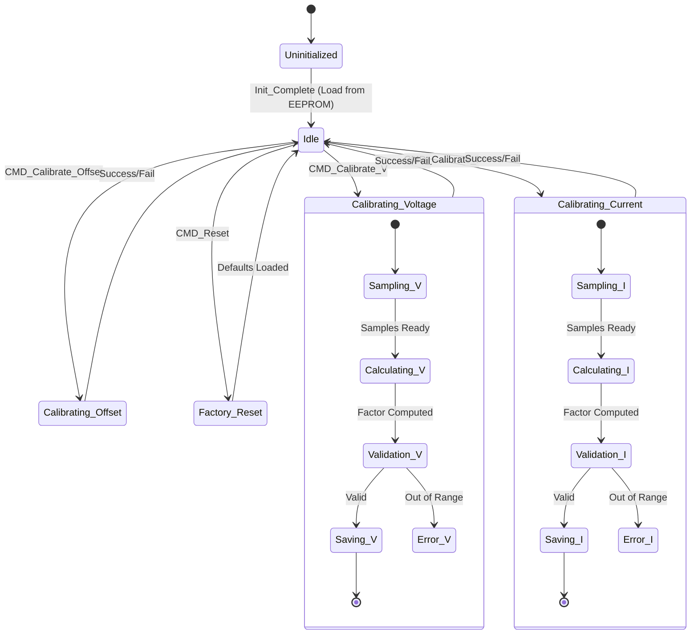
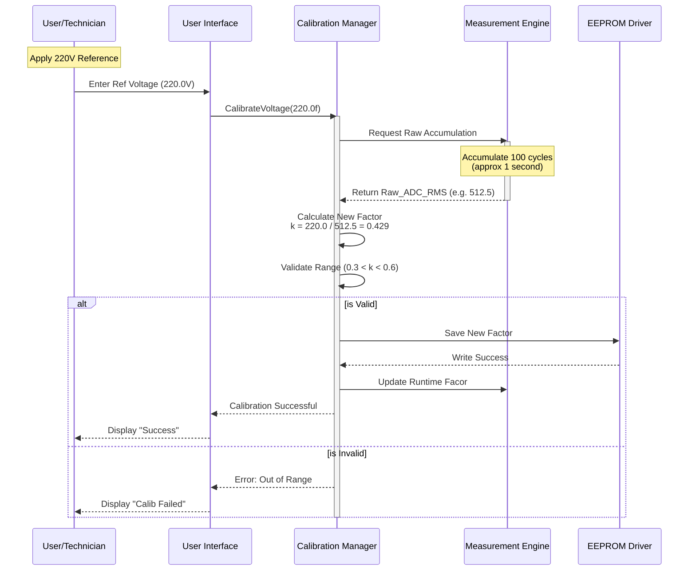
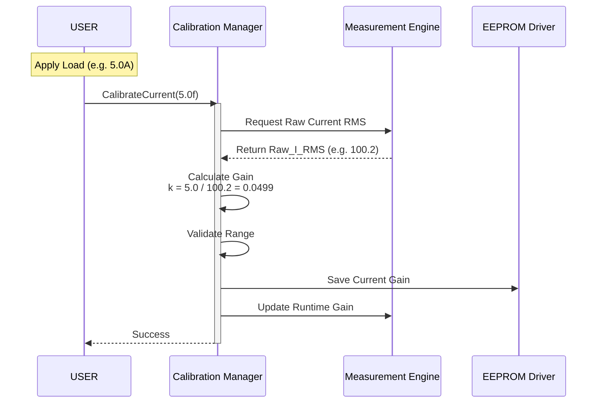
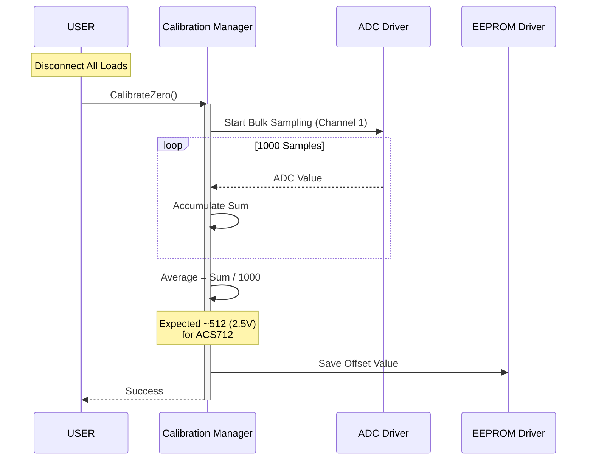
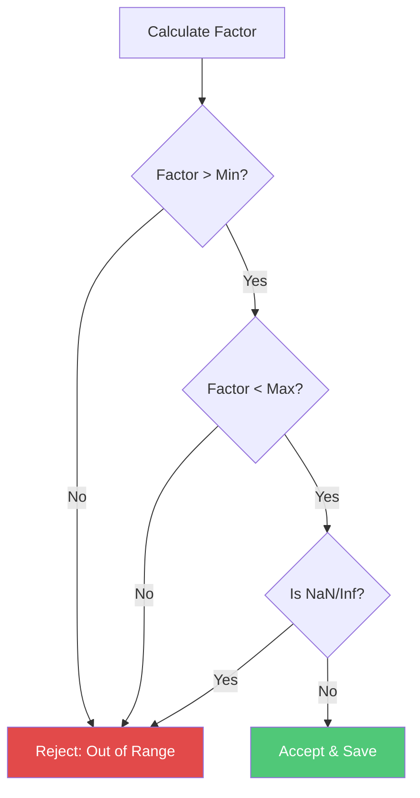
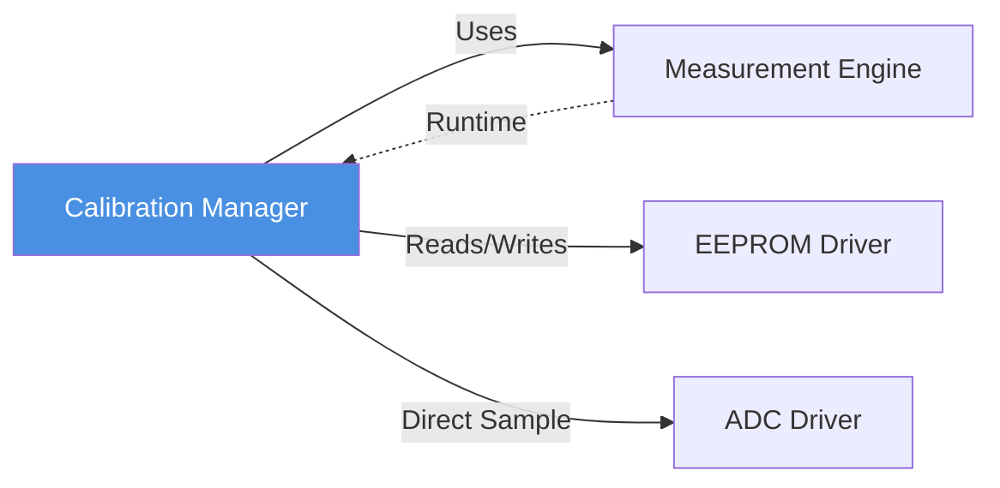

# 📏 Calibration Manager

**Calibration Manager**

**Smart Energy Management System - Sensor Accuracy Control**

_Developed by Gestell Company - Professional Embedded Solutions_

---

## 📋 Table of Contents

- [Module Overview](#-1-module-overview)
- [Architecture](#-2-architecture-diagram)
- [Calibration Procedure](#-3-calibration-procedure)
- [State Machine](#-4-state-machine)
- [Sequence Diagrams](#-5-sequence-diagrams)
- [Data Structures](#-6-data-structures)
- [Configuration Parameters](#-7-configuration-parameters)
- [Error Handling](#-8-error-handling-strategy)
- [Performance Characteristics](#-9-performance-characteristics)
- [Dependencies](#-10-module-dependencies)

---

## 🔗 Related Documentation

| Document                                                                 | Description  | Status       |
| ------------------------------------------------------------------------ | ------------ | ------------ |
| **[Measurement_Engine.md](../Measurement_Engine/Measurement_Engine.md)** | Measurements | ✅ Available |
| **[EEPROM_Driver.md](../../MCAL_Layer/EEPROM/EEPROM_Driver.md)**         | Storage      | ✅ Available |

---

## 📋 1. Module Overview

### Purpose and Role

The Calibration Manager is responsible for ensuring the accuracy of voltage and current measurements in the Smart Energy Management System. Low-cost sensors and electronic components often have tolerances that lead to measurement errors (offset and gain errors). This module provides a mechanism to correct these errors by comparing measured values against known reference standards and determining correction factors.

### Key Responsibilities

- **Gain Correction**: Calculates and applies multiplication factors to correct slope errors in voltage and current readings.
- **Offset Correction**: Determines and subtracts zero-current offsets to eliminate phantom readings when no load is connected.
- **Persistence**: Saves calibration coefficients to non-volatile memory (EEPROM) so they are retained after power cycles.
- **Validation**: Ensures calculated factors are within reasonable limits to prevent erroneous calibration.
- **Factory Reset**: Provides capability to restore default calibration values.

### Calibration Theory

The relationship between the raw ADC value and the physical quantity is modeled linearly:

> **Physical Value = (Raw ADC - Offset) × Gain Factor**

1.  **Offset**: The ADC reading when the physical input is zero.
2.  **Gain Factor**: The ratio between the actual physical value and the offset-corrected ADC reading.

By determining these two parameters experimentally, the system can achieve high accuracy even with inexpensive hardware components.

---

## 2. Architecture Diagram

### Module Interactions

1.  **User Interface**: Initiates calibration commands (e.g., "Calibrate Voltage at 220V").
2.  **Measurement Engine**: Provides raw, uncorrected ADC accumulations for processing. Also receives the final calibration factors to apply during normal operation.
3.  **EEPROM Driver**: Persists the validated coefficients.
4.  **RAM Cache**: Holds active calibration values for fast access during runtime calculations, avoiding slow EEPROM reads.

---

## 3. Calibration Procedure

### 3.1 Voltage Calibration

**Objective**: Determine the scaling factor to convert ADC counts to Volts (RMS).

**Steps**:

1.  Connect a stable AC source to the system.
2.  Measure the actual voltage using a high-precision multimeter (Reference Voltage).
3.  Input the Reference Voltage value to the system via the calibration interface.
4.  The system records the average raw ADC RMS value over a set period.
5.  **Calculation**: `VoltageScale = Reference_Voltage / Raw_ADC_RMS`.
6.  The new `VoltageScale` is validated and saved.

### 3.2 Current Calibration

**Objective**: Determine the scaling factor to convert ADC counts to Amperes (RMS).

**Steps**:

1.  Connect a resistive load (e.g., heater, lamp) in series with a high-precision ammeter.
2.  Turn on the load.
3.  Measure the actual current using the ammeter (Reference Current).
4.  Input the Reference Current value to the system.
5.  The system records the average raw ADC RMS value (offset-corrected).
6.  **Calculation**: `CurrentScale = Reference_Current / Raw_ADC_RMS`.
7.  The new `CurrentScale` is validated and saved.

### 3.3 Zero Offset Calibration (Current)

**Objective**: Eliminate the "zero error" of the Hall-effect current sensor.

**Steps**:

1.  Ensure **NO LOAD** is connected (Current = 0A).
2.  Trigger the "Calibrate Zero" command.
3.  The system takes multiple samples (e.g., 1000 samples) and averages them.
4.  This average value becomes the new `ZeroOffset` (voltage center point for AC wave).
5.  **Result**: Future readings will ideally read 0A when no load is present.

---

## 4. State Machine

### State Descriptions

- **Uninitialized**: System startup state. Calibration data is loaded from EEPROM validation checks are performed.
- **Idle**: Normal operation state. System uses current calibration values for measurements.
- **Calibrating_Voltage**: Active state where voltage samples are accumulated for calibration. Normal measurement reporting may be paused or flagged.
- **Calibrating_Current**: Active state for current gain calibration.
- **Calibrating_Offset**: Active state for calculating zero-current DC offset.
- **Factory_Reset**: Reverts all coefficients to hardcoded safe defaults.

---

## 5. Sequence Diagrams

### 5.1 Voltage Calibration Sequence

### 5.2 Current Calibration Sequence

### 5.3 Zero Offset Calibration Sequence

---

## 6. Data Structures

### Calibration Data Structure (RAM & EEPROM)

The following structure defines the layout of calibration data as stored in memory.

| Field Name       | Data Type  | Size (Bytes) | Description                                      |
| ---------------- | ---------- | ------------ | ------------------------------------------------ |
| `voltage_gain`   | `float`    | 4            | Scaling factor for voltage (Volts per ADC count) |
| `current_gain`   | `float`    | 4            | Scaling factor for current (Amps per ADC count)  |
| `current_offset` | `uint16_t` | 2            | Zero-current ADC offset (0-1023)                 |
| `checksum`       | `uint16_t` | 2            | CRC-16 or simple checksum for integrity          |
| **Total Size**   |            | **12 Bytes** |                                                  |

### EEPROM Memory Map

| Address Range   | Content           | Description                    |
| --------------- | ----------------- | ------------------------------ |
| `0x00` - `0x0B` | Calibration Block | Main calibration data struct   |
| `0x0C` - `0x0D` | Write Counter     | Track EEPROM wear (optional)   |
| `0x10` - `...`  | Energy Log        | Start of Energy Logger storage |

---

## 7. Configuration Parameters

These default values and limits are defined in `Config.h` and used for validation.

| Parameter        | Default Value | Min Limit | Max Limit | Description                                        |
| ---------------- | ------------- | --------- | --------- | -------------------------------------------------- |
| `DEFAULT_V_GAIN` | 0.488f        | 0.300f    | 0.700f    | Based on hardware divider design (e.g. 500V range) |
| `DEFAULT_I_GAIN` | 0.066f        | 0.040f    | 0.100f    | Based on ACS712 sensitivity (e.g. 66mV/A)          |
| `DEFAULT_OFFSET` | 512           | 450       | 574       | Center point of 10-bit ADC (2.5V approx)           |
| `CALIB_TIMEOUT`  | 5000 ms       | -         | -         | Max time to wait for stable measurement            |
| `STABLE_COUNT`   | 50            | -         | -         | Number of consistent samples required              |

### Calculating Default Gains (Design Time)

**Voltage Gain**:

- Max Input: 500V (Peak)
- Divider Ratio: 100:1 (500V -> 5V)
- ADC Reference: 5V
- ADC Steps: 1023
- Volts per Step: 5V / 1023 ≈ 0.00488V
- Input Voltage per Step: 0.00488V × 100 = 0.488 V/count

**Current Gain**:

- Sensor: ACS712-30A
- Sensitivity: 66 mV/A
- ADC Steps per Volt: 1023 / 5 = 204.6 steps/V
- ADC Steps per Amp: 0.066 V/A × 204.6 steps/V ≈ 13.5 steps/A
- Amps per Step (Gain): 1 / 13.5 ≈ 0.074 A/count

---

## 8. Error Handling Strategy

### Calibration Validation Logic

Before saving any new calibration factor, the system validates it against hard limits to prevent "bricking" the sensor accuracy.

**Validation Tree**:

### Error Codes

| Code              | Trigger Condition                            | System Action                   |
| ----------------- | -------------------------------------------- | ------------------------------- |
| `CAL_ERR_NONE`    | Successful operation                         | Update runtime and EEPROM       |
| `CAL_ERR_RANGE`   | Calculated factor outside min/max limits     | Discard new factor, keep old    |
| `CAL_ERR_TIMEOUT` | Measurement did not stabilize in time        | Abort calibration process       |
| `CAL_ERR_EEPROM`  | Verify-after-write failed                    | Flag EEPROM error, use RAM only |
| `CAL_ERR_INPUT`   | Reference value provided is zero or negative | Reject command                  |

---

## 9. Performance Characteristics

### Accuracy and Precision

| Parameter             | Specification       | Notes                             |
| --------------------- | ------------------- | --------------------------------- |
| **ADC Resolution**    | 10-bit (1024 steps) | ~0.1% of full scale               |
| **Voltage Accuracy**  | ±1.0%               | After 1-point calibration         |
| **Current Accuracy**  | ±2.0%               | Especially at low currents (<1A)  |
| **Calibration Speed** | < 2 seconds         | Sample accumulation + calculation |
| **EEPROM Life**       | 100,000 cycles      | Updates strictly on user command  |

### Drift Factors

- **Temperature**: Reference voltage (AVCC) and resistor divider ratios may drift with heat.
- **Aging**: Capacitor aging in the power supply filter may increase noise over years.
- **Recommendation**: Re-calibrate annually for critical applications.

---

## 10. Module Dependencies

- **Measurement Engine**: Source of processed RMS values (e.g., getting the average RAW counts).
- **EEPROM Driver**: Handling byte-level storage operations.
- **ADC Driver**: For zero-offset calibration, raw ADC access is sometimes required bypassing RMS filtering.

---

**Built with ❤️ by Gestell Team**

_Professional Embedded Systems Engineering_

**Copyright © 2025-2026 Gestell Company - All Rights Reserved**

