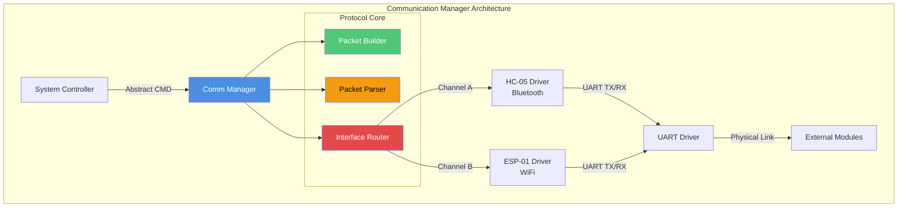
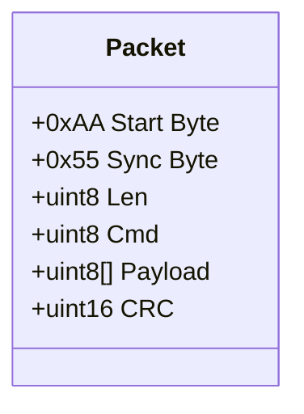
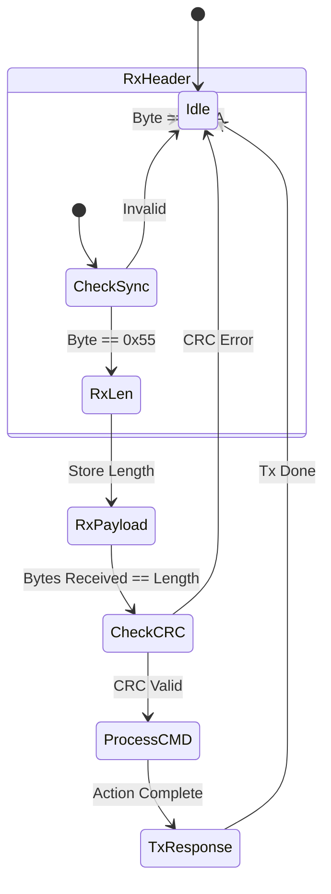
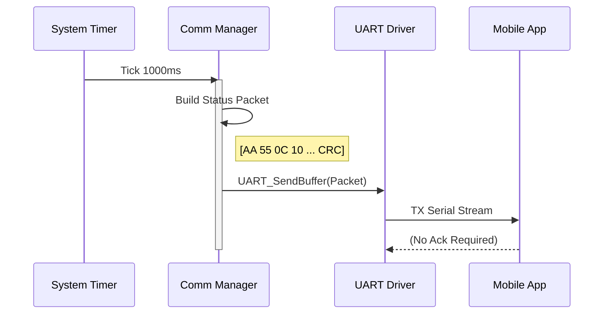
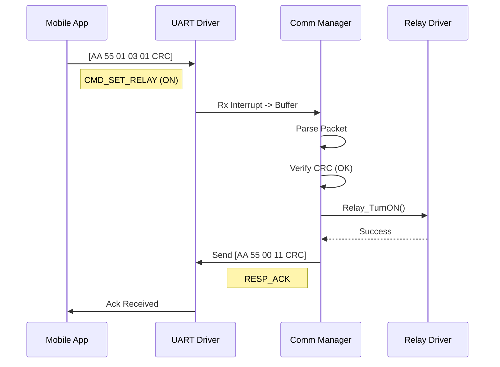

# 📡 Communication Manager

**Communication Manager**

**Smart Energy Management System - Data Connectivity & Control**

_Developed by Gestell Company - Professional Embedded Solutions_

---

## 📋 Table of Contents

- [Module Overview](#-1-module-overview)
- [Architecture](#-2-architecture-diagram)
- [Communication Protocol](#-3-communication-protocol)
- [Message Formats](#-4-message-formats)
- [State Machine](#-5-state-machine)
- [Sequence Diagrams](#-6-sequence-diagrams)
- [Buffer Management](#-7-buffer-management)
- [Configuration Parameters](#-8-configuration-parameters)
- [Error Handling](#-9-error-handling)
- [AT Command Reference](#-10-at-command-reference-esp-01)

---

## 🔗 Related Documentation

| Document                                                            | Description     | Status       |
| ------------------------------------------------------------------- | --------------- | ------------ |
| **[UART_Driver.md](../../MCAL_Layer/UART/UART_Driver.md)**          | Serial Hardware | ✅ Available |
| **[ESP01_Driver.md](../../HAL_Layer/ESP01_WiFi/ESP01_Driver.md)**   | WiFi Hardware   | ✅ Available |
| **[HC05_Driver.md](../../HAL_Layer/HC05_Bluetooth/HC05_Driver.md)** | Bluetooth HW    | ✅ Available |

---

## 📋 1. Module Overview

### Purpose and Role

The Communication Manager is the system's gateway to the outside world. It handles data transmission and reception across multiple channels, specifically Bluetooth (for local mobile app control) and WiFi (for cloud logging and IoT integration). It abstracts the underlying transport layers, providing a unified API for the application to send telemetry and receive command without worrying about packet framing, checksums, or retries.

### Key Responsibilities

- **Transport Abstraction**: Unifies UART-based interfaces (HC-05 and ESP-01) under a single command handler.
- **Packet Framing**: Wraps raw data in a robust protocol structure (Header, Length, Payload, CRC).
- **Command Parsing**: Decodes incoming requests (e.g., "Get Status", "Turn Relay ON") and routes them to the System Controller.
- **Telemetry Publishing**: Periodically sends system status updates to connected clients.
- **Link Management**: Monitors connection health and attempts reconnection if links are lost.

---

## 2. Architecture Diagram

### Dual-Path Logic

1.  **Shared UART Bus**: Since ATmega32 has only one hardware UART, the system may use multiplexing or different modes to switch between Bluetooth and WiFi, or use Software UART for one channel.
2.  **Routing Strategy**:
    - **Telemetry**: Broadcast to ALL connected interfaces.
    - **Response**: Sent ONLY to the interface that originated the request.

---

## 3. Communication Protocol

To ensure data integrity over potentially noisy wireless links, a custom binary protocol is used.

### Frame Structure

| Byte Index | Field      | Description          | Value/Note |
| ---------- | ---------- | -------------------- | ---------- |
| 0          | `HEADER_1` | Frame Start Marker 1 | `0xAA`     |
| 1          | `HEADER_2` | Frame Start Marker 2 | `0x55`     |
| 2          | `LENGTH`   | Payload Length       | 0-255      |
| 3          | `CMD_ID`   | Command Identifier   | Enum ID    |
| 4...N      | `PAYLOAD`  | Data Bytes           | Variable   |
| N+1        | `CRC_L`    | Checksum Low         | CRC-16     |
| N+2        | `CRC_H`    | Checksum High        | CRC-16     |

### Command List

| CMD ID | Name             | Direction | Description                  |
| ------ | ---------------- | --------- | ---------------------------- |
| `0x01` | `CMD_PING`       | C ↔ S     | Connection heartbeat         |
| `0x02` | `CMD_GET_STATUS` | C → S     | Request V, I, P, Relay state |
| `0x03` | `CMD_SET_RELAY`  | C → S     | Turn Load ON/OFF             |
| `0x04` | `CMD_GET_LOGS`   | C → S     | Request history dump         |
| `0x10` | `RESP_STATUS`    | S → C     | Response with status data    |
| `0x11` | `RESP_ACK`       | S → C     | Command Acknowledgement      |
| `0x12` | `RESP_NACK`      | S → C     | Command Failed               |
| `0x20` | `EVENT_FAULT`    | S → C     | Async Fault Alert            |

_(Min: Client (Mobile App), S: Server (Embedded System))_

---

## 4. Message Formats

### Status Response (`RESP_STATUS`)

Payload structure for the most common telemetry packet.

| Offset | Type                   | Name       | Unit/Scale  |
| ------ | ---------------------- | ---------- | ----------- |
| 0      | `uint16`               | Voltage    | Volts × 10  |
| 2      | `uint16`               | Current    | Amps × 100  |
| 4      | `uint16`               | Power      | Watts       |
| 6      | `uint32`               | Energy     | Wh          |
| 10     | `uint8`                | RelayState | 0=OFF, 1=ON |
| 11     | `uint8`                | ProtStatus | Fault Codes |
| **12** | **Total Payload Size** |            |             |

---

## 5. State Machine

### State Descriptions

- **Idle**: Waiting for start byte (`0xAA`). Buffer empty.
- **RxHeader**: Validating sequence 0xAA 0x55.
- **RxPayload**: Accumulating bytes into RX buffer until `Length` reached.
- **CheckCRC**: Calculating CRC of received payload and comparing with footer.
- **ProcessCMD**: Identifying `CMD_ID` and fulfilling the request.

---

## 6. Sequence Diagrams

### 6.1 Telemetry Broadcast

### 6.2 Command Execution (Relay ON)

---

## 7. Buffer Management

### Buffer Strategy

- **RX Buffer**: Fixed size (e.g., 64 bytes). Stores raw incoming stream.
- **TX Buffer**: Fixed size (e.g., 64 bytes). Stores packet constructed before sending.
- **Ring Buffer Implementation**: Used for UART RX interrupt to decoupling reception from processing speed.

### Queue Overflow Handling

If `RX_Head` catches `RX_Tail`:

1.  **Discard**: Incoming byte is dropped.
2.  **Flag**: `ERR_RX_OVERFLOW` set.
3.  **Recovery**: Parser resets to Idle state to resynchronize on next frame header.

---

## 8. Configuration Parameters

| Parameter     | Default | Description                         |
| ------------- | ------- | ----------------------------------- |
| `BAUD_RATE`   | 9600    | Standard for HC-05 default          |
| `RX_BUF_SIZE` | 128     | Bytes. Must hold largest packet x2  |
| `TX_BUF_SIZE` | 128     | Bytes. Must hold log batch          |
| `CMD_TIMEOUT` | 500 ms  | Max time to wait for complete frame |
| `MAX_RETRIES` | 3       | Retries for confirmed packets       |

---

## 9. Error Handling

### Communication Errors

| Error          | Cause                     | Detection               | Action                            |
| -------------- | ------------------------- | ----------------------- | --------------------------------- |
| `ERR_CRC`      | Noise corrupted bits      | Calcuated CRC != Rx CRC | Drop packet, send NACK (optional) |
| `ERR_TIMEOUT`  | Sender stopped mid-packet | Timer > `CMD_TIMEOUT`   | Reset Parser to Idle              |
| `ERR_OVERFLOW` | CPU busy, buffer full     | `Head + 1 == Tail`      | Drop byte, log error              |
| `ERR_UNKNOWN`  | Unsupported CMD ID        | Switch Default Case     | Send `RESP_NACK`                  |

---

## 10. AT Command Reference (ESP-01)

Used when initializing the WiFi module in Station Mode.

| Command       | Parameter       | Description        | Expected Response    |
| ------------- | --------------- | ------------------ | -------------------- |
| `AT`          | -               | Test Communication | `OK`                 |
| `AT+RST`      | -               | Reset Module       | `ready`              |
| `AT+CWMODE`   | `1`             | Set Station Mode   | `OK`                 |
| `AT+CWJAP`    | `"SSID","PWD"`  | Join Access Point  | `WIFI CONNECTED`     |
| `AT+CIFSR`    | -               | Get IP Address     | `+CIFSR:192.168.x.x` |
| `AT+CIPSTART` | `"TCP","IP",80` | Start Connection   | `CONNECT`            |
| `AT+CIPSEND`  | `Length`        | Send Data Mode     | `>`                  |

### Connection Sequence

1.  **Power On**: Send `AT` until `OK`.
2.  **Config**: `AT+CWMODE=1`.
3.  **Connect**: `AT+CWJAP="..."` (Wait up to 10s).
4.  **Confirm**: `AT+CIFSR` checks if IP assigned.
5.  **Ready**: Module is now ready for Transparent Transmission.

---

**Built with ❤️ by Gestell Team**

_Professional Embedded Systems Engineering_

**Copyright © 2025-2026 Gestell Company - All Rights Reserved**

