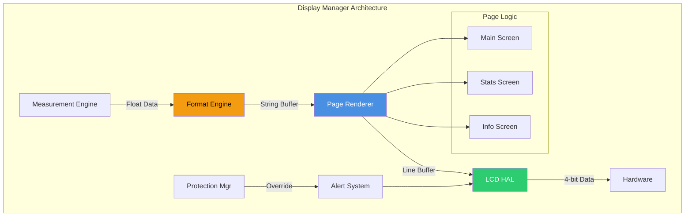
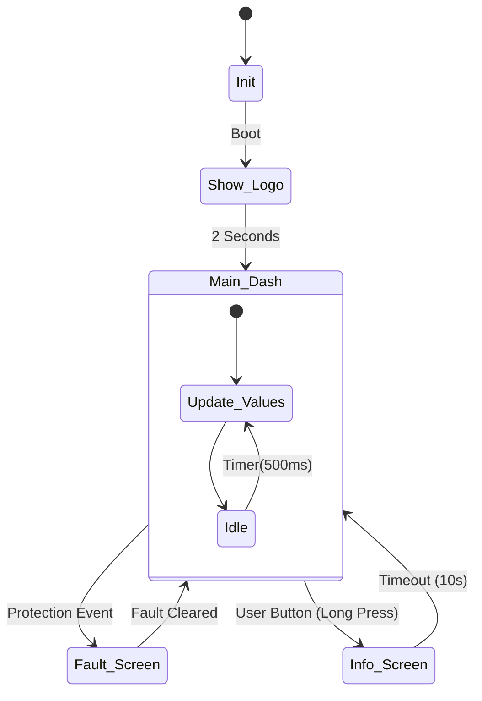
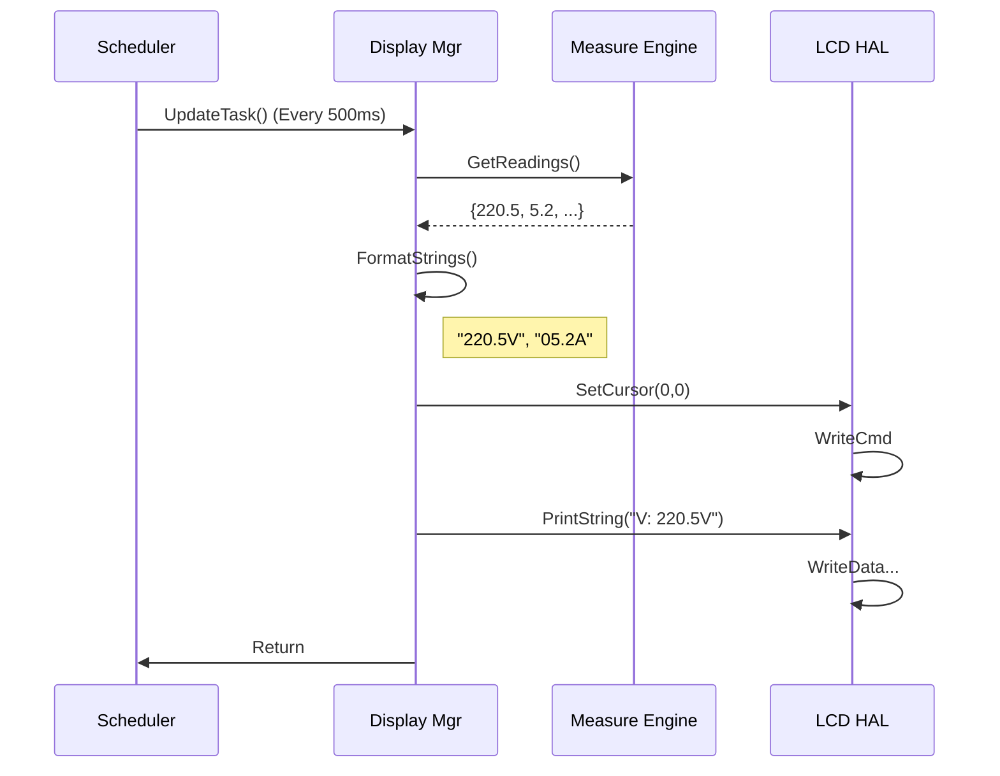

# 📺 Display Manager

<div align="center">


**Display Manager**

**Smart Energy Management System - User Interface & Visualization**

_Developed by Gestell Company - Professional Embedded Solutions_

</div>

---

## 📋 Table of Contents

- [Module Overview](#-1-module-overview)
- [Architecture](#-2-architecture-diagram)
- [Screen Layouts](#-3-screen-layout-specifications)
- [Formatting Logic](#-4-data-formatting-logic)
- [State Machine](#-5-state-machine)
- [Sequence Diagrams](#-6-sequence-diagrams)
- [Configuration](#-7-configuration-parameters)
- [Performance](#-8-performance-characteristics)

---

## 🔗 Related Documentation

| Document                                                                 | Description      | Status       |
| ------------------------------------------------------------------------ | ---------------- | ------------ |
| **[LCD_Driver.md](../../HAL_Layer/LCD/LCD_Driver.md)**                   | Hardware Control | ✅ Available |
| **[Measurement_Engine.md](../Measurement_Engine/Measurement_Engine.md)** | Data Source      | ✅ Available |

---

## 📋 1. Module Overview

### Purpose and Role

The Display Manager is responsible for the human-machine interface (HMI). It abstracts the underlying LCD hardware, providing a set of "Screens" or "Pages" that the user can navigate. It handles the formatting of raw floating-point numbers into human-readable strings, manages screen refresh rates to prevent flicker, and displays system alerts with high priority.

### Key Responsibilities

- **Page Management**: Switching between "Main Dashboard", "Energy Stats", and "System Info".
- **Data Formatting**: Converting `220.5123` to `"220.5V"`.
- **Symbol Rendering**: Placing custom icons (WiFi strength, Load status) dynamically.
- **Alert Overlay**: Temporarily replacing the screen content during a Fault event (e.g., "OVER VOLTAGE").

### Requirements Traceability

| Requirement ID   | Description      | Implementation                    |
| :--------------- | :--------------- | :-------------------------------- |
| **REQ-DISP-001** | 16x2 LCD Display | 20x4 Driver Support (Expanded)    |
| **REQ-DISP-003** | Screen Content   | Main/Stats/Info Pages Implemented |
| **REQ-DISP-006** | Update Rate 1Hz  | 500ms Refresh Rate Configured     |

---

## 2. Architecture Diagram



### Rendering Pipeline

1.  **Fetch**: Get latest values from Measurement Engine struct.
2.  **Format**: Convert floats to fixed-width char arrays (`sprintf` optimization).
3.  **Construct**: Assemble the 20x4 grid in a local RAM buffer.
4.  **Diff**: Compare with current screen content (Optional optimization).
5.  **Flush**: Send only changed characters to the LCD Driver.

---

## 3. Screen Layout Specifications

The system uses a 20x4 Character LCD.

### Screen 1: Main Dashboard (Default)

Overview of instantaneous electrical parameters.

```text
+--------------------+
| V: 220.5V  I: 05.2A|  <- Row 0: Voltage & Current
| P: 1150W   E: 12kWh|  <- Row 1: Power & Energy
| [WiFi] Connected   |  <- Row 2: Connectivity Status
| Load: ON   [Plug]  |  <- Row 3: Relay State
+--------------------+
```

### Screen 2: System Info

Device metadata for technicians.

```text
+--------------------+
| Gen-4 Energy Meter |
| FW: v2.1.0  HW: B2 |
| ID: A4F2-3C91      |
| [Gestell Company]  |
+--------------------+
```

### Screen 3: Fault Alert (Overlay)

Flashes when Protection Manager triggers a trip.

```text
+--------------------+
|  !!! WARNING !!!   |
|                    |
| ** OVER VOLTAGE ** |
|                    |
+--------------------+
```

---

## 4. Data Formatting Logic

Standard `printf` is expensive in flash memory. Custom lightweight formatters are used.

### Float-to-String Strategy

To display `220.5`:

1.  **Cast to Int**: `int part1 = (int)val` -> `220`.
2.  **Get Decimal**: `int part2 = (val - part1) * 10` -> `5`.
3.  **Print**: `itoa(part1) + "." + itoa(part2)`.

| Value  | Format   | Result | Notes                       |
| ------ | -------- | ------ | --------------------------- |
| 5.123  | `%04.1f` | `05.1` | Pad zero, 1 decimal         |
| 12.55  | `%04.1f` | `12.5` | Truncate/Round              |
| 1050.2 | `%4d`    | `1050` | No decimal for Watts > 1000 |

---

## 5. State Machine



### Interaction Logic

- **Auto-Scroll**: Can be enabled to cycle Main -> Stats -> Info every 5 seconds.
- **Fault Override**: Fault state ignores all button presses and forces the Fault Screen until resolved.

---

## 6. Sequence Diagrams

### 6.1 Screen Refresh Cycle



---

## 7. Configuration Parameters

Configured in `Display_Config.h`.

| Parameter           | Value | Description                                             |
| ------------------- | ----- | ------------------------------------------------------- |
| `REFRESH_RATE_MS`   | 500   | Update interval. Faster = Blur. Slower = Lag.           |
| `SCROLL_DELAY_MS`   | 5000  | Time per screen in auto-scroll mode.                    |
| `BACKLIGHT_TIMEOUT` | 30000 | Turn off backlight after 30s inactivity (Power saving). |

---

## 8. Performance Characteristics

### Rendering Cost

- **Full Screen Refresh**: 20x4 = 80 characters.
  - Writing 1 char ~40µs (4-bit mode).
  - 80 chars \* 40µs = 3.2ms (Hardware limit).
  - Software Overhead (formatting): ~1ms.
  - **Total**: ~5ms per update.
  - **Impact**: Negligible on main loop (approx 1% load at 2Hz).

### Memory Usage

- **Display Buffer**: 80 bytes (Shadow RAM) optional.
- **String Buffers**: ~32 bytes generic buffer for `sprintf`.

---

<div align="center">

**Built with ❤️ by Gestell Team**

_Professional Embedded Systems Engineering_

**Copyright © 2025-2026 Gestell Company - All Rights Reserved**

</div>
