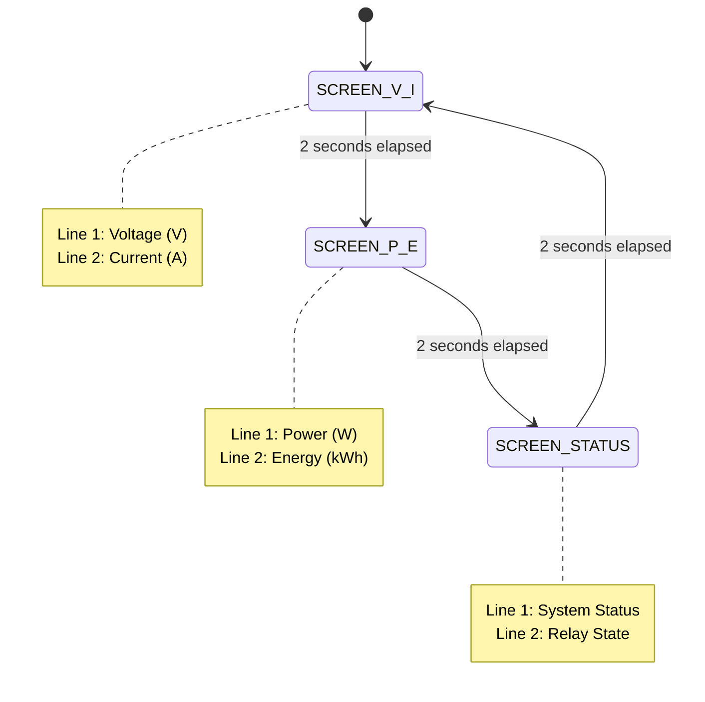
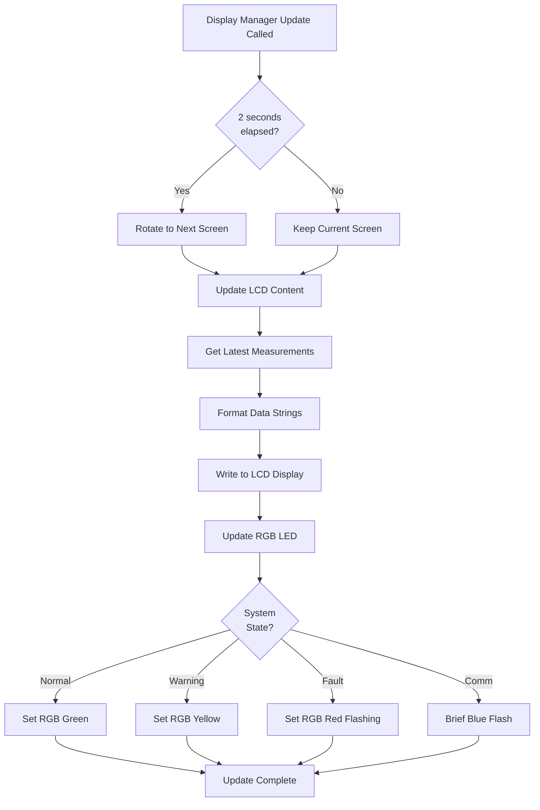

# Display Manager

**Purpose**: User interface management via LCD and status indicators  
**Components**: LCD, RGB LED, Buzzer  
**Update Rate**: 100ms (main loop), Screen rotation every 2 seconds

---

## Overview

The Display Manager module coordinates all user-facing output devices to provide real-time system status, measurement values, and fault indications. It manages three synchronized display outputs: LCD text display, RGB LED status indication, and buzzer audio alerts.

---

## Hardware Resources

**LCD Display**: 16×2 character LCD (HD44780 compatible)  
**RGB LED**: Common cathode RGB LED for status indication  
**Buzzer**: Active 5V buzzer for audio alerts  
**Control Interface**: Managed via HAL layer drivers

---

## Screen Management

### Screen Rotation Strategy

**Automatic Rotation**: Display cycles through multiple information screens to show all data on limited 16×2 display.

**Rotation Timing**: Each screen displayed for 2 seconds before advancing to next.

**Rotation Sequence**:

---

## Screen Content Definitions

### Screen 1: Voltage & Current

**Purpose**: Display real-time electrical measurements

**Line 1 Format**: `V: XXX.X V`

- Example: `V: 220.5 V      `
- Range: 0.0 to 999.9 V
- Precision: 0.1V resolution

**Line 2 Format**: `I: XX.XX A`

- Example: `I: 05.23 A      `
- Range: 0.00 to 30.00 A
- Precision: 0.01A resolution

**Update Frequency**: Every 100ms with latest measurements

---

### Screen 2: Power & Energy

**Purpose**: Display calculated power consumption and accumulated energy

**Line 1 Format**: `P: XXXX.X W`

- Example: `P: 1152.3 W     `
- Range: 0.0 to 9999.9 W
- Precision: 0.1W resolution

**Line 2 Format**: `E: XXX.XX kWh`

- Example: `E: 002.45 kWh   `
- Range: 0.00 to 999.99 kWh
- Precision: 0.01 kWh resolution

**Energy Counter**: Continuously accumulates, persists in EEPROM

---

### Screen 3: System Status

**Purpose**: Display system operational state and relay status

**Line 1 - System Status Messages**:

- `NORMAL          ` - All systems operating normally
- `OVERLOAD!       ` - Overcurrent protection triggered
- `OVERVOLT!       ` - Overvoltage protection triggered
- `CALIBRATING...  ` - Calibration procedure active
- `COMM ACTIVE     ` - Data transmission in progress

**Line 2 - Relay Status**:

- `Relay: ON       ` - Load connected
- `Relay: OFF      ` - Load disconnected (safe state)
- `Relay: FAULT    ` - Protection active, manual reset required

---

## LCD Content Formatting

### Number Formatting Rules

**Voltage Display**:

- Always 3 integer digits + 1 decimal place
- Leading zeros suppressed except for tens place
- Examples: `220.5`, `18.3`, `0.0`

**Current Display**:

- Always 2 integer digits + 2 decimal places
- Leading zero preserved for ones place
- Examples: `05.23`, `15.47`, `00.00`

**Power Display**:

- Up to 4 integer digits + 1 decimal place
- Examples: `1152.3`, `45.0`, `0.0`

**Energy Display**:

- Always 3 integer digits + 2 decimal places
- Leading zeros preserved
- Examples: `002.45`, `123.78`, `000.00`

**Padding**: All strings right-padded with spaces to fill 16-character line width, ensuring clean display with no residual characters.

---

## RGB LED Status Indication

The RGB LED provides instant visual feedback synchronized with system state.

**Color States**:

**GREEN** (Normal Operation):

- Condition: No faults, measurements within limits
- RGB Values: R=0, G=255, B=0
- Meaning: System operating safely

**YELLOW** (Warning):

- Condition: Approaching protection threshold (>90% of limit)
- RGB Values: R=255, G=255, B=0
- Meaning: Caution, monitor closely

**RED** (Fault/Protection):

- Condition: Overcurrent or overvoltage protection triggered
- RGB Values: R=255, G=0, B=0
- Meaning: Load disconnected, manual reset required
- Flashing: 1 Hz flash rate during fault state

**BLUE** (Communication Active):

- Condition: UART transmission/reception in progress
- RGB Values: R=0, G=0, B=255
- Meaning: Data exchange with mobile/dashboard
- Duration: Brief flash (200ms) during communication

**CYAN** (Calibration Mode):

- Condition: Calibration procedure active
- RGB Values: R=0, G=255, B=255
- Meaning: User calibration in progress

---

## Buzzer Alert Management

**Alert Types and Patterns**:

**Overcurrent Alert** (3 beeps):

- Trigger: Overcurrent protection activated
- Pattern: BEEP (100ms) - GAP (100ms) - BEEP - GAP - BEEP
- Total duration: 500ms
- Synchronization: Triggered once per protection event

**Overvoltage Alert** (5 beeps):

- Trigger: Overvoltage protection activated
- Pattern: BEEP (100ms) - GAP (100ms) × 5
- Total duration: 900ms
- Distinct from overcurrent for fault identification

**Configuration Confirmation** (2 short beeps):

- Trigger: User configuration change accepted
- Pattern: BEEP (50ms) - GAP (50ms) - BEEP (50ms)
- Total duration: 150ms
- Non-intrusive acknowledgment

**Calibration Start/End** (1 long beep):

- Trigger: Calibration initiated or completed
- Pattern: Single BEEP (300ms)
- Clear start/end indication

---

## Display Update Flow

**Update Execution Sequence**:

**Update Timing**: Called every 100ms from main loop  
**Screen Rotation**: Timer incremented each call, rotates at 2000ms intervals  
**Non-Blocking**: All operations complete within 5ms budget

---

## Fault Display Prioritization

When multiple conditions occur simultaneously, display priority:

1. **Protection Faults** (highest priority)
   - Overcurrent or overvoltage fault messages override all others
   - Displayed immediately, screen rotation paused during fault

2. **Calibration Mode**
   - "CALIBRATING..." message shown
   - Normal measurement display paused

3. **Communication Active**
   - Brief status indication
   - Does not interrupt main display, only RGB flash

4. **Normal Operation** (lowest priority)
   - Standard screen rotation resumes

---

## Integration with Other Modules

**Data Sources**:

- **Measurement Engine**: Provides V, I, P, E values
- **Protection Manager**: Provides fault state flags
- **Energy Logger**: Provides accumulated energy
- **Communication Manager**: Signals active transmission

**Control Outputs**:

- **LCD HAL**: Character display commands
- **RGB LED HAL**: Color setting commands
- **Buzzer HAL**: Beep pattern requests

---

## Performance Characteristics

**LCD Update Time**: < 2ms for full screen write (16 characters × 2 lines)  
**RGB Update Time**: < 50µs (simple GPIO writes)  
**Buzzer Trigger Time**: < 10µs (GPIO set)  
**Total Update Budget**: < 5ms worst-case

**CPU Utilization**: < 5% of available processing time

---

## Configuration Options

**Adjustable Parameters** (stored in EEPROM):

**Screen Rotation Interval**:

- Default: 2 seconds
- Range: 1-10 seconds
- Allows user preference for viewing time

**RGB Brightness**:

- Default: 100% (255/255)
- Range: 10%-100%
- Reduces brightness for night operation

**Buzzer Enable/Disable**:

- Default: Enabled
- Option to silence audio alerts
- Visual indications remain active

---

**Document Version**: 1.0  
**Last Updated**: January 2026  
**Maintained By**: Gestell Engineering Team
