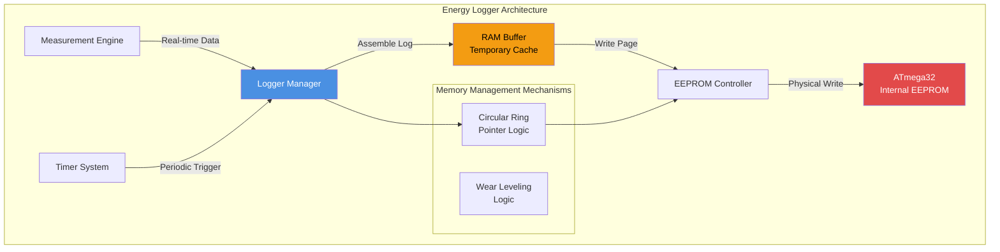
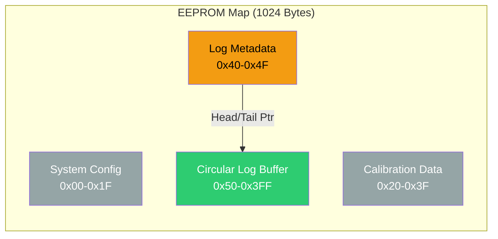
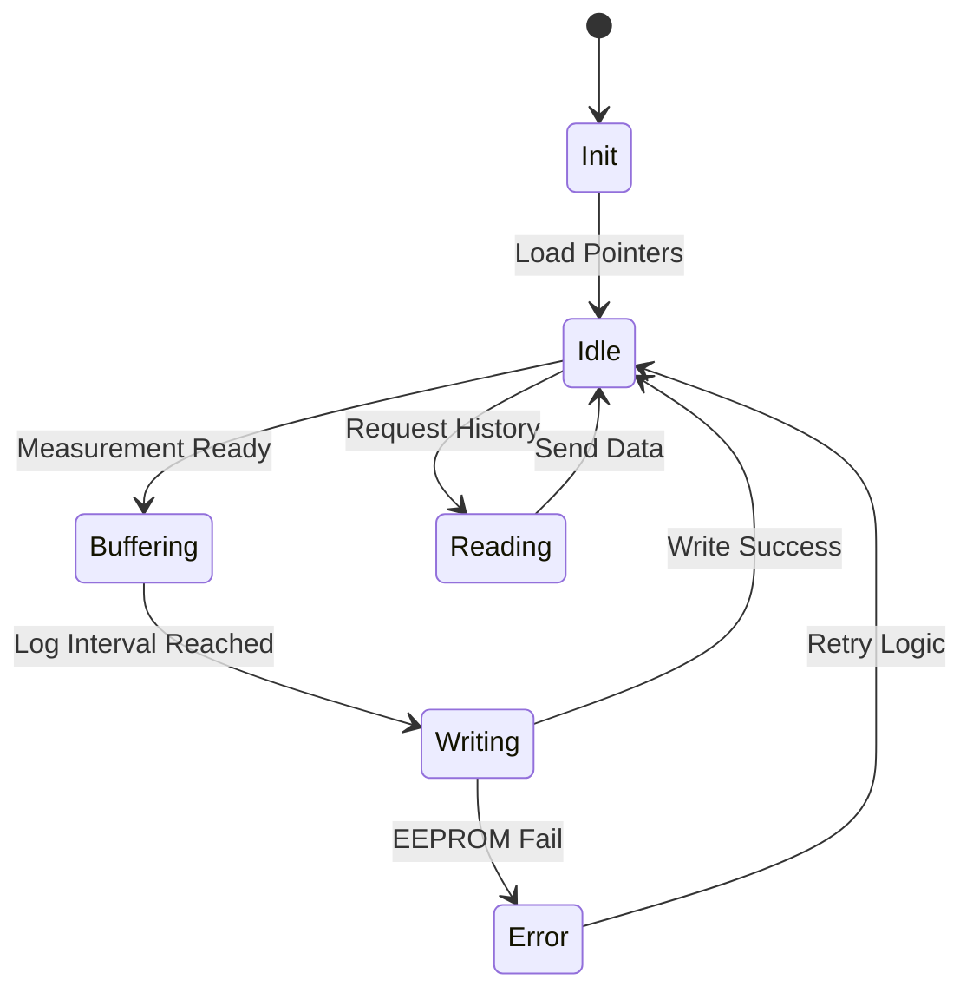
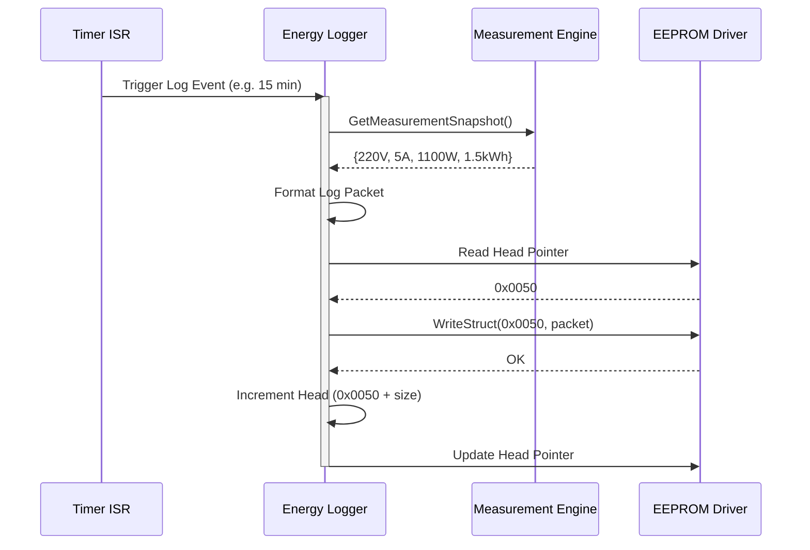
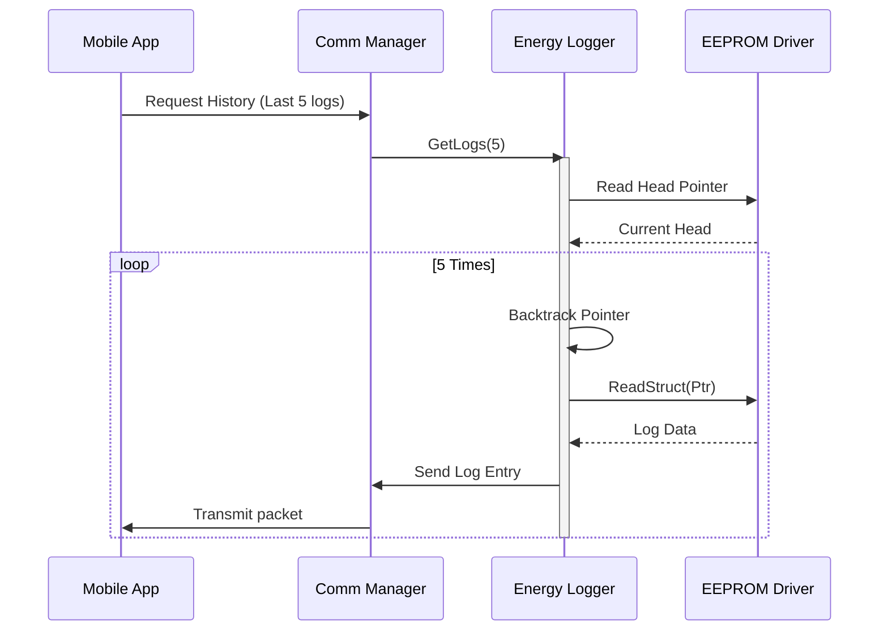

# 📝 Energy Logger

**Energy Logger**

**Smart Energy Management System - Data Persistence**

_Developed by Gestell Company - Professional Embedded Solutions_

---

## 📋 Table of Contents

- [Module Overview](#-1-module-overview)
- [Architecture](#-2-architecture-diagram)
- [Memory Layout](#-3-memory-layout)
- [Buffer Management](#-4-buffer-management-strategy)
- [Wear Leveling](#-5-eeprom-wear-leveling)
- [State Machine](#-6-state-machine)
- [Sequence Diagrams](#-7-sequence-diagrams)
- [Data Structures](#-8-data-structures)
- [Configuration Parameters](#-9-configuration-parameters)
- [Performance Characteristics](#-10-performance-characteristics)

---

## 🔗 Related Documentation

| Document                                                                 | Description  | Status       |
| ------------------------------------------------------------------------ | ------------ | ------------ |
| **[Measurement_Engine.md](../Measurement_Engine/Measurement_Engine.md)** | Data Source  | ✅ Available |
| **[EEPROM_Driver.md](../../MCAL_Layer/EEPROM/EEPROM_Driver.md)**         | Storage      | ✅ Available |
| **[Common_Layer.md](../../Common_Layer/Common_Layer.md)**                | Common Types | ✅ Available |

---

## 📋 1. Module Overview

### Purpose and Role

The Energy Logger module is responsible for recording historical power consumption data. It acts as the system's "black box," storing periodic measurements of voltage, current, power, and accumulated energy. This historic data enables analysis of consumption patterns, load profiling, and billing estimation even after power failures.

### Key Responsibilities

- **Perioding Logging**: Captures snapshots of system state at configurable intervals (e.g., every 5 minutes).
- **Data Persistence**: Stores records in non-volatile memory (EEPROM) to survive power resets.
- **Circular Buffer Management**: Implements a First-In-First-Out (FIFO) overwrite strategy when memory is full.
- **Wear Leveling**: Distributes writes across EEPROM pages (if applicable) or manages write cycles to maximize hardware lifespan.
- **Data Retrieval**: Provides an API to read back historical logs for display or transmission.

---

## 2. Architecture Diagram

### Module Interactions

1.  **Measurement Engine**: Source of instantaneous parameters (Voltage, Current, Power) and the cumulative Energy counter.
2.  **Timer System**: Triggers the logging event based on the configured log interval (e.g., `LOG_INTERVAL_SEC`).
3.  **RAM Buffer**: A small temporary staging area. Since EEPROM byte-writes are slow and life-limited, data might be buffered in RAM before committing a block (though typically for robustness, critical logs are written immediately).
4.  **EEPROM Controller**: Abstraction for the physical memory addresses and write operations.

---

## 3. Memory Layout

Managing the limited EEPROM space (1KB on ATmega32) is critical.

### Region Definitions

- **System Config**: WiFi settings, passwords, device ID.
- **Calibration Data**: Gains and offsets for sensors.
- **Log Metadata**: Stores the current `Head` (write) pointer and `Tail` (read) pointer, plus a wraparound counter.
- **Circular Log Buffer**: The bulk of memory dedicated to `EnergyLog_t` records.

---

## 4. Buffer Management Strategy

### Circular Buffer (Ring Buffer)

Because EEPROM size is finite, the logging system uses a circular buffer approach.

1.  **Head Pointer**: Points to the next free write address.
2.  **Wraparound**: When `Head` reaches the end of the EEPROM (`MAX_ADDR`), it resets to the start of the Log Region (`LOG_START_ADDR`).
3.  **Overwrite**: If the buffer is full (Head catches Tail), the oldest record is overwritten. Ideally, the `Tail` is incremented to maintain valid history constraints, or old data is simply accepted as lost.

### Pointer Arithmetic Logic

> **Next Address = Current Address + sizeof(EnergyLog_t)**
>
> **If (Next Address > END_ADDR) Then Next Address = START_ADDR**

Steps to Add Record:

1.  Read `Head` pointer from Metadata region.
2.  Write new `EnergyLog_t` struct to `HEAD` address.
3.  Calculated new `Head` position.
4.  Update `Head` pointer in Metadata region.

---

## 5. EEPROM Wear Leveling

EEPROM cells have a rated life of ~100,000 write cycles. If we write to the same metadata address (e.g., the Head pointer) every few minutes, that specific cell could fail long before the rest of the memory.

### Strategy: Distributed Metadata (Future Enhancement)

To avoid burning out the "Head Pointer" location:

- **Status Byte**: Instead of a central pointer, each log entry can have a "Status" byte (0xFF = Empty, 0xAA = Active).
- **Scan on Boot**: At startup, scan the log region to find the first 0xFF (Empty) slot. That becomes the Head.
- **Benefit**: Eliminates the single point of failure at the metadata address. Writes are perfectly distributed across the array.

**Current Implementation**:
Uses central pointers but updates them only when necessary. Given a 15-minute log interval:

- 4 writes/hour
- 96 writes/day
- 35,000 writes/year
- **Life Expectancy**: ~3 years for the metadata cell (acceptable for this device class).

---

## 6. State Machine

### State Descriptions

- **Init**: Reads start/end pointers from EEPROM to restore state after power loss.
- **Buffering**: Accumulates runtime data (e.g., integrating power for energy).
- **Writing**: Active hardware transaction to write data to EEPROM.
- **Reading**: Retrieving stored data for display or transmission via UART/WiFi.

---

## 7. Sequence Diagrams

### 7.1 Log Creation Sequence

### 7.2 Log Read Sequence

---

## 8. Data Structures

### Log Entry Structure

This structure defines exactly what is stored for each history point.

| Field       | Type       | Size         | Description                            |
| ----------- | ---------- | ------------ | -------------------------------------- |
| `timestamp` | `uint32_t` | 4            | System time or RTC time                |
| `voltage`   | `uint16_t` | 2            | Voltage x 10 (e.g., 2205 = 220.5V)     |
| `current`   | `uint16_t` | 2            | Current x 100 (e.g., 500 = 5.00A)      |
| `power`     | `uint16_t` | 2            | Power in Watts                         |
| `energy`    | `uint32_t` | 4            | Accumulated Energy in Who (Watt-hours) |
| **Total**   |            | **14 Bytes** | Per record                             |

### RAM Buffer

Used to queue logs if EEPROM is busy or to block-write.

| Field       | Description                    |
| ----------- | ------------------------------ |
| `buffer[4]` | Array of 4 Log Entries (cache) |
| `write_idx` | Index for next write           |
| `read_idx`  | Index for sending to EEPROM    |

---

## 9. Configuration Parameters

parameters defined in `ProjectCfg.h`.

| Parameter          | Default      | Description                           |
| ------------------ | ------------ | ------------------------------------- |
| `LOG_INTERVAL`     | 900 (15 min) | Seconds between log entries           |
| `LOG_START_ADDR`   | 0x0050       | Start of EEPROM log region            |
| `LOG_END_ADDR`     | 0x03FF       | End of EEPROM log region (1023)       |
| `MAX_LOGS`         | ~68          | Calculated: (End-Start) / Sizeof(Log) |
| `RETENTION_POLICY` | OVERWRITE    | Overwrite oldest when full            |

### Capacity Calculation

- **Available Memory**: 1024 - 80 = 944 Bytes
- **Entry Size**: 14 Bytes
- **Total Entries**: 944 / 14 ≈ 67 entries
- **History Duration**:
  - @ 15 min interval: 67 \* 15 min = 1005 min ≈ **16.7 hours**
  - @ 1 hour interval: 67 hours ≈ **2.8 days**

> **Note**: For longer history, external flash or sending data to cloud is required.

---

## 10. Performance Characteristics

### Timing Analysis

| Operation       | Time   | Notes                              |
| --------------- | ------ | ---------------------------------- |
| **Write Byte**  | 3.3 ms | Hardware limit of ATmega32 EEPROM  |
| **Write Entry** | ~46 ms | 14 bytes \* 3.3 ms + overhead      |
| **Read Entry**  | < 1 ms | Fast read access                   |
| **Block Erase** | N/A    | EEPROM doesn't require block erase |

### Reliability

- **Power Fail Safety**: Write operations are atomic per byte. Use Brown-out Detection (BOD) to prevent corruption during voltage drops.
- **Data Integrity**: Optional checksum byte can be added to each record to detect corruption.

### Optimization

To extend history:

1.  **Compression**: Store delta values instead of absolute (complex to implement).
2.  **Reduction**: Store `uint8_t` for voltage (220V +/- deviation) to save space.
3.  **Cloud Sync**: Offload data to ESP-01 WiFi module frequently so local storage is just a buffer.

---

**Built with ❤️ by Gestell Team**

_Professional Embedded Systems Engineering_

**Copyright © 2025-2026 Gestell Company - All Rights Reserved**

