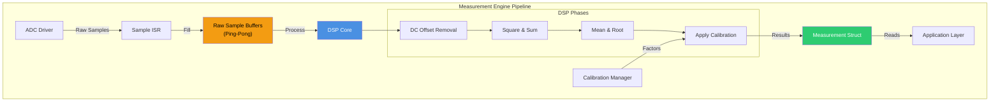
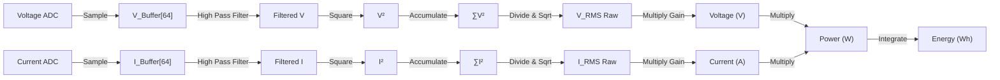
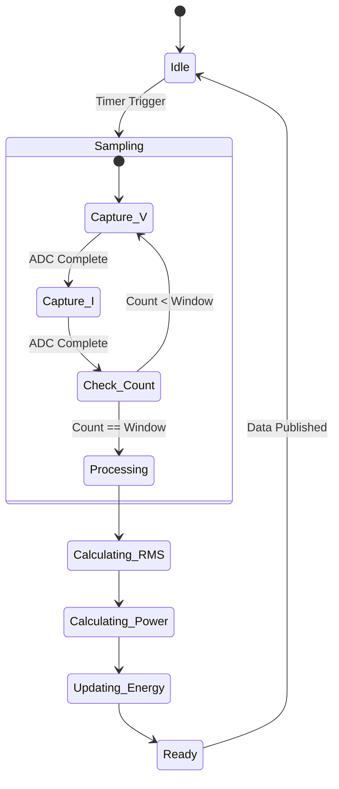
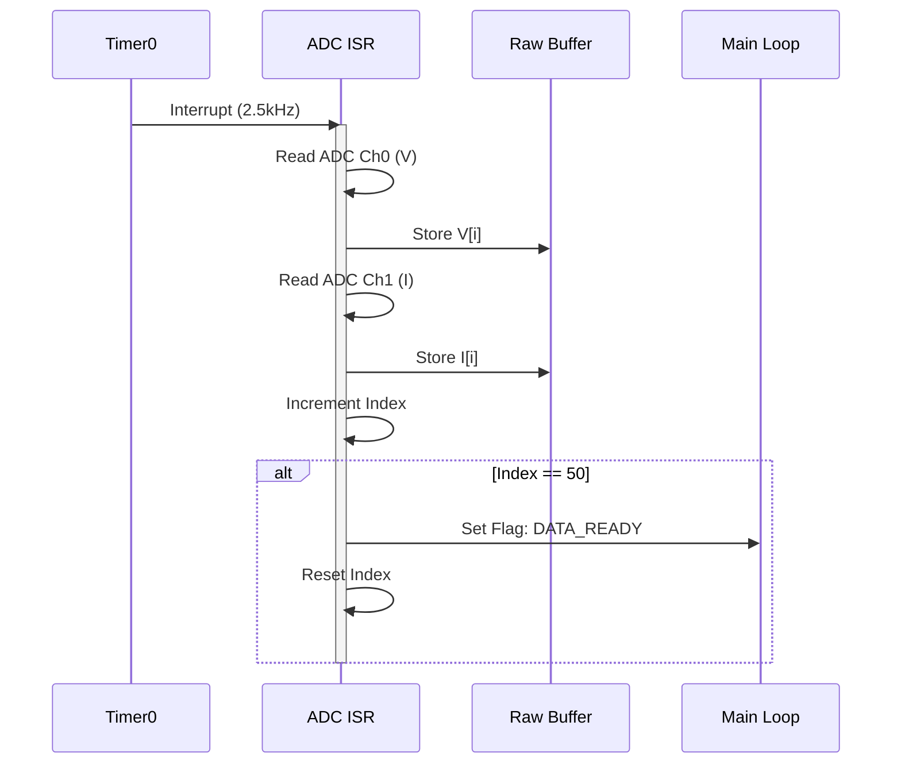
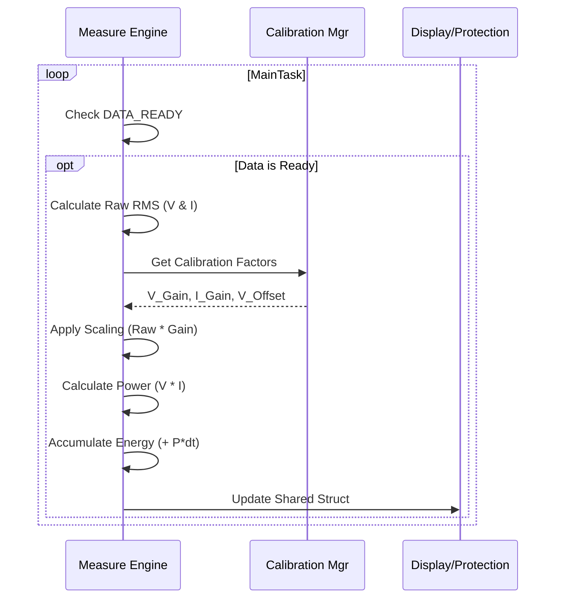
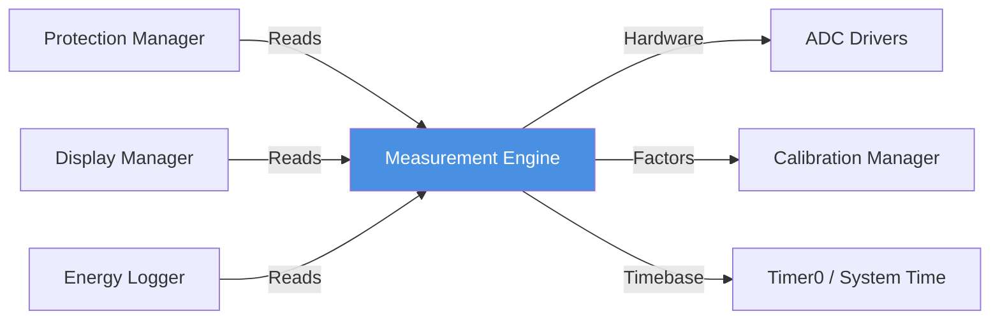

# 📊 Measurement Engine

**Measurement Engine**

**Smart Energy Management System - Digital Signal Processing Core**

_Developed by Gestell Company - Professional Embedded Solutions_

---

## 📋 Table of Contents

- [Module Overview](#-1-module-overview)
- [Architecture](#-2-architecture-diagram)
- [Processing Pipeline](#-3-signal-processing-pipeline)
- [Algorithms](#-4-algorithms-and-math)
- [State Machine](#-5-state-machine)
- [Sequence Diagrams](#-6-sequence-diagrams)
- [Data Structures](#-7-data-structures)
- [Configuration](#-8-configuration-parameters)
- [Accuracy Analysis](#-9-accuracy-and-performance)
- [Dependencies](#-10-module-dependencies)

---

## 🔗 Related Documentation

| Document                                                                    | Description      | Status       |
| --------------------------------------------------------------------------- | ---------------- | ------------ |
| **[ADC_Driver.md](../../MCAL_Layer/ADC/ADC_Driver.md)**                     | Analog Hardware  | ✅ Available |
| **[Calibration_Manager.md](../Calibration_Manager/Calibration_Manager.md)** | Accuracy Control | ✅ Available |
| **[Voltage_Sensor.md](../../HAL_Layer/Voltage_Sensor/Voltage_Sensor.md)**   | Sensor Specs     | ✅ Available |

---

## 📋 1. Module Overview

### Purpose and Role

The Measurement Engine (ME) is the system's "mathematical heart." It converts raw analog signals sampled by the ADC into meaningful electrical units (Volts, Amps, Watts, kWh). It implements Digital Signal Processing (DSP) algorithms to calculate Root Mean Square (RMS) values for alternating current (AC) signals, ensuring accurate readings even for non-sinusoidal loads.

### Key Responsibilities

- **Data Acquisition**: Orchestrates sampling of Voltage and Current channels.
- **RMS Calculation**: Computes True RMS values for Voltage and Current.
- **Power Calculation**: Derives Active Power (Watts), Apparent Power (VA), and Power Factor (PF).
- **Energy Integration**: Accumulates power over time to calculate Energy consumption (kWh).
- **Zero-Crossing Detection**: Synchronizes measurements with the AC mains frequency (50/60Hz).

### Requirements Traceability

| Requirement ID   | Description        | Implementation                       |
| :--------------- | :----------------- | :----------------------------------- |
| **REQ-MEAS-016** | RMS Calculation    | Sum of Squares Algorithm implemented |
| **REQ-MEAS-011** | Power Calculation  | P = V _ I _ PF implemented           |
| **REQ-MEAS-015** | Energy Integration | E = P \* dt implemented              |

---

## 2. Architecture Diagram

### Pipeline Concept

1.  **Acquisition Phase** (Interrupt Context): High-speed sampling (e.g., 2.5 kHz) triggered by timer. Stores raw ADC counts (0-1023).
2.  **Processing Phase** (Main Loop): Triggered when a buffer is full. Performs math heavy lifting (float/long calculations) to avoid blocking interrupts.
3.  **Publication Phase**: Updates global data structures available to Display and Communications.

---

## 3. Signal Processing Pipeline

### Detailed Data Flow

---

## 4. Algorithms and Math

Since the MCU (ATmega32) has no FPU (Floating Point Unit), algorithms must be optimized.

### 4.1 RMS Calculation (True RMS)

The Root Mean Square value is defined as:

$$ V\_{RMS} = \sqrt{ \frac{1}{N} \sum\_{n=0}^{N-1} V[n]^2 } $$

**Implementation Steps**:

1.  **Remove DC Offset**: $V\_{AC} = V\_{Raw} - V\_{Offset}$ (where offset is approx 512).
2.  **Square**: $Accumulator += V\_{AC} \times V\_{AC}$.
3.  **Average**: $MeanSquare = Accumulator / SampleCount$.
4.  **Root**: $RMS\_{Raw} = \sqrt{MeanSquare}$.

### 4.2 Power Calculation

**Active Power (Real Power)**:
$$ P = V\_{RMS} \times I\_{RMS} \times \cos(\phi) $$

_Note: For Phase 1 implementation, assuming resistive load or calculating Apparent Power (VA) directly as $V \times I$._

### 4.3 Energy Calculation

Energy is the integral of power over time.

$$ E = \int P(t) dt \approx \sum (P\_{avg} \times \Delta t) $$

**Accumulator Logic**:

- `EnergyAccumulater += Power_Watts * UpdateInterval_Seconds`
- Convert unit: `Energy_Wh = EnergyAccumulator / 3600`
- Since 3600 is large and Watt-Hours accumulate slowly, we use internal `micro_watt_hours` or `milli_joules` counter to preserve precision.

---

## 5. State Machine

### State Descriptions

- **Idle**: Waiting for next 20ms AC cycle window.
- **Sampling**: Fast acquisition loop (Interleaved V/I samples).
- **Processing**: Calculations performed on "snapshot" data buffers. V and I buffers are locked.
- **Ready**: New valid measurements are available for other modules.

---

## 6. Sequence Diagrams

### 6.1 Sample Acquisition

### 6.2 Data Processing Workflow

---

## 7. Data Structures

### Measurement Output Structure

| Field          | Type     | Unit  | Description                 |
| -------------- | -------- | ----- | --------------------------- |
| `voltage_rms`  | `float`  | Volts | RMS Voltage (e.g., 220.5)   |
| `current_rms`  | `float`  | Amps  | RMS Current (e.g., 5.42)    |
| `power_active` | `float`  | Watts | Active Power (e.g., 1195.2) |
| `energy_total` | `double` | Wh    | Accumulated Energy          |
| `p_factor`     | `float`  | 0-1.0 | Power Factor (Optional)     |
| `frequency`    | `float`  | Hz    | Mains Frequency (Optional)  |

### Internal Buffers

| Buffer Name | Size | Type       | Usage                       |
| ----------- | ---- | ---------- | --------------------------- |
| `raw_volts` | 64   | `uint16_t` | Raw ADC samples for Voltage |
| `raw_amps`  | 64   | `uint16_t` | Raw ADC samples for Current |
| `sq_sum_v`  | 1    | `uint32_t` | Sum of squares accumulator  |

---

## 8. Configuration Parameters

Configured in `Measurement_Config.h`.

| Parameter        | Value   | Description                                            |
| ---------------- | ------- | ------------------------------------------------------ |
| `SAMPLE_RATE`    | 2500 Hz | Samples per second (for 50Hz, gives 50 samples/cycle)  |
| `WINDOW_SIZE`    | 50      | Number of samples per calculation window (20ms @ 50Hz) |
| `ADC_REF`        | 5.0 V   | ADC reference voltage                                  |
| `V_SENSOR_RATIO` | 100.0   | Resistor divider ratio                                 |
| `I_SENSOR_SENS`  | 66 mV/A | Current sensor sensitivity                             |
| `CALC_INTERVAL`  | 1000 ms | Frequency of updating user-facing values               |

---

## 9. Accuracy and Performance

### Accuracy Factors

1.  **ADC Quantization**: 10-bit ADC has 1024 steps.
    - Voltage Range 0-500V. Resolution $\approx 0.5V$.
    - Current Range 0-30A. Resolution $\approx 0.03A$.
    - _Improvement_: Oversampling helps improve effective resolution.
2.  **Noise**: System noise floor affects zero-current reading.
    - _Solution_: "Zero-Clamp" logic. Force current to 0A if read value < 0.05A.
3.  **Timing Jitter**: Variations in sample timing affect non-sinusoidal accuracy.
    - _Solution_: Use hardware timer interrupts for consistent sampling.

### Performance

- **CPU Load**: Interrupt runs every 400µs. ISR duration < 50µs (~12% load).
- **Math Overhead**: `sqrt()` is expensive. Processing runs only once per 20ms (AC cycle) or once per 1s (Display update).
- **Memory**:
  - Buffers: 64 _ 2 _ 2 = 256 bytes SRAM.
  - Structs: ~40 bytes.
  - Total: ~300 bytes (Fits comfortably in 2KB SRAM).

---

## 10. Module Dependencies

- **Hardware**: Strictly dependent on ADC configuration.
- **Consumers**: Provides data to almost all Application Layer modules.

---

**Built with ❤️ by Gestell Team**

_Professional Embedded Systems Engineering_

**Copyright © 2025-2026 Gestell Company - All Rights Reserved**

