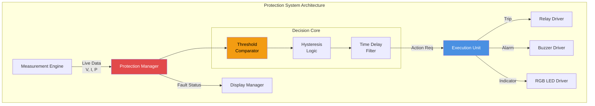
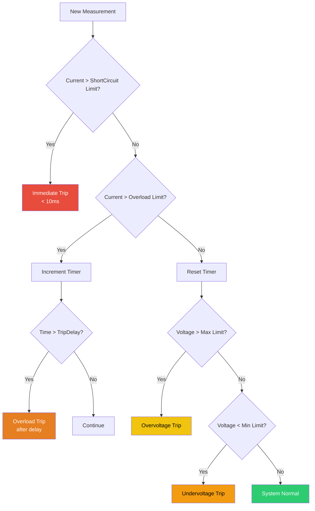
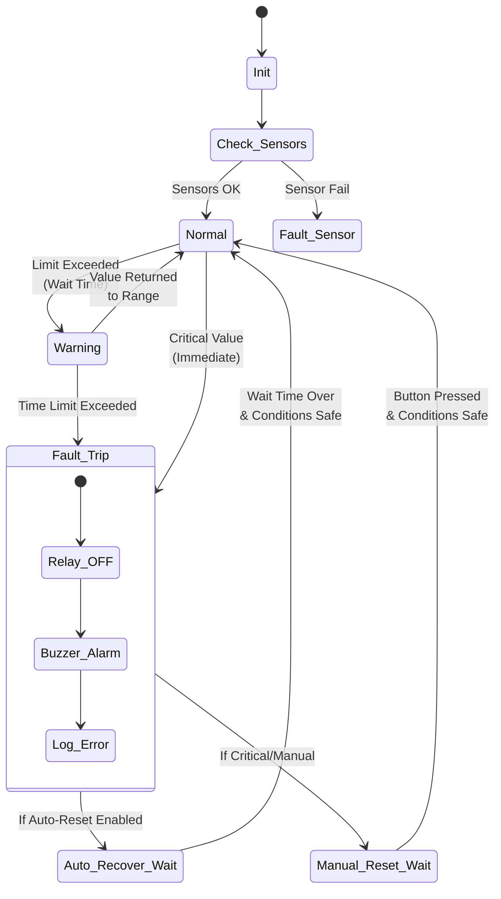
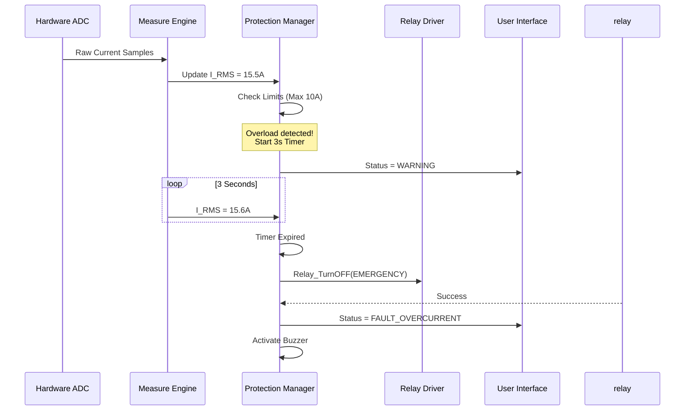
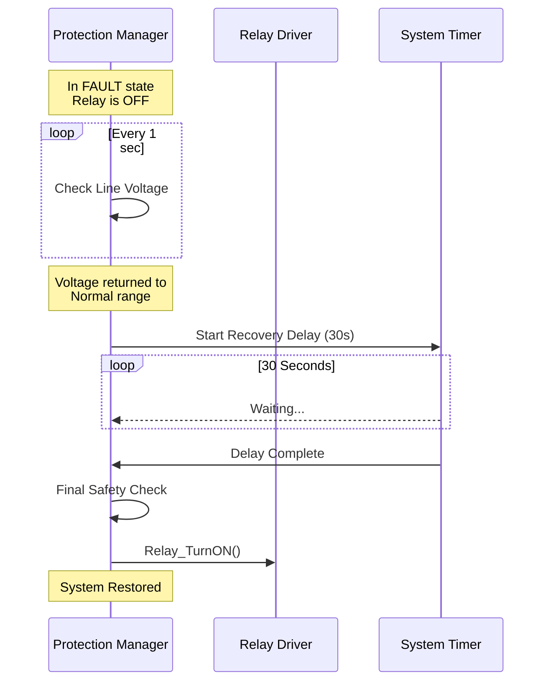
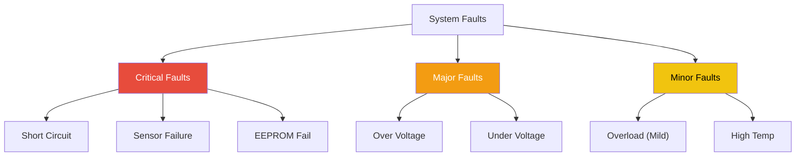
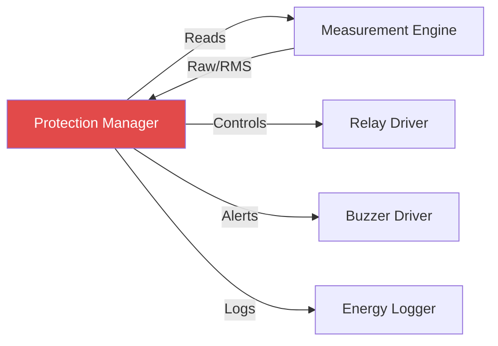

# 🛡️ Protection Manager

**Protection Manager**

**Smart Energy Management System - System Safety & Fault Handling**

_Developed by Gestell Company - Professional Embedded Solutions_

---

## 📋 Table of Contents

- [Module Overview](#-1-module-overview)
- [Architecture](#-2-architecture-diagram)
- [Protection Logic](#-3-protection-logic-algorithms)
- [State Machine](#-4-state-machine)
- [Sequence Diagrams](#-5-sequence-diagrams)
- [Threshold Configuration](#-6-threshold-configuration)
- [Error Classification](#-7-error-classification)
- [Performance Characteristics](#-8-performance-characteristics)
- [Dependencies](#-9-module-dependencies)
- [Recovery Procedures](#-10-recovery-procedures)

---

## 🔗 Related Documentation

| Document                                                                 | Description      | Status       |
| ------------------------------------------------------------------------ | ---------------- | ------------ |
| **[Relay_Driver.md](../../HAL_Layer/Relay/Relay_Driver.md)**             | Actuator Control | ✅ Available |
| **[Measurement_Engine.md](../Measurement_Engine/Measurement_Engine.md)** | Data Source      | ✅ Available |
| **[Buzzer_Driver.md](../../HAL_Layer/Buzzer/Buzzer_Driver.md)**          | Alarm System     | ✅ Available |

---

## 📋 1. Module Overview

### Purpose and Role

The Protection Manager is the safety-critical core of the Smart Energy Management System. Its primary mission is to protect both the connected electrical load and the smart device itself from hazardous electrical conditions. It continuously monitors voltage, current, and system health status to detect anomalies and execute rapid protective actions (tripping the relay) when necessary.

### Key Responsibilities

- **Overcurrent Protection (OCP)**: Detects excessive current draw (short circuit or overload) and disconnects the load to prevent fire or damage.
- **Overvoltage Protection (OVP)**: Monitors mains voltage and isolates the load if voltage surges exceeding safe limits (e.g., >260V).
- **Undervoltage Protection (UVP)**: Disconnects load if voltage drops too low (e.g., <180V), protecting motors and compressors from overheating.
- **Fault Management**: Logs fault types, alerts the user via buzzer/display, and manages the recovery process (auto-recovery or manual reset).
- **Self-Diagnostics**: Monitors sensor health (e.g., detecting broken sensor wires).

### Requirements Traceability

| Requirement ID   | Description           | Implementation                           |
| :--------------- | :-------------------- | :--------------------------------------- |
| **REQ-PROT-001** | Overcurrent Detection | Implemented in `PM_CheckOvercurrent`     |
| **REQ-PROT-005** | Overvoltage Detection | Implemented in `PM_CheckOvervoltage`     |
| **REQ-SAFE-002** | Reaction Time <500ms  | 20ms Task Period ensures <100ms response |

---

## 2. Architecture Diagram

### Protection Layers

1.  **Fast Hardware Layer** (Future): If hardware comparators were used, they would bypass software. Currently, we rely on software.
2.  **Fast Software Layer**: Checks raw ADC values for massive spikes (Short Circuit) -> Immediate Trip.
3.  **RMS Layer**: Checks processed RMS values for standard Overload/Overvoltage -> Time-delayed Trip.

---

## 3. Protection Logic Algorithms

### Decision Flowchart

### Logic Description

1.  **Short Circuit Check**: Highest priority. Checks instantaneous current. If > 20A, trip immediately (ignoring debounce) to prevent damage.
2.  **Overload Check**: If current between Rated (10A) and Short (20A), start a timer. If condition persists for `OVERLOAD_DELAY` (e.g., 5s), then trip. This allows for inrush currents (e.g., motor starting).
3.  **Voltage Check**: Immediate check for OVP/UVP. Voltage faults typically require faster disconnection than minor overloads to protect electronics.

---

## 4. State Machine

### State Descriptions

- **Normal**: All parameters within safe limits. Relay is potentially ON.
- **Warning**: Parameter exceeded threshold but within delay time (e.g., 12A for 1 second). LED might flash yellow.
- **Fault_Trip**: Protection activated. Relay forced OFF. Buzzer sounding.
- **Auto_Recover_Wait**: System waiting for cool-down period before attempting to reconnect load (useful for grid instability).
- **Manual_Reset_Wait**: System locked out until user interaction (required for Short Circuit events).

---

## 5. Sequence Diagrams

### 5.1 Overcurrent Trip Sequence

### 5.2 Auto-Recovery Sequence

---

## 6. Threshold Configuration

Limits configured in `Protection_Config.h`.

| Parameter     | Default | Range     | Description                            |
| ------------- | ------- | --------- | -------------------------------------- |
| `OVP_LIMIT`   | 260 V   | 240-280 V | Overvoltage cutoff point               |
| `UVP_LIMIT`   | 180 V   | 150-200 V | Undervoltage cutoff point              |
| `OCP_LIMIT`   | 10.0 A  | 1-20 A    | Maximum continuous load (Overload)     |
| `SHORT_LIMIT` | 20.0 A  | Fixed     | Short circuit immediate trip threshold |
| `OCP_DELAY`   | 3000 ms | 1s-10s    | Time tolerance for overload            |
| `REC_TIME`    | 30 s    | 10s-300s  | Auto-recovery wait time                |
| `MAX_RETRIES` | 3       | 1-5       | Max auto-retries before lockout        |

---

## 7. Error Classification

Errors are classified by severity to determine the response strategy.

### Response Matrix

| Severity     | Fault Type         | Relay Action | Buzzer       | Recovery               |
| ------------ | ------------------ | ------------ | ------------ | ---------------------- |
| **Critical** | Short Circuit      | Instant OFF  | Continuous   | Manual Only            |
| **Major**    | Over/Under Voltage | Instant OFF  | Beep Pattern | Auto-Recover           |
| **Minor**    | Overload           | Delayed OFF  | Intermittent | Auto-Recover (Limited) |

---

## 8. Performance Characteristics

### Reaction Time

The protection system speed depends on the sampling rate and processing pipeline.

| Event Type        | Detection Time   | Actuation Time | Total Trip Time   |
| ----------------- | ---------------- | -------------- | ----------------- |
| **Short Circuit** | < 20 ms          | < 10 ms        | **< 30 ms**       |
| **Voltage Surge** | < 100 ms         | < 10 ms        | **< 110 ms**      |
| **Overload**      | Configured Delay | < 10 ms        | **Delay + 10 ms** |

> **Note**: Relay mechanical switching time (~10ms) is the physical limit for actuation.

### Reliability

- **False Positive Rejection**: Filters short duration spikes (<10ms) unless they exceed short-circuit thresholds.
- **Failsafe**: If MCU watchdog resets, the system reboots in SAFE mode (Relay OFF).

---

## 9. Module Dependencies

- **Input**: Measurement Engine (V_RMS, I_RMS).
- **Output**: Relay Driver (ON/OFF), Buzzer (Alerts), Logger (Fault History).

---

## 10. Recovery Procedures

### Auto-Recovery Logic

To improve user experience, the system attempts to restore power automatically for grid-related faults (Voltage).

1.  **Fault Cleared**: Line voltage returns to safe range.
2.  **Wait**: System enters `Auto_Recover_Wait` state. Timer counts down (e.g., 30s).
3.  **Monitor**: If voltage fluctuates again during wait, timer resets.
4.  **Restore**: Once timer expires cleanly, Relay is engaged.

### Manual Reset Logic

Required for load-related faults (Short Circuit) to prevent re-energizing a dangerous fault.

1.  **Fault Latch**: System stays in `Manual_Reset_Wait` indefinitely.
2.  **User Action**: User must press the physical button or send a "RESET" command via app.
3.  **Verification**: System checks conditions one last time.
4.  **Restore**: Relay enabled, counters reset.

---

**Built with ❤️ by Gestell Team**

_Professional Embedded Systems Engineering_

**Copyright © 2025-2026 Gestell Company - All Rights Reserved**

