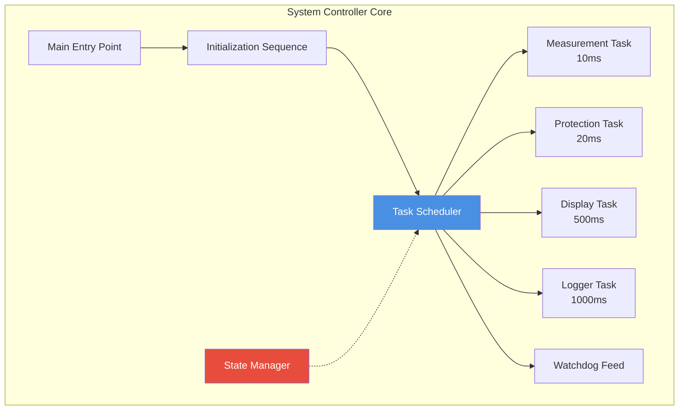
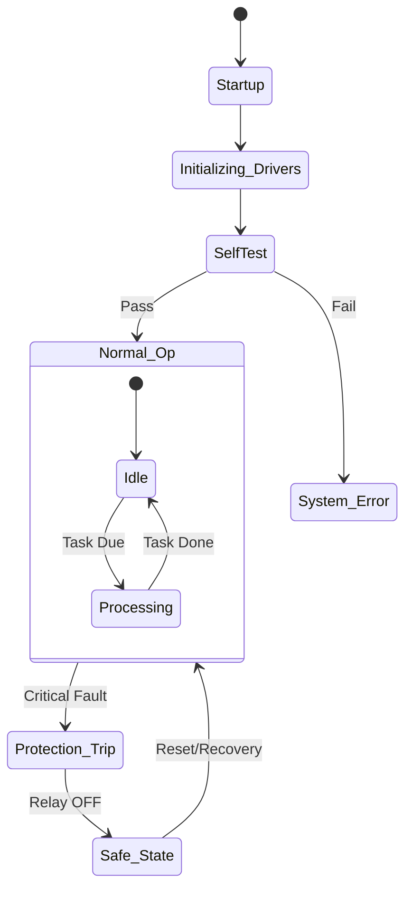

# 🧠 System Controller

**System Controller**

**Smart Energy Management System - Central State Machine**

_Developed by Gestell Company - Professional Embedded Solutions_

---

## 📋 Table of Contents

- [Module Overview](#-1-module-overview)
- [Architecture](#-2-architecture-diagram)
- [System State Machine](#-3-system-state-machine)
- [Boot Sequence](#-4-boot-sequence)
- [Task Scheduling](#-5-task-scheduling)
- [Power Management](#-6-power-management)
- [Dependencies](#-7-module-dependencies)

---

## 🔗 Related Documentation

| Document                                                                 | Description  | Status       |
| ------------------------------------------------------------------------ | ------------ | ------------ |
| **[Measurement_Engine.md](../Measurement_Engine/Measurement_Engine.md)** | Data Source  | ✅ Available |
| **[Protection_Manager.md](../Protection_Manager/Protection_Manager.md)** | Safety Logic | ✅ Available |
| **[GIE_Driver.md](../../MCAL_Layer/GIE/GIE_Driver.md)**                  | System Tick  | ✅ Available |

---

## 📋 1. Module Overview

### Purpose and Role

The System Controller is the top-level orchestrator of the firmware. It manages the global system state (Initialization, Normal Operation, Fault, Sleep), coordinates the startup sequence, and executes the main task scheduler. It ensures that all other modules (Measurement, Protection, Display) work in harmony.

### Key Responsibilities

- **Boot Orchestration**: Initializing MCAL, HAL, and App layers in the correct order.
- **Global State Management**: Transitioning between Safe, Application, and Error states.
- **Task Scheduling**: Executing periodic tasks (10ms, 100ms, 1000ms).
- **Watchdog Management**: Feeding the WDT to prevent system hangs.

### Requirements Traceability

| Requirement ID   | Description          | Implementation             |
| :--------------- | :------------------- | :------------------------- |
| **REQ-ARCH-005** | Bare-metal Superloop | Implemented in `Sys_Run()` |
| **REQ-ARCH-006** | Main Loop Freq 10Hz  | 100ms Task Slot            |
| **REQ-SAFE-001** | Fault Monitoring     | Global Error State         |

---

## 2. Architecture Diagram

---

## 3. System State Machine

---

## 4. Boot Sequence

1.  **MCAL Init**: Disable Interrupts -> Config Clock -> Init GPIO/UART/ADC/Timers.
2.  **HAL Init**: Init LCD -> Init Sensors -> Init Relay (OFF).
3.  **App Init**: Restore Config from EEPROM -> Init Measurement/Protection.
4.  **System Start**: Enable Global Interrupts (GIE) -> Start Scheduler.

---

## 5. Task Scheduling

The system uses a non-preemptive cooperative scheduler (superloop with time slicing).

| Task Name          | Period  | Priority | Description           |
| ------------------ | ------- | -------- | --------------------- |
| `Measure_Update()` | 10 ms   | High     | Process ADC buffers   |
| `Prot_Update()`    | 20 ms   | High     | Check safety limits   |
| `Comm_Update()`    | 50 ms   | Medium   | Process UART commands |
| `Display_Update()` | 500 ms  | Low      | Update LCD UI         |
| `Logger_Update()`  | 1000 ms | Low      | Save energy to EEPROM |

---

**Built with ❤️ by Gestell Team**

