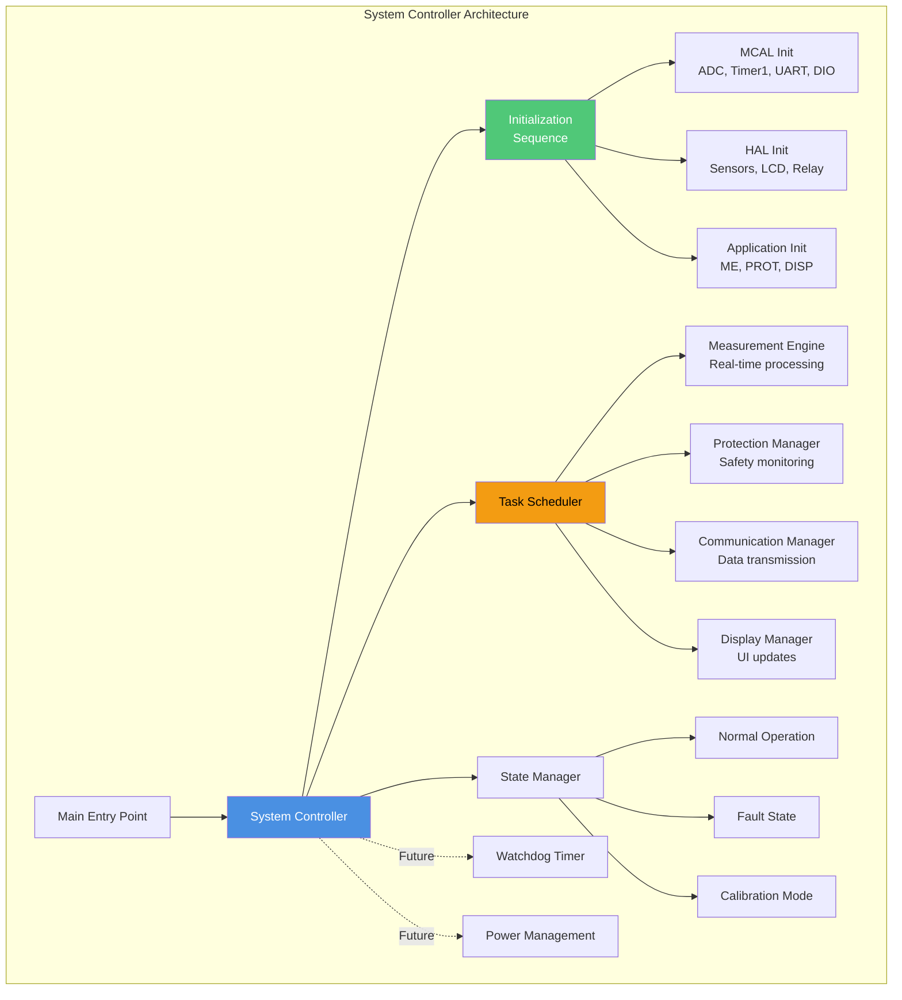
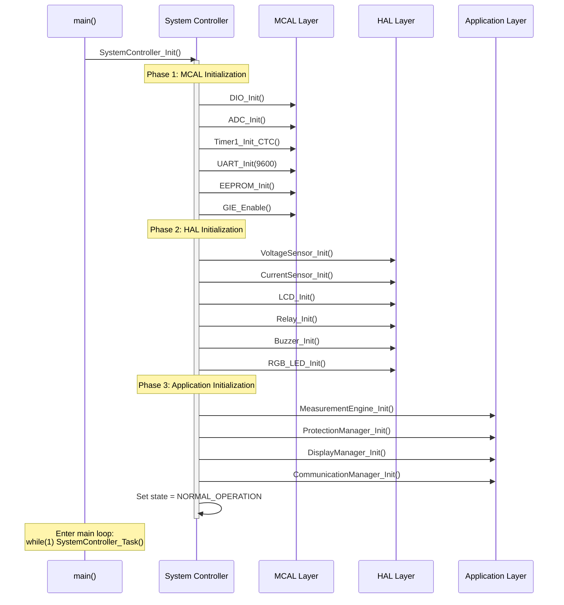
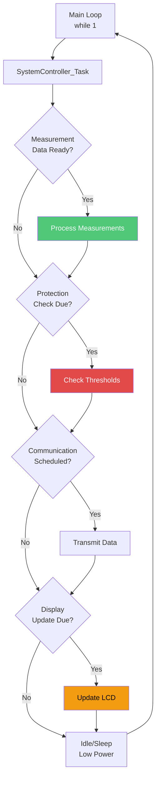
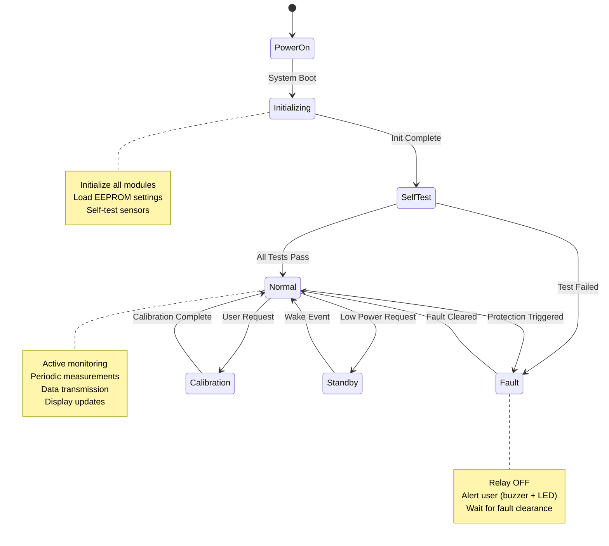
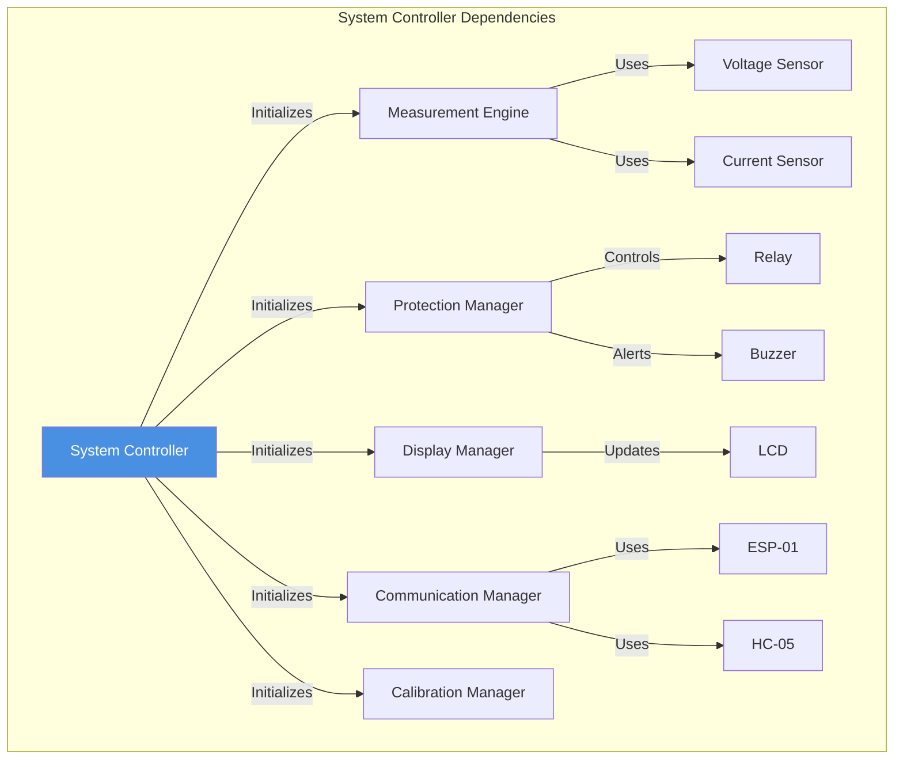

# System Controller - Main System Orchestration

**Purpose**: Overall system coordination and initialization  
**Layer**: Application  
**Role**: Main entry point and system lifecycle management

---

## 1. Module Overview

### Purpose and Role

The System Controller serves as the main orchestrator of the Smart Energy Management System, managing initialization of all subsystems, coordinating high-level tasks, and supervising system state transitions.

### Key Responsibilities

- Initialize all hardware and software modules in correct order
- Coordinate periodic tasks scheduling
- Manage system states and mode transitions
- Watchdog management (future)
- Power mode control (future)
- Error recovery orchestration

---

## 2. Architecture Diagram

---

## 3. Initialization Sequence

---

## 4. Task Scheduling

---

## 5. State Machine

---

## 6. Module Dependencies

---

## 7. Configuration Parameters

| Parameter          | Value    | Description                  |
| ------------------ | -------- | ---------------------------- |
| Task rate          | ~10 Hz   | Main loop iteration rate     |
| Watchdog timeout   | 1 second | Future WDT implementation    |
| Startup delay      | 100 ms   | Allow hardware stabilization |
| Self-test duration | 500 ms   | Sensor validation time       |

---

## 8. Error Handling

**Initialization Failures:**

- If MCAL init fails: Halt and blink error code
- If HAL init fails: Continue with degraded functionality
- If calibration data corrupted: Use defaults, flag for recalibration

**Runtime Errors:**

- Module fault: Disable affected module, log error
- Communication failure: Retry with backoff
- Critical fault: Enter safe state (relay OFF)

---

## 9. Performance Characteristics

**Boot Time:**

- Hardware init: ~50 ms
- Software init: ~100 ms
- Total boot: ~150 ms

**CPU Utilization:**

- Idle: ~5% (mainly measurements)
- Active: ~20% (with communication)
- Peak: ~40% (during complex processing)

**Memory Usage:**

- RAM: ~100 bytes (state variables)
- Flash: ~1 kB (initialization code)

---

## Implementation Notes

### Initialization Order

Critical order to prevent issues:

1. **DIO first**: Other peripherals need pins configured
2. **Timers before ADC**: ADC needs Timer1 trigger
3. **GIE last in MCAL**: Enable interrupts after all setup
4. **Sensors before engines**: ME needs sensor drivers ready

### Task Scheduling Strategy

- **No RTOS**: Simple cooperative multitasking
- **Periodic tasks**: Triggered by flags from ISRs
- **Priority**: Protection > Measurement > Display > Communication

---

**Document Version**: 2.0  
**Last Updated**: January 2026  
**Maintained By**: Gestell Engineering Team
