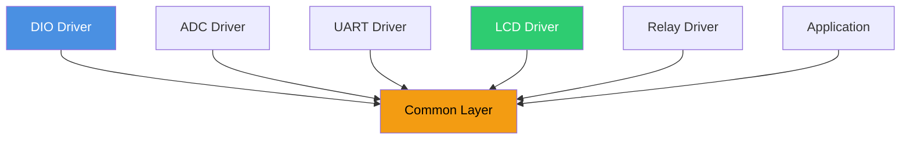

# 🧰 Common Layer

**Common Layer**

**Smart Energy Management System - Standard Types & Macros**

_Developed by Gestell Company - Professional Embedded Solutions_

---

## 📋 Table of Contents

- [Module Overview](#-1-module-overview)
- [Standard Data Types](#-2-standard-data-types)
- [Common Macros](#-3-common-macros)
- [Bit Manipulation](#-4-bit-manipulation-utilities)
- [Error Codes](#-5-global-error-codes)
- [Project Constants](#-6-project-constants)
- [Architecture Usage](#-7-architecture-usage)

---

## 🔗 Related Documentation

| Document                                                              | Description | Status       |
| --------------------------------------------------------------------- | ----------- | ------------ |
| **[Coding_Standards.md](../../Coding_Standards/Coding_Standards.md)** | Style Guide | ✅ Available |

---

## 📋 1. Module Overview

### Purpose and Role

The Common Layer (often referred to as `Std_Types` or `Common_Macros`) provides the foundational vocabulary for the entire software stack. It defines:

1.  **Platform-Independent Types**: Ensuring `uint8_t` is always 8-bits, regardless of the compiler.
2.  **Helper Macros**: Syntactic sugar for bitwise operations to improve readability.
3.  **Global Constants**: Project-wide settings like CPU frequency and boolean values.
4.  **Error Handling Types**: Unified return values for all driver functions.

By including this layer in every other module, we ensure consistency and portability.

---

## 2. Standard Data Types

To avoid ambiguity (e.g., is `int` 16-bit or 32-bit?), strictly use the C99 standard integer types.

| Type Definition | Bit Width | Range        | Usage Example                           |
| --------------- | --------- | ------------ | --------------------------------------- |
| `uint8_t`       | 8-bit     | 0 .. 255     | Counters, Loop Indices, Bytes           |
| `int8_t`        | 8-bit     | -128 .. +127 | Small signed offsets                    |
| `uint16_t`      | 16-bit    | 0 .. 65,535  | ADC Values (10-bit), Sizes              |
| `int16_t`       | 16-bit    | -32k .. +32k | Sensor readings with negative potential |
| `uint32_t`      | 32-bit    | 0 .. 4.2B    | Timestamps, Long Accumulators           |
| `float32`       | 32-bit    | Float        | Measurement math (Voltage, Power)       |

### Boolean Type

Standardization of logical values.

| Name    | Value | Description   |
| ------- | ----- | ------------- |
| `TRUE`  | `1`   | Logical True  |
| `FALSE` | `0`   | Logical False |

> **Note**: Do not compare strictly against TRUE (e.g., `if (x == TRUE)` is bad practice). Instead use `if (x)`.

---

## 3. Common Macros

These macros simplify coding and reduce the risk of bitwise errors.

### Bit Manipulation

| Macro Name | Arguments    | Description                    | Logic              |
| ---------- | ------------ | ------------------------------ | ------------------ | ----------- |
| `SET_BIT`  | `(REG, BIT)` | Sets a specific bit to 1       | `REG               | = (1<<BIT)` |
| `CLR_BIT`  | `(REG, BIT)` | Clears a specific bit to 0     | `REG &= ~(1<<BIT)` |
| `TOG_BIT`  | `(REG, BIT)` | Toggles bit state (0->1, 1->0) | `REG ^= (1<<BIT)`  |
| `GET_BIT`  | `(REG, BIT)` | Reads the value of a bit (0/1) | `((REG>>BIT) & 1)` |

**Usage Example**:

- Turn on LED: `SET_BIT(PORTB, PIN1);`
- Check Timer Flag: `if(GET_BIT(TIFR, TOV0))`

### Math Helpers

| Macro Name  | Arguments       | Description                     |
| ----------- | --------------- | ------------------------------- |
| `MIN`       | `(A, B)`        | Returns smaller of A and B      |
| `MAX`       | `(A, B)`        | Returns larger of A and B       |
| `ABS`       | `(A)`           | Returns absolute positive value |
| `CONSTRAIN` | `(X, Min, Max)` | Clamps X between limits         |

---

## 4. Bit Manipulation Utilities

Detailed explanation of how the bitwise macros operate at the hardware level.

### Setting a Bit (Read-Modify-Write)

1.  **Read**: CPU fetches current register value (e.g., `0b00000000`).
2.  **Modify**: OR operation with mask (e.g., `1<<2` = `0b00000100`).
3.  **Result**: `0b00000100`.
4.  **Write**: CPU writes back to register.

### Clearing a Bit

1.  **Mask Creation**: `1<<2` is `0b00000100`.
2.  **Inversion**: `~(Mask)` becomes `0b11111011`.
3.  **AND Operation**: `Register & Mask` clears only the target bit while preserving others.

---

## 5. Global Error Codes

Unified error handling for all drivers. Functions should return `Std_ReturnType`.

| Error Name     | Value  | Description                  |
| -------------- | ------ | ---------------------------- |
| `E_OK`         | `0x00` | Operation successful         |
| `E_NOT_OK`     | `0x01` | Generic failure              |
| `E_NULL_PTR`   | `0x02` | Pointer argument was NULL    |
| `E_TIMEOUT`    | `0x03` | Operation timed out          |
| `E_BUSY`       | `0x04` | Module is currently busy     |
| `E_RANGE`      | `0x05` | Parameter out of valid range |
| `E_CONNECTION` | `0x06` | Communication link failed    |

### Usage Standard

- **Check Returns**: Always check if a function returned `E_OK`.
- **Propagate Errors**: If a lower-level driver fails, pass the error up to the application.

---

## 6. Project Constants

Configuration values that must be consistent across the entire project.

### CPU Frequency

- `F_CPU`: **16,000,000 UL** (16 MHz)
- Vital for delay loops and baud rate calculations.
- Defined in Makefile, but fallback provided in Common header.

### Null Definition

- `NULL_PTR`: `((void*)0)`
- Used for initializing pointer variables.

### Interrupt Enable

- `ISR_ENABLE`: Global interrupt flag mask.
- `ISR_DISABLE`: Mask to clear global interrupts.

---

## 7. Architecture Usage

### Dependency Rules

1.  **Every File**: Must include `Common_Types.h` (indirectly or directly).
2.  **No Circular Deps**: Common Layer must NOT include any other module files.
3.  **Atomic**: It is self-contained and depends only on standard compiler libraries (`stdint.h`).

---

**Built with ❤️ by Gestell Team**

_Professional Embedded Systems Engineering_

**Copyright © 2025-2026 Gestell Company - All Rights Reserved**

