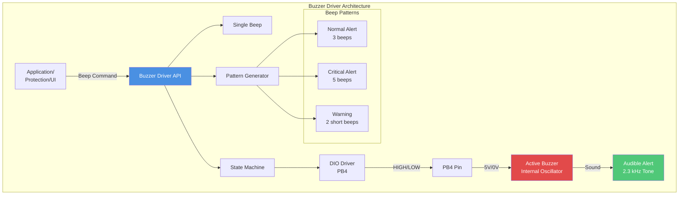
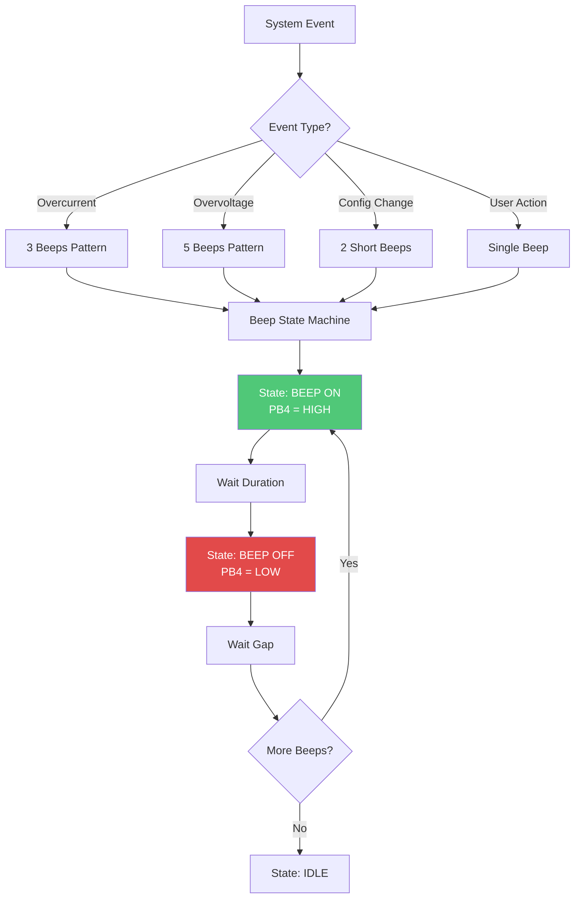
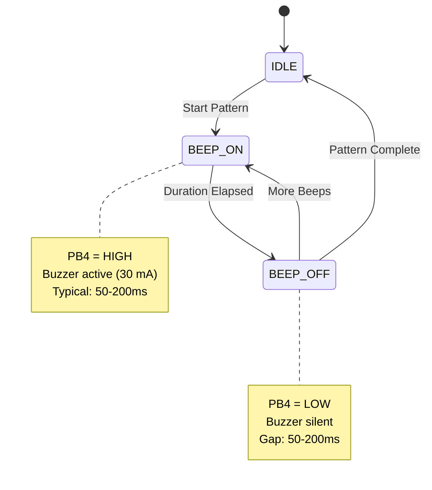
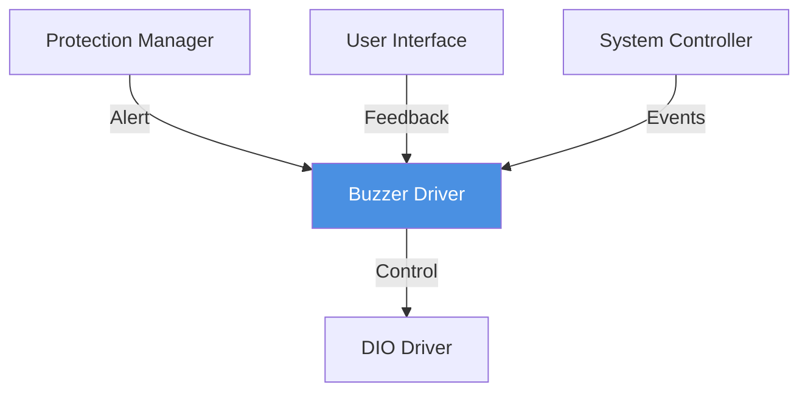

# Buzzer Driver - Audio Alert System

**Hardware**: Active 5V Buzzer  
**Control**: Digital ON/OFF via GPIO  
**Pin**: PB4  
**Purpose**: Audible feedback for system events and alerts

---

## 1. Module Overview

### Purpose and Role

The Buzzer driver provides audible feedback for system events, user actions, and protection alerts through an active buzzer that requires only a digital control signal.

### Key Responsibilities

- Generate single beeps and beep patterns
- Distinguish different alert types by pattern
- Non-blocking pattern execution
- Volume control (on/off only)
- Integration with protection and UI systems

### Hardware Component

- Type: Active buzzer with internal oscillator
- Operating voltage: 5V DC
- Frequency: 2.3 kHz ± 300 Hz (internal)
- Sound level: 85 dB @ 10 cm
- Current: ~30 mA when active

---

## 2. Architecture Diagram

---

## 3. Data Flow

---

## 4. State Machine

---

## 5. Beep Patterns

### Pattern Definitions

| Pattern        | Beeps | Duration | Gap   | Total Time | Use Case                 |
| -------------- | ----- | -------- | ----- | ---------- | ------------------------ |
| Single         | 1     | 150ms    | -     | 150ms      | User action confirmation |
| Warning        | 2     | 50ms     | 50ms  | 150ms      | Configuration change     |
| Normal Alert   | 3     | 100ms    | 100ms | 500ms      | Overcurrent protection   |
| Critical Alert | 5     | 100ms    | 100ms | 900ms      | Overvoltage protection   |

---

## 6. Module Dependencies

---

## 7. Configuration Parameters

| Parameter         | Value     | Description         |
| ----------------- | --------- | ------------------- |
| Min beep duration | 50ms      | Minimum audible     |
| Max beep duration | 500ms     | Maximum comfortable |
| Typical beep      | 100-150ms | Standard duration   |
| Gap duration      | 50-200ms  | Between beeps       |
| Max pattern time  | 2 seconds | User comfort limit  |

---

## 8. Performance Characteristics

**Power:**

- Active: 30 mA @ 5V
- Idle: < 1 µA
- Energy per beep: ~4.5 mJ (100ms @ 30mA)

**Timing:**

- Response time: < 1ms (GPIO switching)
- Pattern accuracy: ±5ms

---

## 9. Implementation Notes

### Non-Blocking Operation

Pattern execution via timer-based state machine allows main system to continue during beep sequences.

### Safety Considerations

- Limited pattern duration prevents user annoyance
- Distinct patterns for different alert types
- Silent failure acceptable (disconnected buzzer)

---

**Document Version**: 2.0  
**Last Updated**: January 2026  
**Maintained By**: Gestell Engineering Team
