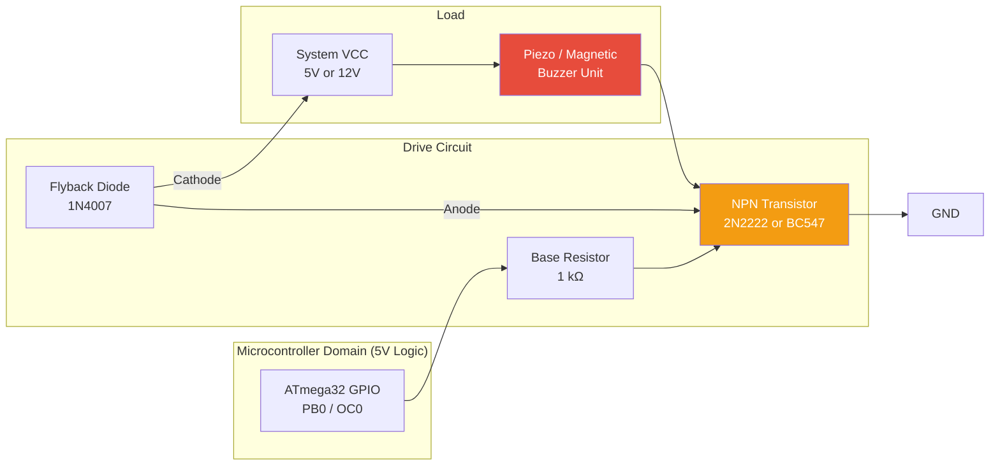
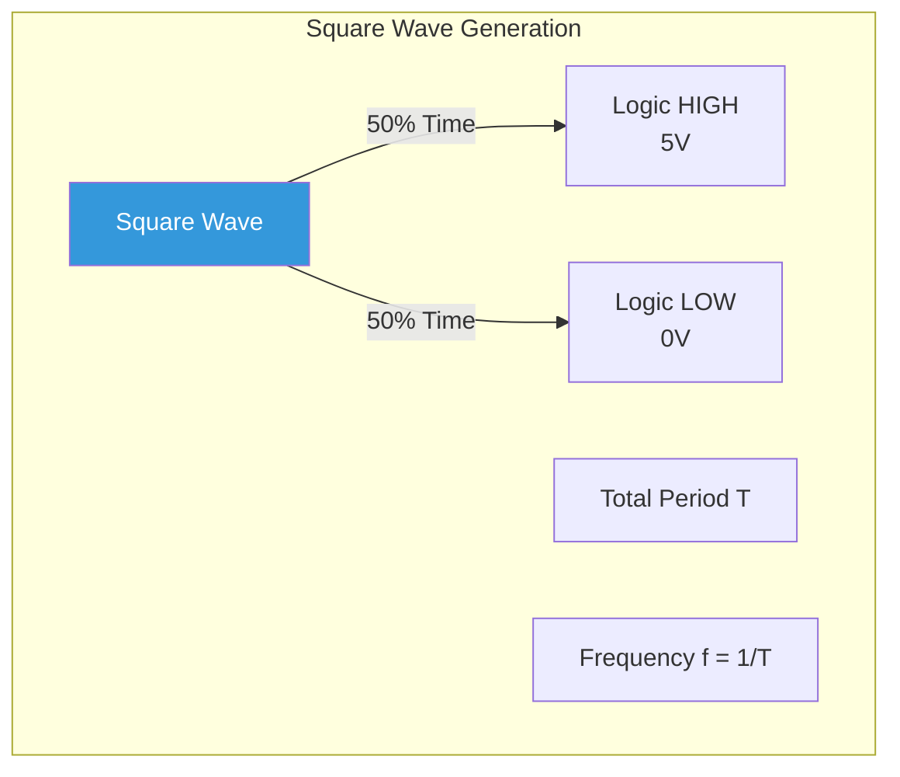
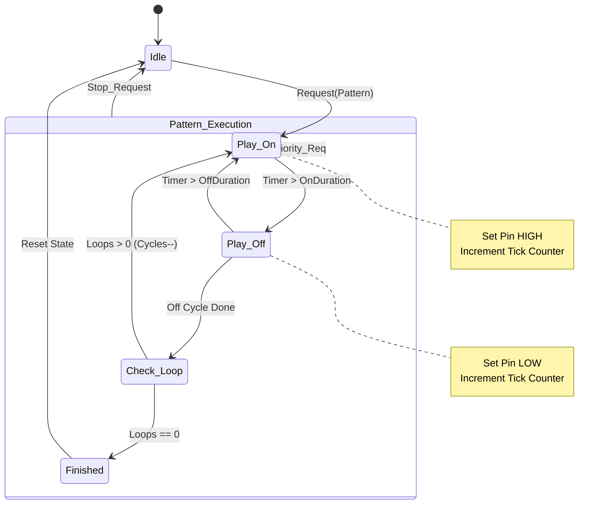
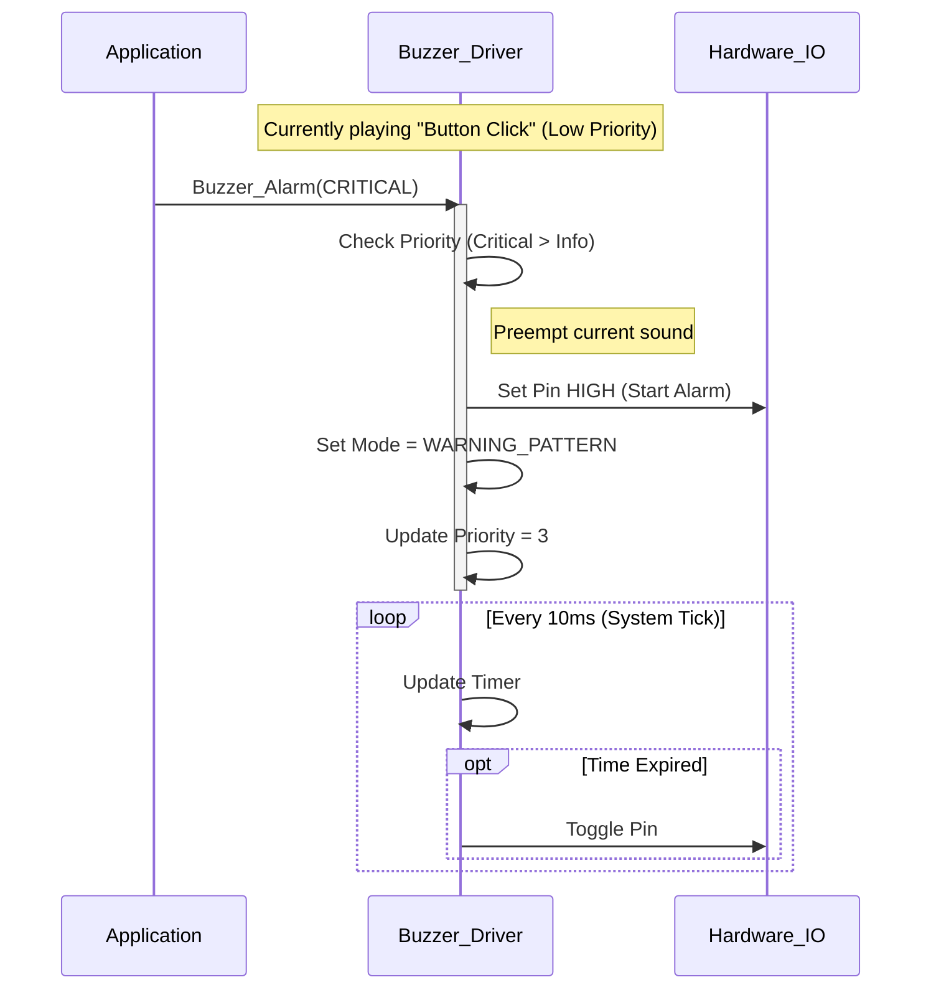
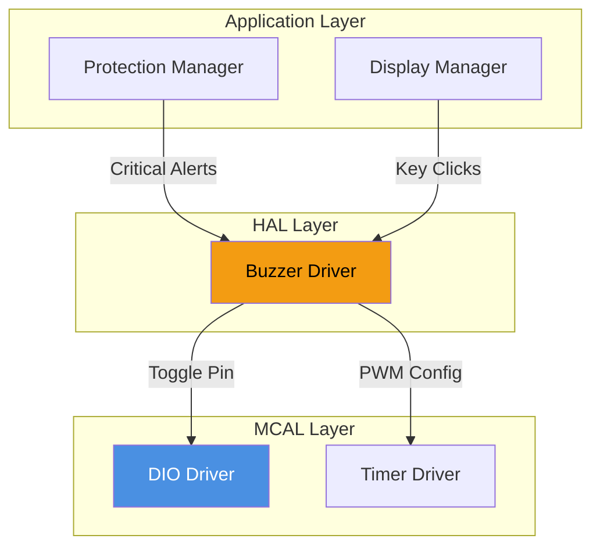

# 🔊 Buzzer Driver

<div align="center">


**Buzzer Driver**

**Smart Energy Management System - Audible Alert Controller & Melody Engine**

_Developed by Gestell Company - Professional Embedded Solutions_

</div>

---

## 📋 Table of Contents

- [Module Overview](#-1-module-overview)
- [Hardware Architecture](#-2-hardware-architecture)
- [Physics of Sound](#-3-physics-of-sound-generation)
- [PWM Signal Analysis](#-4-pwm-signal-analysis)
- [Melody Engine](#-5-melody-and-pattern-engine)
- [State Machine](#-6-state-machine)
- [Sequence Diagrams](#-7-sequence-diagrams)
- [Configuration](#-8-configuration-parameters)
- [Dependencies](#-9-module-dependencies)
- [Troubleshooting](#-10-troubleshooting-and-diagnostics)

---

## 🔗 Related Documentation

| Document                                                                                   | Description     | Status       |
| ------------------------------------------------------------------------------------------ | --------------- | ------------ |
| **[DIO_Driver.md](../../MCAL_Layer/DIO/DIO_Driver.md)**                                    | GPIO Control    | ✅ Available |
| **[Timer0_Driver.md](../../MCAL_Layer/Timer0/Timer0_Driver.md)**                           | PWM Source      | ✅ Available |
| **[System_Controller.md](../../Application_Layer/System_Controller/System_Controller.md)** | Task Scheduling | ✅ Available |

---

## 📋 1. Module Overview

### Purpose and Role

The Buzzer Driver is responsible for all audible feedback in the Smart Energy Management System. In an industrial or embedded environment, visual displays (LCD/LED) are not always within the user's field of view. The buzzer provides an immediate, attention-grabbing channel for critical alerts (e.g., Over-Current Trip) and subtle confirmation for user interactions (e.g., Button Key-press).

This driver abstracts the low-level hardware details (toggling GPIOs or configuring PWM registers) and presents a high-level API to the application layer. It supports both **Active Buzzers** (simple ON/OFF) and **Passive Buzzers** (frequency control for musical notes), though the specific implementation details below focus on a versatile hybrid approach.

### Key Responsibilities

- **State Control**: Managing the physical state of the output pin (High/Low).
- **Pattern Sequencing**: Executing temporal patterns (e.g., "Three short beeps" for error).
- **Priority Enforcement**: Ensuring high-priority safety alarms override low-priority UI sounds.
- **Non-Blocking Operation**: utilizing system ticks to manage durations without halting the CPU.
- **Frequency Generation** (Passive Mode): Configuring Timer registers to produce specific audible pitches.

### User Experience Goals

- **Distinctiveness**: A "Success" beep must sound different from a "Critical Fault" alarm.
- **Responsiveness**: Audio feedback should feel instantaneous (< 50ms latency) upon user action.
- **Annoyance Management**: Alarms should be loud enough to notify, but capability to mute or timeout is essential to prevent operator fatigue.

---

## 2. Hardware Architecture

The buzzer interface requires careful electrical design to protect the microcontroller from inductive kickback and to ensure sufficient drive current.

### 2.1 Electrical Schematic



### 2.2 Component Selection Analysis

1.  **Transistor (Q_DRIVE)**:
    - **Why?** A typical buzzer draws 30mA - 80mA. An ATmega32 pin can source max 20mA safely. Direct connection would damage the MCU.
    - **NPN Switch**: Used in "Low-Side" configuration. A HIGH signal on the base turns ON the collector-emitter path, grounding the buzzer.

2.  **Flyback Diode (DIODE)**:
    - **Why?** Magnetic buzzers contain a coil (inductor). When current is cut abruptly, the collapsing magnetic field generates a high-voltage spike (Back EMF) that can destroy the transistor.
    - **Action**: The diode provides a safe recirculation path for this current.

3.  **Active vs. Passive Types**:
    - **Active Buzzer**: Has internal oscillator. Apply specific voltage -> Sound @ fixed frequency (~2.5kHz). Easier to drive (Digital I/O).
    - **Passive Buzzer**: Speaker-like. Requires oscillating signal (PWM). Allows variable tone/pitch.

---

## 3. Physics of Sound Generation

To create meaningful alerts, we must understand how electrical signals translate to sound.

### 3.1 Frequency and Pitch

Sound is produced by vibrating air. The speed of vibration (Frequency in Hz) determines the "pitch".

- **2000 Hz - 4000 Hz**: Most sensitive range for human hearing. Ideal for alarms.
- **1000 Hz**: Softer, "polite" notification tone.
- **500 Hz**: Low, "boot-up" or "shutdown" thud.

### 3.2 Musical Note Table

For a Passive Buzzer, we generate square waves at these precise frequencies using Timer0 hardware PWM or software delays.

| Note   | Frequency (Hz) | Period (µs) | Half-Period (µs) | Usage Context      |
| ------ | -------------- | ----------- | ---------------- | ------------------ |
| **C5** | 523            | 1912        | 956              | Startup Low        |
| **E5** | 659            | 1517        | 758              | Harmony            |
| **G5** | 784            | 1275        | 637              | Startup High       |
| **C6** | 1047           | 955         | 477              | Standard Beep      |
| **A6** | 1760           | 568         | 284              | High Alert         |
| **C7** | 2093           | 477         | 239              | Critical Pattern 1 |
| **E7** | 2637           | 379         | 189              | Critical Pattern 2 |

### 3.3 Perception of Volume

Volume is determined by:

1.  **Voltage Amplitude**: Higher VCC = Louder.
2.  **Resonance**: Every buzzer has a "resonant frequency" where it is loudest (usually printed on the casing, e.g., 2300 Hz). Driving it at this exact frequency extracts maximum Sound Pressure Level (SPL) for minimum energy process.

---

## 4. PWM Signal Analysis

When using a Passive Buzzer, the system must generate a square wave.



### Calculation for Timer0 (8-bit)

To generate a 2.5 kHz tone (typical alarm):

1.  **Formulas**:
    $$ f*{PWM} = \frac{f*{CPU}}{N \cdot (1 + OCR0)} $$
    Where $N$ is Prescaler.
2.  **Target**: $f = 2500$ Hz. $f_{CPU} = 16,000,000$ Hz.
3.  **Prescaler Selection**: Try $N=64$.
4.  **OCR0 Calculation**:
    $$ 2500 = \frac{16000000}{64 \cdot (1 + OCR0)} $$
    $$ 1 + OCR0 = \frac{250000}{2500} = 100 $$
    $$ OCR0 = 99 $$

**Result**: Setting Timer0 to CTC Mode with Prescaler 64 and OCR0 = 99 generates a precise 2.5 kHz square wave on the output pin.

---

## 5. Melody and Pattern Engine

Instead of blocking the CPU with `_delay_ms()`, the driver implements a pattern engine processed in the background.

### 5.1 Pattern Structure

A generic pattern defines a sequence of On/Off states.

```text
Pattern: [OnTime_1, OffTime_1, OnTime_2, OffTime_2, ... LoopCount]
```

### 5.2 Pre-defined Alerts

| Alert Name      | Pattern Profile              | Visual description | Usage              |
| --------------- | ---------------------------- | ------------------ | ------------------ |
| **BEEP_SHORT**  | 50ms ON, 0ms OFF             | `█`                | Key Press          |
| **BEEP_DOUBLE** | 50ms ON, 100ms OFF, 50ms ON  | `█  █`             | Save Success       |
| **ALARM_WARN**  | 500ms ON, 500ms OFF (Repeat) | `█████     █████`  | Overload Warning   |
| **ALARM_CRIT**  | 100ms ON, 50ms OFF (Repeat)  | `█ █ █ █ █`        | Short Circuit Trip |
| **STARTUP**     | 200ms ON, 50ms OFF, 200ms ON | `██  ██`           | System Ready       |

### 5.3 Priority Logic

The Buzzer Driver maintains a `Current_Priority` variable.

- **New Request**: `Buzzer_Play(Pattern, Priority_Level)`
- **Logic**:
  - If `New_Priority > Current_Priority`: Stop current, start new immediately.
  - If `New_Priority == Current_Priority`: Ignore (or queue, depending on config).
  - If `New_Priority < Current_Priority`: Ignore.

**Priority Levels**:

1.  **CRITICAL (Level 3)**: Safety Faults (cannot be interrupted).
2.  **WARNING (Level 2)**: Battery Low, Connection Lost.
3.  **INFO (Level 1)**: User feedback, Startup.

---

## 6. State Machine

The driver uses a non-blocking state machine updated every System Tick (e.g., 10ms).



### State Variables

- `u8 state`: Current state (IDLE, ON, OFF).
- `u32 ticker`: Milliseconds elapsed in current state.
- `u8 remaining_cycles`: How many beep-cycles left.
- `curr_pattern`: Pointer to the active configuration.

---

## 7. Sequence Diagrams

### 7.1 Play Critical Alarm (Interrupting Info Beep)



---

## 8. Configuration Parameters

Configurable via `Buzzer_Config.h`.

| Parameter      | Default       | Range          | Description                                           |
| -------------- | ------------- | -------------- | ----------------------------------------------------- |
| `BUZZER_PIN`   | `PIN_C0`      | Any GPIO       | Physical pin connection.                              |
| `BUZZER_LOGIC` | `ACTIVE_HIGH` | HIGH/LOW       | `ACTIVE_HIGH`: 1=ON. `ACTIVE_LOW`: 0=ON (if sinking). |
| `BUZZER_TYPE`  | `ACTIVE`      | ACTIVE/PASSIVE | `ACTIVE`: Simple IO. `PASSIVE`: Uses Timer PWM.       |
| `PWM_TIMER`    | `TIMER0`      | T0/T1/T2       | Timer instance for Passive mode.                      |
| `DEFAULT_VOL`  | `100`         | 0-100          | Default duty cycle (volume) for Passive mode.         |

### Note on Active Low

If the buzzer is driven by a PNP transistor (High-Side Switch), the logic is inverted.

- MCU Output `0` -> Base Low -> PNP ON -> Current Flows.
- The driver must support `BUZZER_LOGIC = ACTIVE_LOW` to handle this transparency.

---

## 9. Module Dependencies



- **Timer**: Essential only if `BUZZER_TYPE == PASSIVE`.
- **System Controller**: Must call `Buzzer_Update()` periodically for pattern processing.

---

## 10. Troubleshooting and Diagnostics

### Common Issues

1.  **Buzzer is quiet / low volume**:
    - _Cause_: Insufficient current drive from MCU pin without transistor.
    - _Fix_: Verify transistor circuit. Check base resistor value (1kΩ is typical).

2.  **Clicking noise instead of tone**:
    - _Cause_: Using an Active Buzzer logic on a Passive Buzzer.
    - _Fix_: Passive buzzers need oscillation. Simply turning them "ON" puts DC current through the magnet, pulling the diaphragm tight but not vibrating it. Ensure PWM/Oscillation is occurring.

3.  **Continuous screaming**:
    - _Cause_: Software crash or Logic Inversion.
    - _Fix_: Check `BUZZER_LOGIC` setting. If system resets, ensure default pin state (floating/high-Z) is pulled to OFF state by external resistor.

4.  **MCU Reset when buzzer starts**:
    - _Cause_: Back EMF spike or power supply dip.
    - _Fix_: Ensure Flyback Diode is present. Add decoupling capacitor (100nF) near buzzer power pins.

---

<div align="center">

**Built with ❤️ by Gestell Team**

_Professional Embedded Systems Engineering_

**Copyright © 2025-2026 Gestell Company - All Rights Reserved**

</div>
