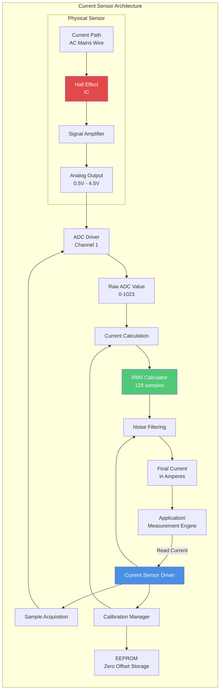
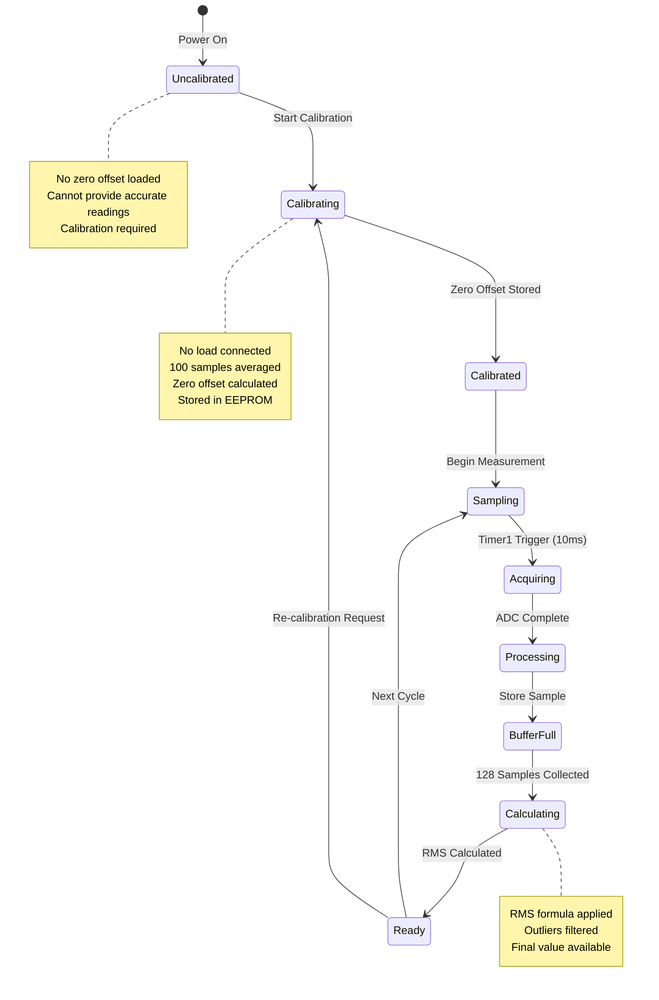
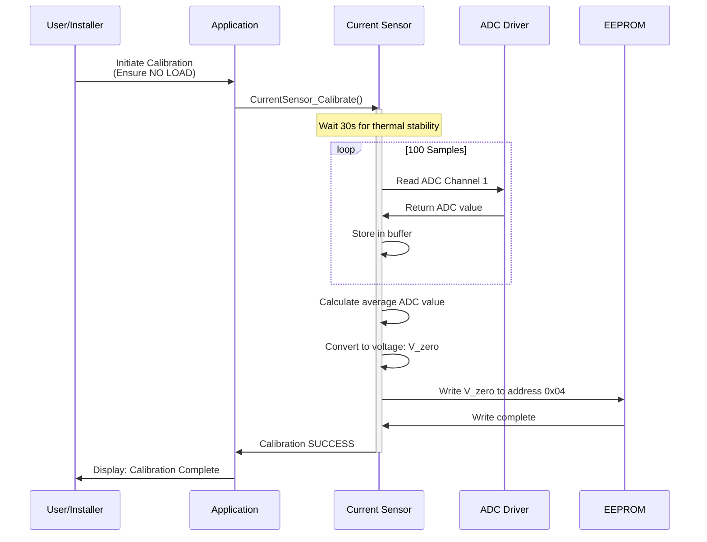
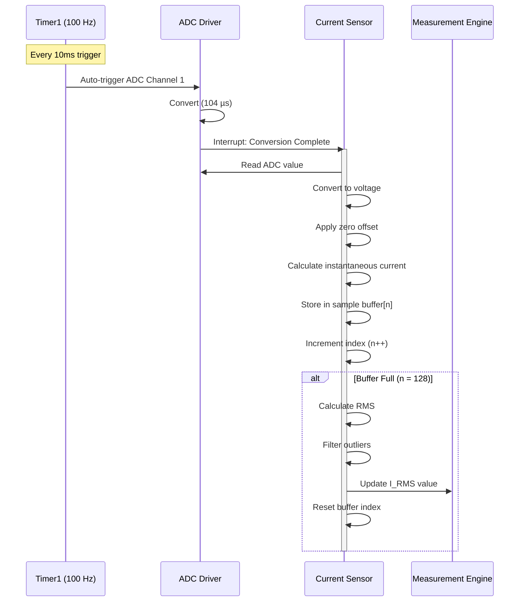
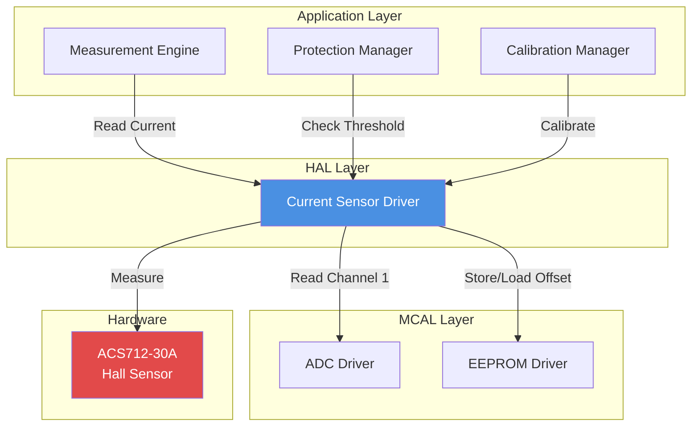

# ⚡ Current Sensor Driver - ACS712

<div align="center">


**Current Sensor Driver**

**Smart Energy Management System - Non-Invasive Sensing**

_Developed by Gestell Company - Professional Embedded Solutions_

</div>

---

## 📋 Table of Contents

- [Module Overview](#-1-module-overview)
- [Architecture](#-2-architecture-diagram)
- [Hardware Interface](#-3-hardware-interface)
- [Data Flow](#-4-data-flow-diagram)
- [State Machine](#-5-state-machine)
- [Sequence Diagrams](#-6-sequence-diagrams)
- [Dependencies](#-7-module-dependencies)

---

## 🔗 Related Documentation

| Document                                                     | Description  | Status       |
| ------------------------------------------------------------ | ------------ | ------------ |
| **[ADC_Driver.md](../../MCAL_Layer/ADC/ADC_Driver.md)**      | Analog Input | ✅ Available |
| **[Voltage_Sensor.md](../Voltage_Sensor/Voltage_Sensor.md)** | Voltage      | ✅ Available |

---

## 📋 1. Module Overview

### Purpose and Role

The Current Sensor driver provides accurate AC current measurement through a Hall-effect sensor that measures magnetic field strength proportional to current flow. This enables the Smart Energy Management System to monitor load current, calculate power consumption, and detect overcurrent conditions without breaking the electrical circuit.

### Key Responsibilities

- Measure AC RMS current (0-30A range)
- Provide calibrated current readings in Amperes
- Zero-current offset calibration
- Digital filtering and noise reduction
- Overcurrent detection support
- Interface with ADC for analog-to-digital conversion

### Hardware Component

**ACS712-30A Specifications:**

- Range: -30A to +30A (bidirectional)
- Sensitivity: 66 mV/A (typical)
- Zero-current output: 2.5V (VCC/2)
- Isolation: 2.1 kV RMS minimum
- Bandwidth: 80 kHz
- Supply voltage: 5V DC

---

## 2. Architecture Diagram



---

## 3. Hardware Interface

### Sensor Connections

**Electrical Interface:**

- VCC: 5V power supply
- GND: Ground reference
- VOUT: Analog voltage output (connected to PA1/ADC1)
- IP+/IP-: Current path terminals (AC mains wire passes through)

### Operating Principle

**Hall-Effect Detection:**

1. Current flows through internal copper conductor
2. Magnetic field generated proportional to current
3. Hall-effect IC detects magnetic field strength
4. Output voltage varies with magnetic field intensity
5. Galvanic isolation maintained (no electrical connection)

### Output Voltage Relationship

**Formula:**

```
V_out = V_zero + (I × Sensitivity)
V_out = 2.5V + (I × 0.066 V/A)
```

**Examples:**

- 0A: V_out = 2.5V
- +10A: V_out = 2.5V + 0.66V = 3.16V
- -10A: V_out = 2.5V - 0.66V = 1.84V
- +20A: V_out = 2.5V + 1.32V = 3.82V

---

## 4. Data Flow Diagram

```mermaid
flowchart TB
    subgraph "Current Measurement Flow"
        direction TB

        AC_CURRENT[AC Current<br/>in Wire] --> MAG_FIELD[Magnetic Field<br/>Generated]
        MAG_FIELD --> HALL_DET[Hall Effect<br/>Detection]
        HALL_DET --> ANALOG_V[Analog Voltage<br/>0.5V - 4.5V]

        ANALOG_V --> ADC_CONV[ADC Conversion<br/>10-bit]
        ADC_CONV --> DIGITAL[Digital Value<br/>0-1023]

        DIGITAL --> VOLTAGE_CALC[Convert to Voltage<br/>V = ADC × 5.0 / 1024]

        VOLTAGE_CALC --> ZERO_SUB[Subtract Zero Offset<br/>ΔV = V - V_zero]

        ZERO_OFFSET[Zero Offset<br/>from EEPROM] --> ZERO_SUB

        ZERO_SUB --> CURR_CALC[Calculate Current<br/>I = ΔV / 0.066]

        CURR_CALC --> SAMPLE_BUF[Sample Buffer<br/>128 samples]

        SAMPLE_BUF --> RMS_CALC[RMS Calculation<br/>√(Σ(I²)/N)]

        RMS_CALC --> OUTLIER[Outlier Rejection<br/>±3σ filter]

        OUTLIER --> FINAL[Final RMS Current]

        FINAL --> APP_LAYER[Application Layer]
    end

    style HALL_DET fill:#E24A4A,color:#fff
    style RMS_CALC fill:#50C878,color:#fff
    style FINAL fill:#F39C12,color:#000
```

---

## 5. State Machine



---

## 6. Sequence Diagrams

### Calibration Sequence



### Normal Measurement Sequence



---

## 7. Module Dependencies

### Dependency Diagram



---

## 8. Configuration Parameters

### Calibration Data

| Parameter           | Storage          | Description                     |
| ------------------- | ---------------- | ------------------------------- |
| Zero offset voltage | EEPROM 0x04-0x07 | Voltage at 0A current           |
| Calibration factor  | EEPROM 0x08-0x0B | Sensitivity correction (future) |

### Measurement Parameters

| Parameter       | Value   | Description                           |
| --------------- | ------- | ------------------------------------- |
| Sensitivity     | 66 mV/A | Nominal (datasheet)                   |
| Zero voltage    | 2.5V    | Nominal (adjusted by calibration)     |
| ADC resolution  | 10-bit  | 1024 levels                           |
| Voltage per LSB | 4.88 mV | 5V / 1024                             |
| Current per LSB | 74 mA   | 4.88mV / 66mV/A                       |
| Sampling rate   | 50 Hz   | Per channel (alternates with voltage) |
| Samples per RMS | 128     | 2.56 seconds of data                  |

### Range and Resolution

| Metric               | Value                 |
| -------------------- | --------------------- |
| Minimum detectable   | ~0.1A (noise limited) |
| Maximum rated        | 30A                   |
| Recommended range    | 0.5A - 25A            |
| Practical resolution | 0.1A                  |

---

## 9. Error Handling Strategy

### Error Sources

**Temperature Drift:**

- Zero offset varies ±4mV/°C
- Mitigation: Periodic re-calibration

**Magnetic Interference:**

- External magnetic fields affect reading
- Mitigation: Shield sensor, keep away from transformers

**Offset Error:**

- Unit-to-unit variation in zero output
- Mitigation: Mandatory calibration during setup

### Outlier Rejection

**Method**: Statistical filtering

- Calculate mean and standard deviation of 128 samples
- Reject samples > 3× standard deviation
- Recalculate RMS without outliers

---

## 10. Performance Characteristics

### Accuracy

| Condition         | Accuracy | Notes             |
| ----------------- | -------- | ----------------- |
| After calibration | ±1%      | @ 10A, 25°C       |
| Uncalibrated      | ±3%      | Factory tolerance |
| Temperature drift | ±0.5%    | Over 0-50°C       |
| Linearity         | ±1%      | Full scale        |

### Response Time

- Single sample: 104 µs (ADC conversion)
- RMS update: 2.56 seconds (128 samples)
- Step response: < 3 seconds

### Resource Usage

- RAM: 512 bytes (128 samples × 4 bytes)
- Flash: ~350 bytes
- EEPROM: 8 bytes

---

## Implementation Notes

### RMS Calculation

**Formula:**

```
I_RMS = √(Σ(I_sample²) / N)
where N = 128 samples
```

**Purpose**: RMS represents equivalent DC current producing same heating effect

### Noise Filtering

**Hardware:**

- RC filter on output: R=1kΩ, C=100nF (fc ≈ 1.6 kHz)
- Twisted pair wiring
- Physical separation from switching components

**Software:**

- 128-sample averaging
- Outlier rejection
- Optional moving average for display

---

---

## 📞 Support & Contact

**Project Information**:

- **Project Name**: Smart Energy Management System
- **Development Company**: Gestell - Professional Embedded Solutions

**Technical Support**: Hisham4Ahmed@gmail.com

---

## 📄 Document Control

| Attribute            | Value                               |
| -------------------- | ----------------------------------- |
| **Document Type**    | Current Sensor Driver Documentation |
| **Document Status**  | Active                              |
| **Document Version** | 2.0                                 |
| **Last Updated**     | January 2026                        |
| **Prepared By**      | Gestell Engineering Team            |

---

<div align="center">

**Built with ❤️ by Gestell Team**

_Professional Embedded Systems Engineering_

**Copyright © 2025-2026 Gestell Company - All Rights Reserved**

</div>
