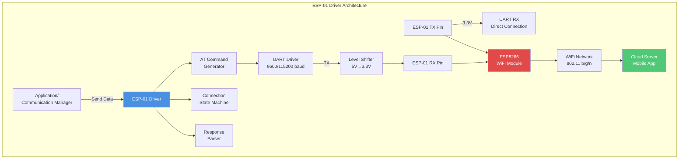
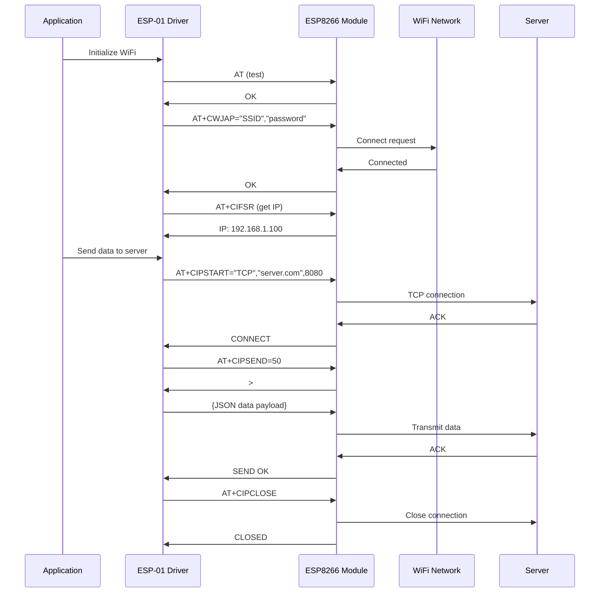
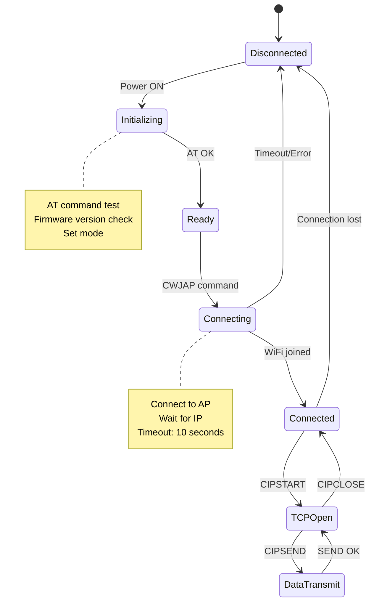
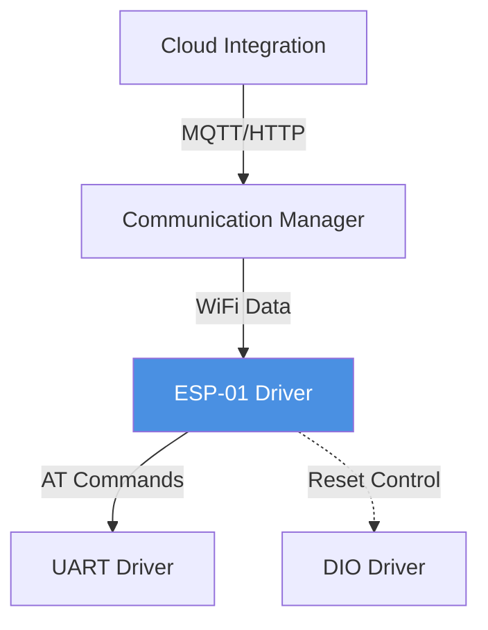

# ESP-01 WiFi Module Driver

**Module**: ESP-01 (ESP8266)  
**Interface**: UART (AT Commands)  
**Purpose**: WiFi connectivity for cloud integration and remote monitoring

---

## 1. Module Overview

### Purpose and Role

The ESP-01 driver provides WiFi connectivity through the ESP8266 module, enabling the Smart Energy Management System to transmit data to cloud platforms, mobile apps, and web dashboards.

### Key Responsibilities

- WiFi network connection management
- AT command protocol handling
- TCP/IP data transmission
- Connection status monitoring
- Error recovery and reconnection

### Hardware Component

- SoC: ESP8266 WiFi chip
- WiFi: 802.11 b/g/n (2.4 GHz)
- Modes: Station (client) or Access Point
- Interface: AT commands via UART
- Power: 3.3V (requires level shifter from 5V MCU)

---

## 2. Architecture Diagram

---

## 3. AT Command Protocol

### Common Commands

| Command     | Purpose              | Response     | Example                         |
| ----------- | -------------------- | ------------ | ------------------------------- |
| AT          | Test communication   | OK           | Basic connectivity check        |
| AT+GMR      | Get firmware version | Version info | Firmware verification           |
| AT+CWJAP    | Connect to WiFi      | OK or ERROR  | AT+CWJAP="SSID","password"      |
| AT+CIFSR    | Get IP address       | IP address   | Check connection status         |
| AT+CIPSTART | Start TCP connection | OK/CONNECT   | AT+CIPSTART="TCP","server",port |
| AT+CIPSEND  | Send data            | SEND OK      | AT+CIPSEND=length, then data    |
| AT+CIPCLOSE | Close connection     | CLOSED       | Disconnect from server          |

---

## 4. Connection Sequence

---

## 5. State Machine

---

## 6. Configuration Parameters

| Parameter      | Value         | Description                     |
| -------------- | ------------- | ------------------------------- |
| UART Baud Rate | 9600 / 115200 | Configurable (9600 more stable) |
| WiFi Mode      | Station       | Connect to existing network     |
| IP Assignment  | DHCP          | Automatic IP from router        |
| TCP Timeout    | 30 seconds    | Connection timeout              |
| Max Retry      | 3 attempts    | Reconnection attempts           |
| Keep-alive     | 60 seconds    | Periodic ping                   |

---

## 7. Power Management

**Power Requirements:**

- Operating voltage: 3.3V ± 0.3V (strict)
- Peak current: 200-300 mA (transmission)
- Average current: 80 mA (connected)
- Minimum regulator capacity: 500 mA

**Level Shifting:**

- TX (MCU→ESP): Voltage divider (5V→3.3V)
- RX (ESP→MCU): Direct connection (3.3V recognized as HIGH)

---

## 8. Error Handling

**Connection Failures:**

- Wrong password: Retry with correct credentials
- Network unavailable: Wait and retry
- Weak signal: Move closer or change antenna

**Communication Errors:**

- AT timeout: Module reset required
- Garbled response: Baud rate mismatch
- No response: Power supply issue

**Recovery Procedure:**

1. Detect error condition
2. Log error type
3. Close connections
4. Reset module (toggle power or RST pin)
5. Re-initialize
6. Retry connection

---

## 9. Module Dependencies

---

## 10. Performance Characteristics

**Data Throughput:**

- Maximum: ~1 Mbps (802.11b)
- Typical: 100-300 kbps (depends on signal)
- Latency: 50-200 ms (to internet)

**Resource Usage:**

- RAM: ~100 bytes (buffers, state)
- Flash: ~800 bytes
- UART: Shared with HC-05 (software mux required)

**Reliability:**

- Connection uptime: 95%+ (good signal)
- Packet loss: < 1% (typical)
- Reconnect time: 5-10 seconds

---

## Implementation Notes

### Stability Considerations

**Power Supply:**

- Low-ESR capacitors: 100µF + 10µF close to module
- Stable 3.3V regulator essential
- Poor power = frequent resets

**AT Command Timing:**

- Wait for response before next command
- Timeout: 1-5 seconds per command
- Buffer responses (may arrive in chunks)

**Baud Rate Selection:**

- 9600: More stable, lower speed
- 115200: Faster, may have errors
- Default often 115200, change to 9600 for reliability

---

**Document Version**: 2.0  
**Last Updated**: January 2026  
**Maintained By**: Gestell Engineering Team
